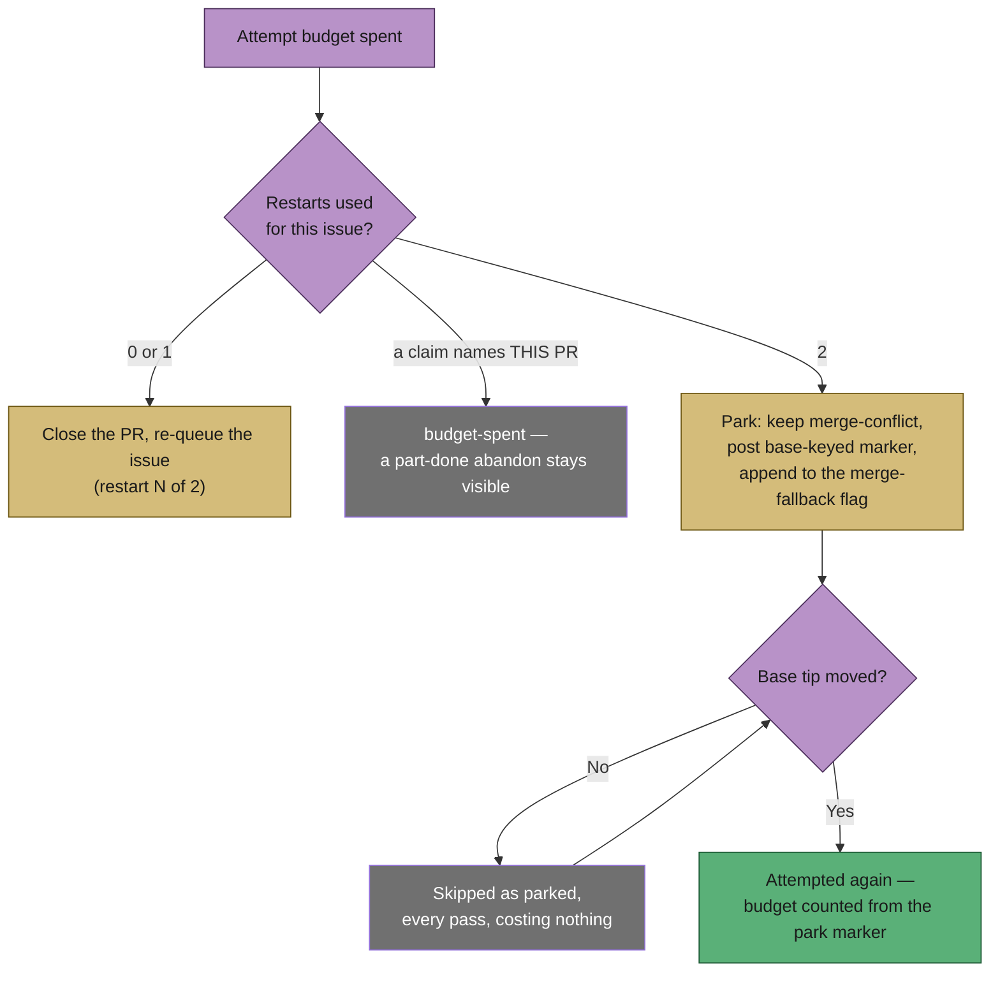

# PR path: two restarts per issue, then park on merge-conflict

## Summary

The abandon-and-restart rung allowed **one** restart per originating issue; the
second exhaustion declined and the PR was handed to a human. One restart was too
few — the first fresh PR is raised off a base that has often moved again by the
time it conflicts — and the human it ended at never came.

This raises the bound to **two** restarts and replaces the escalation with a
**park**: after both restarts are spent the PR is left open carrying
`merge-conflict`, with one comment carrying a `<!-- vibe-merge-conflict-parked
base="<sha>" -->` marker naming the base tip it is waiting on. Every later pass
compares the PR's live `baseRefOid` against that marker and skips it unchanged;
the first pass they differ, the PR is attempted again with a fresh two-attempt
budget counted from the park marker onward. No `needs-human` label and no
comment asking anybody for anything is applied anywhere on this path.

Closes #2312.

## Evidence

Backend/CLI change with no web interface to screenshot. The evidence is the test
suite below and the full quality gate, which passed on the final commit
(`deno tests`, `deno lint`, `deno type check`, `deno fmt`, semgrep, markdownlint,
mermaid and the chokepoint audits — `config integration` skipped as it always is
without a live config).

The one-restart rule was confirmed red before the fix: with
`MAX_RESTARTS_PER_ISSUE` temporarily set back to `1`, four of the new tests fail
(`a restarted issue is restarted a second time`, `the third exhaustion is
declined, not restarted`, `the last restart says what follows it`, and
`one restart on the issue still allows a second`); at `2` they pass.

## Acceptance Criteria

<!-- vibe-spec-review inputs="diff+issue-body" -->

- **met** — Second exhaustion on the same issue → second restart — evidence:
  `worker/deno/lib/conflict_abandon_restart.ts:131` (`MAX_RESTARTS_PER_ISSUE`),
  `worker/deno/tests/conflict_abandon_restart_test.ts::abandonAndRestart - a
  restarted issue is restarted a second time` — reviewer: partial — reason: the
  reviewer split this criterion and found the restart half met; its second half
  is recorded separately below.
- **partial** — …with the event appended to the existing flag issue — evidence:
  `worker/deno/lib/pr_merge_conflict_scan.ts` `fileConflictFallbackFlag` →
  `fileMergeFallbackIssue` — reviewer: partial — reason: the flag's dedup title
  is keyed on the **PR**, not the originating issue
  (`merge_fallback_issue.ts::mergeFallbackTitle`), so across a restart chain
  each fresh PR files its own flag and "appended" only happens when one PR
  falls back twice. That per-PR keying is the invariant #2304/#2310 established
  and the issue itself points at ("`fileMergeFallbackIssue` dedups on title");
  re-keying it on the issue would change the milestone path too, so it is
  reported rather than silently widened.
- **met** — Third exhaustion → PR stays open with `merge-conflict`, park marker
  posted, `parked` skip reason counted, no `needs-human` label or comment —
  evidence: `worker/deno/tests/pr_merge_conflict_scan_test.ts::findConflictingPr
  - the third exhaustion parks the PR, asking no human (Issue #2312)` —
  reviewer: met.
- **met** — A parked PR whose base tip has not moved is skipped every pass; once
  `baseRefOid` differs it is attempted again with a fresh two-run budget —
  evidence: `worker/deno/tests/pr_merge_conflict_scan_test.ts::findConflictingPr
  - a parked PR on an unmoved base is skipped every pass` and `::a moved base
  offers a parked PR again with a fresh budget` (asserts `attemptCount === 0`) —
  reviewer: met.
- **met** — The stall watchdog does not escalate a parked PR — evidence:
  `worker/deno/tests/merge_conflict_stall_watchdog_test.ts::detectConflictQueueStall
  - a parked PR on an unmoved base is not a stall` — reviewer: met — reason: the
  reviewer noted the suppression is narrower than the criterion's flat wording —
  once the base moves the watchdog measures that PR the ordinary way again, so a
  just-un-parked PR can be reported before the scan's next pass reaches it. That
  is deliberate and asserted (`::a parked PR whose base moved is judged the usual
  way`): the watchdog files work and never applies `needs-human`, and a park that
  suppressed for ever is the silence it exists to remove.
- **met** — Regression tests in the three named files that fail against the
  one-restart rule and the `needs-human` route — evidence:
  `conflict_abandon_restart_test.ts`, `pr_merge_conflict_scan_test.ts`,
  `merge_conflict_decision_taxonomy_test.ts`; red-then-green confirmed above —
  reviewer: met.
- **met** — `./quality.sh` passes — evidence: full gate run after the final
  commit, `Result: PASSED (with skipped checks)` — reviewer: partial — reason:
  the reviewer ran the gate against a working tree that was mid-edit and saw
  `deno fmt` fail on an uncommitted test file; that file was formatted and the
  gate re-run clean before the commit under review.
- **unrequested** — `pr_merge_conflict_processor.ts::failAttempt` no longer
  escalates an `already-restarted` decline — reviewer: unrequested — reason: the
  issue names only the scan, but this is the *other* site that reached
  `needs-human` for a spent restart budget, so "remove the `restart-exhausted`
  needs-human escalation" could not be done without it.
- **unrequested** — `baseRefOid` added to `PrEntry` and
  `PR_MAINTENANCE_LIST_FIELDS` — reviewer: unrequested — reason: the issue's own
  assumption asked this to be verified and added if missing; it was missing.
  Widening the shared listing costs no extra call, where a per-PR read would
  cost one per parked PR per pass. `resolveBaseRefOid` keeps that per-PR read
  only as the fallback for a cached listing written before the field existed.
- **unrequested** — `buildRestartIssueComment` gained a `restartNumber` and
  rewrote its closing paragraph — reviewer: unrequested — reason: the old text
  said "this is the fleet's **one** restart … the conflict goes to a human",
  which this change makes false on a permanent public comment.
- **unrequested** — four marker tests in `conflict_verdict_ladder_test.ts` and a
  `pr close` model in the abandon fake — reviewer: unrequested — reason: the new
  marker belongs to the vocabulary that file already covers, and the fake had to
  stop listing a closed PR as open before a second restart could reach the bound
  honestly rather than tripping the other-open-PR precondition.

## Standards Review

<!-- vibe-standards-review inputs="diff+CODING-STANDARDS.md" -->

- **violation** — Twelve surfaces still stated the superseded one-restart rule
  ("A Code Change Owes a Docs Change") — evidence: `README.md:558`,
  `docs/MERGE.md:869`, `docs/workflows/merge-conflicts.md:38/489/492/539/1185`,
  `worker/deno/lib/conflict_abandon_restart.ts:115` and `:1372`,
  `worker/deno/lib/conflict_marker_trust.ts:27`,
  `worker/deno/lib/run_core_production_deps.ts:2483`,
  `worker/deno/tests/conflict_abandon_restart_test.ts:11` — reason: all twelve
  rewritten in this diff.
- **violation** — `logger.error` for a park comment the code then handles and
  retries — evidence: `worker/deno/lib/pr_merge_conflict_scan.ts:1267` — reason:
  dropped to `warn`, matching every other recoverable `gh` failure in the module.
- **violation** — `readParkedBase` re-encoded the sha rule as its own regex,
  laxer than the writer's — evidence:
  `worker/deno/lib/merge_conflict_markers.ts:209` — reason: now validates through
  `isConflictHeadSha`, the same predicate the writer uses.
- **violation** — `Promise<number | undefined | null>` encoded three outcomes in
  one nullable number — evidence:
  `worker/deno/lib/pr_merge_conflict_scan.ts:1243` — reason: replaced with a
  named `ParkOutcome` discriminated union.
- **violation** — Three new branches had no test coverage: an unpostable park
  marker, both `resolveBaseRefOid` failure exits, and `buildParkedPrComment`'s
  no-flag branch — evidence: `worker/deno/lib/pr_merge_conflict_scan.ts:1241`,
  `:1306`, `:1190` — reason: four tests added, listed in the Test Plan.
- **violation** — `docs/archive/pr-summaries/pr-summary-2312.md` missing —
  evidence: this file — reason: written.
- **clean** — Australian English throughout; fail-loud error handling with no
  swallowed errors (`conflictParkedMarker` throws on an unwritable sha, and an
  unpostable marker refuses to claim a park happened); marker trust (the park is
  read only from fleet-authored comments in both the scan and the watchdog, each
  with an outsider-forgery regression test); no hidden paths staged; every test
  calls real code through fakes that model `gh`, with no source-grepping, sleeps
  or wall-clock thresholds; no tests removed — the one rewritten case tracks the
  deleted `restart-exhausted` route and keeps its distinction under assertion;
  the `parked` reason is registered in every exhaustive switch and table.

Two further reviewer observations were judged and kept as designed, rather than
changed: an unreadable base tip resolves the *opposite* way in the scan (stay
parked) and in the watchdog (judge normally), because each component fails
towards saying something — now stated in a comment at both sites; and attempt
numbering repeats in a thread after an un-park, which is inherent to the
budget reset the issue asks for.

One reviewer finding was adopted as a behaviour change beyond the issue text: a
decline whose restart claim names *this* PR is a **part-done abandon**, not a
wait — the issue may never have been re-queued — so it no longer parks. It keeps
`budget-spent`, its route on the WARN line, and its visibility to the stall
watchdog. Parking it would have replaced the only record of that failure with a
marker saying the fleet is waiting.

## Test Plan

Added in `worker/deno/tests/conflict_abandon_restart_test.ts`:

- `abandonAndRestart - a restarted issue is restarted a second time` — the
  regression against the one-restart rule; asserts both closes and both markers
  on the one issue.
- `abandonAndRestart - the third exhaustion is declined, not restarted`.
- `buildRestartIssueComment - the last restart says what follows it`.
- Rewritten: `exhaustedEscalationRoute - a burnt claim on this PR is not a failed
  replacement` (was `describeExhaustedRoute - …`), tracking the removed
  `restart-exhausted` route while keeping its distinction asserted.

Added in `worker/deno/tests/pr_merge_conflict_scan_test.ts`:

- `one restart on the issue still allows a second`.
- `the third exhaustion parks the PR, asking no human` — `parked` recorded, no
  close, one marker comment, flag appended, `assertNoNeedsHumanWrites`.
- `a parked PR on an unmoved base is skipped every pass`.
- `a moved base offers a parked PR again with a fresh budget`.
- `a park whose marker cannot be posted is not a park`.
- `an unreadable base tip leaves a parked PR parked` / `…cannot park a PR either`.
- `a half-done abandon is not parked away`.
- `an outsider's park marker cannot silence a PR`.
- `buildParkedPrComment - says so when the flag could not be filed`.

Added in `worker/deno/tests/merge_conflict_stall_watchdog_test.ts`:

- `a parked PR on an unmoved base is not a stall`.
- `a parked PR whose base moved is judged the usual way`.
- `an outsider's park marker cannot silence the watchdog`.
- `a conclusion after a park ends the park`.

Added in `worker/deno/tests/conflict_verdict_ladder_test.ts`:

- `conflictParkedMarker - names the base tip the PR waits on`, plus
  `readParkedBase` cases for newest-wins, unreadable and upper-case shas, and
  the builder's refusal of an unwritable sha.

Added in `worker/deno/tests/merge_conflict_decision_taxonomy_test.ts`:

- The `parked` sample and its `case` in the compile-gate fixture — the
  exhaustiveness record fails to compile without them.

Added in `worker/deno/tests/pr_merge_conflict_processor_test.ts`:

- `a spent restart budget asks no human (Issue #2312)`.

Existing tests changed, with the business-logic reason: two scan tests that used
an `already-restarted` decline to produce `budget-spent` now use `other-open-pr`,
because that decline reason no longer lands there; the abandon fake now removes a
closed PR from the open listing so a second restart reaches the bound rather than
the other-open-PR precondition.
