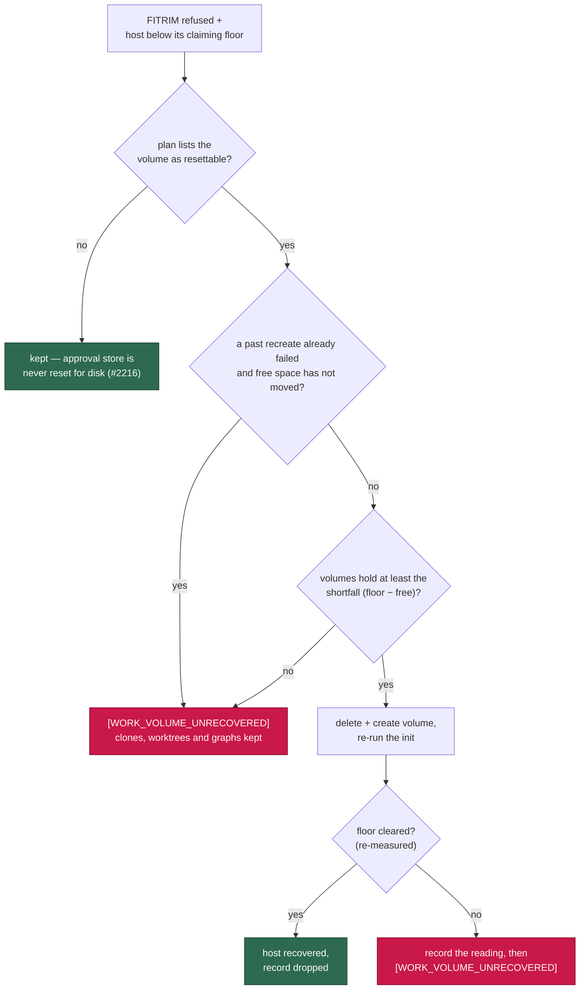

# Recreate the work volume only when it holds the host's missing space

## Summary

`run.sh` destroyed and recreated `vibe-work` whenever the host sat below its
claiming floor and the runtime refused to trim, judging the volume against a
fixed 1 GB minimum. On a trim-refused runtime the image ratchets past 1 GB
within a cycle or two, so the guard never spared anything: GRQ-23 recreated six
times in 30 hours against a volume holding 364 MB (12.1 GB at its largest)
while the host was 10–20 GB short because the Mac's *own* data had grown. Every
recreate wiped every clone, every lane worktree, both toolchain caches and every
Graft graph, and cleared the floor not once.

The decision is now made against the host's **shortfall**:

- **The threshold is `floor − free`, not a fixed gigabyte.** `volume_reset_required_kb`
  scales the shortfall by `VIBE_WORK_VOLUME_HEAL_SHORTFALL_PERCENT` (100 % by
  default — the reset must be able to clear the floor on its own) and never
  falls below the Issue #2117 per-volume minimum. Volumes that cannot cover it
  are reported as `[WORK_VOLUME_UNRECOVERED]`, naming what they hold and what
  was missing, and are **left intact**.
- **A fruitless recreate is remembered.** When a recreate leaves the host below
  the floor, the re-measured free space is recorded in
  `~/.vibe-coder/work-volume-heal-unrecovered`. Until free space moves by more
  than `VIBE_WORK_VOLUME_HEAL_MIN_GB`, the next launch reports that reading
  instead of destroying the clones again. The record is dropped as soon as the
  host is back above its floor.
- **Both decision points apply the gate** — `heal_untrimmable_volumes` (after
  the volume init) and `reset_work_volumes_before_build` (Issue #2092). The
  Issue #2253 headroom case is untouched: above the floor the shortfall is zero,
  so a trim-refused volume within its own allocation of the floor still resets.

An unmeasurable store still recreates as before: Docker and Podman keep their
volumes where the launcher cannot look, and "we could not measure it" must never
be read as "it holds nothing" (Issue #2216).

Closes #2313.

## Evidence

Backend/launcher change — no web interface to screenshot. The evidence is the
launcher suite driving the real `run.sh` against a recording runtime stub: 128
tests in `tests/run_sh_launcher_test.ts`, `tests/launcher_parity_test.ts` and
`tests/launcher_source_test.ts` pass (`ok | 128 passed | 0 failed (2m50s)`),
including six that exercise this decision directly.

## Reproduction

- **symptom** — a host below its claiming floor whose work volume holds a
  fraction of the missing space has that volume destroyed and recreated anyway,
  on every launch, clearing the floor not once
- **status** — `verified` — with `run.sh` stashed, the four new regression
  assertions failed (`FAILED | 2 passed | 4 failed`, the launcher recreating
  `vibe-work` where the test expects no removal); with the fix applied all six
  pass (`ok | 6 passed | 0 failed`)
- **regression test** —
  `worker/deno/tests/run_sh_launcher_test.ts::run.sh - a volume that cannot cover the shortfall is reported, not destroyed (Issue #2313)`

## Test Plan

Added to `worker/deno/tests/run_sh_launcher_test.ts`:

- `a volume that cannot cover the shortfall is reported, not destroyed (Issue #2313)`
  — 256 MB short, 64 MB held: no volume removed, no second init, and the log
  names the shortfall and where the host's space actually went.
- `the shortfall share a reset must return is an operator knob (Issue #2313)` —
  the same host with `VIBE_WORK_VOLUME_HEAL_SHORTFALL_PERCENT=20` resets.
- `a recreate that did not clear the floor is not repeated on an unchanged host (Issue #2313)`
  — a recorded unrecovered reading 8 MB from the current one (16 MB tolerance)
  leaves the volume alone.
- `free space that has actually moved retries the recreate (Issue #2313)` — a
  recorded reading 64 MB away is stale, so the reset runs.
- `the pre-build reset leaves a volume that cannot cover the shortfall alone (Issue #2313)`
  — the same gate on the Issue #2092 pre-build path.

Modified (business-logic change, documented in each test's comment):

- `a reset that cannot clear the floor still runs, and is reported as unrecovered (Issues #2077, #2313)`
  — the fixture volume now holds 64 MB against a 32 MB shortfall, so the reset
  it asserts still runs; it additionally asserts the unrecovered reading is
  recorded. An 8 MB volume against a 32 MB shortfall is now the "reported, not
  destroyed" case above, which is the behaviour this issue asks for.
- `a refused trim below the floor resets only volumes big enough to matter, never the approval store (Issue #2117)`
  — the unreachable 999999 GB floor is replaced by a host 32 MB short of a
  15 GB floor, because no volume can cover a shortfall that large. The
  assertions (work volume reset, approval store spared) are unchanged.

Unchanged and still passing: the Issue #478, #731, #734, #2077, #2092, #2216 and
#2253 launcher cases, including the unmeasurable-store paths that must keep
recreating.

Docs: `docs/CONTAINER.md` — the heal's numbered account and its flowchart now
state the shortfall gate, the unrecovered-reading memory, and the two new state
surfaces.
