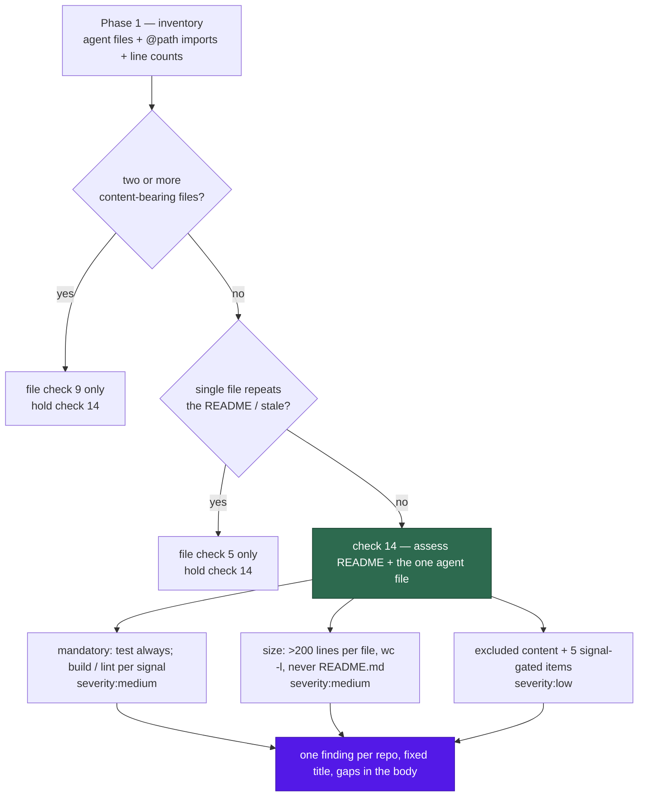

# Check 14 — agent instruction files against the Claude Code guidance

## Summary

The weekly documentation audit now reads **what** a repo's surviving agent
instruction file says, not just how many such files exist. Check 14 measures the
file — plus every file it imports with an `@path` line, and `README.md` as part
of the same assessed unit — against Anthropic's published Claude Code guidance:
a runnable command line for each stage the repo actually has, the published
200-line size budget, the content the guidance says to exclude, and five further
items each gated on a fixed repository signal rather than the agent's judgement.

Checks 5 and 9 still decide **how many** agent instruction files a repo keeps,
and check 14 is held while either is outstanding — reviewing the content of a
file that is about to be deleted spends a cap slot on a moving target. The check
never asks a repo to create a `CLAUDE.md`. All of one repo's gaps collapse into
a single finding per run under the fixed title
`Agent instruction files do not follow Claude Code guidance`, so its `BP-` id
stays stable as the gap list changes.

This is a prompt-and-docs change: no new Deno library code, and no new
cross-repo mechanism — each monitored repo is audited on its own, exactly as the
other thirteen checks are. Closes #2321.

## Evidence

Backend/prompt change with no web interface, so there is nothing to screenshot.
The evidence is the test suite and the gate:

- `deno test tests/documentation_audit_prompt_v9_test.ts` — **34 passed, 0
  failed**. The 17 new and updated cases were observed **red** before the prompt
  and doc edits landed (17 failed / 17 passed), then green.
- **Mutation-checked**, not merely green: reversing `it never fires on
  README.md` to `always` in the prompt failed
  `check 14 measures 200 physical lines per file and never on the README`, and
  deleting the mandatory-command clause from the severity guidance failed
  `severity guidance covers the check-14 gaps`. Both were restored.
- `./quality.sh` — **PASSED** (semgrep, markdownlint, mermaid, deno
  test/lint/check/fmt); `config integration` skipped as it is on this host.

## Acceptance Criteria

<!-- vibe-spec-review inputs="diff+issue-body" -->

The issue states its requirements as an "Accepted scope" list rather than a
`## Acceptance Criteria` heading; they are answered here as criteria.

- **met** — new check 14 in the prompt, a matching section in the operator
  manual, new tests in the v9 test file, no new Deno library code — evidence:
  `prompts/documentation_audit/prompt.md:563`, `docs/DOCUMENTATION-AUDIT-SCAN.md:155`,
  `worker/deno/tests/documentation_audit_prompt_v9_test.ts` — reviewer: met
- **met** — every "thirteen-check" string becomes "fourteen-check"; the manual's
  "thirteenth registered idle-task template" line is unchanged — evidence:
  `worker/deno/tests/documentation_audit_prompt_v9_test.ts::states the check counts consistently`
  and the two doc guard tests — reviewer: met
- **met** — the check-9 hierarchy stands; no repo is asked to create a
  `CLAUDE.md` — evidence: `prompts/documentation_audit/prompt.md:574` — reviewer: met
- **met** — the file set is check 9's detection set plus `@path` imports —
  evidence: `prompts/documentation_audit/prompt.md:574`, Phase 1 inventory at
  `:256` — reviewer: met
- **met** — no agent file is a finding only when the README also lacks the
  commands — evidence: `prompts/documentation_audit/prompt.md:604` and the
  `gate-command-satisfies-both-stages` worked example — reviewer: met
- **met** — over 200 lines at `severity:medium`, per file, `wc -l` with no
  exclusions, never on `README.md` — evidence:
  `prompts/documentation_audit/prompt.md:621` — reviewer: met
- **met** — commands and testing are the only mandatory items; the other five
  are `severity:low` behind a fixed signal list — evidence:
  `prompts/documentation_audit/prompt.md:608` — reviewer: met
- **met** — a runnable command line per required stage; test always, build and
  lint only with their signal; one gate command satisfies every stage it runs —
  evidence: `prompts/documentation_audit/prompt.md:579` — reviewer: met
- **met** — excluded content is `severity:low`, folded into the same file's size
  entry — evidence: `prompts/documentation_audit/prompt.md:630` — reviewer:
  partial — reason: the reviewer found the under-200-line case undefined (no
  size entry to fold into); the prompt now says the observation is its own
  `severity:low` entry there, which the reviewer could not have seen.
- **met** — check 14 is held while check 5 or check 9 is outstanding — evidence:
  `prompts/documentation_audit/prompt.md:579` — reviewer: met
- **met** — one fixed finding title keeps the `BP-` id stable, with the gap list
  in the body — evidence: `prompts/documentation_audit/prompt.md:639`, Phase 4
  guidance at `:964` — reviewer: met
- **met** — all of a repo's gaps collapse into one finding per run — evidence:
  `prompts/documentation_audit/prompt.md:639` — reviewer: met
- **met** — the primary file is the agent instruction file assessed, or
  `README.md` when the repo has none — evidence:
  `prompts/documentation_audit/prompt.md:645` — reviewer: met
- **unrequested** — `README.md:488` and the `DESIGN-PRINCIPLES.md` check-14
  paragraph — reviewer: unrequested — reason: both restate the catalogue size,
  and `DESIGN-PRINCIPLES.md` is asserted by the pre-existing test in this very
  file; leaving either stale would have made the docs contradict the prompt.
- **unrequested** — `wc` added to the permitted-command list, Phase 1 recording
  imports and line counts, and the "check 14 is guidance-shaped" preamble —
  reviewer: unrequested — reason: enablers the check cannot run without; the
  preamble mirrors check 13's.
- **unrequested** — a credit row in `docs/REFERENCES.md` for the Claude Code
  guidance — reviewer: unrequested — reason: raised by the Standards reviewer;
  the prompt quotes an external figure, which this scan's own checks 4 and 12
  would otherwise file against it.

## Standards Review

<!-- vibe-standards-review inputs="diff+CODING-STANDARDS.md" -->

- **violation** — the severity-guidance test sliced to EOF, so Phase 4's own
  `check 14` mention could satisfy it — evidence:
  `worker/deno/tests/documentation_audit_prompt_v9_test.ts:303` — reason: fixed
  here; the slice is bounded at `## Stable finding ID recipe` and both severity
  halves are asserted. Mutation-checked.
- **violation** — `assertStringIncludes(check, "fires on \`README.md\`")` passed
  under the inverted rule — evidence:
  `worker/deno/tests/documentation_audit_prompt_v9_test.ts:257` — reason: fixed
  here; it now pins `it never fires on README.md`, and the mutation confirms it
  fails when reversed.
- **violation** — an external figure quoted with no link and no
  `docs/REFERENCES.md` row — evidence: `prompts/documentation_audit/prompt.md:621`
  — reason: fixed here; the guidance is credited in `docs/REFERENCES.md` and
  linked from the operator manual (the prompt itself stays link-free, per
  REFERENCES.md rule 1).
- **violation** — "an architecture document under `docs/`" is judgement, two
  lines under "do not substitute judgement" — evidence:
  `prompts/documentation_audit/prompt.md:616` — reason: fixed here; the signal
  now names `docs/adr/` or a filename containing `ARCHITECTURE`/`DESIGN`.
- **violation** — excluded content in an under-budget file had no defined
  outcome — evidence: `prompts/documentation_audit/prompt.md:630` — reason:
  fixed here; it becomes its own `severity:low` entry.
- **violation** — "binds hardest on checks 10–13" not swept with the renumber —
  evidence: `prompts/documentation_audit/prompt.md:193` — reason: fixed here as
  10–14, with the guard test extended to reject both stale ranges.
- **violation** — the five-copy `text.slice(indexOf(...))` idiom was re-edited
  rather than collapsed (DRY / Boy Scout) — evidence:
  `worker/deno/tests/documentation_audit_prompt_v9_test.ts:83` — reason: fixed
  here; one `catalogueSection(n)` helper serves checks 13 and 14.
- **violation** — assertions pinned incidental wording (`"is not a finding"`,
  `"collapse into"`) and the five-item test asserted only signals — evidence:
  `worker/deno/tests/documentation_audit_prompt_v9_test.ts:219` — reason: fixed
  here; each assertion now pins a whole rule and all five item names.
- **violation** — the worked example said "two gaps" while listing three, and
  fired the style-rules conditional on a signal alone — evidence:
  `prompts/documentation_audit/prompt.md:767` (Spec reviewer) — reason: fixed
  here; the excerpt now states the style-rule absence and the reason counts
  three entries.
- **violation** — the first commit subject omitted the issue number — evidence:
  commit `6482f2c1` — reason: stands; the body carries `Refs #2321` and rewriting
  a pushed commit is the more costly of the two. The follow-up commit uses the
  house `(Issue #2321)` form.
- **clean** — Australian English throughout (catalogue, judgement, behaviour);
  tests load the real `loadPrompt()` rather than grepping source; no hidden
  paths staged; the renumber is swept repo-wide and guarded by negative
  assertions; no Deno→Node regression; file sizes mid-pack for the prompt tree.

**Considered and not done.** The Phase 2 sweep bound exempts check 13 because
the source-comment shortlist ranks last in the drift order. Check 14 needs no
such exemption: agent instruction files are **rank 1** in that same order
(`prompts/documentation_audit/prompt.md:272`), so they are read before the stop
rule can fire.

## Test Plan

`worker/deno/tests/documentation_audit_prompt_v9_test.ts` — 14 new cases and 3
updated ones, following the check-13 pattern:

- check 14 is present, and assesses the detection set plus `@path` imports
  without ever asking for a `CLAUDE.md`;
- it is held while check 5 or check 9 is outstanding;
- a runnable command line is required per applicable stage, with the build and
  lint signals and the one-gate-command rule;
- a repo with no agent file fires only when the README also lacks the commands;
- the five conditional items and their fixed signals, with gotchas never
  inferred;
- 200 physical lines by `wc -l`, per file, never on `README.md`;
- excluded content folds into the same file's size entry;
- one finding per repo under the fixed title, with the primary file pinned;
- both worked examples exist; `wc` is a permitted command; the severity
  guidance, the Phase 4 body guidance and the Phase 1 inventory all name what
  check 14 needs;
- **updated**: the catalogue-count guard now rejects "thirteen-check", the
  operator-manual and DESIGN-PRINCIPLES guards assert the fourteen-check
  wording, and the read-before-you-assert guard covers 10–14. The five check-13
  slices moved to the shared `catalogueSection()` helper — same assertions, now
  bounded by the next check's heading instead of the worked examples.
