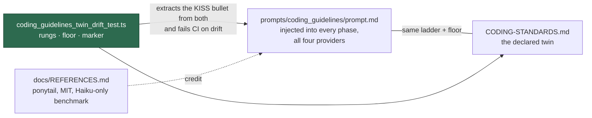

# Adopt the smallest-change-first ladder in the shared guidelines

## Summary

Rewrote ponytail's seven-rung **smallest-change-first ladder** — skip what is
not needed, reuse what the codebase has, the standard library, a native
platform feature, an installed dependency, one line, and only then new code —
into the shared injected guidelines in our own words, hung under the existing
**KISS** bullet so the two prompts that cite KISS by name keep their
definition. A one-sentence never-cut floor sits under it, cross-referencing the
existing secure-coding and fail-loud sections rather than restating them, and
each deliberate corner cut now carries one `// SIMPLE-ON-PURPOSE:` comment line
naming the ceiling first and the condition that lifts it after `upgrade when`.

The same ladder, floor and marker land in `CODING-STANDARDS.md` (the declared
twin), whose **Avoid over-engineering** bullet now names three departures for
the Standards reviewer to flag: a reinvented standard-library function, a
dependency added when an installed one or the standard library already does the
job, and an abstraction with a single implementation. Two new cases in
`coding_guidelines_twin_drift_test.ts` fail CI when a rung, a floor item or a
marker field is stated on one surface and not the other. No Claude plugin or
skill is installed — a plugin would cover one of the four providers, where the
injected block covers every phase of all four.

Closes #2322.

## Evidence

Backend/prompt-text change with no web interface to screenshot. Evidence is the
test run and the full gate:

- `deno test tests/coding_guidelines_twin_drift_test.ts` — 9 passed, 0 failed
  (7 pre-existing cases plus the 2 added here).
- `./quality.sh` — **PASSED** (semgrep, markdownlint, mermaid, deno tests, lint,
  type check and fmt all green; `config integration` skipped as it always is
  without `.config.json`).
- The new order checks were watched failing before they were trusted: with the
  worked example doctored to drop its ceiling field, the suite reports
  `coding_guidelines's // SIMPLE-ON-PURPOSE: example states no ceiling before
  "upgrade when"` and goes red.
- `gh api repos/DietrichGebert/ponytail` confirms the URL and the MIT licence
  recorded in `docs/REFERENCES.md`.

## Acceptance Criteria

<!-- vibe-spec-review inputs="diff+issue-body" -->

- **met** — Ladder rewritten into `prompts/coding_guidelines/prompt.md` under
  the existing **KISS** bullet, "Three similar lines…" deleted from the "Prefer
  smaller files" bullet, net growth under 15 lines — evidence:
  `prompts/coding_guidelines/prompt.md:95-111`, `git diff --numstat origin/main`
  reports `13 3` (net +10) — reviewer: met
- **met** — Never-cut floor as one sentence naming the four items plus whatever
  the issue asks for, cross-referencing the existing sections — evidence:
  `prompts/coding_guidelines/prompt.md:101-104` — reviewer: partial — reason:
  the reviewer scored the standards half partial because `CODING-STANDARDS.md`
  has no "Secure Coding Principles" section; that surface points at
  `SECURITY.md` and its own fail-loud anchor instead, so the reference resolves
  rather than dangling
- **met** — Applies to every phase of every provider through the shared
  injected block, no phase-specific opt-in — evidence: the only prompt file
  changed is the injected fragment; no phase prompt or conditional was touched
  — reviewer: met
- **met** — Same ladder and floor in the **Coding Principles** section of
  `CODING-STANDARDS.md`, twin-drift test extended in the existing
  regex-extract-and-compare pattern, no separate test file — evidence:
  `CODING-STANDARDS.md:25-39`,
  `worker/deno/tests/coding_guidelines_twin_drift_test.ts::twin pair - both
  surfaces state the same smallest-change-first ladder, in order (Issue #2322)`
  — reviewer: met
- **met** — Three over-engineering checks added to `CODING-STANDARDS.md`, no
  fourth check for an unmarked cut — evidence: `CODING-STANDARDS.md:44-49`;
  the Standards reviewer's declared inputs are `diff+CODING-STANDARDS.md` —
  reviewer: met
- **met** — `// SIMPLE-ON-PURPOSE:` marker, one line, ceiling then
  `upgrade when`, pinned on both surfaces — evidence:
  `worker/deno/tests/coding_guidelines_twin_drift_test.ts::twin pair - both
  surfaces state the never-cut floor and the corner-cut marker (Issue #2322)` —
  reviewer: met — reason: the reviewer noted neither surface said the comment
  line must *start with* the token; both now read "one comment line opening
  with `// SIMPLE-ON-PURPOSE:`"
- **met** — No intensity levels (lite/full/ultra), no configuration knob —
  evidence: no config surface touched; neither word appears in the diff —
  reviewer: met
- **met** — `prompts/planning_critique/prompt.md:18` unchanged — evidence: not
  in the diff — reviewer: met
- **met** — ponytail credited in `docs/REFERENCES.md` under **Agents, prompting
  and accountability** with URL, what was taken, MIT licence, the Haiku-only
  benchmark limitation and both paths — evidence: `docs/REFERENCES.md:68` —
  reviewer: met
- **met** — No Claude plugin or skill installed; `container/providers/claude.sh`
  and `worker/deno/lib/claude_runner.ts` unchanged — evidence: neither file is
  in the diff — reviewer: met
- **met** — `deno test` green including the extended twin-drift test —
  evidence: `./quality.sh` PASSED, full Deno suite included — reviewer: met —
  reason: the reviewer's own run of the full suite exceeded its budget and was
  killed, so it verified the targeted suites only; the gate was run here and
  passed
- **unrequested** — the ladder test also fails when the rungs are present but
  reordered, where the issue's observable was only "fails if any rung is
  missing" — reviewer: unrequested — reason: a reordered ladder contradicts
  "stop at the first rung that solves the problem", so order is the rule rather
  than a stricter gate on a different rule
- **unrequested** — the `docs/REFERENCES.md` row carries a sixth clause, why no
  plugin was installed, beyond the five fields the issue enumerated — reviewer:
  unrequested — reason: one clause recording the decision the issue made, so a
  future reader revisiting ponytail does not re-litigate it
- **unrequested** — `CODING-STANDARDS.md` also loses "Three similar lines of
  code is better than a premature abstraction", which the issue scoped to the
  prompt only — reviewer: unrequested — reason: both reviewers flagged the
  surviving sentence as fresh twin drift, and the issue's own rationale (the
  ladder's "one line" rung covers it) applies to the rule rather than to one
  file

## Standards Review

<!-- vibe-standards-review inputs="diff+CODING-STANDARDS.md" -->

- **violation** — the "Three similar lines…" rule survived on one twin surface
  after being deleted from the other — evidence: `CODING-STANDARDS.md:41-43` —
  reason: fixed here; the sentence is gone from both surfaces
- **violation** — the corner-cut order assertion could not fail: it searched
  the whole KISS bullet, whose rule sentence already says "ceiling" then
  "upgrade when", so a reversed worked example passed — evidence:
  `worker/deno/tests/coding_guidelines_twin_drift_test.ts:341-347` — reason:
  fixed here; the order check now runs on the example line alone, and was
  watched going red against a doctored ceiling-less example
- **violation** — "A review of a diff names three departures explicitly" read
  as description rather than a directive, and could be read as "exactly three"
  — evidence: `CODING-STANDARDS.md:46-49` — reason: fixed here; it now reads
  "Reviewing a diff, flag these three departures explicitly"
- **violation** — `new RegExp()` built from a non-literal tripped semgrep's
  `detect-non-literal-regexp` and failed the gate — evidence:
  `worker/deno/tests/coding_guidelines_twin_drift_test.ts:107` — reason: fixed
  here; phrase matching is a whitespace-flattened substring search, which is
  also simpler than the pattern it replaced
- **clean** — Australian English throughout; commit safety (four working files,
  no hidden path staged); fail-loud assertions naming the surface, the phrase
  and the full text; the test runs in 5 ms with no sleep, no env mutation and no
  spawned process; the new `#never-fail-silently--fail-loud` anchor and the
  `SECURITY.md` link both resolve; the `docs/REFERENCES.md` row sits under the
  right heading and both cited paths exist

## Test Plan

- Added `worker/deno/tests/coding_guidelines_twin_drift_test.ts::twin pair -
  both surfaces state the same smallest-change-first ladder, in order (Issue
  #2322)` — extracts the `**KISS**` bullet from both surfaces and asserts all
  seven rungs are present and in order.
- Added `worker/deno/tests/coding_guidelines_twin_drift_test.ts::twin pair -
  both surfaces state the never-cut floor and the corner-cut marker (Issue
  #2322)` — asserts every floor item, the `// SIMPLE-ON-PURPOSE:` token, both
  marker fields in order, and that the worked example itself states a ceiling
  before `upgrade when`.
- Ran `deno test tests/coding_guidelines_twin_drift_test.ts` (9 passed),
  `tests/references_doc_test.ts`, `tests/coding_guidelines_v42_test.ts` and
  `tests/prompt_house_vocabulary_drift_test.ts` (45 passed) while iterating.
- Ran `./quality.sh < /dev/null` to completion: PASSED.
