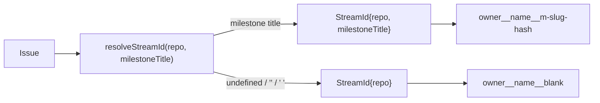

# Stream identity — resolve an issue to its (repository, milestone) or blank stream

## Summary

Adds the stream identity seam: `worker/deno/lib/stream_identity.ts`, a pure
module mapping an issue to the stream that owns its agent conversation — one
stream per (repository, milestone), plus one blank stream per repository for the
issues carrying no milestone — and rendering that stream as a filesystem-safe
key (`streamKey`) and a human label (`streamLabel`). Nothing calls it yet; it is
the foundation the rest of the milestone keys off. Closes #2331.

A key is a single path segment: `<owner>__<name>__m-<slug>-<hash>` for a
milestone stream, `<owner>__<name>__blank` for the blank one. Slugging is lossy
by design, so a milestone key always carries the first 8 hex of a SHA-256 of the
title — `#2298 merge conflicts` and `#2298: merge conflicts!` share a readable
stem but never a key. The repository's own segments take that hash only when
slugging actually lost a character, keeping the common `owner__name__…` form
legible.

## Evidence

Backend module with no web interface, so no screenshot applies. The evidence is
the test suite and the gate:

- `deno test worker/deno/tests/stream_identity_test.ts` — **26 passed, 0
  failed**. The suite was red before the module existed (`TS2307: Cannot find
  module …/lib/stream_identity.ts`) and green after.
- `./quality.sh` — **PASSED** (one pre-existing `SKIPPED`: config integration).
  The first run failed two checks, both because a new module under the sweep
  ledger roots must be claimed by exactly one slice; `top-up-2331` and
  `docs/audits/security-sweep-2331-stream-identity.md` register it, and the
  re-run is green.

## Acceptance Criteria

<!-- vibe-spec-review inputs="diff+issue-body" -->

- **met** — `resolveStreamId` returns the blank stream for `undefined`, `""` and
  `"   "`, and a milestone stream otherwise — evidence:
  `worker/deno/tests/stream_identity_test.ts::resolveStreamId - undefined milestone is the blank stream`
  and its `""` / `"   "` / round-trip siblings — reviewer: met
- **met** — `streamKey` is stable across calls, safe as a single filename path
  segment, and distinct for two milestone titles that slug identically —
  evidence:
  `worker/deno/tests/stream_identity_test.ts::streamKey - is stable across calls`
  and `::streamKey - titles that slug identically get different keys`, with
  `assertSafePathSegment` asserting `[a-z0-9_-]` only, no `/`, no `..`, no
  leading `.` — reviewer: met
- **met** — same milestone title in two different repositories yields two
  different keys — evidence:
  `worker/deno/tests/stream_identity_test.ts::streamKey - same milestone title in two repositories differs`
  — reviewer: met
- **met** — no existing module's behaviour changes — evidence: the diff adds two
  new `.ts` files and appends a data-only slice plus its record under
  `docs/audits/`; no other TypeScript file is touched and nothing imports the new
  module yet — reviewer: met
- **met** — `./quality.sh` passes — evidence: full gate run after the final edit,
  `Result: PASSED` — reviewer: partial — reason: the reviewer saw only the diff
  and could not run the gate, noting the components it could check were green;
  the gate was run here and passed.
- **unrequested** — `resolveStreamId` and `streamKey` throw when `repo` is not
  `owner/name` — reviewer: unrequested — reason: the key is a filesystem path
  segment, so a malformed slug would silently merge two conversations; the
  repo's fail-loud standard requires the throw rather than a best-effort key.
- **unrequested** — a 48-character slug cap, an `"x"` stem when a title slugs to
  nothing, and slugging/hashing of the owner and name segments — reviewer:
  unrequested — reason: a milestone title is unbounded and a path segment is
  not, and an owner or name containing a dot would otherwise produce an unsafe
  or colliding segment; the always-present hash keeps every case injective.
- **unrequested** — a milestone title is trimmed before it becomes a stream, and
  `streamLabel` inserts a space when the title does not open with `#` —
  reviewer: unrequested — reason: `" #2319 …"` and `"#2319 …"` are one
  milestone, not two; the label's example form is preserved for the `#`-prefixed
  titles this repo uses and stays readable for any other.
- **unrequested** — `docs/audits/lib-sweep-coverage.json` slice `top-up-2331`
  and `docs/audits/security-sweep-2331-stream-identity.md` — reviewer:
  unrequested — reason: required by the `./quality.sh` criterion — the
  completeness and sweep-coverage checks fail loud until a new `lib/` module is
  claimed by exactly one slice with a written record.

## Standards Review

<!-- vibe-standards-review inputs="diff+CODING-STANDARDS.md" -->

- **violation** — the sweep record claimed the suite asserts path safety on
  "every key it builds", which the suite does not do — evidence:
  `docs/audits/security-sweep-2331-stream-identity.md:32` — reason: fixed here;
  the row now names the nine cases `assertSafePathSegment` actually covers.
- **violation** — `docs/archive/pr-summaries/pr-summary-2331.md` was absent —
  evidence: the reviewer read the diff before this file was written — reason:
  fixed here; this is that file, and it carries `Closes #2331`.
- **clean** — Australian English throughout; tests call the real exported
  functions and assert on returned values and thrown errors, with no
  source-grepping, sleep or spawned process; parallel-safe, self-contained and
  sub-second, so correctly a unit test; `@std/assert` and the already-pinned
  `@std/crypto`; `deno fmt`, `deno lint` and `deno check` clean; fail-loud
  validation with no swallowed error; every exported symbol, constant and helper
  carries a doc comment; no hidden path staged and both commits carry the run-id
  trailer.

## Test Plan

Added `worker/deno/tests/stream_identity_test.ts` — 26 cases:

- `resolveStreamId` — round-trip of repository and title; blank resolution for
  `undefined`, `""` and `"   "`; a surrounding-whitespace title trimmed rather
  than blanked; fail-loud on a blank repository, a repository with no owner, a
  three-segment repository and a leading `/`.
- `isBlankStream` — a directly built stream with an absent or whitespace title.
- `streamKey` — the exact blank key; the milestone stem plus an 8 hex hash;
  stability across calls and against a hand-built `StreamId`; distinctness for
  titles that slug identically, for two repositories, for two blank streams, for
  a milestone titled `blank` against the blank stream, and for two long titles
  sharing a prefix past the slug cap; path safety for a `..` repository name, a
  dotted/dashed/underscored repository name, a punctuation-only title, a unicode
  title and a 1,000-character title; fail-loud on an invalid repository.
- `streamLabel` — the `#`-prefixed milestone form, the spaced form, and the
  blank form.
