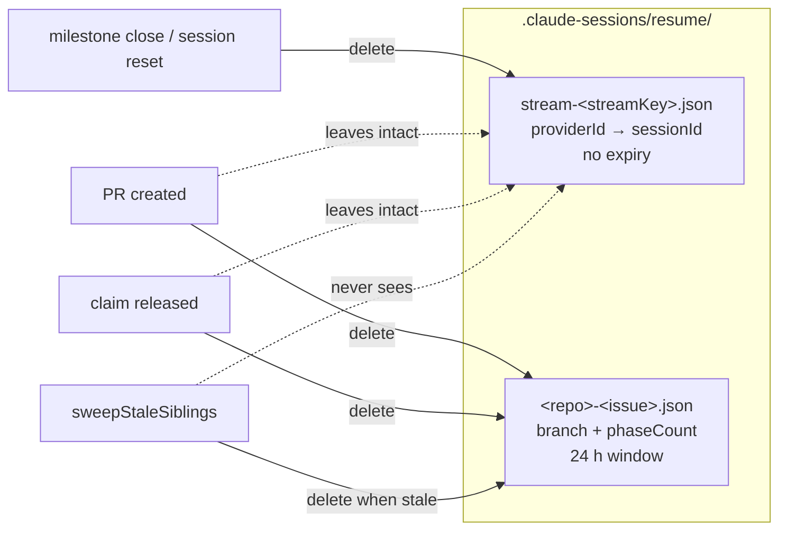

# Per-stream resume state: stream session record separate from the per-issue checkpoint

## Summary

The session id belongs to the `(repository, stream)` conversation, not to the
issue that happened to open it. `worker/deno/lib/resume_state_store.ts` now
keeps two records side by side in `.claude-sessions/resume/`:

- **stream session** — `stream-<streamKey>.json` (`streamKey` from
  `stream_identity.ts`, #2331), mapping `providerId -> { sessionId,
  credentialScope, holderHost, savedAtEpochMs }`, so a sub-issue that falls
  back to another provider opens that provider's own stream session and leaves
  the others untouched. No 24-hour expiry, not deleted at PR creation or claim
  release, never swept. New API: `streamSessionPath`, `saveStreamSession`,
  `loadStreamSession`, `deleteStreamSession`.
- **per-issue checkpoint** — today's `<repo-slug>-<issue>.json`, with today's
  fields, signatures and lifecycle, unchanged.

`sweepStaleSiblings` now matches the per-issue file-name shape (and skips the
`stream-` prefix outright) instead of every `.json`, so a stream record can
never be swept. No migration: a pre-existing per-issue record carrying a
session id is read exactly as before and is never promoted, and a host with no
stream record starts the stream fresh.

Closes #2332.

## Evidence

Backend/CLI change with no web interface to screenshot. Verified by the tests
below and by the full gate:

- `deno test tests/resume_state_store_stream_test.ts
  tests/resume_state_store_test.ts` — 26 passed, 0 failed.
- `./quality.sh` — `Result: PASSED (with skipped checks)`; the one skip
  (`config integration`) is pre-existing and unrelated.

## Acceptance Criteria

<!-- vibe-spec-review inputs="diff+issue-body" -->

- **met** — a stream record written 48 hours ago still loads; a per-issue
  record older than 24 hours still expires — evidence:
  `worker/deno/tests/resume_state_store_stream_test.ts::stream session - a
  record written 48 hours ago still loads, where a per-issue record expires`
  — reviewer: met — reason: the reviewer rightly noted the first version of
  this test compared two constants; it now stamps both records 48 h before the
  real clock and asserts the opposite outcomes on one timeline.
- **partial** — successful PR creation and claim release delete the per-issue
  record and leave the stream record intact — evidence:
  `worker/deno/tests/resume_state_store_stream_test.ts::stream session -
  deleting the per-issue record leaves the stream record intact`; the call
  sites (`worker/deno/lib/issue_worker.ts`) call `deleteResumeState`, which
  only ever touches the per-issue path — reviewer: partial — reason: covered at
  the store level only; no production path writes a stream record yet, so there
  is nothing at those call sites to assert against until the phases are wired
  in later in this milestone.
- **met** — two providers on one stream hold two session ids side by side;
  writing one leaves the other unchanged — evidence:
  `worker/deno/tests/resume_state_store_stream_test.ts::stream session - two
  providers hold sessions side by side` — reviewer: partial — reason: the
  reviewer's `partial` was about a concurrent read-modify-write. Two of the
  three failure modes are now closed — a record that exists but cannot be read
  aborts the save instead of overwriting it
  (`worker/deno/lib/resume_state_store.ts:362`), and the write goes through a
  temp file and a rename so a crash cannot truncate it (`:380`). A same-instant
  interleave of two live writers remains possible and needs a lock, which is
  out of scope for this store-level change.
- **met** — `sweepStaleSiblings` never deletes a `stream-*.json` file —
  evidence: `worker/deno/lib/resume_state_store.ts:506` plus
  `worker/deno/tests/resume_state_store_stream_test.ts::stream session - the
  per-issue sweep never deletes a stream record` — reviewer: met — reason: the
  reviewer asked that the guard say what it means, so the sweep now skips
  `STREAM_FILE_PREFIX` explicitly as well as requiring the per-issue name
  shape.
- **met** — pre-existing per-issue records keep loading unchanged (no
  migration step) — evidence:
  `worker/deno/tests/resume_state_store_stream_test.ts::stream session - a
  pre-existing per-issue record keeps loading and is not promoted` —
  reviewer: met
- **met** — `./quality.sh` passes — evidence: full gate run after the final
  edit, `Result: PASSED (with skipped checks)` — reviewer: missing — reason:
  the reviewer saw only the diff and could not run the gate; it was run here
  and passed.
- **unrequested** — the sweep became an allowlist (per-issue name shape) rather
  than an exclusion, so a `.json` file in the resume directory that is not a
  per-issue record is no longer garbage-collected — reviewer: unrequested —
  reason: the stream record is exactly such a file and must survive; a
  corrupt file that *does* carry a per-issue name is still swept as before.
- **unrequested** — `deleteStreamSession` takes an optional `providerId` and
  removes the file when the last provider goes — reviewer: unrequested —
  reason: the issue gives the call two owners with different scopes —
  milestone-close (the whole stream) and the reset path (one unresumable
  session) — and an empty record left behind would never be reclaimed, having
  no expiry and no sweep.
- **unrequested** — the record is stored as `{ "sessions": { providerId: … } }`
  rather than a bare provider map, and `loadStreamSession` applies
  `isPersistableSessionId` — reviewer: unrequested — reason: the envelope keeps
  room for record-level fields without a format break, and the id check is the
  #204 rule the per-issue record already applies on load — an id the CLI would
  refuse is not a resume.

## Standards Review

<!-- vibe-standards-review inputs="diff+CODING-STANDARDS.md" -->

- **violation** — fail-loud: a read error degraded to "empty record", so the
  next write destroyed the providers it could not read — evidence:
  `worker/deno/lib/resume_state_store.ts:362` — reason: fixed here.
  `readStreamSessions` now returns `{}` only for "not found" and a corrupt
  file, and `null` for a genuine read fault; `saveStreamSession` returns false
  on `null` rather than merging into nothing.
- **violation** — fail-loud: the reset path could report success while leaving
  the unresumable session on disk — evidence:
  `worker/deno/lib/resume_state_store.ts:327` — reason: fixed here. A
  single-provider delete that cannot read the record removes the whole file, so
  the named session is gone either way; the trade-off is documented at the
  function.
- **violation** — non-atomic write of a record nothing rebuilds: a crash
  mid-write would truncate every provider permanently — evidence:
  `worker/deno/lib/resume_state_store.ts:380` — reason: fixed here; the write
  goes to a temp file and is renamed into place.
- **violation** — the 48-hour test asserted arithmetic on two constants rather
  than behaviour — evidence:
  `worker/deno/tests/resume_state_store_stream_test.ts:74` — reason: fixed
  here; both records are now stamped 48 h before the real clock and the test
  asserts the stream loads while the per-issue record expires.
- **violation** — the documented throw (malformed repository) had no test —
  evidence: `worker/deno/lib/resume_state_store.ts:245` — reason: fixed here;
  `stream session - a malformed repository throws rather than resolving to some
  key` covers it, and the `loadStreamSession` / `deleteStreamSession` doc
  comments now state that they throw too.
- **violation** — a duplicated test body and a tautological second assertion —
  evidence: `worker/deno/tests/resume_state_store_stream_test.ts:46` — reason:
  fixed here; both removed.
- **violation** — docs stated the stream lifecycle in the present indicative
  while no caller exists yet — evidence: `docs/CONFIGURATION.md:3283` — reason:
  fixed here; the doc and the `deleteStreamSession` comment now say the callers
  land with the rest of this milestone.
- **violation** — a second persistence stack in an existing module takes the
  file past 480 lines, against "favour many smaller, focused source files" —
  evidence: `worker/deno/lib/resume_state_store.ts:234` — reason: stands. The
  issue scopes the change to this file, and the two records genuinely share
  state: one directory, one sweep invariant, and one `isPersistableSessionId`
  policy. Splitting them into two modules with a shared directory contract is a
  larger refactor than this issue asks for.
- **clean** — Australian English throughout the added lines; commit safety (no
  hidden or credential paths staged); commit message carries `#2332` and the
  run-id trailer; Deno-native tooling only (`deno test`/`fmt`/`lint`/`check`,
  `@std/assert`); every test calls the real exports and asserts on returned
  values and on-disk effects, none inspect source text; no existing test
  removed or commented out; injected clocks, no sleeps or wall-clock
  thresholds; the sweep narrowing still matches everything `resumeStatePath`
  produces.

## Test Plan

Added `worker/deno/tests/resume_state_store_stream_test.ts` (16 cases):

- path shape, and a malformed repository throwing rather than resolving;
- save/load round-trip of every field;
- a 48-hour-old stream record loading while a per-issue record of the same
  instant expires;
- two providers side by side, and rewriting one leaving the other unchanged;
- two streams of one repository not sharing a session; unknown provider;
- a non-UUID Claude id dropped, a Codex thread id kept (#204/#1699);
- a corrupt record loading as null and the next save repairing it;
- a record that exists but cannot be read never being overwritten;
- save best-effort false on filesystem failure;
- per-provider and whole-record delete, both idempotent, and the empty record
  removed;
- the per-issue sweep leaving the stream record alone;
- `deleteResumeState` leaving the stream record intact;
- a pre-existing per-issue record loading unchanged and not being promoted.

Added to `worker/deno/tests/resume_state_store_test.ts`: the sweep considers
only per-issue record names (Issue #2332). All existing cases unchanged.
