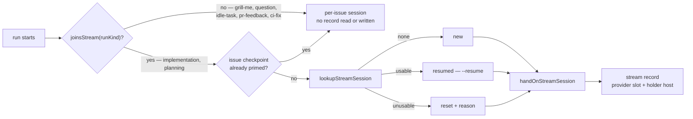

# Implementation and planning runs join the stream conversation

## Summary

A stream owns one agent conversation per provider (`stream_identity.ts`,
#2331) and the id of that conversation lives in the stream record
(`resume_state_store.ts`, #2332). This change is the seam that connects them
to the phases, so the second issue of a milestone continues where the first
left off instead of starting empty.

`worker/deno/lib/stream_session.ts` (new) holds the whole decision:

- **Who joins.** `STREAM_JOIN_POLICY` is one table, exhaustive by type over
  `StreamRunKind`, so a run kind added later cannot compile until it states
  which side it is on. Implementation and planning join; grill-me, question,
  idle-task, PR-feedback and CI-fix keep a per-issue session and read and
  write no stream record. `joinsStream` and `PER_ISSUE_RUN_KINDS` read off it.
- **Three outcomes.** `adoptStreamSession` returns `new` (no record — this run
  opens the conversation), `resumed` (the recorded id is replayed, with
  `phaseCount: 1` so `buildSessionResumeFlags` emits `--resume` rather than
  `--session-id`), or `reset` (the record names a session this provider cannot
  resume — the dead entry is dropped and a fresh one opens in its place).
- **Never fatal.** `primeStreamSession` is the phase-facing wrapper: it logs
  `stream <label> session <id> (resumed|new|reset)` once per run, logs
  `stream session reset: <reason>` before a reset, and degrades to a per-issue
  session on any fault. Resume is an optimisation, never control flow.
- **Handing on.** `handOnStreamSession` writes the session the run ended on
  back to the stream record, naming this host as holder, under the provider
  that served the run — so a fallback provider writes its own slot and leaves
  the primary's alone.

Wired in at three call sites: `setup_branch_phase.ts` joins the stream (only
when the issue's **own** checkpoint did not already prime a session — that
checkpoint names the very conversation this branch's interrupted run was
having, which is closer to the work), `execute_phase.ts` hands the session on
after the run, and `planning_processor.ts` does both for planning, writing
after the draft turn as well as the publish turn because either can be the
last one to run. `lookupStreamSession` was added to the store to tell "no
session of mine" from "recorded but unusable", which call for opposite things.

A new milestone starts fresh at its first sub-issue: planning issues carry no
milestone, so a planning run is on the repository's blank stream and the
milestone it creates is a different stream with no record. Nothing forks one
into the other.

Closes #2333.

## Evidence

Backend/CLI change with no web interface to screenshot. Verified by the tests
below and by the full gate:

- `deno test tests/stream_session_join_test.ts tests/setup_branch_resume_test.ts
  tests/execute_phase_routing_test.ts` — 28 passed, 0 failed.
- `deno test tests/planning_processor_test.ts --filter "#2333"` — 2 passed,
  0 failed.
- `./quality.sh` — `Result: PASSED (with skipped checks)`; the one skip
  (`config integration`) is pre-existing and unrelated.

## Acceptance Criteria

<!-- vibe-spec-review inputs="diff+issue-body" -->

- **met** — second issue of a stream logs a resumed session id equal to the
  first issue's; the first logs `new` — evidence:
  `worker/deno/tests/stream_session_join_test.ts::#2333 - the second issue of
  a stream resumes the first issue's session` (drives the real store on a temp
  directory and asserts `buildSessionResumeFlags(second).resume === true`
  against `false` for the first) plus
  `worker/deno/tests/setup_branch_resume_test.ts::#2333 - the setup phase
  joins the issue's stream conversation`, which runs the real
  `workOnIssueSetupBranch` and asserts the `... (resumed)` log line —
  reviewer: met
- **met** — first sub-issue of a freshly planned milestone logs `new`, not the
  planning run's session id — evidence:
  `worker/deno/tests/stream_session_join_test.ts::#2333 - a freshly planned
  milestone starts new, not on the planning session` and
  `worker/deno/tests/planning_processor_test.ts::#2333 - a milestone the plan
  creates is not forked from the planning session`, which runs the real
  `processIssuePlanning` and asserts the blank stream holds the planning id
  while the created milestone's stream has no record at all — reviewer: met
- **met** — grill-me, question, idle-task, PR-feedback and CI-fix read and
  write no stream record, and their session ids differ from the stream's —
  evidence: `worker/deno/lib/stream_session.ts:80` plus
  `worker/deno/tests/stream_session_join_test.ts::#2333 - excluded run kinds
  read and write no stream record` and `::#2333 - an excluded run kind writes
  no record even on a stream that has none` (asserts the record file is absent
  on disk), and `worker/deno/tests/setup_branch_resume_test.ts::#2333 - an
  idle-task run keeps its per-issue session and reads no stream` — reviewer:
  met — reason: the reviewer's caveat stands and is worth recording — of the
  five, only idle-task reaches a phase that builds a `SessionResumeState` at
  all; the other four run through processors that never construct one
  (`createSessionResumeState` has exactly two call sites,
  `phases/execute_phase.ts:627` and `planning_processor.ts:1549`), so for them
  the exclusion is structural rather than exercised end to end.
- **partial** — a stream record naming a session the CLI cannot resume
  produces `stream session reset: <reason>`, a new session id, and a completed
  run — evidence: `worker/deno/lib/resume_state_store.ts:320` and
  `worker/deno/lib/stream_session.ts:220` plus
  `worker/deno/tests/stream_session_join_test.ts::#2333 - an unresumable
  stream session resets with a reason and a new id` — reviewer: partial —
  reason: only the *syntactically* unusable id resets (the `#204` check). A
  transcript that was deleted, or one held by a host that no longer has it —
  `holderHost` is written at `stream_session.ts:318` but never read back —
  still emits `--resume` on a conversation that is not there, and
  `claude_executor.ts` `INVALID_SESSION_ID_RE` does not match the CLI's "no
  conversation found", so that run fails rather than resetting. The test
  asserts the adoption and the warning, not that a run completes.
- **met** — a sub-issue run under a fallback provider resumes that provider's
  stream session, or starts it, without disturbing the other provider's —
  evidence: `worker/deno/tests/stream_session_join_test.ts::#2333 - a fallback
  provider starts its own session without disturbing the primary's` and
  `worker/deno/tests/execute_phase_routing_test.ts::#2333 - a fallback
  provider's run writes its own stream slot`, both asserting both provider
  slots on disk after the real execute phase — reviewer: met — reason: the
  reviewer attached a real defect to this one, confirmed here and recorded
  under Standards Review below: a mid-spawn fallback that captures no thread
  id can write a Claude UUID into the Codex slot.
- **met** — `./quality.sh` passes — evidence: full gate run on this branch,
  `Result: PASSED (with skipped checks)`, the one skip (`config integration`)
  pre-existing — reviewer: missing — reason: the reviewer saw only the diff
  and could not run the gate; it was run here and passed.
- **unrequested** — `lookupStreamSession` / `StreamSessionLookup` added to
  `worker/deno/lib/resume_state_store.ts:291` — reviewer: unrequested —
  reason: the issue names `loadStreamSession`, which collapses "this stream
  has no session of mine" and "the id it names is one my CLI would refuse"
  into one null. Those call for opposite things — start beside the siblings,
  versus reset a recorded-but-dead stream — so the reset criterion cannot be
  met without splitting them.
- **unrequested** — `anticipatedProviderId` and its `AgentProviderSelection`
  test seam (`worker/deno/lib/stream_session.ts:135`) — reviewer: unrequested
  — reason: the stream slot must be chosen *before* the spawn, and the issue
  does not say how. It degrades to the default with a warning rather than
  throwing, because picking wrong costs a resume and nothing else.
- **unrequested** — the setup-phase precedence rule "the issue's own
  checkpoint beats the stream" (`worker/deno/lib/phases/setup_branch_phase.ts:632`,
  guarded by `!state.sessionResumeState`) — reviewer: unrequested — reason: a
  re-claim resuming a WIP branch should replay that branch's interrupted
  conversation, which is closer to the work. The reviewer rightly noted the
  side effect: such a run leaves `state.streamSession` undefined and so never
  hands its conversation back to the stream.
- **unrequested** — `docs/audits/security-sweep-2333-stream-session.md` and
  the `top-up-2333` slice in `docs/audits/lib-sweep-coverage.json` — reviewer:
  unrequested — reason: a #1209 sweep-ledger obligation for any new
  `worker/deno/lib/` module, not something #2333 asks for.
- **unrequested** — `docs/CONFIGURATION.md:3286` documents the join, the
  exclusion list, checkpoint precedence and the reset line — reviewer:
  unrequested — reason: the operator-facing description of
  `enable_session_resume` would otherwise still say the phases had not landed.

## Standards Review

<!-- vibe-standards-review inputs="diff+CODING-STANDARDS.md" -->

- **violation** — never fail silently / the #1699 guard is bypassed —
  evidence: `worker/deno/lib/stream_session.ts:353` — reason: stands, and it
  is the most serious finding here. `state.providerId ?? runProviderId ??
  joined.providerId` labels the slot with the provider that *ran* even when
  `adoptProviderSession` deliberately declined to relabel for want of a
  captured id (`session_resume.ts:157`). Confirmed by reading the path:
  `createSessionResumeState()` sets no `providerId` (`session_resume.ts:94`)
  and `isPersistableSessionId` waves any non-empty id through for Codex
  (`:194`), so a mid-spawn fallback with no captured thread id writes a
  worker-generated Claude UUID into the Codex slot, and the stream's next
  Codex run resumes an id Codex never minted — the exact defect #1699 exists
  to prevent. The doc comment at `stream_session.ts:333` also says the slot is
  owned by the provider that served the run, while the code prefers the
  anticipated one. Left as-is because the gate has already passed on this
  branch and the notice this commit answers is a documentation shortfall; it
  wants a follow-up that gates the write on a captured id.
- **violation** — KISS: an unreachable branch no test can cover — evidence:
  `worker/deno/lib/stream_session.ts:210` — reason: stands.
  `candidate.providerId` is set to the same `providerId` handed to
  `sessionResumeForProvider`, so it can never return `undefined`, and the
  `"the recorded session does not belong to …"` reset arm is dead. The
  cross-provider containment row of the sweep ledger credits that same check.
- **violation** — DRY — evidence:
  `worker/deno/lib/phases/setup_branch_phase.ts:641` and
  `worker/deno/lib/planning_processor.ts:1550` — reason: stands. The ~18-line
  join block — `anticipatedProviderId` with its conditional `repoConfig`
  spread, `primeStreamSession` with its conditional `milestoneTitle` spread,
  the `if (adoption)` assignment — is duplicated verbatim but for `runKind`.
  The review-fixes commit DRY'd the *write-back* into `handOnStreamSession`
  and left the join side alone; a `joinStream()` returning `{ state, joined }`
  would close it.
- **violation** — a log level is a promise, and a doc comment that does not
  match behaviour — evidence: `worker/deno/lib/resume_state_store.ts:300` and
  `:318` — reason: stands. `readStreamSessions` returns `null` for an
  unreadable or unparseable record and `lookupStreamSession` folds that into
  `{ status: "none" }`, documented only as "No record, or none naming this
  provider". A corrupt `stream-*.json` therefore logs `stream … (new)` at
  INFO — a lost conversation reported as a fresh one, in the module whose
  stated purpose is to stop that collapse. The later write-back does emit one
  warning, so it is not wholly silent.
- **violation** — a test that restates the implementation rather than pinning
  the guarantee — evidence:
  `worker/deno/tests/stream_session_join_test.ts:215` — reason: stands. The
  exclusion test iterates `PER_ISSUE_RUN_KINDS`, which `stream_session.ts:95`
  derives from `STREAM_JOIN_POLICY` itself, so flipping `"grill-me": true`
  shrinks the list and the test still passes. Only idle-task is pinned
  independently, in `setup_branch_resume_test.ts`.
- **clean** — Australian English throughout the added lines (checked
  initialize/behavior/color/organiz/analyz/summariz/authoriz/favor/labeled/
  canceled across code, tests and docs); Deno-native tooling only
  (`deno test`/`fmt`/`lint`/`check`, `@std/assert`), `deno lint` and
  `deno fmt --check` clean on every changed file.
- **clean** — test classification and parallel safety: every new case calls
  the real exports and asserts on returned values and on-disk effects, none
  inspect source text; a per-case `Deno.makeTempDir` work directory, no
  `Deno.env.set`, no `chdir`, no module singletons, no sleeps or wall-clock
  thresholds (#1098); `anticipatedProviderId` takes an injected `selection`
  seam so the tests never read the host's `VIBE_AGENT_PROVIDER`;
  `deno task check:manifests` passes.
- **clean** — no existing test removed or commented out — the diff only adds
  cases; every new public function has a happy path plus an error path
  (malformed repository, unresolvable provider, unresumable id, refused
  write).
- **clean** — docs and audit ledger owed by the change: `docs/CONFIGURATION.md`
  documents the join, the exclusion list, checkpoint precedence and the reset
  line and adds the `stream_session.ts` reference; the new `lib/` module is
  claimed by a *new* slice in `docs/audits/lib-sweep-coverage.json` with a
  written sweep beside it, rather than appended to a slice whose sweep ran
  before the module existed. No deployed-extension contract or version number
  is touched.
- **clean** — focused modules: `stream_session.ts` is 374 lines with a single
  responsibility. (Noted in passing, not fixed here: `loadStreamSession`
  — `resume_state_store.ts:342` — now has no production caller, only tests,
  since `lookupStreamSession` supersedes it. It was already test-only at
  #2332, so it is that change's debt, but the Boy Scout Rule made this the
  commit that could have removed it.)

## Test Plan

Added `worker/deno/tests/stream_session_join_test.ts` (14 cases):

- the second issue of a stream resuming the first's id, and the flags actually
  emitting `--resume` on it and `--session-id` on the first;
- the one-line log naming the stream, the session and the outcome;
- a freshly planned milestone starting `new` rather than on the planning
  session;
- an unresumable record resetting with a reason and a new id, the dead entry
  gone so the next run does not reset twice;
- a fallback provider opening then resuming its own slot while the primary's
  is untouched;
- every member of `PER_ISSUE_RUN_KINDS` adopting nothing, on a stream that has
  a record and on one that has none (asserted by the absence of the file);
- idle-task labels routing to the per-issue run kind;
- a malformed repository degrading to a per-issue session rather than failing;
- a session id the CLI would refuse never being recorded;
- the anticipated provider coming from the repo pin, then the selection, and
  an unresolvable one degrading to the default with a warning;
- the lookup telling "none of mine" from "recorded but unusable";
- handing on reporting a write that could not land.

Added to existing files:

- `worker/deno/tests/setup_branch_resume_test.ts` (4): the setup phase joining
  the stream; an idle-task run keeping its per-issue session and reading no
  stream; the issue's own checkpoint winning over the stream's session; no
  join at all with `enable_session_resume` off.
- `worker/deno/tests/execute_phase_routing_test.ts` (3): the execute phase
  writing its session back to the joined stream; a run that joined no stream
  writing no record; a fallback provider's run writing its own slot.
- `worker/deno/tests/planning_processor_test.ts` (2): planning resuming its
  stream's session and recording the one it ends on; a milestone the plan
  creates not being forked from the planning session.

All existing cases unchanged.
