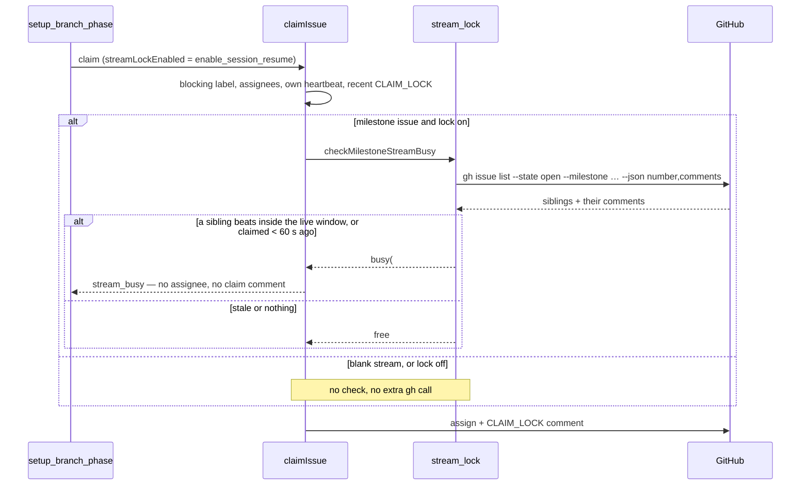

# Fleet-wide milestone stream lock: refuse a claim while a sibling issue is live

## Summary

A stream owns one agent conversation (#2331), so two hosts working two
sub-issues of one milestone are two runs inside one conversation. This adds a
fleet-wide lock: before a claim is taken, the worker reads the milestone's
**other open** issues and refuses the claim as `stream_busy` while any of them
carries a heartbeat that beat inside `LIVE_HEARTBEAT_WINDOW_SECONDS` or a fleet
`CLAIM_LOCK` posted inside the recent-claim window. Anything older is stale and
holds nothing — a crashed run never holds a stream shut. Closes #2334.

- **New `worker/deno/lib/stream_lock.ts`** — `checkMilestoneStreamBusy(...)`
  returns `{ busy: true, holderIssue, holderHost, streamLabel }` or
  `{ busy: false }`. One `gh issue list --state open --milestone … --json
  number,comments` per candidate: the listing carries the siblings' comments,
  so the markers are read from the same response. Author-filtered through
  `isFleetAuthor`, so a forged marker holds nothing.
- **`worker/deno/lib/claim_issue.ts`** — the check runs as Check 3 of
  `preClaimFreshnessCheck`, before the assignment and before the claim comment,
  so a blocked issue costs no assignment churn. New `stream_busy`
  `ClaimFailureReason`, and a `streamLockEnabled` claim option that is off
  unless a caller asks for it.
- **`worker/deno/lib/phases/setup_branch_phase.ts`** — the standard pipeline's
  claim (the run that joins the stream) passes
  `streamLockEnabled: config.enableSessionResume`. The pre-pipeline routes
  (idle-task, `add-repo`, `seed-idle-tasks`) never join a stream and never set
  it, so the lock is exactly on the runs #2333 calls stream-joining.
- The skip is **not a failure**: the refusal reads
  `Issue not available: stream_busy: …`, which `isExpectedSkipResult`
  classifies as a skip — no failure ladder, no `failed-once`, no churn record,
  and the churn check is never reached because it runs only after a won claim.

### Fail direction

Every failure mode is loud and fails open — an unreachable GitHub must not stop
the fleet claiming work, but "not read" is never reported as "nothing there":
`stream_check_failed` (gh error or unparseable payload), `stream_unresolved`
(a repository that is not `owner/name`, which would otherwise have thrown out
of the claim path), `stream_listing_truncated` (the milestone page filled) and
`sibling_comments_truncated` (one sibling's comment page filled).

## Evidence

Backend/CLI change with no web surface, so there is no screenshot: the evidence
is the test suites below and the full quality gate.



Quality gate, run after the final edit:

```text
Result: PASSED (with skipped checks)   # only "config integration" SKIPPED, as usual
```

## Acceptance Criteria

<!-- vibe-spec-review inputs="diff+issue-body" -->

- **met** — two open issues in one milestone, one with a heartbeat 30 s old →
  the second is refused with `stream_busy` and logged, and no assignee or claim
  comment is written — evidence:
  `worker/deno/tests/claim_issue_test.ts::claim issue - refuses a claim while a sibling of the milestone stream is beating (Issue #2334)`
  (asserts the reason, the log detail, and that no `--add-assignee`,
  `issue comment` or `--add-label` call was made) — reviewer: met
- **met** — same pair with the heartbeat older than
  `LIVE_HEARTBEAT_WINDOW_SECONDS` → the claim proceeds — evidence:
  `worker/deno/tests/claim_issue_test.ts::claim issue - a sibling whose heartbeat is stale does not hold the stream (Issue #2334)`
  and `worker/deno/tests/stream_lock_test.ts::checkMilestoneStreamBusy - a heartbeat older than the live window is stale`
  — reviewer: met
- **met** — a closed sibling, or a sibling in a different milestone or
  repository, never blocks — evidence:
  `worker/deno/tests/stream_lock_test.ts::checkMilestoneStreamBusy - a closed, differently-milestoned or foreign sibling never blocks`,
  which drives a fake `gh` honouring `--repo`, `--state` and `--milestone` so a
  wrongly-built query goes red — reviewer: met
- **met** — blank-stream (no milestone) issues are untouched — evidence:
  `worker/deno/tests/stream_lock_test.ts::checkMilestoneStreamBusy - a blank-stream issue is never checked`
  (three blank forms, zero API calls) and the blank-stream case in
  `worker/deno/tests/claim_issue_test.ts` — reviewer: met
- **met** — `enable_session_resume: false` → no check runs and no extra `gh`
  call is made — evidence:
  `worker/deno/tests/stream_lock_test.ts::setup phase - the stream lock follows enable_session_resume`
  and `worker/deno/tests/claim_issue_test.ts::claim issue - session resume off makes no stream check and no extra gh call (Issue #2334)`
  — reviewer: met
- **partial** — a `stream_busy` skip leaves no label, no churn record and no
  cooldown; the issue is claimed on a later scan once the heartbeat is stale —
  evidence:
  `worker/deno/tests/stream_lock_test.ts::setup phase - a stream_busy refusal is a skip, not a failure`
  (no label, no ladder, no churn — the churn check runs only after a won claim)
  — reviewer: partial — reason: the shared skip path in `run_core.ts` records
  the ordinary `issue_retry_cooldown` (600 s, no failure kind) for every
  unavailable claim, `stream_busy` included; carving one reason out of that
  path is a change to the scan loop rather than to this issue's files, and
  600 s is the same order as the 600 s liveness window the skip waits on
- **met** — `./quality.sh` passes — evidence: full gate run after the final
  edit, `Result: PASSED (with skipped checks)` — reviewer: met — reason: the
  reviewer ran the gate itself and reported the same result
- **partial** — (body requirement) reuse `filterFleetClaimComments` — evidence:
  `worker/deno/lib/stream_lock.ts` reuses `isFleetAuthor`,
  `findLiveHeartbeatMarker`, `parseHeartbeatMarker`, `hostFromMachineId`,
  `CLAIM_MARKER_PREFIX` and `RECENT_CLAIM_WINDOW_MS` — reviewer: partial —
  reason: `filterFleetClaimComments` itself is module-private and shaped for
  the REST `/comments` payload, not the `gh issue list` one, so its author
  filter is reused through `isFleetAuthor` rather than the wrapper
- **partial** — (body requirement) reuse the issue cache so the check costs at
  most one extra `gh issue list` per candidate — evidence: the one-call cost
  bound is met (`worker/deno/tests/stream_lock_test.ts` asserts
  `calls.length === 1`) — reviewer: partial — reason: `IssueCache` is
  deliberately **not** used, because its 600 s TTL outlives the liveness window
  and a cached snapshot would report a finished run as live and a live one as
  free; the module documents the inversion
- **partial** — (body requirement) apply the check only to runs that join a
  stream (#2333's `joinsStream`) — evidence:
  `worker/deno/lib/phases/setup_branch_phase.ts` sets `streamLockEnabled` and
  no other claim path does — reviewer: partial — reason: #2333 is still open,
  so `joinsStream` does not exist yet; the flag is the seam it will set, and
  the two claim callers are the standard pipeline (joins a stream) and
  `route_claim` (never does)
- **unrequested** — `stream_busy` added to `route_claim.ts`'s `UNAVAILABLE` set
  and `describeRefusal` — reviewer: unrequested — reason: the routed paths
  never enable the lock today, so this is classification-only; without it a
  future route that enabled the lock would record a benign skip as a fault
- **unrequested** — `docs/audits/security-sweep-2334-stream-lock.md` and the
  `top-up-2334` slice in `docs/audits/lib-sweep-coverage.json` — reviewer:
  unrequested — reason: repo convention, enforced by
  `tests/lib_sweep_coverage_test.ts` — a new `worker/deno/lib/` module must be
  claimed by exactly one sweep slice with a written record
- **unrequested** — the session-resume bullet in `docs/CONFIGURATION.md` —
  reviewer: unrequested — reason: a code change owes a docs change; the flag's
  documented behaviour now includes the lock
- **unrequested** — `RECENT_CLAIM_WINDOW_MS` exported from `claim_issue.ts`
  and `hostFromMachineId` exported from `heartbeat_storage.ts` — reviewer:
  unrequested — reason: the check reuses both rather than re-spelling the
  window or the host derivation

## Standards Review

<!-- vibe-standards-review inputs="diff+CODING-STANDARDS.md" -->

- **violation** — `stream_busy` changed `isRouteClaimUnavailable` with no test,
  leaving the refusal enumeration non-exhaustive — evidence:
  `worker/deno/tests/route_claim_test.ts:263` — reason: fixed here; the
  enumeration test now carries `stream_busy` in its unavailable list
- **violation** — non-null assertion the compiler cannot prove
  (`stream.milestoneTitle!`) — evidence: `worker/deno/lib/stream_lock.ts:230`
  (pre-fix) — reason: fixed here; the resolved title is bound once and the
  early return narrows it
- **violation** — a listing that filled the page was silently reported as
  "stream free" — evidence: `worker/deno/lib/stream_lock.ts:254` (pre-fix) —
  reason: fixed here; `stream_listing_truncated` is logged, and the same was
  added for a sibling's comment page (`sibling_comments_truncated`) after the
  spec reviewer flagged gh's per-issue comment page
- **violation** — the sweep record's regex row described the claim-host pattern
  as anchored and quantifier-free when it is neither — evidence:
  `docs/audits/security-sweep-2334-stream-lock.md:39` — reason: fixed here;
  the row now describes both patterns as they are, and the safety conclusion
  (no nested quantifier, no backtracking surface) is unchanged
- **violation** — missing `docs/archive/pr-summaries/pr-summary-2334.md` —
  evidence: the branch at review time — reason: fixed here; this file, with the
  Mermaid diagram the claim-sequence change calls for
- **clean** — log levels (`console.info` for the expected skip, `console.warn`
  for the degraded-but-continuing fail-open); behavioural tests through real
  functions and injected seams, no source-text greps; unit-test speed rules (no
  sleeps, no polling, no wall-clock thresholds); Australian English throughout;
  commit trailers and issue references; no hidden or credential paths staged;
  `Result`/tagged-union style; additive-only change to `ClaimFailureReason`;
  the new module paired with its test file and registered in the sweep ledger
- **clean (noted, not fixed)** — the fail-open warning interpolates the `gh`
  error message without `redactSecrets`, which the standards reviewer called a
  repo-wide gap (21 of 27 `lib/` modules that log an error do the same,
  `claim_issue.ts` included). Out of scope for this issue and not introduced by
  it

## Known limits

- **Best effort, not mutual exclusion.** The check is a read with no post-claim
  re-verification, so two hosts scanning siblings of one milestone inside the
  same window can both see a free stream. The recent-claim window narrows that
  race; closing it entirely needs a stream-level claim marker, which this issue
  did not ask for.
- **Page limits are loud, not eliminated.** A milestone past 100 open issues,
  or a sibling past one comment page, is read partially and says so.

## Test Plan

- `worker/deno/tests/stream_lock_test.ts` (new, 18 tests) — live sibling,
  stale heartbeat, released marker, fresh and stale `CLAIM_LOCK`,
  self-exclusion, closed/foreign/other-milestone siblings against a `gh` fake
  that honours the query, forged non-fleet markers, blank stream (three forms,
  zero calls), `gh` rejection, unparseable JSON, unresolvable repository,
  truncated milestone listing, truncated sibling comment page, the log wording,
  and the setup phase's `enable_session_resume` wiring plus its skip
  classification.
- `worker/deno/tests/claim_issue_test.ts` (4 new tests) — the `stream_busy`
  refusal with no assignee/comment/label, the stale-sibling claim, the
  blank-stream claim, and session resume off making no extra `gh` call.
- `worker/deno/tests/route_claim_test.ts` — `stream_busy` added to the
  refusal-classification enumeration.
- `./quality.sh` — `Result: PASSED (with skipped checks)`.
