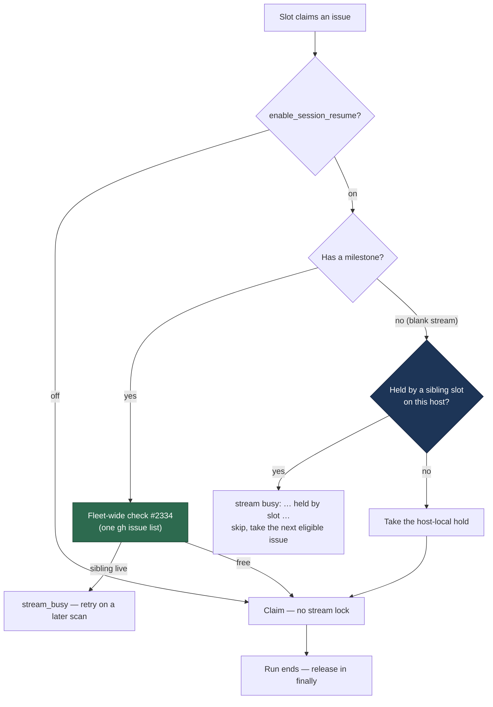

# Blank-stream lock: one non-milestone issue per repository per host

## Summary

The blank stream — a repository's issues carrying no milestone — has no
fleet-wide conversation to collide in, because each host keeps its **own** blank
conversation per repository (`stream_session.ts`, #2333). Two hosts working two
of that repository's non-milestone issues at once are two conversations, which
is correct; two **slots on one host** doing it are two runs inside one
conversation, which is not.

So `worker/deno/lib/stream_lock.ts` gains a second, host-local lock beside the
fleet-wide milestone lock of #2334: `BlankStreamLockRegistry`, an in-process
registry keyed by the conversation's own `streamKey`. A slot takes the hold when
it claims a non-milestone issue and gives it back in the same `finally` that
releases the claim, so a throw, a timeout or a kill can never hold the stream
shut. A sibling slot finding the stream held logs
`stream busy: <streamLabel> held by slot <slot> on #<issue>` and takes the next
eligible issue instead of idling the scan. No `gh` call is made for locking, so
the lock is host-local by construction.

Closes #2335.

### Why `streamKey` and not the slot registry's key

A host-local per-stream exclusion already exists — `InFlightRepoRegistry`
(#1091) — but it keys by `(repo, milestone-title-as-given)`, which is a
**coarser** partition than the conversation store's: `streamKey` trims, so a
title differing only in surrounding whitespace is two work-stream keys but one
conversation. Where the two disagree, the conversation is what this lock
protects, so it asks `streamKey` and nothing else. It only ever **adds** a
refusal and never permits one the slot registry refuses, so
`InFlightRepoRegistry.tryAcquire` remains the hard guarantee it has always been
and there is no second mechanism that can disagree in the dangerous direction.

### Two locks, never both on one issue

## Evidence

Backend/CLI change with no web interface to screenshot. The evidence is the test
suite and the full quality gate.

- `deno test -A tests/stream_lock_blank_test.ts` — **13 passed, 0 failed**.
- Affected suites together — `stream_lock_blank`, `stream_lock`,
  `run_core_production_deps`, `run_core_slot_pool`, `run_core_adaptive_claim`,
  `run_core_throw_release`, `stream_scoped_slot_exclusion_1091`,
  `slot_idle_accounting_925` — **141 passed, 0 failed**.
- `./quality.sh` — `Result: PASSED (with skipped checks)`; the one `SKIPPED`
  entry is `config integration`, which is skipped on this host already and not
  affected by this change.

**The tests were observed red before the implementation.** With
`BlankStreamLockRegistry.tryAcquire` stubbed never to find a holder, the suite
failed on the registry cases and on the pool case, whose log showed the refusal
coming from the pre-existing registry
(`[s2] lost the acquire race for stSoftwareAU/VibeCoder#900`) rather than from
this lock — which is exactly what the new behaviour adds.

## Acceptance Criteria

<!-- vibe-spec-review inputs="diff+issue-body" -->

- **met** — Two slots on one host, two non-milestone issues of one repository →
  the second slot logs `stream busy` and picks a different eligible issue, not
  an idle scan — evidence:
  `worker/deno/tests/stream_lock_blank_test.ts::blank stream lock - the blocked slot logs stream busy and picks a different eligible issue`
  — reviewer: met — reason: the reviewer's `met` verdict applies to the current
  code; it recorded `partial` against the first commit, where the refusal was
  routed into the cycle-scoped `pool.deferredClaims` and stranded the issue for
  the rest of the run. That is the defect it found and the second commit fixed.
- **met** — Two slots, non-milestone issues of two different repositories → both
  run — evidence:
  `worker/deno/tests/stream_lock_blank_test.ts::blank stream lock - non-milestone issues of two repositories both run`
  — reviewer: met
- **met** — A run that throws, times out or is killed releases the host-local
  lock; the next scan can claim the stream — evidence:
  `worker/deno/tests/stream_lock_blank_test.ts::blank stream lock - a run that throws releases the host-local lock`
  and `worker/deno/lib/run_core.ts` (the release sits in the `finally` beside
  `pool.registry.release`) — reviewer: met — reason: the reviewer noted a kill is
  moot for an in-process registry and that the timeout path is not separately
  tested; it runs through the same `finally`.
- **met** — The blank-stream path makes no `gh` call for locking — evidence:
  `worker/deno/tests/stream_lock_blank_test.ts::blank stream lock - locking a blank stream makes no gh call at all`
  asserts zero calls on an injected `gh` runner — reviewer: met
- **met** — `enable_session_resume: false` → no host-local lock is taken —
  evidence:
  `worker/deno/tests/stream_lock_blank_test.ts::blank stream lock - enable_session_resume off takes no host-local lock`,
  plus
  `worker/deno/tests/run_core_production_deps_test.ts::createProductionRunCoreDeps - enable_session_resume reaches the loop's config (Issue #2335)`
  for the operator flag actually arriving in `RunCoreConfig` — reviewer: met
- **met** — `./quality.sh` passes — evidence: full gate run after the final
  edit, `Result: PASSED (with skipped checks)` — reviewer: met
- **partial** — "Applies only … to runs that join a stream" (from *What Needs to
  Be Done*) — evidence: `worker/deno/lib/run_core.ts` gates on
  `config.enableSessionResume` alone — reviewer: partial — reason: the claim scan
  also serves the `idle-task` run kind, which `STREAM_JOIN_POLICY` keeps on a
  per-issue session, and `DiscoveredIssue` carries no labels, so the run kind is
  not knowable at the lock site without a `gh` read this lock must not make.
  Left as-is deliberately and documented at the call site: an idle-task issue
  carries no milestone, so the slot registry already occupies the same
  `(repo, blank)` stream and excludes the sibling either way — the hold is
  redundant, not wrong, and costs a refusal logged in the stream's terms rather
  than a refused claim. Closing it properly means adding labels to the finder's
  output contract, which is a separate change.
- **unrequested** — `scanExcludedIssues` exported from `run_core.ts`, with the
  per-slot self-pruning `streamBusyIssues` map — reviewer: unrequested — reason:
  it is what makes "moves on to the next eligible issue" true **without**
  stranding that issue: the refused issue leaves the scan only while its stream
  is busy, and the entry is pruned the moment the holder releases. Exported so
  the self-healing is tested directly rather than through run timing.
- **unrequested** — injectable clock on `BlankStreamLockRegistry` and the
  `sinceMs` / `streamKey` fields on a hold — reviewer: unrequested — reason: the
  clock is the seam that keeps the tests off the wall clock (the repo's own
  standard), and the two fields are what make a held stream identifiable in a
  test failure; `InFlightHold` carries the same pair for the same reason.
- **unrequested** — the fail-open `console.warn` path for a repository that is
  not `owner/name` — reviewer: unrequested — reason: `resolveStreamId` throws on
  one, and a lock must never turn a claim into a run failure; reported loudly
  rather than swallowed, matching `checkMilestoneStreamBusy`'s own fail
  direction.
- **unrequested** — the refusal line carries `on #<issue>` and a trailing clause
  beyond the `stream busy: <streamLabel> held by slot <n>` the issue specified —
  reviewer: unrequested — reason: the specified stem is intact and greppable; the
  issue number names which run holds the stream, which is the first thing an
  operator reading the line needs.
- **unrequested** — the `docs/CONFIGURATION.md` block and its Mermaid flowchart
  — reviewer: unrequested — reason: `CODING-STANDARDS.md` requires a docs change
  for a behaviour change and a Mermaid diagram where it aids understanding.

## Standards Review

<!-- vibe-standards-review inputs="diff+CODING-STANDARDS.md" -->

- **violation** — the one `await` between taking the holds and entering the
  run's `try` sat outside it, so a throw there leaked both the registry hold and
  the new blank-stream hold for the life of the process and no later scan could
  claim that stream — evidence: `worker/deno/lib/run_core.ts:3904` (as it was) —
  reason: **fixed here** — `pool.idleHooks?.disagreement.clear(slotId)` moved
  inside the `try`, so the `finally` that releases both now covers it. This also
  closes the same pre-existing window for the registry hold.
- **violation** — reusing `pool.deferredClaims` for a stream-busy refusal routed
  it into the adaptive-claim-floor re-offer guard, which logs at ERROR and names
  Issue #245 as the cause, and stranded the refused issue for the rest of the
  cycle — evidence: `worker/deno/lib/run_core.ts:3807` (as it was) — reason:
  **fixed here** — replaced with the slot-local, self-pruning `streamBusyIssues`
  set and `scanExcludedIssues`.
- **violation** — the pool test held a claim open with a fixed real-clock poll,
  breaching "Rendezvous, never sleep, to prove concurrency" and the unit-test
  shape rule — evidence:
  `worker/deno/tests/stream_lock_blank_test.ts:376` (as it was) — reason:
  **fixed here** — now `waitUntil` from `tests/support/rendezvous.ts` (#1098).
- **violation** — `BlankStreamLockRegistry.holds()` had no caller and no test,
  breaching "avoid over-engineering" and the test-coverage rule — evidence:
  `worker/deno/lib/stream_lock.ts:515` (as it was) — reason: **fixed here** —
  method removed.
- **violation** — the operator flag → pool wiring was untested, so nothing proved
  `enable_session_resume` reaches the lock — evidence:
  `worker/deno/lib/run_core_production_deps.ts:1207` — reason: **fixed here** —
  `run_core_production_deps_test.ts` now asserts the flag arrives in
  `RunCoreConfig` both on and off.
- **violation** — the first commit's subject carried no issue reference —
  evidence: commit `f957b4b8` — reason: stands, as history; its body carries
  `Refs #2335` and the run-id trailer, and the follow-up commit's subject names
  the issue.
- **clean** — Australian English throughout; no hidden path, key or credential
  file staged; every test drives real code (the real registry, the real refusal
  wording, the real `checkMilestoneStreamBusy`, the real `runCoreLoop` pool) with
  no source grepping; DRY — one `blankStreamOf` helper shared by
  `tryAcquire`/`release`/`holder`, the refusal wording exported so pool, tests
  and log-grep share one spelling, and `OPERATIONAL_DEFAULTS.enableSessionResume`
  left as the only default; fail-loud error handling with nothing swallowed;
  doc comments on every new export; the refusal logged at INFO, which is the
  right level for a condition the code goes on to handle; `deno fmt`, `deno lint`
  and the manifest classification check all clean.

## Test Plan

New — `worker/deno/tests/stream_lock_blank_test.ts` (13 tests):

- a sibling slot cannot take a blank stream this host already holds
- the refusal line names the stream and the holding slot
- blank streams of two repositories are held at once
- a milestone issue takes no host-local lock (so the two locks never both apply)
- release frees the stream and is idempotent
- a whitespace-only milestone title is the same blank stream
- a repository that is not `owner/name` fails open, loudly
- locking a blank stream makes no `gh` call at all
- the refused issue leaves the scan's exclusion set the moment the holder
  releases
- the blocked slot logs `stream busy` and picks a different eligible issue
- non-milestone issues of two repositories both run
- a run that throws releases the host-local lock
- `enable_session_resume` off takes no host-local lock

Modified — `worker/deno/tests/run_core_production_deps_test.ts`: one added test
that `enable_session_resume` reaches `RunCoreConfig`. No existing test was
changed or removed.
