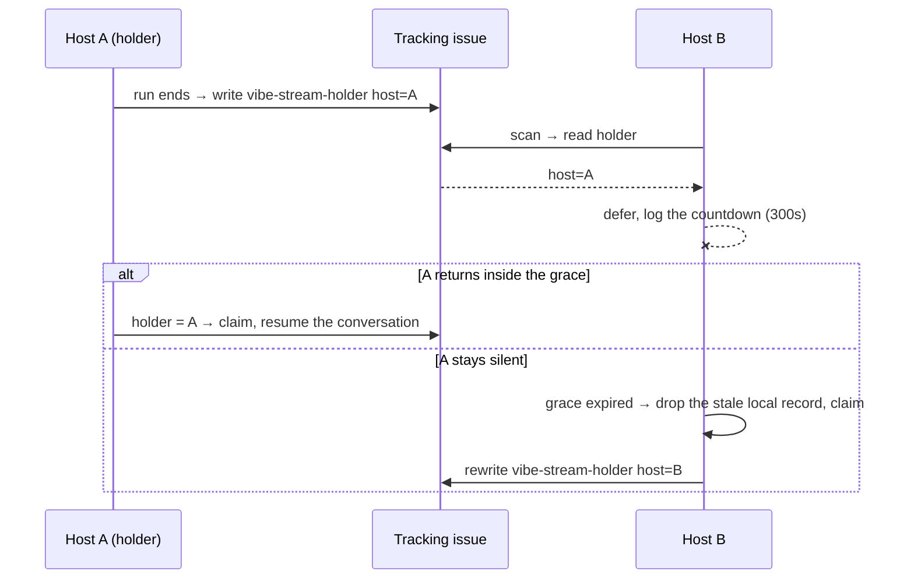

# Stream affinity: record the holder host and give it a five-minute head start

## Summary

A milestone stream's conversation lives on **one host's disk**, so a sibling
host claiming that stream's next issue cannot resume it — it opens the
conversation again from nothing and the context every sub-issue was
accumulating is lost. This change gives the holder a head start.

New `worker/deno/lib/stream_holder.ts`:

- **Writes the holder** when a stream run finishes — a hidden
  `<!-- vibe-stream-holder stream=<streamKey> host=<machineId> at=<epoch> -->`
  marker on the milestone's tracking issue (the planning issue named by the
  milestone title's `#<N>` head). An existing marker is **rewritten in place**
  and leftovers deleted, so a stream keeps exactly one live marker however many
  runs it has.
- **Reads the holder** during discovery (`readStreamHolder`).
- **Defers a non-holder** for `STREAM_AFFINITY_GRACE_SECONDS = 300`, measured
  from this host's own first sighting of the issue in this process, logged once
  as `stream affinity: deferring <stream> to <host> (<n>s left)`. After the
  grace the first other host claims, drops its own stale stream record, logs
  `stream session reset: affinity grace expired` and becomes the new holder.

Wired into the claim path as Check 4 of `preClaimFreshnessCheck`, refusing as
`stream_affinity` — a **skip, not a failure**, like `stream_busy`. Affinity is
an optimisation, never a lock: no marker, the holder being this host, a blank
stream, a milestone with no tracking issue, or a `gh` failure all mean no
deferral, and every failure is logged rather than raised.

Closes #2336.

## Evidence

Backend/CLI only — no web interface to screenshot. The evidence is the test
suite below, plus the full quality gate:

```text
deno test tests/stream_holder_test.ts tests/stream_lock_test.ts \
  tests/claim_issue_test.ts tests/route_claim_test.ts \
  tests/stream_session_join_test.ts tests/lib_sweep_coverage_test.ts
ok | 175 passed | 0 failed

./quality.sh  →  Result: PASSED (with skipped checks)
```

(The one `SKIPPED` line is `config integration`, which needs a `.config.json`
this checkout does not carry — it was skipped before this change too.)



## Acceptance Criteria

<!-- vibe-spec-review inputs="diff+issue-body" -->

- **met** — Holder host claims its stream's next issue immediately; a
  non-holder defers and logs the countdown — evidence:
  `worker/deno/tests/stream_holder_test.ts::checkStreamAffinity - the holder host claims immediately`,
  `::checkStreamAffinity - a non-holder defers and logs the countdown once`,
  `::claim issue - the holder host claims its own stream immediately (Issue #2336)`
  — reviewer: met
- **met** — After 300 s with the holder silent, the first other host claims,
  logs the reset, and the holder marker is rewritten to that host — evidence:
  `worker/deno/tests/stream_holder_test.ts::checkStreamAffinity - after the grace the claim proceeds and the reset is logged`,
  `::checkStreamAffinity - the hand-over drops this host's stale record`,
  `::recordStreamHolderForRun - writes the holder of the stream the run joined`
  — reviewer: partial — reason: the reviewer read the first draft, where
  `stream session reset: affinity grace expired` was a log line with no reset
  behind it; `checkStreamAffinity` now drops this host's stream record
  (`deleteStreamSession`) before the claim, and the new test asserts the record
  is gone.
- **met** — Exactly one live holder marker per stream survives repeated runs —
  evidence:
  `worker/deno/tests/stream_holder_test.ts::writeStreamHolder - supersedes the live marker instead of accumulating`
  — reviewer: met
- **met** — A stream with no resolvable tracking issue is claimable with no
  deferral, and the failure to write is logged, not raised — evidence:
  `worker/deno/tests/stream_holder_test.ts::writeStreamHolder - an unresolvable tracking issue is logged, not raised`,
  `::checkStreamAffinity - a gh outage fails open, loudly` — reviewer: met
- **met** — Blank-stream issues are never deferred — evidence:
  `worker/deno/tests/stream_holder_test.ts::checkStreamAffinity - a blank-stream issue is never deferred and costs no call`
  — reviewer: met
- **met** — `./quality.sh` passes — evidence: full gate run after the final
  edit, `Result: PASSED` — reviewer: partial — reason: the reviewer saw only
  the diff and could not run the gate; it was run here and passed, after the
  sweep-coverage ledger entry the first run showed missing was added.
- **unrequested** — `docs/CONFIGURATION.md` gains a bullet, a Mermaid sequence
  diagram and two reference lines — reviewer: unrequested — reason: the repo
  standard is that a behaviour change owes a docs change, and the sibling
  stream issues (#2331–#2334) each documented themselves in this same section.
- **unrequested** — `stream_affinity` added to `route_claim.ts`'s `UNAVAILABLE`
  set and `describeRefusal` — reviewer: unrequested — reason: the refusal type
  is shared, so without it `describeRefusal` falls through to the raw code and
  the route would class a skip as a fault; `stream_busy` was wired the same way
  by #2334.
- **unrequested** — markers are filtered to fleet authors (`isFleetAuthor`) —
  reviewer: unrequested — reason: a marker is text any GitHub user can post, so
  an unfiltered read would let a stranger stall a stream for five minutes per
  scan; the stream lock filters the same way.
- **unrequested** — `sanitiseField` on the marker's fields, and host comparison
  through `hostFromMachineId` — reviewer: unrequested — reason: sanitising stops
  a host name ending the HTML comment early, and comparing host parts stops two
  worker slots on one machine deferring to each other over a transcript they
  share.
- **unrequested** — sighting-map lifecycle (`SIGHTING_RETENTION_SECONDS`,
  `forgetIssueEligibility`, `resetStreamAffinityState`) — reviewer: unrequested
  — reason: the issue asks for a process-local clock; these bound its growth in
  a long-lived worker and give the tests a seam instead of a shared clock.

## Standards Review

<!-- vibe-standards-review inputs="diff+CODING-STANDARDS.md" -->

- **violation** — `stream_holder.ts` was claimed by no sweep slice, so
  `deno task check:manifests` failed — evidence:
  `docs/audits/lib-sweep-coverage.json:1838` — reason: fixed here; added the
  `top-up-2336` slice and its record,
  `docs/audits/security-sweep-2336-stream-holder.md`.
- **violation** — `catch { return null }` around `streamKey` in
  `readStreamHolder` discarded the failure and reported it as "no holder" —
  evidence: `worker/deno/lib/stream_holder.ts:355` — reason: fixed here; the
  refusal is logged before the fail-open, matching `writeStreamHolder`.
- **violation** — a degraded `gh` read was logged at INFO — evidence:
  `worker/deno/lib/stream_holder.ts:545` — reason: fixed here; `log` (warn) and
  `logInfo` (info) are separate sinks, so a degraded read warns and the
  countdown informs.
- **violation** — the execute phase sent every holder message to WARNING,
  including the expected "this milestone has no tracking issue" line — evidence:
  `worker/deno/lib/phases/execute_phase.ts:1437` — reason: fixed here; the phase
  passes both sinks.
- **violation** — `stream_affinity` was added to `route_claim.ts`'s
  `UNAVAILABLE` set with no test — evidence: `worker/deno/lib/route_claim.ts:174`
  — reason: fixed here; added to the enumeration in
  `tests/route_claim_test.ts::isRouteClaimUnavailable - held-or-unclaimable versus fault`.
- **violation** — `recordStreamHolderForRun` was a new exported function with no
  test — evidence: `worker/deno/lib/stream_holder.ts:604` — reason: fixed here;
  three tests cover its happy path, its two no-op paths and its failure path.
- **violation** — the deferral line was logged twice, once by the module and
  once by the claim path — evidence: `worker/deno/lib/claim_issue.ts:666` —
  reason: fixed here; the claim path no longer repeats it.
- **violation** — `firstSeenAt` / `deferralLogged` are module-level mutable
  singletons rather than an injected store — evidence:
  `worker/deno/lib/stream_holder.ts:445` — reason: stands. The issue asks
  specifically for the clock to be "the host's own first sighting of the issue
  **in this process**", which is process state by definition; the pure decision
  it feeds (`decideStreamAffinity`) takes `eligibleSinceSeconds` as a parameter
  and is the injected seam, and `resetStreamAffinityState` keeps the tests off a
  shared clock.
- **violation** — no `docs/archive/pr-summaries/pr-summary-2336.md` — evidence:
  `docs/archive/pr-summaries/` — reason: fixed here; this file.
- **clean** — Australian English throughout (behaviour, optimisation,
  sanitiseField); no hidden paths staged; every test drives the real
  `stream_holder.ts` and the real `claimIssue` through injected `gh` and clock
  seams, with no source-grepping; fail-open is documented and always logged;
  reuses `fetchMarkerComments`, `deleteIssueComment`, `isFleetAuthor`,
  `hostFromMachineId`, `resolveStreamId`/`streamKey`/`streamLabel` and
  `deleteStreamSession` rather than re-implementing them; no wall-clock sleeps
  or absolute timing assertions; commit messages reference the issue and carry
  the run-id trailer.

## Test Plan

Added `worker/deno/tests/stream_holder_test.ts` (30 tests):

- **Marker** — round-trip of stream key, host and epoch; a malformed or absent
  marker parses to `null`; `streamTrackingIssue` resolves the planning issue and
  refuses the blank stream and a hand-made milestone title.
- **Write** — posts on the tracking issue; supersedes the live marker in place
  and deletes leftovers; leaves another stream's marker alone; no call at all
  for the blank stream; an unresolvable tracking issue and a `gh` failure are
  logged, not raised.
- **Read** — newest marker for the stream wins; a non-fleet author's marker is
  ignored; no marker means no holder.
- **Decision** — the holder never defers to itself (host-part comparison); no
  holder means no deferral; the countdown runs down over the grace and expires
  exactly at the boundary; the deferral line's wording.
- **Check** — the countdown is logged once, not per scan; the hand-over logs the
  reset and drops this host's stale stream record; the holder claims
  immediately; a blank-stream issue costs no `gh` call; a `gh` outage fails
  open, loudly; a degraded read warns while the expected path informs.
- **Phase wrapper** — `recordStreamHolderForRun` writes the holder, is a no-op
  for a run that joined no stream or recorded no host, and reports a `gh`
  failure.
- **Claim path** — through the real `claimIssue`: a non-holder is refused as
  `stream_affinity` with no assignee written; the holder claims immediately.

Modified `worker/deno/tests/route_claim_test.ts` — `stream_affinity` added to
the `isRouteClaimUnavailable` enumeration. No existing test was removed or
disabled.
