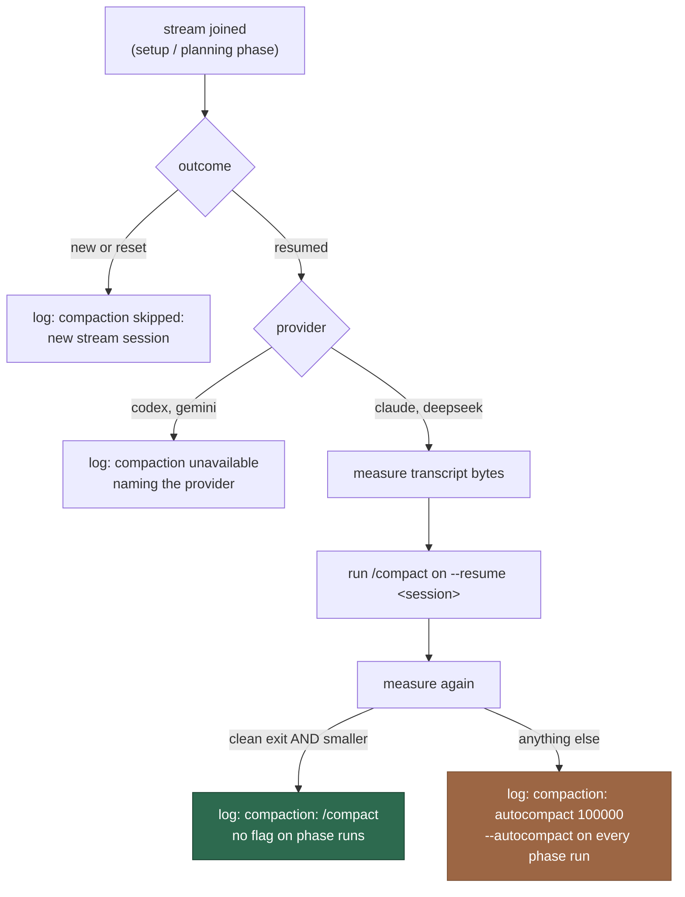

# Compact a stream conversation before each new issue (Issue #2337)

## Summary

A stream owns one agent conversation across every issue that runs on it
(#2333), so that conversation only grows — left alone it is the *next* issue
that dies of a full context window. This adds
`worker/deno/lib/stream_compaction.ts`, called from both stream-join sites
immediately after a session is adopted and before the issue's first phase run.

Claude and DeepSeek (one CLI, so one pair of levers) send `/compact` as the
prompt of a `--resume <sessionId>` print run, then **measure** the session's
transcript under the child's own `CLAUDE_CONFIG_DIR`. Only a measurably smaller
transcript counts as a compaction. Anything short of that proof — unchanged or
larger, a non-zero exit, an unmeasurable transcript, a failed spawn — is treated
as uncompacted, and every agent run of the issue carries `--autocompact 100000`
instead. Codex and Gemini expose no compaction control and say so. A `new` or
`reset` stream session has nothing to compact and spends no CLI call. Exactly
one compaction line per run, and no compaction outcome can fail an issue.

Closes #2337.

## Evidence

Backend/CLI change with no web interface to screenshot. The evidence is the
test suite below plus the full quality gate.

Verified behaviour worth a reviewer's attention:

- `claude --help` documents `--autocompact <auto|tokens>` with a `100k–1M`
  range, so 100,000 genuinely is the smallest window the CLI accepts.
- `Deno.readDir` raises `NotFound` on the first `next()`, not on the call
  (`deno eval` confirmed): the guard is around the iteration, so a host whose
  `<CLAUDE_CONFIG_DIR>/projects` does not exist yet falls back rather than
  throwing out of a module documented never to throw.
- **Known limitation, inherited from the issue's own stated assumption.**
  Whether `/compact` on a `--resume` print run shrinks the durable transcript
  is unverified — Claude transcripts are append-only JSONL, so the measured
  size may never fall and the fallback may be the path production always takes.
  That is exactly why the outcome is measured rather than assumed and why the
  fallback exists; the run says which path it took either way. Changing the
  proof (a compact-boundary marker, or resumed context tokens) is a separate
  decision for the issue author, not a silent substitution here.

## Acceptance Criteria

<!-- vibe-spec-review inputs="diff+issue-body" -->

- **met** — Transcript shrinks → `compaction: /compact` logged and no
  `--autocompact` on the phase runs — evidence:
  `worker/deno/tests/stream_compaction_test.ts::compactStreamSession - a shrinking transcript is a real compaction`
  and `::--autocompact is absent when no fallback is in force` — reviewer: met
- **met** — Transcript unchanged or larger → `compaction: autocompact 100000`
  logged and the flag on every phase run of that issue — evidence:
  `worker/deno/tests/stream_compaction_test.ts::compactStreamSession - an unchanged transcript falls back to autocompact`,
  wiring at `worker/deno/lib/phases/execute_phase.ts:785` and
  `worker/deno/lib/planning_processor.ts:1646,1801` — reviewer: met — reason:
  the reviewer noted "every phase run" is in practice the agent runs that carry
  the stream session; the other agent calls in an issue pass no
  `sessionResumeState`, are not on the stream conversation, and correctly get
  no flag
- **met** — `/compact` exiting non-zero → the fallback runs, the exit is
  logged, and the issue is not failed — evidence:
  `worker/deno/tests/stream_compaction_test.ts::compactStreamSession - a non-zero /compact run falls back and never fails the issue`
  (asserts `compactExitCode` on the log fields) — reviewer: met
- **met** — Codex and Gemini log `compaction unavailable` and invoke neither
  lever — evidence:
  `worker/deno/tests/stream_compaction_test.ts::compactStreamSession - codex exposes no compaction lever`
  (and the gemini case) plus
  `::--autocompact is never passed to a provider without the lever` — reviewer:
  met — reason: the reviewer flagged that a Codex run on a *new* stream logs
  `compaction skipped` rather than `compaction unavailable`, since only one line
  may be logged; that precedence is now deliberate and covered by
  `::compactStreamSession - a new stream session is skipped whatever the provider`
- **met** — A freshly created or reset stream session logs
  `compaction skipped: new stream session` and makes no extra CLI call —
  evidence:
  `worker/deno/tests/stream_compaction_test.ts::compactStreamSession - a new stream session has nothing to compact`
  (and the `reset` case), both asserting the stub runner was never called —
  reviewer: met
- **met** — Exactly one compaction line per run in every case — evidence:
  `worker/deno/tests/stream_compaction_test.ts::primeStreamCompaction - logs exactly one compaction line per run, whichever path ran`
  — reviewer: met — reason: the reviewer noted a run that joins no stream logs
  zero lines, which matches "called from the stream-join path"
- **met** — `./quality.sh` passes — evidence: full gate run after the final
  edit, `Result: PASSED (with skipped checks)` (`config integration` is the
  usual environment skip) — reviewer: met
- **unrequested** — operator documentation in `docs/CONFIGURATION.md` and
  `docs/PROVIDER-PARITY.md` — reviewer: unrequested — reason: repo standard —
  a code change owes a docs change, and the four log lines are operator-facing
- **unrequested** — the `top-up-2337` sweep slice and its written record
  (`docs/audits/`) — reviewer: unrequested — reason: forced by the gate —
  `lib_sweep_coverage_test.ts` fails closed on any new `worker/deno/lib/`
  module, so this is traceable to "`./quality.sh` passes"
- **unrequested** — three fallback triggers beyond the two the issue names
  (unresolvable transcript root, unmeasurable transcript, failed spawn) —
  reviewer: unrequested — reason: a safe superset — each still produces the
  specified `compaction: autocompact 100000` line, and treating an unprovable
  outcome as success is what the fail-loud standard forbids
- **unrequested** — `COMPACT_TIMEOUT_SECONDS = 180` — reviewer: unrequested —
  reason: the issue said "a short timeout" without naming one; the constant is
  module-level and matches the repo's pattern for non-operator-configurable
  timeouts

## Standards Review

<!-- vibe-standards-review inputs="diff+CODING-STANDARDS.md" -->

- **violation** — the degraded `autocompact` outcome was logged at INFO, which
  "Log Levels Are a Promise About What the Reader Must Do" defines as the
  expected path — evidence: `worker/deno/lib/stream_compaction.ts:394` (before
  the fix) — reason: fixed here — the fallback now logs at `warn` and the
  verified/skipped/unavailable outcomes stay at `info`, covered by
  `::primeStreamCompaction - the fallback is a warning, a verified compaction is not`
- **violation** — the `try` around `Deno.readDir` never fired, so a missing
  `projects/` directory threw out of a module whose contract says it never
  throws — evidence: `worker/deno/lib/stream_compaction.ts:184` (before the
  fix) — reason: fixed here — the iteration is inside the guard, proven by
  `::compactStreamSession - a transcript directory that does not exist yet is not a fault`
- **violation** — a test passed for a reason other than the one it named: the
  directory fault fired before the throwing runner was ever called — evidence:
  `worker/deno/tests/stream_compaction_test.ts:323` (before the fix) — reason:
  fixed here — the test now uses a real transcript root and asserts the
  `could not be spawned` reason, so it can only pass on the branch it names
- **violation** — the production transcript-root resolution read the ambient
  environment with no test exercising the declared `parentEnv` seam — evidence:
  `worker/deno/lib/stream_compaction.ts:213` — reason: partly fixed —
  `::compactStreamSession - the transcript root comes from the provider's own child environment`
  now drives that path through `parentEnv`. `defaultCompactionRunner` remains
  covered only by the injected-runner seam, because exercising it spawns a real
  CLI; the reviewer's related telemetry point is addressed by naming the run's
  phase (`stream_compaction.ts:230`) so it is not another `phase=unknown` line
- **violation** — no `docs/archive/pr-summaries/pr-summary-2337.md` — evidence:
  the file was absent from the diff — reason: fixed here — this file
- **clean** — Australian English throughout both new files and the docs; `deno
  fmt`, `deno lint`, `deno check` and `markdownlint` clean; the new `lib/`
  module registered in the sweep ledger with a real written record rather than
  appended to an older slice; genuine unit tests (temp dir only, no env
  mutation, no sleeps, no absolute-millisecond assertions, ~24 ms for 19 cases)
  calling real exported functions; one test file per module; every new field
  (`autocompactTokens` on `AgentInvocationRequest`, `RunClaudeOptions`,
  `PhaseState`) additive and optional; log fields carry sizes, an exit code and
  an error message — never transcript bytes, so no conversation content or
  credential reaches a sink; both commits reference the issue and carry the
  run-id trailer; no hidden paths staged

## Test Plan

Added `worker/deno/tests/stream_compaction_test.ts` (19 cases, stubbed runner
and a temp transcript file):

- a shrinking transcript is a real compaction (`compaction: /compact`, no flag)
- an unchanged transcript, and a grown one, fall back to `autocompact 100000`
- a non-zero `/compact` run falls back, records the exit code, and does not fail
- a runner that throws falls back rather than propagating (spawn branch asserted)
- a transcript that cannot be measured is never claimed as compacted
- a transcript directory that does not exist yet is not a fault
- the transcript root is derived from the provider's own child environment
- Codex and Gemini report `compaction unavailable` and invoke no lever
- `new` and `reset` sessions skip, with no CLI call; a `new` Codex session
  reports the skip (precedence between the two rules)
- exactly one compaction line per run across all five paths, and that line is a
  warning only for the fallback
- `--autocompact` reaches the Claude and DeepSeek argument lists, is absent
  without a fallback, and never reaches Codex or Gemini

Full gate: `./quality.sh` — `Result: PASSED (with skipped checks)`.
