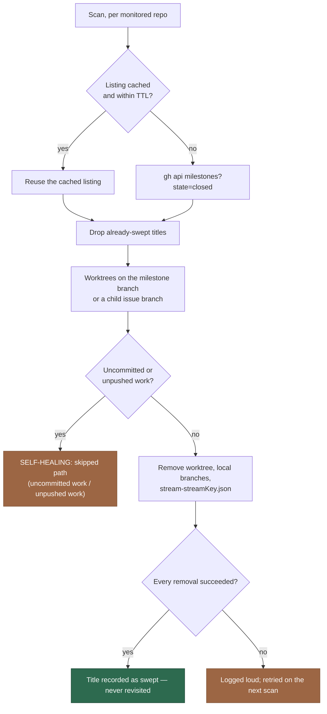

# Milestone-close housekeeping: sweep worktrees, local branches and the stream session (Issue #2338)

## Summary

When a milestone closes its stream is over — the conversation will never be
resumed, the milestone branch will never be pushed again, and the child issue
branches are spent. This adds
`worker/deno/lib/milestone_close_housekeeping.ts` at **Priority 1.71**, placed
directly after the completion pass that closes milestones, so a milestone
closed this cycle is swept on the next scan rather than waiting for the
time-based cleanups at the next startup.

Per monitored repository, one scan lists the repository's closed milestones
(`gh api repos/:repo/milestones?state=closed`), drops the titles already
recorded as swept, and for each remaining one removes: the lane worktrees
holding its `milestone/**` branch or one of its child issue branches, those
local branches, and the stream session record (`stream-<streamKey>.json`,
#2332) for every provider. One
`SELF-HEALING: <what> for closed milestone <title>` line per removal.

Two things are persisted under the work root
(`<workDir>/.milestone-close-housekeeping/<repo-slug>.json`): the closed
milestone **listing** with a 15-minute TTL, so consecutive scans share one
`gh` call, and the set of **swept titles** forever, so a closed milestone
costs one listing in its lifetime and never re-appears in the listed set.

Nothing here is destructive or fatal. A worktree with uncommitted changes, or
a branch whose commits no remote holds, is logged as
`SELF-HEALING: skipped <subject> (<reason>)` and left to the existing
`worktree_cleanup.ts` / `branch_cleanup.ts`, which this complements rather
than replaces — neither is touched by this change. A removal that fails is
logged and the milestone is *not* recorded as swept, so the next scan retries
it; the sweep never throws and never fails a run. It runs regardless of
`enable_session_resume` — with resume off there is simply no stream session
record to drop.

Closes #2338.

## Evidence

Backend/CLI change with no web interface to screenshot. The evidence is the
test suite below plus the full quality gate.

Decisions worth a reviewer's attention:

- **"Pushed" is measured against every remote ref**, not `origin/<branch>`
  (`git log <branch> --not --remotes`). A merged milestone branch is routinely
  deleted on the remote while its commits live on the default branch — fully
  pushed, and invisible to a comparison that only knows `origin/<branch>`.
- **A malformed `gh` response throws rather than reading as "no milestones".**
  Reporting an unreadable listing as empty would cache that emptiness for the
  TTL and quietly stop the sweep.
- **"Swept" is positively confirmed, never inferred from the absence of a
  failure.** A milestone whose worktrees or branches could not even be *read*
  stays unswept and is retried, rather than being recorded forever as done on
  the strength of a fault.
- **Child issues come from GitHub**, because a branch name alone cannot say
  which milestone an issue belongs to; that call is skipped entirely when the
  clone holds no `issue-*` branch.
- The `gh` seam is the shared `runGhCommand` chokepoint, not a second raw
  spawn, so the sweep inherits the timeout, retry/backoff and rate-limit
  short-circuit every other `gh` caller gets.

## Acceptance Criteria

<!-- vibe-spec-review inputs="diff+issue-body" -->

- **met** — Closing a milestone causes each host, on its next scan, to remove
  that milestone's worktrees, local milestone branch, child issue branches and
  stream session files, each with a `SELF-HEALING:` line — evidence:
  `worker/deno/tests/milestone_close_housekeeping_test.ts::sweepClosedMilestones - removes the worktree, branches and stream session of a closed milestone`
  — reviewer: met — reason: the reviewer confirmed the case runs against a
  real git clone with a real linked worktree and a real `stream-<key>.json`,
  and asserts the worktree directory is gone, both branches gone, `main` kept,
  the session record gone, and that the `SELF-HEALING:` lines name the
  milestone and cover all four artefacts
- **met** — The same closed milestone is not swept again on later scans and
  does not re-appear in the listed set — evidence:
  `worker/deno/tests/milestone_close_housekeeping_test.ts::sweepClosedMilestones - a swept milestone is never listed or swept again`
  and `worker/deno/lib/milestone_close_housekeeping.ts:326` — reviewer: met —
  reason: the reviewer checked the persistence is genuinely durable — the test
  re-reads `milestoneCloseStatePath()` off disk, then forces `listingTtlMs: 0`
  so the TTL cache is bypassed and a fresh listing is fetched; `considered` is
  still empty, so the skip comes from the persisted swept set rather than the
  cache
- **met** — A worktree or branch with uncommitted or unpushed work is skipped
  and logged, not removed — evidence:
  `worker/deno/tests/milestone_close_housekeeping_test.ts::sweepClosedMilestones - skips a worktree holding uncommitted work`
  and
  `::sweepClosedMilestones - skips a branch whose commits are on no remote` —
  reviewer: met — reason: both assert the artefact still exists *and* the
  exact log line; the unpushed case makes a real local-only commit, so it
  exercises git rather than a mock
- **met** — A removal failure is logged and retried next scan; the run
  completes — evidence:
  `worker/deno/tests/milestone_close_housekeeping_test.ts::sweepClosedMilestones - a failed removal is logged, never swept, and retried next scan`
  and the gate at `worker/deno/lib/milestone_close_housekeeping.ts:313` —
  reviewer: met — reason: the test injects a failing `git worktree remove`,
  asserts nothing was recorded as swept, then runs a second scan that
  re-considers the milestone and completes the sweep
- **met** — With `enable_session_resume: false` the worktree and branch sweep
  still runs — evidence: `worker/deno/lib/run_core_production_deps.ts:3008`
  and `worker/deno/lib/run_core.ts:1811`, plus
  `worker/deno/tests/milestone_close_housekeeping_test.ts::sweepClosedMilestones - sweeps worktrees and branches with no stream session on disk (enable_session_resume off)`
  — reviewer: met — reason: the reviewer checked the wiring and not just the
  module — the dep is an unconditional property of the production deps set and
  the 1.71 tier carries no resume gate
- **met** — `branch_cleanup.ts` and `worktree_cleanup.ts` behaviour is
  unchanged — evidence: neither file appears in `git diff --name-only` for
  this change — reviewer: met — reason: the new module only *imports* the
  already-exported `parseWorktreeList`; no signature or behaviour is touched
- **met** — `./quality.sh` passes — evidence: full gate run on this branch
  after the final edit, `Result: PASSED (with skipped checks)` (`config
  integration` is the usual environment skip) — reviewer: partial — reason:
  the reviewer graded the targeted checks only and declined to claim the full
  gate — the suite (14 cases), `deno fmt --check`, `deno lint`, `deno check`
  and `lib_sweep_coverage_test.ts` were all green in their hands, and the gate
  result above is the author's own run
- **unrequested** — `docs/INTERNALS.md` (priority row 1.71, a
  milestone-close-housekeeping section with a flowchart, module-index row),
  `docs/USAGE.md` and `docs/workflows/README.md` priority ladders — reviewer:
  unrequested — reason: repo standard — every new dispatch tier and `lib/`
  module is mirrored in all three places
- **unrequested** — the `top-up-2338` sweep slice in
  `docs/audits/lib-sweep-coverage.json` and its written record
  `docs/audits/security-sweep-2338-milestone-close-housekeeping.md` —
  reviewer: unrequested — reason: forced by the gate —
  `lib_sweep_coverage_test.ts` fails closed on any new `worker/deno/lib/`
  module, so this is traceable to "`./quality.sh` passes"
- **unrequested** — `worker/deno/tests/milestone_close_dispatch_test.ts` and
  the optional `RunCoreDeps.sweepClosedMilestones?` with an inert fallback —
  reviewer: unrequested — reason: the issue named only
  `milestone_close_housekeeping_test.ts`; the reviewer judged both justified —
  the optionality keeps existing deps sets compiling and the extra test is the
  only thing that pins the tier's position in the ladder

## Standards Review

<!-- vibe-standards-review inputs="diff+CODING-STANDARDS.md" -->

**Every violation below stands.** This commit was raised by the PR-summary
gate to add the missing criteria block to this file, and is scoped to this
file alone — the code on the branch had already cleared the quality gate. The
findings are recorded here rather than fixed so the human reviewer sees them;
the first three are one defect with three faces and are worth a follow-up
issue.

- **violation** — Never Fail Silently — Fail Loud ("never discard a non-zero
  exit code") — evidence:
  `worker/deno/lib/milestone_close_housekeeping.ts:563` and `:589` — reason:
  it stands — a failing `git status` or `git log` is folded into the benign
  outcomes `"uncommitted work"` / `"unpushed work"` and never reaches
  `outcome.errors` or `outcome.failures`, so the milestone is still recorded
  as swept at `:313` — permanently — on the strength of a git call that
  failed. The conservative *direction* is right (unreadable is treated as
  held, so nothing is destroyed); what is wrong is that the fault is not
  reported and the milestone is never reconsidered
- **violation** — Log Levels Are a Promise About What the Reader Must Do —
  evidence: `worker/deno/lib/milestone_close_housekeeping.ts:371-374`
  (`skippedLine`) — reason: it stands — the git failure above surfaces only as
  a `SELF-HEALING: skipped …` line, which production wires to `logger.info`
  (`run_core_production_deps.ts:3016`); a degraded git that leaves an artefact
  behind forever is reported on the "nothing to do" level
- **violation** — the module's own stated contract for `SkipReason` —
  evidence: `worker/deno/lib/milestone_close_housekeeping.ts:542-547` — reason:
  it stands — the doc comment promises the line names "the reason that
  actually applied rather than one standing in for both", and in the
  git-failure case it names a reason that did not apply
- **violation** — Fake the external service, do not assert the request —
  evidence: `worker/deno/tests/milestone_close_housekeeping_test.ts:102-116` —
  reason: it stands — the `gh` fake dispatches on the substrings
  `/milestones` and `/issues` alone and ignores `state=closed`,
  `milestone=<number>` and `per_page`, so a sweep that asked for *open*
  milestones, or for the children of the wrong milestone, would receive the
  same canned answer and every test would still pass
- **violation** — test coverage expectations (every new public function needs
  its error paths covered) — evidence:
  `worker/deno/lib/milestone_close_housekeeping.ts:255-262` — reason: it
  stands — the `^[^/\s]+\/[^/\s]+$` repository refusal is the first control
  the security ledger names
  (`docs/audits/security-sweep-2338-milestone-close-housekeeping.md:28`,
  "refused with no filesystem or `gh` call at all") and no test exercises it;
  every case uses `REPO = "owner/demo"`
- **clean** — fail-loud elsewhere is genuinely done: `parseJsonArrayPages`
  throws rather than reading a malformed response as "no milestones" (covered);
  "swept" is positively confirmed, never inferred; `deleteStreamSession`
  swallows its own removal error, so the module re-`stat`s and reports a
  failure; a failed removal leaves the milestone unswept and is retried,
  covered end to end
- **clean** — subprocess and secret surface: `gh` through the shared
  `runGhCommand` chokepoint and git through `runGitCommand`, both argv arrays,
  never a shell string; log text routes through the redacting logger; the
  lines carry a milestone title, a branch name, a path and git's own stderr —
  no token and no file content
- **clean** — contract and structure: `RunCoreDeps.sweepClosedMilestones?` is
  optional and additive, with a test proving an unwired deps set still
  dispatches; `parseWorktreeList` is reused rather than re-implemented; one
  test file per module; `deno task check:manifests` passes, so the
  integration, parallel-unsafe and sweep-coverage manifests all agree
- **clean** — test shape: no `Deno.env` mutation, no `Deno.chdir`, no module
  singleton, no sleeps, no polling, no absolute-millisecond assertions; every
  case builds its own `Deno.makeTempDir` work root and a real git clone, with
  `cleanup` in `finally`
- **clean** — tooling and prose: `deno fmt --check`, `deno lint` and
  `deno check` (run from `worker/deno`, where the import map lives) clean on
  the new files; `markdownlint-cli2` clean on the changed docs;
  `run_core_test.ts`, `run_core_maintenance_lane_test.ts` and
  `git_spawn_chokepoint_check_test.ts` still pass, so the new tier breaks no
  existing dispatch assertion; Australian English throughout

## Reviewer notes carried forward

Raised by the reviewers, outside the stated criteria, and **not** addressed on
this branch:

- **Concurrency.** This sweep is more aggressive than the cleanup it says it
  complements: `worktree_cleanup.ts` runs at startup and only on orphans older
  than 24 hours, whereas this runs every scan and force-removes a worktree
  whose branch still exists, guarded only by a clean tree and pushed commits.
  A slot mid-run on a child issue of a milestone that closed this cycle — in
  the window between `git push` and PR creation — could have its worktree
  removed from under it. The module consults neither `InFlightRepoRegistry`
  nor `live_slot_holds`. Neither reviewer traced whether the main loop can
  dispatch 1.71 while a slot is mid-run, so this is a suspicion, not a
  confirmed fault — but it is the first thing to settle before a host running
  `max_concurrent_issues > 1` takes this.
- **"Next scan" is really "within 15 minutes"**, because of the listing TTL.
  The issue sanctions the TTL explicitly; the docs' wording is the stronger of
  the two.
- **A legitimate skip also marks the milestone swept**, so an artefact left
  alone for uncommitted work is never reconsidered by this module. That is
  what the issue asks for, but note `worktree_cleanup.ts` only removes orphans
  and `branch_cleanup.ts` only remote-gone branches — a clean, in-use lane
  worktree skipped here may match neither.
- **Duplicate logging.** Every failure is emitted twice: at INFO by the module
  and at WARN by the caller (`run_core_production_deps.ts:3018`). The WARN is
  the correct level, so the module header's "logged loud" promise is kept by
  the caller rather than the module.
- **Two factual slips in the security ledger.** Line 43 says "two read-only
  `gh api` GETs per closed, unswept milestone" — the milestones listing is one
  call per repository per TTL, and the issues listing is skipped when no local
  `issue-*` branch exists. Line 47's "three anchored patterns" omits the
  state-file slug `replace`, which is itself trivially safe.

## Test Plan

`worker/deno/tests/milestone_close_housekeeping_test.ts` (10 cases, each on a
real git clone in its own temp work root, with an injected `gh` and clock):

- the worktree, milestone branch, child issue branches and stream session of a
  closed milestone are removed, `main` is kept, and every removal is logged
- a swept milestone is never listed or swept again, proven across a fresh
  listing with the TTL forced to zero
- a worktree holding uncommitted work is skipped and survives
- a branch whose commits are on no remote is skipped and survives
- a failed removal is logged, leaves the milestone unswept, and the next scan
  completes it
- the worktree and branch sweep runs with no stream session on disk
  (`enable_session_resume` off)
- a `gh` listing failure is reported in `errors`, not thrown
- `childIssueBranchNumber` reads the issue number off an issue branch
- `parseClosedMilestones` reads concatenated `--paginate` pages, and throws on
  unreadable output rather than reading it as none

`worker/deno/tests/milestone_close_dispatch_test.ts` (4 cases):

- the sweep tier sits between milestone completion (1.7) and branch sync
  (1.72)
- the tier calls the dep and never claims an issue
- a sweep failure is surfaced, not swallowed
- an unwired sweep dep leaves the tier inert rather than failing

Full gate: `./quality.sh`.
