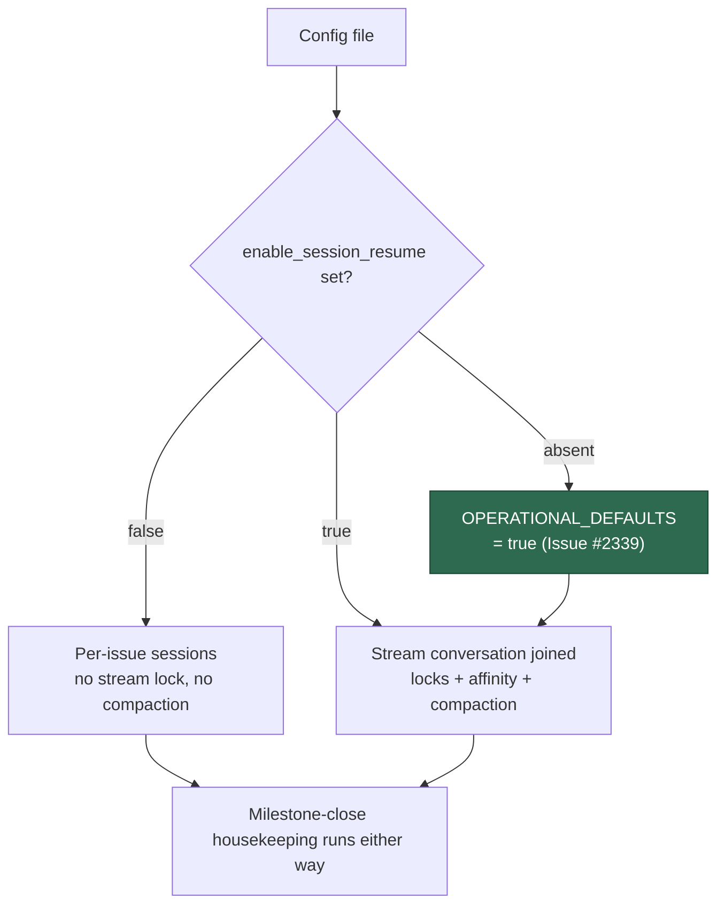

# Flip `enable_session_resume` to true by default and document the stream model (Issue #2339)

## Summary

The stream machinery this flag turns on has landed (#2333–#2338), so the shipped
default flips: `OPERATIONAL_DEFAULTS.enableSessionResume` is now `true`, and a
host with no explicit value runs with per-stream conversations, both stream
locks and the per-issue compaction. `loadConfig` already resolves
`file.enable_session_resume ?? OPERATIONAL_DEFAULTS.enableSessionResume`, so an
operator who sets `enable_session_resume: false` still turns it off; every other
site (`run_core.ts:1545`, `run_core_production_deps.ts:1210`) delegates to the
same constant rather than hardcoding a literal.

The docs half brings three tables in line with the new default and documents the
stream model itself:

- **`docs/CONFIGURATION.md`** — both tables now say `true`; a new **stream
  model** subsection covers one stream per (repository, milestone) plus one
  blank stream per repository (never shared between repositories), which run
  kinds join a stream, the fleet-wide milestone lock versus the per-host blank
  lock, affinity and its five-minute grace, compaction, and milestone-close
  housekeeping. The stale "leave disabled if your workflow is predominantly
  single-phase" note is replaced by what the flag controls and what turning it
  off gives up.
- **`docs/MODEL-AND-CACHING.md`** — both tables corrected, plus a per-provider
  **compaction behaviour** table: `/compact` with a measured transcript for
  Claude and DeepSeek, `--autocompact 100000` when that proof is absent, and
  `compaction unavailable` for Codex and Gemini.

Closes #2339.

## Evidence

Backend/config change with no web interface to screenshot. The evidence is the
test run below.

`deno test tests/config_defaults_test.ts tests/config_docs_consistency_test.ts
tests/resume_branch_by_issue_test.ts tests/setup_branch_resume_test.ts`
— **116 passed, 0 failed**. The three new default-pinning tests were observed
failing before the flip (`Actual false / Expected true`) and passing after it.

What the default now resolves to:

## Acceptance Criteria

<!-- vibe-spec-review inputs="diff+issue-body" -->

- **met** — A config file with no `enable_session_resume` key loads with
  `enableSessionResume: true` — evidence:
  `worker/deno/tests/config_defaults_test.ts::config_defaults - loadConfig defaults enableSessionResume to true (Issue #2339)`
  — reviewer: met
- **met** — `enable_session_resume: false` in the file still loads as `false` —
  evidence:
  `worker/deno/tests/config_defaults_test.ts::config_defaults - loadConfig honours enable_session_resume false (Issue #2339)`
  — reviewer: met
- **met** — `docs/CONFIGURATION.md` and `docs/MODEL-AND-CACHING.md` state the
  `true` default and describe the stream model, the locks, affinity, compaction
  and the close-time housekeeping — evidence: `docs/CONFIGURATION.md` (§ Session
  Resume → The stream model) and `docs/MODEL-AND-CACHING.md` (§ Compaction
  behaviour by provider) — reviewer: met
- **met** — No test still asserts `false` as the shipped default; a test pins
  `true` — evidence: `worker/deno/tests/resume_branch_by_issue_test.ts:58` now
  sets `enableSessionResume: false` explicitly and line 120 pins
  `buildDefaultWorkerConfig().enableSessionResume === true`;
  `worker/deno/tests/config_defaults_test.ts::config_defaults - OPERATIONAL_DEFAULTS.enableSessionResume is true (Issue #2339)`;
  `worker/deno/tests/run_core_slot_pool_test.ts:1528` likewise passes the flag
  explicitly — reviewer: met
- **met** — `./quality.sh` passes — evidence: full gate run after the final
  edit, `Result: PASSED (with skipped checks)`; the only skip is
  `config integration`, which the gate skips in normal mode on every run —
  reviewer: missing — reason: the reviewer was given the diff only and was
  told not to run the gate, so it could not confirm a run it cannot see. The
  gate was run here, twice: it failed the first time (four tests) and passes
  after the fixes recorded above.
- **unrequested** — `docs/archive/pr-summaries/pr-summary-2339.md` —
  reviewer: unrequested — reason: the repository's mandatory PR-summary
  artifact, required of every PR by the house standards rather than by this
  issue's own text.
- **unrequested** — `worker/deno/lib/run_core.ts:1543` comment, and the
  `docs/INTERNALS.md` / `run_core_slot_pool_test.ts` edits —
  reviewer: unrequested — reason: surfaces the flip falsified. The comment and
  the INTERNALS paragraph described the flag as off; the slot-pool test stopped
  exercising the acquire race it exists for, because under the new default its
  blank-stream issue is refused earlier by the #2335 lock. Each is the
  docs-or-test half the issue's own "verify no other site hardcodes the old
  default" instruction implies.

## Standards Review

<!-- vibe-standards-review inputs="diff+CODING-STANDARDS.md" -->

- **violation** — no PR summary file — evidence:
  `docs/archive/pr-summaries/pr-summary-2339.md` — reason: fixed here; the
  reviewer saw the diff before the summary was written.
- **violation** — "A Code Change Owes a Docs Change": the rewritten Session
  Resume section still carried the superseded per-issue keying — evidence:
  `docs/CONFIGURATION.md:3288` ("How it works") — reason: fixed here; the steps
  now describe the stream lookup and the checkpoint precedence.
- **violation** — the compaction note still said resume controls "within-issue"
  continuity — evidence: `docs/CONFIGURATION.md:3496` — reason: fixed here.
- **violation** — sibling surfaces still framed resume as per-issue only —
  evidence: `docs/MODEL-AND-CACHING.md:1546`, `docs/MODEL-AND-CACHING.md:2599`,
  `docs/INTERNALS.md:4196` — reason: fixed here; INTERNALS now points at the
  stream model.
- **violation** — a link named a bold paragraph with no anchor — evidence:
  `docs/CONFIGURATION.md:3308` — reason: fixed here; it now names the enclosing
  heading.
- **violation** — TDD rule 5: the new docs-drift test reads Markdown as text
  rather than exercising worker code — evidence:
  `worker/deno/tests/config_docs_consistency_test.ts:137` — reason: stands. It
  is the house pattern of the file it was added to (Issue #3464), and it is the
  docs-drift check this issue's Failure Detection asks for; it asserts against
  `OPERATIONAL_DEFAULTS`, so it cannot pass while the docs disagree with the
  code.
- **violation** — DRY: the shipped-default pin is duplicated inside a
  pushed-WIP test — evidence:
  `worker/deno/tests/resume_branch_by_issue_test.ts:120` — reason: stands. The
  issue asks that this file assert the new default "deliberately, not
  incidentally", and the line next to the fixture's explicit `false` is what
  makes the distinction visible at the point it matters.
- **clean** — Australian English throughout; the four `config_defaults_test.ts`
  additions drive `buildDefaultWorkerConfig()` and `loadConfig()` against real
  temp config files rather than inspecting source; no hidden or credential
  paths staged; the commit carries the `Vibe-Coder-Run-Id` trailer; the new
  Mermaid block validates; the default lives only in `OPERATIONAL_DEFAULTS`,
  with `config.ts:868`, `run_core.ts:1545` and
  `run_core_production_deps.ts:1210` all reading through it.

A working-tree slip is worth flagging to the reviewer: an earlier
`deno fmt docs/ worker/deno/` in this run reformatted 712 unrelated files
(the repo formats from `worker/deno/` and excludes `docs/`). It was reverted
with `git checkout -- .` before anything was staged, and the four intended
edits were reapplied by hand — the diff contains no reformatting.

## Test Plan

Added to `worker/deno/tests/config_defaults_test.ts`:

- `config_defaults - OPERATIONAL_DEFAULTS.enableSessionResume is true (Issue #2339)`
- `config_defaults - buildDefaultWorkerConfig enables session resume (Issue #2339)`
- `config_defaults - loadConfig defaults enableSessionResume to true (Issue #2339)`
- `config_defaults - loadConfig honours enable_session_resume false (Issue #2339)`
- `config_defaults - loadConfig honours enable_session_resume true (Issue #2339)`

Added to `worker/deno/tests/config_docs_consistency_test.ts`:

- `config docs - documented enable_session_resume default matches the code (Issue #2339)`
  — every table row documenting the key across both documents must name the
  value `OPERATIONAL_DEFAULTS` ships, so the docs half cannot rot.

Modified `worker/deno/tests/resume_branch_by_issue_test.ts`:

- `makeContext` now turns `enableSessionResume` off **explicitly** instead of
  inheriting it from the defaults, preserving the file's purpose (pushed-WIP
  resume does not depend on the flag), and the `setup #220` test additionally
  pins the shipped default at `true`. No test was removed or commented out.
