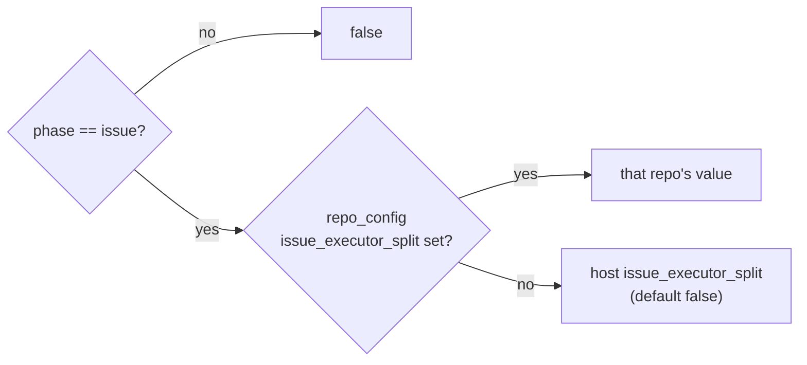

# Add the `issue_executor_split` config key

## Summary

Registers a boolean `issue_executor_split` config key — host-wide, with a
same-named per-repository override under `repo_config` — plus the
`isIssueExecutorSplitEnabled(phase, repoConfig, config)` resolver the later
sub-issues of #2320 call. The key defaults to `false` and nothing reads the
resolver yet, so an unconfigured host invokes the coding agent exactly as it
does today. Closes #2341.

Registration is complete end to end: `WorkerConfig`, `RepoConfig` and
`ConfigFile` in `types.ts`; `REPO_CONFIG_KEY_MAP` and `loadConfig` in
`config.ts`; `OPERATIONAL_DEFAULTS` and `buildDefaultWorkerConfig` in
`config_defaults.ts`; `KNOWN_CONFIG_KEYS`; and `ConfigFileJson` plus the
`booleanFields` list in `validation.ts`, so a non-boolean fails validation
naming the key.

## Evidence

Backend/config change with no web interface to screenshot. Evidence is the test
suite and the full quality gate:

- `deno test worker/deno/tests/issue_executor_split_test.ts` — 11 passed.
- `./quality.sh` — `Result: PASSED (with skipped checks)`; the only skip is the
  `config integration` stage, which needs host credentials this sandbox lacks.
- `deno task check:manifests` — 656 passed after the new `lib/` module was
  claimed by sweep slice `top-up-2341`.

## Acceptance Criteria

<!-- vibe-spec-review inputs="diff+issue-body" -->

- **met** — a `.config.json` with no key loads `issueExecutorSplit === false`
  and the resolver returns `false` — evidence:
  `worker/deno/tests/config_defaults_test.ts::config_defaults - loadConfig defaults issueExecutorSplit to false (Issue #2341)`
  and
  `worker/deno/tests/issue_executor_split_test.ts::issue_executor_split - defaults to disabled for the issue phase`
  — reviewer: met
- **met** — host `true` enables the `issue` phase and never `planning`,
  `pr_feedback` or `ci_fix` — evidence:
  `worker/deno/tests/issue_executor_split_test.ts::issue_executor_split - every other phase resolves false`
  — reviewer: met
- **met** — a `repo_config` value beats the host value in both directions —
  evidence:
  `worker/deno/tests/issue_executor_split_test.ts::issue_executor_split - per-repo false beats a host-wide true`
  and
  `worker/deno/tests/config_test.ts::config - loadConfig normalises per-repo issue_executor_split (Issue #2341)`
  — reviewer: met
- **met** — `issue_executor_split: "yes"` fails `validateConfigFileJson` with an
  error naming the key — evidence:
  `worker/deno/tests/issue_executor_split_test.ts::issue_executor_split - validateConfigFileJson rejects a non-boolean`
  — reviewer: met
- **met** — setting the key raises no unknown-key warning — evidence:
  `worker/deno/tests/config_unknown_keys_test.ts` core-field list and
  `worker/deno/lib/config_unknown_keys.ts` — reviewer: met
- **met** — `docs/CONFIGURATION.md` documents the key and its `repo_config`
  override — evidence: the host-key row in the defaults table and the
  `repo_config` row in the repository-options table — reviewer: met
- **met** — `./quality.sh` passes — evidence: full gate run after the final
  edit, `Result: PASSED` — reviewer: met — reason: the reviewer spot-verified
  `check`, `fmt`, `lint` and the affected tests but did not run the full gate;
  it was run here and passed.
- **unrequested** — a non-boolean `repo_config` value warns and falls through to
  the host value, rather than being returned as-is — evidence:
  `worker/deno/lib/issue_executor_split.ts:48` — reviewer: unrequested — reason:
  `repo_config` is not schema-validated, so without the guard a string `"false"`
  would resolve truthy; kept and documented, with the warning printing `typeof`
  only.
- **unrequested** — the `config` parameter is typed
  `Pick<WorkerConfig, "issueExecutorSplit">` rather than the whole
  `WorkerConfig` — evidence: `worker/deno/lib/issue_executor_split.ts:15` —
  reviewer: unrequested — reason: structurally compatible with a full
  `WorkerConfig` and it keeps the resolver's dependency surface to the one field
  it reads.
- **unrequested** — a `top-up-2341` sweep slice and its written record —
  evidence: `docs/audits/lib-sweep-coverage.json` and
  `docs/audits/security-sweep-2341-issue-executor-split.md` — reviewer:
  unrequested — reason: not in the issue, but `check:manifests` fails any new
  `worker/deno/lib/` module that no sweep slice claims.

## Standards Review

<!-- vibe-standards-review inputs="diff+CODING-STANDARDS.md" -->

- **violation** — the new `lib/` module was claimed by no sweep slice, so
  `deno task check:manifests` and the gate's `completeness checks` stage failed
  — evidence: `worker/deno/lib/issue_executor_split.ts:1` — reason: fixed here —
  slice `top-up-2341` added to `docs/audits/lib-sweep-coverage.json` with its
  written record; `check:manifests` and `./quality.sh` now pass.
- **violation** — a documentation-grep test asserting markdown row counts, the
  shape TDD rule 5 forbids — evidence:
  `worker/deno/tests/issue_executor_split_test.ts:110` — reason: fixed here —
  the test was removed; the documentation itself is the evidence for that
  criterion.
- **violation** — the operator docs described run behaviour the code does not
  implement — evidence: `docs/CONFIGURATION.md:399` and
  `docs/CONFIGURATION.md:3991` — reason: fixed here — both rows now state that
  the key is registered only and changes no run behaviour yet.
- **violation** — `isIssueExecutorSplitEnabled` is exported with no production
  caller — evidence: `worker/deno/lib/issue_executor_split.ts:44` — reason:
  stands — the issue explicitly asks for "the resolver the later sub-issues
  call", and wiring a caller here would change run behaviour this issue forbids.
- **violation** — a test swaps `console.warn` instead of using an injected seam
  — evidence: `worker/deno/tests/issue_executor_split_test.ts:79` — reason:
  stands — the swap is restored in `finally`, the parallel-safety gate does not
  flag it, and 28 existing test files use the same pattern; adding a `warn` seam
  to the signature the sub-issues call is not this issue's scope.
- **violation** — the PR summary file was absent — evidence:
  `docs/archive/pr-summaries/pr-summary-2341.md` — reason: fixed here — this
  file.
- **clean** — Australian English throughout; `deno fmt`, `deno lint`,
  `deno check` and markdownlint all pass; the default lives once in
  `OPERATIONAL_DEFAULTS` and is consumed by both `loadConfig` and
  `buildDefaultWorkerConfig`; every registration surface updated; a non-boolean
  host value fails loudly in validation; tests call real code with happy, error
  and edge cases; additive-only changes; no hidden or credential-shaped paths
  staged; commit carries the issue reference and the `Vibe-Coder-Run-Id`
  trailer.

## Test Plan

- Added `worker/deno/tests/issue_executor_split_test.ts` — default off,
  host-wide enable, every non-`issue` phase resolving `false`, both override
  directions, a repo entry without the key, a non-boolean repo value warning and
  falling back, `KNOWN_CONFIG_KEYS` membership, and `validateConfigFileJson`
  accepting a boolean and rejecting `"yes"`.
- Added to `worker/deno/tests/config_defaults_test.ts` — `loadConfig` defaults
  `issueExecutorSplit` to `false` and reads a host-wide `true`.
- Added to `worker/deno/tests/config_test.ts` — `loadConfig` normalises the
  snake_case `repo_config` key to `issueExecutorSplit`.
- Added `issue_executor_split` to the core-field list in
  `worker/deno/tests/config_unknown_keys_test.ts`.
