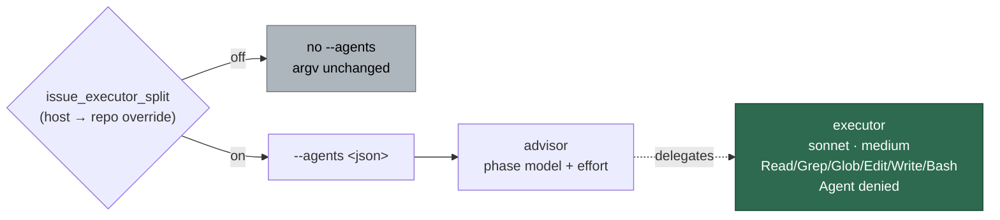

# Pass `--agents` Sonnet executor definitions for a split `issue` run

## Summary

With `issue_executor_split` on, an `issue`-phase run now hands the Claude CLI
`--agents` definitions of a Sonnet executor sub-agent, so the advisor — the main
session on the phase's own model and effort — delegates mechanical edit-and-test
work to a cheaper tier instead of every sub-agent inheriting the phase's model.
With the key off (the default) no argument is emitted at all and the argv is
byte-for-byte what the worker builds today. Closes #2342.

The executor runs on the `sonnet` tier alias at `medium` effort, holds exactly
`Read, Grep, Glob, Edit, Write, Bash`, and is denied `Agent` so it cannot spawn
further sub-agents. Phase routing is untouched.



### What changed

- `worker/deno/lib/issue_executor_agents.ts` (new) — `buildIssueExecutorAgents()`
  and the five constants it is built from.
- `worker/deno/lib/agent_provider.ts` — `AgentDefinition`, the optional `agents`
  field on `AgentInvocationRequest`, and the `--agents <json>` emission in
  `buildClaudeCliArgs`, placed with the static flags ahead of `-p`.
- `worker/deno/lib/claude_runner.ts` — `agents?` on `RunClaudeOptions`,
  forwarded where `disallowedTools` is.
- Both `issue`-phase call sites gate on `isIssueExecutorSplitEnabled(...)`:
  `lib/execute_claude_phase.ts` (standalone command path) and
  `lib/phases/execute_phase.ts` (the main loop the fleet actually runs). Wiring
  only the first would have left the key inert on every fleet run.
- DeepSeek shares Claude's argv builder, so the definitions are stripped there
  — its endpoint cannot resolve Anthropic tier aliases — and the drop is warned
  about rather than silent, mirroring the existing `--effort` treatment. Codex
  and Gemini build their own argv and never see the field.
- `docs/CONFIGURATION.md` — both `issue_executor_split` rows updated; they said
  "nothing reads it yet", which this change makes false.
- `docs/audits/security-sweep-2342-issue-executor-agents.md` +
  `docs/audits/lib-sweep-coverage.json` — the new `lib/` module's sweep slice.

**No silent fallback.** A CLI that rejects `--agents` fails the run with its own
error; nothing re-invokes it without the flag.

## Evidence

Backend/CLI change with no web interface to screenshot. The evidence is the
tests below plus the full gate.

`./quality.sh` output (final run):

```
Result: PASSED
```

## Acceptance Criteria

<!-- vibe-spec-review inputs="diff+issue-body" -->

- **met** — with the key off, `buildClaudeCliArgs` returns the same argv element
  for element — evidence:
  `worker/deno/tests/agent_provider_test.ts::agent provider - Claude emits no --agents when the split is off (Issue #2342)`
  asserts against an explicit expected array — reviewer: met
- **met** — with the key on, the argv carries `--agents` whose JSON parses to one
  executor with the Sonnet model, `medium` effort, exactly the six tools and
  `Agent` denied — evidence:
  `worker/deno/tests/agent_provider_test.ts::agent provider - Claude emits --agents carrying the Sonnet executor when the split is on (Issue #2342)`
  and `worker/deno/tests/issue_executor_agents_test.ts` — reviewer: met
- **met** — a Codex, Gemini or DeepSeek invocation from the same request emits no
  `--agents` — evidence:
  `worker/deno/tests/agent_provider_test.ts::agent provider - Codex and Gemini emit no --agents from the same request (Issue #2342)`
  and
  `worker/deno/tests/agent_provider_deepseek_test.ts::agent provider deepseek - sub-agent definitions are dropped from the argv and stated loudly (Issue #2342)`
  — reviewer: met
- **met** — a CLI exit reporting an unknown `--agents` flag surfaces as a failed
  run with the CLI's message, and no second invocation is made — evidence:
  `worker/deno/tests/claude_runner_test.ts::runClaudeWithRetry - a CLI rejecting --agents fails the run with its own message and is not re-invoked (Issue #2342)`
  — reviewer: met — reason: the reviewer called the evidence thin because the
  test pins `maxRetries: 0`; it then traced the production ladder
  (`claude_runner.ts:3054-3216`) and confirmed an unknown-option exit matches no
  retry classifier, so the behaviour holds at the default `maxRetries` too. The
  test now also asserts the single recorded invocation carried `--agents`.
- **met** — `./quality.sh` passes — evidence: full gate run after the final edit
  — reviewer: missing — reason: the reviewer ran the gate against the first
  commit, where the new `lib/` module was claimed by no sweep slice. Fixed here
  by adding the `top-up-2342` slice and its ledger; the gate now passes.
- **unrequested** — the DeepSeek warning (`warnDeepSeekAgentsUnsupported`) —
  reviewer: unrequested — reason: the issue says DeepSeek "ignores" the field,
  but DeepSeek reuses `buildClaudeCliArgs`, so stripping is required and a
  silent drop would breach the fail-loud standard; the warning mirrors the
  existing `--effort` one.
- **unrequested** — the main-loop call site in `lib/phases/execute_phase.ts` —
  reviewer: unrequested — reason: the issue named only the standalone path, but
  the fleet's own issue runs go through the main loop, so wiring one site alone
  would ship a key that is inert on every real run.
- **unrequested** — the two "split is on" log lines and the exported
  `ISSUE_EXECUTOR_*` constants — reviewer: unrequested — reason: the log states
  which routing a run took, and the constants are the single source the call
  sites and tests read rather than repeating literals.
- **unrequested** — the `docs/CONFIGURATION.md` rows and the sweep-slice ledger
  — reviewer: unrequested — reason: both are made false or red by this change,
  so updating them is required maintenance, not new behaviour.

## Standards Review

<!-- vibe-standards-review inputs="diff+CODING-STANDARDS.md" -->

- **violation** — the new `lib/` module was claimed by no sweep slice, so
  `check:manifests` and the gate were red — evidence:
  `worker/deno/lib/issue_executor_agents.ts:1` — reason: fixed here —
  `docs/audits/lib-sweep-coverage.json` gains the `top-up-2342` slice and
  `docs/audits/security-sweep-2342-issue-executor-agents.md` is its record.
- **violation** — the config doc claimed the key scoped to every host
  `issue`-phase run while only the standalone path was wired — evidence:
  `docs/CONFIGURATION.md:399` — reason: fixed here by wiring the main-loop path
  (`lib/phases/execute_phase.ts`) so the claim is true.
- **violation** — a doc comment asserted wiring parity with
  `codegraphContextEnabled` that did not exist — evidence:
  `worker/deno/lib/execute_claude_phase.ts:312` — reason: fixed here; the
  comment now names each path's own source.
- **violation** — the doc row said Codex and Gemini "say so" when they drop the
  split; they never see the field — evidence: `docs/CONFIGURATION.md:399` —
  reason: fixed here by stating what each provider actually does. Adding
  warnings to two more descriptors was declined as out of scope: neither reads
  the field, so there is no silent *drop* to report.
- **violation** — the INFO line claimed delegation had happened rather than that
  the key resolved on — evidence:
  `worker/deno/lib/execute_claude_phase.ts:1396` — reason: fixed here; both log
  lines now state that the invocation carries the definitions.
- **violation** — `warnDeepSeekAgentsUnsupported` is exported but had no test in
  its own module's test file, and its phase-less branch was unexercised —
  evidence: `worker/deno/lib/deepseek_executor.ts:253` — reason: fixed here;
  `worker/deno/tests/deepseek_executor_test.ts` covers both branches.
- **violation** — a stale module doc comment still said nothing downstream read
  the key — evidence: `worker/deno/lib/issue_executor_split.ts:5` — reason:
  fixed here.
- **violation** — a test asserted keywords in the prompt text the same function
  builds, which verifies nothing and breaks on a re-word — evidence:
  `worker/deno/tests/issue_executor_agents_test.ts:67` — reason: fixed here;
  replaced with the CLI's actual contract (both required fields populated),
  leaving the machine-readable model/effort/tools assertions as they were.
- **violation** — no `docs/archive/pr-summaries/pr-summary-2342.md` — evidence:
  `docs/archive/pr-summaries/` — reason: fixed here; this file.
- **clean** — Australian English throughout; no hidden or credential-shaped path
  staged; every test calls real code (`buildIssueExecutorAgents`,
  `provider.buildInvocation`, `runClaudeWithTimeout` / `runClaudeWithRetry`,
  `runExecuteClaudePhase`, `workOnIssueExecuteClaude`) and asserts on results or
  on a real stub's recorded argv rather than grepping source; the CLI-rejection
  path is fail-loud with no retry; JSDoc on every new exported symbol and
  interface field; tests are parallel-safe (fake clock, per-test temp dirs, no
  `Deno.env.set`, no sleeps); the key-off argv is pinned element for element;
  no new config key was introduced.

One open risk both reviewers raised independently and neither could settle here:
the installed CLI documents `--agents` as `{description, prompt}`, and whether it
honours the per-agent `effort` and `disallowedTools` keys could not be confirmed
without a live invocation. The issue mandates both fields, so the diff is
faithful; a key the CLI silently ignores would produce no error, so confirm
against the CLI's agent schema before enabling the key on a host. The `tools`
allowlist already excludes `Agent`, so the denial is belt-and-braces either way.

## Test Plan

Added:

- `worker/deno/tests/issue_executor_agents_test.ts` — the executor definition's
  model, effort, tool set, `Agent` denial, required fields, and JSON
  round-tripping.
- `worker/deno/tests/execute_claude_phase_issue_executor_split_2342_test.ts` —
  the standalone call site, both directions of the key and both per-repo
  overrides.
- `worker/deno/tests/execute_phase_issue_executor_split_2342_test.ts` — the same
  four cases on the main-loop path.

Extended:

- `worker/deno/tests/agent_provider_test.ts` — key-off argv pinned element for
  element; key-on `--agents` JSON; Codex and Gemini emit nothing.
- `worker/deno/tests/agent_provider_deepseek_test.ts` — DeepSeek strips the
  definitions and warns; an invocation without the split warns nothing.
- `worker/deno/tests/claude_runner_test.ts` — `agents` forwarded as `--agents`
  and absent when not set; a CLI rejecting the flag fails the run with its own
  exit status and message, invoked exactly once, with that one invocation
  carrying the flag.
- `worker/deno/tests/deepseek_executor_test.ts` — the new warning helper, both
  the phase and phase-less branches.
