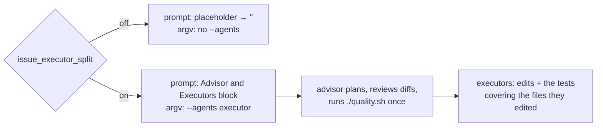

# Advisor/executor instructions in the `issue` prompt, gated by the split key

## Summary

Issue #2342 hands a split `issue`-phase run `--agents` executor definitions,
but nothing told the advisor to use them, so a key-on run behaved exactly like
a key-off one. The `issue` template now carries an
`{{EXECUTOR_SPLIT_INSTRUCTIONS}}` placeholder: it resolves to the
advisor/executor block when `isIssueExecutorSplitEnabled()` is true and to the
empty string otherwise, leaving a key-off prompt byte-identical to what it is
today. Both `issue`-phase call sites resolve the key **once**, before the
prompt is built, so the prompt and the argv cannot disagree. Closes #2343.

## Evidence

Backend/prompt change with no web interface, so there is nothing to screenshot.
What was tested instead:

- The key-off user prompt was rendered against the **base-branch** template and
  against this branch's template and compared byte for byte (fence nonce
  normalised): identical. The same invariant is pinned by
  `issue_prompt_executor_split_2343_test.ts`.
- `./quality.sh` run in full after the final edit: `Result: PASSED (with
  skipped checks)` — only `config integration` skipped (it needs credentials).
- New suite: 9 passed. Failure-detection set
  (`prompt_builder_test.ts`, `issue_prompt_v39_independent_review_test.ts`,
  `coding_guidelines_overlay_test.ts`, plus the new file): 104 passed.

## Acceptance Criteria

<!-- vibe-spec-review inputs="diff+issue-body" -->

- **met** — With the key off, the assembled `issue` prompt is
  character-for-character what it is today — evidence:
  `worker/deno/tests/issue_prompt_executor_split_2343_test.ts::issue prompt - key off renders no executor block and no stray gap`
  — reviewer: met
- **met** — With the key on, the assembled prompt contains the advisor/executor
  block with all four rules — evidence:
  `worker/deno/tests/issue_prompt_executor_split_2343_test.ts::issue prompt - key on carries the advisor/executor rules`
  — reviewer: met
- **met** — With the key on, the Spec and Standards reviewer instructions are
  unchanged — evidence:
  `worker/deno/tests/issue_prompt_executor_split_2343_test.ts::issue prompt - the independent reviewers are unchanged by the split`
  — reviewer: met
- **met** — `prompts/coding_guidelines/prompt.md` lifts the cap only for a
  key-on `issue` run, with a test that the cap text stands for other phases —
  evidence: `prompts/coding_guidelines/prompt.md:35`,
  `worker/deno/tests/issue_prompt_executor_split_2343_test.ts::coding guidelines - the delegation cap stands, with the block as its only exception`
  — reviewer: partial — reason: the reviewer read the earlier wording, which
  keyed the lift on prompt content alone; it now names the `issue` phase as
  well, and the "other phases" case additionally asserts an assembled `ci_fix`
  prompt carries no such section.
- **met** — `./quality.sh` passes — evidence: full gate run after the final
  edit, `Result: PASSED (with skipped checks)` — reviewer: met
- **unrequested** — the block's text lives in
  `worker/deno/lib/issue_executor_split_prompt.ts` rather than inside
  `prompts/issue/prompt.md` — reviewer: unrequested — reason: a placeholder
  cannot pull conditional text out of the same file it is in, so the gated
  prose has to live where the gate is; the template keeps the splice point.
- **unrequested** — `console.warn` when a split run reads a template with no
  `{{EXECUTOR_SPLIT_INSTRUCTIONS}}` placeholder
  (`worker/deno/lib/prompt_builder.ts:676`) — reviewer: unrequested — reason:
  an operator's custom prompt or `work-on` override otherwise drops the block
  in silence on exactly the runs this issue exists to fix; fail-loud, not a new
  feature.
- **unrequested** — `EXECUTOR_SPLIT_INSTRUCTIONS` registered in
  `OPTIONAL_PLACEHOLDERS` (`worker/deno/lib/prompt_manager.ts:257`) — reviewer:
  unrequested — reason: that registry is the code-side record of every optional
  placeholder; leaving it out would make the docs row a second source of truth.
- **unrequested** — executors are told to redirect stdin from `/dev/null`
  (`worker/deno/lib/issue_executor_split_prompt.ts:49`) — reviewer:
  unrequested — reason: the repo's own standing rule for unattended test runs;
  an executor that hangs on stdin stalls the whole advisor.
- **unrequested** — `docs/CONFIGURATION.md` and `docs/CUSTOM-PROMPTS.md` rows —
  reviewer: unrequested — reason: a code change owes a docs change; both
  surfaces document the key and the placeholder.
- **unrequested** — `docs/audits/security-sweep-2343-issue-executor-split-prompt.md`
  and the `top-up-2343` slice in `docs/audits/lib-sweep-coverage.json` —
  reviewer: unrequested — reason: the `completeness checks` gate fails any new
  `worker/deno/lib/` module that no sweep slice claims.
- **unrequested** — the `isIssueExecutorSplitEnabled` call and its log line
  hoisted above the prompt build in both call sites — reviewer: unrequested —
  reason: mechanically required to resolve one boolean before the prompt is
  built; the resolution is unchanged, only its position.

## Standards Review

<!-- vibe-standards-review inputs="diff+CODING-STANDARDS.md" -->

- **violation** — the "make no `Edit` or `Write` call yourself" rule read as
  forbidding the advisor's own PR-summary write, which the same prompt requires
  — evidence: `worker/deno/lib/issue_executor_split_prompt.ts:38` — reason:
  fixed here; the rule now covers the edits the change is made of and exempts
  the run's own record.
- **violation** — a split run whose template is an operator custom prompt or a
  `work-on` override silently lost the block — evidence:
  `worker/deno/lib/prompt_builder.ts:673` — reason: fixed here with a named
  warning and a test.
- **violation** — `OPTIONAL_PLACEHOLDERS` was not updated beside the docs row —
  evidence: `worker/deno/lib/prompt_manager.ts:257` — reason: fixed here.
- **violation** — the flag's path from config into the prompt build was
  untested on both call sites — evidence:
  `worker/deno/lib/phases/execute_phase.ts:524`,
  `worker/deno/lib/execute_claude_phase.ts:1234` — reason: fixed here; one case
  added to each existing `2342` suite.
- **violation** — no `docs/archive/pr-summaries/pr-summary-2343.md` — evidence:
  the diff at review time — reason: fixed here; this file.
- **violation** (minor) — the new module has no same-named test file
  (`tests/issue_executor_split_prompt_test.ts`) — evidence:
  `worker/deno/tests/issue_prompt_executor_split_2343_test.ts:1` — reason:
  stands; the repo has issue-numbered test files throughout, and the constant
  is only observable through the assembled prompt, which is what the suite
  asserts.
- **clean** — Australian English throughout; fail-loud preserved (`substitute`
  still rejects an unrendered token); tests drive real code, no source
  grepping; prompt-cache safety (the block rides the always-rebuilt user turn,
  not the SHA-keyed system prompt); commit safety (no hidden paths, run-id
  trailers present); additive-only options contract; 64-line module, one
  exported constant.

## Test Plan

- `worker/deno/tests/issue_prompt_executor_split_2343_test.ts` (new, 9 cases):
  key-off byte-identity and no stray blank; omitted flag equals explicit
  `false`; every rule of the block on a key-on run; the agent name matches
  `ISSUE_EXECUTOR_AGENT_NAME`; key-on equals key-off plus the block; the
  reviewer section is untouched; the missing-placeholder warning fires on a
  split run and stays quiet otherwise; the delegation cap and its single
  exception; no other phase carries the section.
- `worker/deno/tests/execute_phase_issue_executor_split_2342_test.ts` and
  `worker/deno/tests/execute_claude_phase_issue_executor_split_2342_test.ts`:
  one case each asserting the resolved key reaches the prompt build as well as
  the argv.
- `worker/deno/tests/issue_prompt_v39_independent_review_test.ts`: the new
  placeholder joins the pinned template placeholders.
