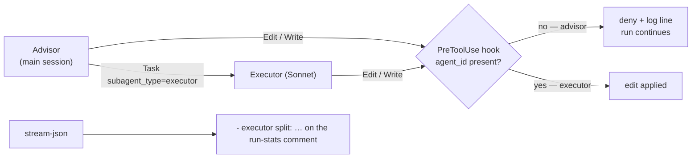

# Keep every Edit/Write in a split run inside an executor (Issue #2344)

## Summary

A split `issue` run now **denies the advisor's own `Edit`/`Write` calls** and
allows an executor's, and tallies what the split actually did off the run's own
`stream-json`. Closes #2344.

**The denial branch was taken** — the container's Claude CLI can distinguish the
caller (evidence below). With `issue_executor_split` on, the Claude invocation
carries a `--settings` JSON string registering a `PreToolUse` hook on
`Edit|Write`; the hook runs `worker/deno/lib/issue_edit_guard_cli.ts`, which
denies the call when the payload carries **no** `agent_id` (the main thread —
the advisor) and allows it when it does (an executor). A denial is logged naming
the tool and never fails the run. With the key off, no hook is configured, no
stream is parsed, and the invocation is byte-for-byte today's.

The counts ride on the run-stats comment as one greppable bullet:

```text
- executor split: 0 advisor edit calls, 2 denied, 3 executors dispatched, 1 re-tasks
```



## Evidence

Backend/CLI change — no web surface to screenshot. The evidence is the CLI
itself and the test suite.

**CLI evidence for the denial branch** (container image, `claude` 2.1.261):

```console
$ claude --version
2.1.261 (Claude Code)

$ grep -ao 'agent_id:i().optional().describe("Subagent identifier[^"]*' "$(readlink -f "$(which claude)")"
agent_id:i().optional().describe("Subagent identifier. Present only when the hook
fires from within a subagent (e.g., a tool called by an AgentTool worker). Absent
for the main thread, even in --agent sessions. Use this field (not agent_type) to
distinguish subagent calls from main-thread calls."

$ claude --help | grep -A1 -- '--settings'
  --settings <file-or-json>             Path to a settings JSON file or a JSON
                                        string to load additional settings from
```

The same schema block shows the `PreToolUse` payload
(`hook_event_name`, `tool_name`, `tool_input`, `tool_use_id`) and the deny
shape (`hookSpecificOutput.permissionDecision`), and the `result` line carries
`permission_denials: [{ tool_name, tool_use_id, tool_input }]` — the record the
tally reads a denial from. A live `claude -p` run could not be used as evidence
here: the guarded shell's CLI answers `Not logged in · Please run /login`, so
the payload contract was established from the binary the container ships.

`--disallowedTools` cannot express this, as the issue states: a tool removed
from the session pool is gone for sub-agents too.

**Tests:** `deno test worker/deno/tests/issue_executor_enforcement_test.ts` —
17 passed. **Full gate:** `./quality.sh` — `Result: PASSED (with skipped
checks)`; the one `SKIPPED` check (`config integration`) is skipped on this host
independently of this change.

## Acceptance Criteria

<!-- vibe-spec-review inputs="diff+issue-body" -->

- **met** — the PR body states which branch was taken and names the CLI evidence — evidence: the Evidence section above (`claude --version`, the `agent_id` schema grep, `claude --help`) — reviewer: missing — reason: the reviewer read the diff before this summary existed and noted the in-repo quote named no command; the commands and their output are now recorded here.
- **met** — denial branch: a simulated advisor `Edit` is denied, logged with the tool name, the run continues, and an executor `Edit` is allowed — evidence: `worker/deno/tests/issue_executor_enforcement_test.ts::issue edit guard - denies an advisor Edit and allows an executor's`, `…produces the CLI deny shape and a log line naming the tool`, `…runs as a child process, denies the advisor and exits 0` — reviewer: met
- **met** — fallback branch: a `stream-json` fixture of two advisor `Edit` calls, three executor dispatches and one re-task yields `2`, `3`, `1` on the phase result — evidence: `…::split run summary - counts advisor edits, executor dispatches and re-tasks` and `…::claude runner - a split run installs the guard and tallies the stream` (asserts `runStats.executorSplit`) — reviewer: met
- **met** — with the key off, no hook is configured and the phase result carries no split counts — evidence: `…::claude invocation - carries --settings only when the split asked for it`, the key-off half of the runner test, and `execute_phase`/`execute_claude_phase - a split run also asks the runner to enforce advisor edits` — reviewer: met
- **met** — `./quality.sh` passes — evidence: full gate re-run after the fixes below, `Result: PASSED (with skipped checks)` — reviewer: missing — reason: the reviewer ran the gate before the console-redaction fix, when `console_redaction_entrypoint_check_test.ts` failed on the new entry point; that is fixed and the gate now passes.
- **unrequested** — the advisor keeps `Write` on the run's own record (`docs/archive/pr-summaries/pr-summary-*.md`, `.pr_response_message`) — reviewer: unrequested — reason: the Spec reviewer found the first cut denied the PR-summary write the prompt mandates and Issue #2343 explicitly reserves to the advisor, which would strand a split run; carved out and tested.
- **unrequested** — `deniedAdvisorEdits`, a fourth count, beside the three the issue names — reviewer: unrequested — reason: "advisor edit calls 0 when denial is enforced" needs the denials recorded somewhere, or an enforcing run is indistinguishable from an idle one.
- **unrequested** — the guard child is resolved from the read-only checkout and pinned to the read-only Deno seed — reviewer: unrequested — reason: reuse of the existing #1444/#1448 hardening for a guard the constrained party must not be able to rewrite or feed.
- **unrequested** — `docs/audits/security-sweep-2344-issue-executor-enforcement.md` and the `top-up-2344` ledger slice — reviewer: unrequested — reason: repository audit policy requires a written sweep for every new `worker/deno/lib/` module; `deno task check:manifests` fails without it.

## Standards Review

<!-- vibe-standards-review inputs="diff+CODING-STANDARDS.md" -->

- **violation** — a stray `remote` block pinning 34 `deno.land/std@0.208.0` modules nothing imports — evidence: `worker/deno/deno.lock:26` — reason: left by a first-cut test import since replaced with `@std/assert`; removed, the lockfile is now identical to the base branch.
- **violation** — no `docs/archive/pr-summaries/pr-summary-2344.md` — evidence: `docs/archive/pr-summaries/` — reason: fixed — this file.
- **violation** — the run-stats bullet inventory did not list the new `- executor split:` line — evidence: `docs/MODEL-AND-CACHING.md:1123` — reason: fixed; the bullet is documented there beside the Graft and quality-gate bullets.
- **violation** — `buildIssueRunStatsComment` was changed with no test at its own seam — evidence: `worker/deno/lib/issue_run_stats_comment.ts:463` — reason: fixed; `worker/deno/tests/issue_run_stats_comment_test.ts::buildIssueRunStatsComment - a split run's counts reach the rendered body` asserts both the split and unsplit bodies.
- **violation** — no same-named test file for `issue_edit_guard_cli.ts` — evidence: `worker/deno/lib/issue_edit_guard_cli.ts:1` — reason: stands. The module is a nine-line entry point over `decideIssueEditHook`, and the issue names `tests/issue_executor_enforcement_test.ts` as the single fixture-driven suite; that suite drives the CLI both in-process and as a real child process.
- **clean** — Australian English throughout; fail-loud error handling (the guard's deliberate fail-open is loud on stderr and backed by the independent advisor-edit count); tests call real code, no source-grepping, no wall-clock sleeps; no hidden paths or credentials staged; both shell interpolations pass through `posixSingleQuote`; the guard child runs with no permission flags and can only deny, never grant; `deno lint`, `deno fmt --check`, `deno check` clean; both commits carry the run-id trailer.

## Test Plan

- **New** `worker/deno/tests/issue_executor_enforcement_test.ts` (17 cases): the
  guard's decision on advisor vs executor calls, the run-record carve-out, the
  CLI deny shape and its log line, the guard as a real child process (exit `0`),
  the hook settings shape (matcher, command, `DENO_DIR` pinning), the split
  summary (2/3/1 fixture, denials from `permission_denials` and from the guard
  marker, a numbered executor instance re-task, malformed streams), the
  run-stats line, the runner end-to-end with a stub agent, and the key-off argv
  — including DeepSeek, which drops the guard with the executor definitions.
- **Extended** `worker/deno/tests/issue_run_stats_comment_test.ts`: the split
  counts reach the rendered comment body, and an unsplit run renders no line.
- **Extended** `worker/deno/tests/execute_phase_issue_executor_split_2342_test.ts`
  and `worker/deno/tests/execute_claude_phase_issue_executor_split_2342_test.ts`:
  both `issue`-phase call sites ask the runner to enforce advisor edits when the
  key is on, and pass nothing when it is off.
- **Full gate** `./quality.sh` — PASSED.
