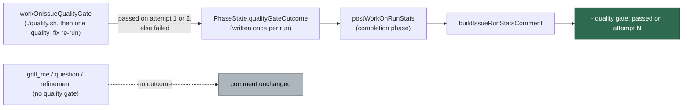

# Report the quality-gate pass attempt on every implementation run-stats comment

## Summary

The implementation quality gate is bounded to two attempts — the initial
`./quality.sh` run plus one `quality_fix` remediation and re-run — and which of
them passed reached the host's private worker log only, so the advisor/executor
pilot (#2320) had no readable source for its first-attempt pass rate.

`workOnIssueQualityGate` now records the outcome on
`PhaseState.qualityGateOutcome`, and the completion path renders one line on the
run-stats comment beside the existing figures:

```text
- quality gate: passed on attempt 1
- quality gate: passed on attempt 2
- quality gate: failed
```

The wording is stable and greppable by contract — the pilot counts the pass rate
off these exact strings — and the doc comment on `QUALITY_GATE_STATS_PREFIX`
says so. A phase that runs no quality gate passes no outcome, so its comment is
byte-for-byte what it was before.

Two honesty boundaries are part of the change:

- a gate **bypassed** as pre-existing breakage (#2604) stays `failed` —
  `./quality.sh` was red, and calling a waiver a pass would inflate the very
  metric the line exists to measure;
- the outcome is recorded **once per run**, so the security-fix (#1575) and
  summary-rule (#2189) recoveries — which re-run this phase before the stats
  comment is posted — cannot relabel an implementation gate that needed
  remediation as a first-attempt pass.

Closes #2345.

## Evidence

Backend/CLI change — no web interface to screenshot. The evidence is the tests
below, all run unattended with `< /dev/null`, plus the full gate:

```text
deno test tests/quality_gate_attempt_report_test.ts \
          tests/issue_run_stats_comment_test.ts \
          tests/completion_phase_run_stats_test.ts
ok | 86 passed | 0 failed

./quality.sh  →  Result: PASSED (with skipped checks)
```

Where the value travels:



## Acceptance Criteria

<!-- vibe-spec-review inputs="diff+issue-body" -->

- **met** — a run whose initial `./quality.sh` passes renders
  `quality gate: passed on attempt 1` — evidence:
  `worker/deno/tests/quality_gate_attempt_report_test.ts::quality gate - a gate that passes first time records attempt 1`
  and
  `worker/deno/tests/issue_run_stats_comment_test.ts::quality-gate line - a gate that passed first time reports attempt 1`
  — reviewer: met
- **met** — a run that fails, remediates and passes renders
  `quality gate: passed on attempt 2` — evidence:
  `worker/deno/tests/quality_gate_attempt_report_test.ts::quality gate - a gate that passes after remediation records attempt 2`
  — reviewer: met
- **met** — a run whose gate still fails after remediation renders
  `quality gate: failed` — evidence:
  `worker/deno/tests/quality_gate_attempt_report_test.ts::quality gate - a gate still red after remediation records failed`
  and
  `worker/deno/tests/completion_phase_run_stats_test.ts::completion - a gate that never passed is reported as failed (Issue #2345)`
  — reviewer: met
- **met** — a non-`issue` run-stats comment is byte-for-byte what it is today —
  evidence:
  `worker/deno/tests/issue_run_stats_comment_test.ts::quality-gate line - a phase with no quality gate is byte-for-byte unchanged`
  — reviewer: met
- **met** — `./quality.sh` passes — evidence: full gate run after the final
  edit, `Result: PASSED (with skipped checks)` — reviewer: missing — reason: the
  reviewer ran the gate against the earlier commit, where a new lib module was
  unclaimed in `docs/audits/lib-sweep-coverage.json`; the type was moved into
  `issue_run_stats_comment.ts`, that module is gone, and the gate now passes
- **unrequested** — `docs/MODEL-AND-CACHING.md` gains a format bullet for the
  new line and drops the now-false "It is the only addition to the format"
  clause from the Graft bullet — reviewer: unrequested — reason: a code change
  owes the docs change, and leaving the neighbouring sentence contradicting the
  line added right below it would be a knowingly false doc
- **unrequested** — `buildQualityGateStatsLine` is exported rather than private
  — reviewer: unrequested — reason: mirrors the sibling `buildGraftStatsLine`
  and `buildCodegraphStatsLine` renderers so the line can be asserted on
  directly; the format constant it renders stays private

## Standards Review

<!-- vibe-standards-review inputs="diff+CODING-STANDARDS.md" -->

- **violation** — new lib module claimed by no sweep slice, so
  `deno task check:manifests` was red — evidence:
  `worker/deno/lib/quality_gate_attempt.ts:1` — reason: fixed here — the module
  is gone and `QualityGateAttemptOutcome` lives beside its renderer in
  `worker/deno/lib/issue_run_stats_comment.ts`, which no ledger slice owes
- **violation** — a bypassed gate was reported as `passed`, inverting "absence
  of a success marker is not success" — evidence:
  `worker/deno/lib/phases/quality_gate_remediation_phase.ts:485` — reason: fixed
  here — the bypass leaves the outcome `failed`, covered by
  `quality_gate_attempt_report_test.ts::quality gate - a bypassed pre-existing failure is never reported as a pass`
- **violation** — a defensive clamp laundered a malformed attempt into a
  flattering `passed on attempt 1` — evidence:
  `worker/deno/lib/issue_run_stats_comment.ts:300` — reason: fixed here — the
  clamp is gone and the counter is interpolated directly
- **violation** — the clamp's branch had no test — evidence:
  `worker/deno/lib/issue_run_stats_comment.ts:290` — reason: resolved by
  deleting the branch rather than testing code that should not exist
- **violation** — `as never` on a stubbed dep defeats strict typing — evidence:
  `worker/deno/tests/quality_gate_attempt_report_test.ts:90` — reason: stands —
  it is the established shape for stubbing a `createMockDeps` slice in the
  adjacent phase tests (`quality_gate_phase_generic_bypass_test.ts:103`), and
  diverging in one file would be the inconsistency, not the fix
- **violation** — no PR summary file — evidence:
  `docs/archive/pr-summaries/pr-summary-2345.md` — reason: fixed here
- **clean** — Australian English throughout; fail-loud (the outcome is seeded
  `failed` before the loop, so every exit reports a gate that ran); tests drive
  real code through `workOnIssueQualityGate`, `workOnIssueCompletion` and
  `buildIssueRunStatsComment` with no source-grepping, sleeps or wall-clock
  assertions; TSDoc on every new symbol explains why rather than restating the
  code; no hidden path staged; Deno-native tooling only; the change follows the
  file's existing optional-line pattern instead of inventing a parallel one

## Test Plan

- Added `worker/deno/tests/quality_gate_attempt_report_test.ts` — six
  phase-level cases through the real wiring: pass on attempt 1, pass on attempt
  2 after remediation, still red after remediation, a bypassed pre-existing
  failure, a gate that could not run at all, and a recovery re-run that must not
  relabel the implementation gate.
- Added to `worker/deno/tests/issue_run_stats_comment_test.ts` — the rendered
  line for each outcome, no line without an outcome, position inside the stats
  block, the cost tally left untouched, the byte-for-byte `grill_me` comment,
  and `postIssueRunStatsComment` both posting the line and refusing to
  manufacture a comment out of a gate outcome alone.
- Added to `worker/deno/tests/completion_phase_run_stats_test.ts` — the
  completion phase carries the phase-state outcome onto the posted comment for
  attempts 1 and 2, for a failed gate, and mentions nothing when the run never
  reached the gate.
