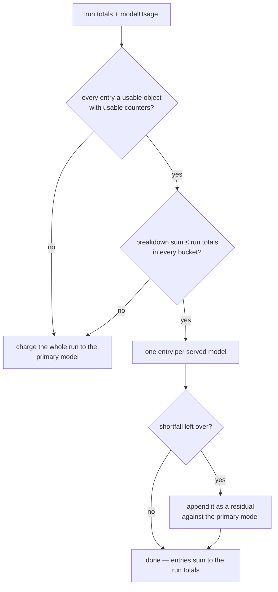

# Run-stats comment: `split: on/off`, executor counts, and executor Sonnet spend in the run cost

## Summary

The advisor/executor pilot (#2320) is measured on estimated USD per
implementation run, so a run-stats comment that charged the executors' Sonnet
tokens at the advisor's Opus rate — or left Sonnet off the comment entirely —
would make the 15% test meaningless. This change puts the split's own figures
on the comment and makes the executors' spend a first-class part of the run's
cost. Closes #2346.

Two parts:

1. **The split figures.** Every implementation run-stats comment now carries
   exactly one `- split: on` or `- split: off` line, so a pilot run and a
   control run are separable when the numbers are read back later. A
   `split: on` run adds three more — `- executors dispatched: N`,
   `- re-tasks issued: N` and `- advisor edit calls: N (M denied)` — with the
   counts taken from `runStats.executorSplit`, the phase result the #2344
   enforcement seam populates. A `split: off` run gains the `split:` line and
   nothing else: no executor figures, no empty headings. Phases that are not
   implementation runs render no split line at all, so their comments are
   byte-for-byte what they were.

2. **The cost.** An advisor (Opus) and its executor sub-agents (Sonnet) share
   one CLI invocation, so attributing that invocation to its first served model
   priced the Sonnet tokens at Opus rates and gave Sonnet no cost line at all.
   The new `attributeUsageByModel` splits the invocation by its own
   `modelUsage` breakdown, so each served model gets its own token counts, its
   own cost line, and its own share of the estimated USD — which
   `tallyIssueCost` then reads back into the cumulative issue total.

The `- executor split:` line #2344 introduced is replaced by the four lines
above; nothing outside the archived `pr-summary-2344.md` greps the retired
string.

### The breakdown must reconcile before it prices the run

The attribution refuses to report a count nothing recorded. A breakdown is
used only when it reconciles against the run's own recorded totals:



An **absent** counter is a genuine zero (the API omits a bucket it never
filled); a counter that is *present* but not a finite non-negative number is a
fault and condemns the breakdown rather than being read as zero. The result is
that the attributed entries can neither under-report the run (the residual
catches the shortfall) nor over-report it (an unreconcilable breakdown is
discarded whole).

## Evidence

Backend/CLI change with no web interface to screenshot — the surface is a
GitHub issue comment body rendered by a pure function, so the evidence is the
tests that assert on the rendered body and the costed total.

Full gate: `./quality.sh` → `Result: PASSED (with skipped checks)` (only
`config integration` skipped, which is its standing state on this host).

Targeted suites after the final edit:

```
deno test -A tests/planning_run_stats_test.ts tests/cost_estimate_test.ts \
  tests/issue_run_stats_comment_test.ts tests/issue_executor_enforcement_test.ts
ok | 178 passed | 0 failed
```

The cost assertions use the per-Mtok prices documented in
`docs/MODEL-AND-CACHING.md` — Opus 5 $5 in / $25 out, Sonnet 5 $2 in / $10 out
— so a run of 1.0 M/0.1 M Opus tokens and 0.5 M/0.2 M Sonnet tokens renders
`$7.50` and `$3.00` cost lines under a `~$10.50` estimate, and two such
comments tally to `~$21.00`.

## Acceptance Criteria

<!-- vibe-spec-review inputs="diff+issue-body" -->

- **met** — Every implementation run-stats comment carries exactly one
  `split: on` or `split: off` line — evidence:
  `worker/deno/tests/issue_run_stats_comment_test.ts::buildIssueRunStatsComment - an unsplit run says split: off and nothing more (Issue #2346)`
  and `…- many invocations render exactly one split line (Issue #2346)`, which
  assert on the full list of matching lines rather than a substring — reviewer:
  met — reason: the reviewer noted the line is keyed to `phase === "issue"`
  (`IMPLEMENTATION_RUN_STATS_PHASE`), so a future implementation phase under a
  different phase string would lose it; that constant is now exported and
  consumed by both posting sites, so there is one spelling to change rather
  than three.
- **met** — A split run's comment carries `executors dispatched`,
  `re-tasks issued` and `advisor edit calls` with the counts taken from the
  phase result — evidence:
  `worker/deno/tests/issue_run_stats_comment_test.ts::buildIssueRunStatsComment - a split run's counts reach the rendered body (Issue #2344, #2346)`
  and `worker/deno/tests/issue_executor_enforcement_test.ts::run stats comment - reports the split counts, and split: off with the key off (Issues #2344, #2346)`
  — reviewer: met
- **met** — A non-split run's comment carries none of those three lines —
  evidence:
  `worker/deno/tests/issue_run_stats_comment_test.ts::buildIssueRunStatsComment - an unsplit run says split: off and nothing more (Issue #2346)`
  — reviewer: met
- **met** — A run with Opus advisor tokens and Sonnet executor tokens lists
  both models with their own token counts and cost lines, and the run's
  estimated USD equals the sum at the documented per-Mtok prices — evidence:
  `worker/deno/tests/issue_run_stats_comment_test.ts::buildIssueRunStatsComment - executor Sonnet spend is priced separately from advisor Opus (Issue #2346)`
  — reviewer: met — reason: the reviewer flagged that the `Served model(s):`
  line is still built from `stats.servedModels` alone, so Sonnet's presence
  there is fixture-guaranteed rather than code-guaranteed; in production
  `extractServedModels` scans every `assistant` line including a sub-agent's,
  so the executor's model is recorded by the same path that records the
  advisor's, and widening that line was not asked for here.
- **met** — The cumulative issue total tallied from two such comments equals
  the sum of both runs' estimated USD — evidence:
  `worker/deno/tests/issue_run_stats_comment_test.ts::buildIssueRunStatsComment - the issue total sums both split runs' executor spend (Issue #2346)`
  and the posted-body case
  `…postIssueRunStatsComment - a split run's posted body carries the split figures and both models' spend (Issue #2346)`
  — reviewer: met
- **met** — `./quality.sh` passes — evidence: full gate run after the final
  edit, `Result: PASSED (with skipped checks)` — reviewer: met
- **unrequested** — `attributeUsageByModel` is wired into
  `buildPlanningStatsSection`, which renders every phase's stats comment, so
  any multi-model run in any phase now costs per served model — reviewer:
  unrequested — reason: `buildIssueRunStatsComment` renders through that shared
  function, so there is no seam at which to apply the attribution to
  implementation runs only; costing a mixed run per served model is correct
  wherever it happens, and a single-model run is unaffected.
- **unrequested** — the per-model token sub-bullets likewise render on any
  multi-model run, not just implementation runs — reviewer: unrequested —
  reason: same shared renderer; the block is gated on `perModel.length > 1`, so
  a single-model run renders exactly what it always did, pinned by
  `worker/deno/tests/planning_run_stats_test.ts::buildPlanningStatsSection - a single-model run renders no per-model breakdown (Issue #2346)`.
- **unrequested** — the residual / reconciliation machinery in
  `attributeUsageByModel` — reviewer: unrequested — reason: without it the
  attribution silently drops or invents tokens, which is the under-reporting
  the issue explicitly calls out; the reviewer's own "implemented wrongly"
  finding was an over-report from the earlier clamp-only version, fixed in
  `4b1d8cd`.
- **unrequested** — exporting `IMPLEMENTATION_RUN_STATS_PHASE` and aliasing the
  two local `WORK_ON_STATS_PHASE` constants to it — reviewer: unrequested —
  reason: the renderer must agree with the posting sites on which phase is the
  implementation run, and a third independent copy of the literal would empty
  the pilot metric the moment one drifted.

## Standards Review

<!-- vibe-standards-review inputs="diff+CODING-STANDARDS.md" -->

- **violation** — `docs/archive/pr-summaries/pr-summary-2346.md` was absent —
  evidence: `docs/archive/pr-summaries/` — reason: fixed here; this file is it.
- **violation** — a token counter that was present but unusable (a string, a
  negative, `NaN`) was reported as `0`, fabricating a count where a real one
  belongs — evidence: `worker/deno/lib/cost_estimate.ts:115` (pre-fix) — reason:
  fixed in `4b1d8cd`; `readCounter` now returns `undefined` for a
  present-but-unusable value and the breakdown is discarded whole, while an
  *absent* counter stays a genuine zero. Covered by
  `worker/deno/tests/cost_estimate_test.ts::cost_estimate - attributeUsageByModel never fabricates a zero for an unusable counter`.
- **violation** — a `modelUsage` entry that was not an object was dropped with
  a bare `continue`, silently re-charging its tokens to the fallback model at
  the wrong rate — evidence: `worker/deno/lib/cost_estimate.ts:151` (pre-fix) —
  reason: fixed in `4b1d8cd`; one unusable entry now condemns the whole
  breakdown rather than being partly trusted.
- **violation** — only the residual was clamped, so a breakdown claiming more
  tokens than the run recorded was emitted whole and over-priced the run and
  the issue's cumulative total, with a test pinning that as intended —
  evidence: `worker/deno/lib/cost_estimate.ts:190-193` and
  `worker/deno/tests/cost_estimate_test.ts:473` (pre-fix) — reason: fixed in
  `4b1d8cd`; an over-claiming breakdown no longer prices the run, and the test
  now pins the discard.
- **violation** — four accepted spellings per cache counter where only two are
  ever produced, justified by a docstring the repo's own CLI fixture
  contradicts — evidence: `worker/deno/lib/cost_estimate.ts:158-169` (pre-fix)
  — reason: fixed in `4b1d8cd`; the speculative `cacheCreationTokens` /
  `cache_creation_tokens` / `cacheReadTokens` / `cache_read_tokens` aliases are
  dropped, leaving the camelCase the CLI emits and the snake_case the recorded
  fixtures carry.
- **violation** — the new multi-model breakdown branch in
  `buildPlanningStatsSection` had no case in its own module's suite — evidence:
  `worker/deno/lib/planning_run_stats.ts:662` — reason: fixed in `4b1d8cd`; two
  cases added to `worker/deno/tests/planning_run_stats_test.ts`, one for the
  two-model breakdown and one pinning that a single-model run renders none.
- **clean** — Australian English throughout the changed `.ts` and `.md` files;
  docs owed by the code change updated (`docs/CONFIGURATION.md` for the
  `issue_executor_split` row and the run-stats bullet inventory in
  `docs/MODEL-AND-CACHING.md`); no stale `- executor split:` reference outside
  the archived `pr-summary-2344.md`; the renamed export
  `buildExecutorSplitStatsLines` has no old-name references left; the four new
  greppable prefixes cannot match `ESTIMATED_COST_PATTERN`, so `tallyIssueCost`
  can never read a count as spend; tests call real functions and assert on
  results, with no source-grepping, no sleeps, no spawned processes and no
  `Deno.env`/`Deno.chdir`; no existing test deleted; no hidden paths staged;
  every commit carries an issue reference and a `Vibe-Coder-Run-Id` trailer.

## Test Plan

Added:

- `worker/deno/tests/issue_run_stats_comment_test.ts`
  - `buildIssueRunStatsComment - an unsplit run says split: off and nothing more (Issue #2346)`
  - `buildIssueRunStatsComment - many invocations render exactly one split line (Issue #2346)`
  - `buildIssueRunStatsComment - a planning-shaped phase carries no split line (Issue #2346)`
  - `buildIssueRunStatsComment - executor Sonnet spend is priced separately from advisor Opus (Issue #2346)`
  - `buildIssueRunStatsComment - the issue total sums both split runs' executor spend (Issue #2346)`
  - `postIssueRunStatsComment - a split run's posted body carries the split figures and both models' spend (Issue #2346)`
- `worker/deno/tests/cost_estimate_test.ts`
  - `attributeUsageByModel falls back to one entry without a breakdown`
  - `attributeUsageByModel reads camelCase and snake_case counters`
  - `attributeUsageByModel attributes any shortfall rather than losing it`
  - `attributeUsageByModel omits an all-zero residual`
  - `attributeUsageByModel discards a breakdown claiming more than the run recorded`
  - `attributeUsageByModel never fabricates a zero for an unusable counter`
- `worker/deno/tests/planning_run_stats_test.ts`
  - `buildPlanningStatsSection - one invocation serving two models lists each model's own tokens (Issue #2346)`
  - `buildPlanningStatsSection - a single-model run renders no per-model breakdown (Issue #2346)`

Modified (behaviour change, documented): the two #2344 assertions on the old
`- executor split:` single line now assert the four-line shape that replaces
it, and the byte-for-byte codegraph test expects the `- split: off` line every
implementation comment now carries. No test was removed or commented out.
