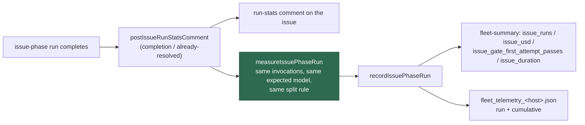

# Fleet telemetry: per-host `issue`-phase run count, cost, first-attempt gate passes and duration

## Summary

Fleet telemetry recorded `successes`, `failures` and `successRate` and no cost
or quality signal, so comparing the advisor/executor pilot host against the
control hosts meant reading every run-stats comment on every issue the fleet
touched. This adds five per-host `issue`-phase counters — `issuePhaseRuns`,
`issuePhaseUsd`, `issuePhaseFirstAttemptGatePasses`, `issuePhaseDurationSeconds`
and `issuePhaseSplitRuns` — recorded once per completed implementation run from
the paths that post the run-stats comment, with the same figures that comment
renders. Closes #2347.

The first-attempt pass rate is deliberately a division of two recorded numbers
(`issuePhaseFirstAttemptGatePasses / issuePhaseRuns`) rather than a grep, and
duration is reported beside the cost with no threshold of its own.



## Evidence

Backend/CLI change with no web interface, so there is nothing to screenshot.
The evidence is the test suite and the gate:

- `deno test` on the affected suites: 146 passed, 0 failed
  (`fleet_telemetry_test.ts`, `fleet_telemetry_sidecar_test.ts`,
  `completion_phase_run_stats_test.ts`, `fleet_telemetry_redaction_test.ts`,
  `issue_run_stats_comment_test.ts`), plus 22 passed in
  `handle_no_changes_phase_test.ts`.
- `./quality.sh` — **PASSED** end to end (deno tests 23,139 parallel +
  129 serial, 0 failed; lint, type check, fmt, semgrep, markdownlint, mermaid
  and every chokepoint check green).
- The cost-attribution fix was verified red-then-green: with the recorder
  pricing off `requestedModel`,
  `measureIssuePhaseRun - an invocation with no served model is priced as the
  comment prices it` fails; with the expected-model fallback it passes.

The emitted summary line gains:

```text
issue_runs=12 issue_split_runs=12 issue_usd=3.9120
issue_gate_first_attempt_passes=9 issue_duration=18400s
```

## Acceptance Criteria

<!-- vibe-spec-review inputs="diff+issue-body" -->

- **met** — Three recorded `issue` runs (two split, one not) give
  `issuePhaseRuns === 3` and `issuePhaseSplitRuns === 2` — evidence:
  `worker/deno/tests/fleet_telemetry_test.ts::fleet_telemetry - issue-phase runs count, with the split runs visible` —
  reviewer: met
- **met** — `issuePhaseUsd` equals the sum of the recorded per-run USD figures —
  evidence:
  `worker/deno/tests/fleet_telemetry_test.ts::fleet_telemetry - issue-phase spend sums the recorded per-run figures` —
  reviewer: met
- **met** — Two runs on attempt 1 and one on attempt 2 give
  `issuePhaseFirstAttemptGatePasses === 2`, so the rate reads 2/3 — evidence:
  `worker/deno/tests/fleet_telemetry_test.ts::fleet_telemetry - only a gate that passed on attempt 1 counts as a first-attempt pass` —
  reviewer: met
- **met** — `issuePhaseDurationSeconds` equals the sum of the recorded durations
  and gates nothing — evidence:
  `worker/deno/tests/fleet_telemetry_test.ts::fleet_telemetry - issue-phase duration sums the recorded durations and gates nothing` —
  reviewer: met
- **met** — A snapshot file written before this change loads with the new
  counters at zero and no error — evidence:
  `worker/deno/tests/fleet_telemetry_sidecar_test.ts::fleet_telemetry_sidecar - a snapshot written before the counters existed still loads` —
  reviewer: met — reason: the reviewer flagged a caveat (a new `run`-object
  rejection could drop a host's history); that guard is reverted in this diff,
  so the caveat no longer stands
- **met** — `formatFleetSummary` includes the new counters — evidence:
  `worker/deno/tests/fleet_telemetry_test.ts::fleet_telemetry - the summary line reports the issue-phase counters` —
  reviewer: met
- **met** — `./quality.sh` passes — evidence: full gate run after the final
  edit, `Result: PASSED (with skipped checks)` — reviewer: partial — reason: the
  reviewer had only the diff and could not run the gate; it was run here to
  completion and passed
- **unrequested** — `executorSplitStats` helper extracted from
  `buildExecutorSplitStatsLines` — evidence:
  `worker/deno/lib/issue_run_stats_comment.ts:399` — reviewer: unrequested —
  reason: `measureIssuePhaseRun` must apply the *same* split rule the comment
  does, and a second copy of the rule is exactly the drift this feature cannot
  afford
- **unrequested** — NaN/negative sanitising of recorded and persisted figures
  (`contribution`, `counterFrom`) — evidence:
  `worker/deno/lib/fleet_telemetry.ts:486` — reviewer: unrequested — reason: one
  unparseable figure would otherwise turn every subsequent total into `NaN`,
  making the whole host's telemetry unreadable
- **unrequested** — `PriorFleetTelemetryTotals` and the widened
  `mergeCumulative` signature — evidence:
  `worker/deno/lib/fleet_telemetry_sidecar.ts:176` — reviewer: unrequested —
  reason: it is the mechanism for "a snapshot written before this change still
  loads"; prior totals come off disk without the counters and must be typed as
  such rather than asserted
- **unrequested** — `docs/INTERNALS.md` sample line and key documentation —
  evidence: `docs/INTERNALS.md:893` — reviewer: unrequested — reason: the
  fleet-summary keys are documented there; a code change owes the docs change
- **unrequested** — the already-resolved wrap-up in
  `handle_no_changes_phase.ts` records too — evidence:
  `worker/deno/lib/phases/handle_no_changes_phase.ts:256` — reviewer:
  unrequested — reason: both reviewers found it is the second path that posts
  the same `issue`-phase run-stats comment; leaving it out made an
  already-resolved run a hole in the per-host spend and duration

## Standards Review

<!-- vibe-standards-review inputs="diff+CODING-STANDARDS.md" -->

- **violation** — orphaned JSDoc: the `buildExecutorSplitStatsLines` doc block
  was left above the newly extracted private helper, and the exported function
  undocumented — evidence: `worker/deno/lib/issue_run_stats_comment.ts:384` —
  reason: fixed here; the helper now sits above the doc block it never owned
- **violation** — a second `issue`-phase completion path posted the comment and
  recorded nothing, contradicting the code's own documentation — evidence:
  `worker/deno/lib/phases/handle_no_changes_phase.ts:230` — reason: fixed here;
  it records, and with no PR there is no gate, so the run counts and the pass
  does not
- **violation** — a run that produced no stats was silently counted as a free
  run, diluting the two numbers the feature exists to produce — evidence:
  `worker/deno/lib/phases/completion_phase.ts:776` — reason: fixed here;
  `measureIssuePhaseRun` measures nothing for a run no invocation produced
  stats for, which is the same set `postIssueRunStatsComment` answers
  `no_stats` for
- **violation** — the recorded spend could drift from the figure the comment
  renders (requested model vs the phase's expected model as the no-served-model
  fallback) — evidence: `worker/deno/lib/issue_run_stats_comment.ts:477` —
  reason: fixed here; both resolve the expected model through the same
  `buildDegradationReport` call, pinned by a test that fails under the old
  attribution
- **violation** — a new "file must carry a `run` object" rejection turned a
  sidecar with intact cumulative totals into `unparseable`, discarding the very
  history it claimed to protect — evidence:
  `worker/deno/lib/fleet_telemetry_sidecar.ts:222` — reason: fixed here; the
  guard is reverted and `run` is normalised only when the file carries one
- **violation** — `measureIssuePhaseRun` is exported and had no direct test —
  evidence: `worker/deno/lib/issue_run_stats_comment.ts:458` — reason: fixed
  here; six tests cover the non-implementation phase, the no-stats run, the
  spend against the rendered comment, the no-served-model fallback, duration and
  split, and the gate attempt
- **violation** — `contribution()` and `counterFrom()` are near-identical
  numeric guards, and both coerce a bad value to `0` without a log line —
  evidence: `worker/deno/lib/fleet_telemetry.ts:486` — reason: stands. They have
  different contracts — a *recorded* figure must be positive to contribute, a
  *persisted* counter of `0` is legitimate — so merging them would need a flag
  argument for no gain. Neither is a silent failure of an operation: the sidecar
  already reports an unreadable or unparseable file loudly, and these two only
  normalise a field inside a file that loaded
- **clean** — Australian English throughout; every new test calls real exported
  code and asserts on results or side effects (nothing greps source); Deno-native
  tooling only; no hidden paths, key material or credential files staged; the
  schema version deliberately not bumped for a purely additive field set; the
  five new `key=value` pairs covered by a real secret-redactor round trip

## Test Plan

Added:

- `worker/deno/tests/fleet_telemetry_test.ts` — 10 tests: the three-run
  split shape, the USD sum, first-attempt counting (including a run that never
  passed), the duration sum with the surrounding totals asserted unchanged, a
  figure-less run, an unusable figure, snapshot immutability, the summary line,
  and reset.
- `worker/deno/tests/fleet_telemetry_sidecar_test.ts` — 3 tests: counters
  persist and accumulate across runs, a pre-#2347 snapshot loads at zero and
  merges without poisoning the history, and `mergeCumulative` reads a prior
  without the counters as zero.
- `worker/deno/tests/completion_phase_run_stats_test.ts` — 4 tests: the run is
  recorded with the figures the comment reports, an attempt-2 pass counts a run
  but no first-attempt pass, an already-counted run is not counted twice, and a
  run where Claude never ran records nothing.
- `worker/deno/tests/issue_run_stats_comment_test.ts` — 6 tests for
  `measureIssuePhaseRun` (see the Standards block).
- `worker/deno/tests/fleet_telemetry_redaction_test.ts` — the new keys survive
  the secret redactor with their values intact.
- `worker/deno/tests/handle_no_changes_phase_test.ts` — the already-resolved
  close records the run, its duration and its spend, and no gate pass.

Modified: none — no existing test was changed, commented out or removed.
