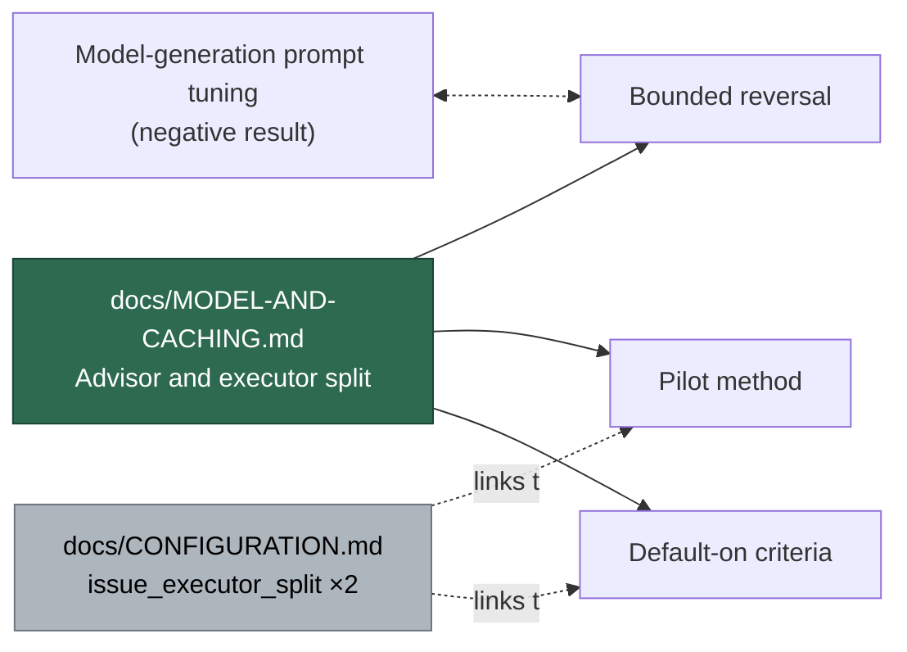

# PR Summary — Document the advisor/executor split, its pilot method and the default-on decision criteria

Closes #2348

## Summary

Documentation-only change. `docs/MODEL-AND-CACHING.md` gains one new routing
section, **Advisor and executor split (issue phase)**, sitting beside the
existing per-phase routing material, and `docs/CONFIGURATION.md`'s two
`issue_executor_split` entries now point into it.

The new section covers four things:

1. **Topology** — the advisor is the main session on the phase's own model and
   effort (Opus at `high` for `issue`), with a `PreToolUse` hook denying its
   `Edit`/`Write` calls; executors run `sonnet` at `medium`, fixed as
   `ISSUE_EXECUTOR_MODEL` / `ISSUE_EXECUTOR_EFFORT`, with no `Agent` tool, so
   the topology is one level deep by construction. A Mermaid `flowchart TD`
   shows dispatch, return and re-task.
2. **Bounded reversal** — the split lifts the delegation cap for the `issue`
   phase only, while the key is on, and only because the sub-agents run on a
   cheaper tier. The durable negative result (Opus 4.8-era delegation
   encouragement, measured harmful once Opus 5 served the `opus` phases) is
   restated as standing unchanged everywhere else, and the original
   negative-result paragraph now back-links to the new subsection so the
   cross-reference reads both ways.
3. **Pilot method** — pilot and control groups, the exclusion of non-Claude
   providers, the 30-run-or-4-week window, a table naming the source of each of
   the five reported numbers, the `issuePhaseSplitRuns` sanity check, and a
   "What no number measures" note on unit-test quality.
4. **Default-on decision criteria** — the four conditions as a conjunctive
   table with the 15% cost threshold, the explicit statement that a cheaper run
   producing worse code is a false saving, duration marked reported-not-gated,
   and a second Mermaid `flowchart TD` showing the quality veto ahead of the
   cost gate.

## Evidence

**No web interface.** This is a documentation-only change with no runtime
surface, no UI and no new code path, so there is nothing to screenshot. What was
tested instead:

- `./quality.sh < /dev/null` — full gate, exit code **0**.
- Targeted docs-consistency suite re-run after the review fixes:
  `deno test tests/markdown_anchors_test.ts tests/docs_provider_matrix_test.ts
  tests/model_routing_docs_test.ts tests/config_docs_consistency_test.ts
  tests/docs_provider_prose_test.ts` — **21 passed, 0 failed**.
- `npx markdownlint-cli2` over the documentation set — **0 issues in 0 files**
  across 180 files.
- Every code reference in the new prose was checked against the source rather
  than assumed: `ISSUE_EXECUTOR_MODEL` / `ISSUE_EXECUTOR_EFFORT` in
  `worker/deno/lib/issue_executor_agents.ts`, the five `IssuePhaseCounters`
  fields in `worker/deno/lib/fleet_telemetry.ts`, `StandardsStatus` in
  `worker/deno/lib/independent_review_gate.ts`, the run-stats line in
  `worker/deno/lib/issue_run_stats_comment.ts`, and the per-provider behaviour
  in `worker/deno/lib/agent_provider.ts`.
- Both Mermaid blocks parse under the repository's Mermaid check
  (`mermaid: PASSED`).

## Acceptance Criteria

<!-- vibe-spec-review inputs="diff+issue-body" -->

- **AC1 — `docs/MODEL-AND-CACHING.md` describes the advisor/executor topology,
  the Sonnet executor tier and the bounded reversal, with the negative result
  still stated for non-split runs.** `reviewer: met`
  Evidence: `docs/MODEL-AND-CACHING.md:436` `### Advisor and executor split
  (issue phase)` — advisor on the phase's model (Opus `high`) with `Edit`/
  `Write` denied by a `PreToolUse` hook, executors `sonnet` at `medium` with
  `Read`/`Grep`/`Glob`/`Edit`/`Write`/`Bash` and no `Agent` tool, plus a
  topology diagram. `docs/MODEL-AND-CACHING.md:480` `#### Bounded reversal of
  the delegation negative result` scopes the lift to the `issue` phase while
  `issue_executor_split` is on, and L504-506 states "Everywhere else the
  negative result stands unchanged".
- **AC2 — the pilot section names pilot and control groups, the
  30-run-or-4-week window and the source of every one of the five numbers.**
  `reviewer: met`
  Evidence: `docs/MODEL-AND-CACHING.md:508` `#### Pilot method` — groups and
  the non-Claude exclusion at L516-524, window at L526-527, and a five-row
  source table at L531-537 naming `successes`/`failures`, `issuePhaseUsd`,
  `issuePhaseFirstAttemptGatePasses`, the `## Standards Review` block and
  `issuePhaseDurationSeconds`. Counter names verified against
  `worker/deno/lib/fleet_telemetry.ts:107-115`.
- **AC3 — the four default-on conditions listed as conjunctive with the 15%
  threshold and the quality veto explicit, duration reported-not-gated.**
  `reviewer: met`
  Evidence: `docs/MODEL-AND-CACHING.md:552` `#### Default-on decision criteria`
  — "only if all four of these hold… three out of four is not a pass", the
  15% row at L562, the false-saving veto at L565 and "Duration is reported, not
  gated." at L569, with a decision flowchart repeating the same ordering.
- **AC4 — `docs/CONFIGURATION.md`'s `issue_executor_split` entry links to the
  pilot section.** `reviewer: met`
  Evidence: `docs/CONFIGURATION.md:399` links both
  `MODEL-AND-CACHING.md#pilot-method` and
  `MODEL-AND-CACHING.md#default-on-decision-criteria`; both anchors resolve
  (`markdown_anchors_test.ts` passes).
- **AC5 — `./quality.sh` passes.** `reviewer: met`
  Evidence: full `./quality.sh < /dev/null` run in the worktree exited 0 —
  `Result: PASSED (with skipped checks)`; only `config integration` was
  skipped, which is unrelated to this diff.
- **Additions beyond the literal ask.** `reviewer: unrequested`
  Reason: kept — each is required by a repository invariant or supports the
  requested content, and none contradicts the issue. They are the second
  cross-reference on the per-repo `repo_config.<repo>.issue_executor_split` row
  (`docs/CONFIGURATION.md:4225`), the TOC entry and Provider Applicability row
  the file's own `deno test` invariants make mandatory
  (`docs/MODEL-AND-CACHING.md:15`, `:102`), the two Mermaid diagrams, and the
  `issuePhaseSplitRuns` sanity-check paragraph, which is explicitly flagged as
  "not one of the five".

## Standards Review

<!-- vibe-standards-review inputs="diff+CODING-STANDARDS.md" -->

- `violation` — `docs/MODEL-AND-CACHING.md:547` overstated the Spec-review
  control, claiming the reviewer's per-criterion evidence "must name a test".
  `prompts/issue/prompt.md:694` requires the file, the test, **or** the test
  identifier, and `worker/deno/lib/independent_review_gate.ts:365-373` enforces
  an evidence string only on Standards-axis `violation` entries. **Fixed here**
  in commit `4feab963` — the sentence now reads "the Spec reviewer must name
  evidence for each criterion — the file, the test, or the test identifier —
  and where that evidence is a test, the quality gate runs it."
- `violation` — `docs/MODEL-AND-CACHING.md:535` claimed every run-stats comment
  carries a `quality gate: passed on attempt N` line;
  `worker/deno/lib/issue_run_stats_comment.ts:340-341` renders no line when
  there is no gate outcome and `- quality gate: failed` for a never-passing
  run. **Fixed here** in commit `4feab963` — now "the line a run-stats comment
  carries when a gate outcome exists".
- `violation` — `docs/MODEL-AND-CACHING.md:484` attributed the split prompt's
  precedence sentence to the *Cap delegation* bullet in
  `prompts/coding_guidelines/prompt.md`, but
  `worker/deno/lib/issue_executor_split_prompt.ts` names the *Delegate
  sparingly* bullet in `prompts/issue/prompt.md`. Net effect was right, the
  attribution wrong. **Fixed here** in commit `4feab963` — both bullets are now
  named and precedence is stated against the one the prompt actually cites.
- `violation` — `docs/MODEL-AND-CACHING.md:2536` left the cross-reference
  one-way: the new subsection linked the negative result, but the
  negative-result paragraph did not link back to its one bounded exception.
  **Fixed here** in commit `4feab963` — the paragraph now links
  `#bounded-reversal-of-the-delegation-negative-result`.
- `clean` — Australian English (no US spellings introduced; only Mermaid
  `color:` style keywords appear, matching existing precedent in the file);
  documentation conventions (heading hierarchy, Applies-to marker, ToC and
  Provider Applicability matrix updated — `markdownlint-cli2` reports
  `0 issues`); Mermaid (both `flowchart TD` blocks parse, repo check
  `mermaid: PASSED`); link correctness (all added links and all five new
  anchors resolve; 21 doc-consistency Deno tests pass); code references
  (`ISSUE_EXECUTOR_MODEL`, `ISSUE_EXECUTOR_EFFORT`, the five
  `IssuePhaseCounters` fields, `StandardsStatus`, and the per-provider
  behaviour in `agent_provider.ts` all verified against source); scope (only
  the two documentation files, plus this summary).

## Test Plan

Documentation-only, so the plan is the repository's own docs invariants rather
than new tests — no new behaviour exists to test, and no existing test was
changed or removed.

| Check | Command | Result |
| --- | --- | --- |
| Full quality gate | `./quality.sh < /dev/null` | exit 0, `Result: PASSED (with skipped checks)` |
| Docs-consistency suite | `deno test tests/markdown_anchors_test.ts tests/docs_provider_matrix_test.ts tests/model_routing_docs_test.ts tests/config_docs_consistency_test.ts tests/docs_provider_prose_test.ts` | 21 passed, 0 failed |
| Markdown lint | `npx markdownlint-cli2` | 0 issues in 0 files (180 linted) |
| Mermaid parse | repository Mermaid check inside `./quality.sh` | `mermaid: PASSED` |

Two of those suites are the ones that would have caught a mistake here, and one
did: `docs_provider_matrix_test.ts` failed on the first run because a new `###`
heading in `docs/MODEL-AND-CACHING.md` must also appear as a Provider
Applicability row, and `markdown_anchors_test.ts` caught an incorrect
`#-phase-specific-defaults` slug. Both were fixed before the first commit and
both suites were re-run after the review fixes.
