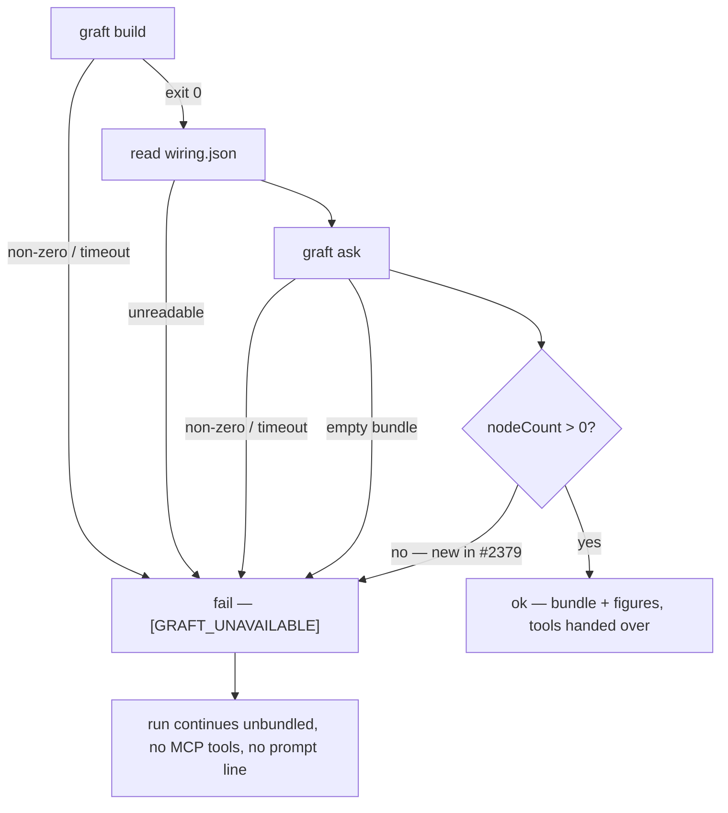

# Fail a Graft build that produced a graph with 0 nodes

Closes #2379

## Summary

`collectGraftContext` reported `status: "ok"` for a build whose `wiring.json`
held zero nodes. Every figure was present, every exit code was 0 and the ask
returned a small bundle, so the run read as a working Graft run on a very small
repository — nine such runs on 2026-09-18 across two monitored repositories.

The module already held the rule it was breaking: _the absence of a failure is
not success_. The empty-bundle guard checked the bundle, not the graph.

One guard closes it, placed after the empty-bundle check and before the `ok`
return:

```ts
if (figures.value.nodeCount === 0) {
  return fail(
    "graph built with 0 nodes — no file in the checkout matched a " +
      "language graft parses, or the build matched no files",
    { buildSeconds, bundleChars: bundle.length, ...figures.value },
  );
}
```

It reuses the existing `fail()` closure, so the run takes the same path as every
other Graft fault: exactly one `[GRAFT_UNAVAILABLE] <reason>` line at `warn`,
`status: "failed"`, every figure carried so the fault stays diagnosable, and the
run continues unbundled. No new status value — the callback contract is
additive-only.

The reason names **both** candidate causes rather than asserting one. The
codebase has no language-support signal (`"unsupported"` on the CodeGraph enum
means a Gemini-routed run, not an unsupported language), and `graft build`
output is discarded on success, so claiming a single cause would be a guess.
Naming both still lets an operator tell "Graft cannot help this repository" from
"Graft broke".

`graft_run.ts` needed no change: `wired` is computed from `status === "ok"`
alone, and the prompt line, the MCP server entry and the `queries` tally all key
off that one verdict. A `failed` collection therefore hands the agent neither
query tools backed by an empty graph nor the prompt line telling it to use them.
A test pins that rather than trusting it.



## Evidence

This is a backend change — a guard in a worker library and its tests. There is
no visual surface to screenshot, so the evidence is test output.

Red, before the guard (the new test only):

```
Actual: ok
Expected: failed
    at graft_context_test.ts:483
ok | 63 passed | 1 failed
```

Green, after:

```
$ cd worker/deno && deno test --allow-read --allow-env --allow-run --allow-write \
    tests/graft_context_test.ts tests/graft_run_test.ts < /dev/null
ok | 63 passed | 0 failed (104ms)
```

Full quality gate:

```
$ ./quality.sh < /dev/null
Result: PASSED (with skipped checks)
```

(`config integration` is the only skip — it needs credentials this run does not
have. `deno tests`, `deno lint`, `deno type check`, `deno fmt`, `semgrep`,
`markdownlint`, `mermaid` and the chokepoint checks all PASSED.)

## Test Plan

Three tests, all driving the real functions through injected `run`/`git` seams
against a real temporary checkout — nothing spawns `graft`.

1. **Regression — `collectGraftContext` fails a zero-node graph.** Fixture
   `wiring.json` of `{nodes: [], edges: []}`, both subprocesses exiting 0, the
   ask returning real text. Asserts `status === "failed"`,
   `bundle ===
   undefined`, the figures carried (`nodeCount: 0`,
   `callEdgeCount: 0`, `bundleChars` equal to the real bundle length, a numeric
   `buildSeconds`), exactly one warn line containing `[GRAFT_UNAVAILABLE]` and
   the verbatim phrase `graph built with 0 nodes`, and no throw. This test fails
   against the unfixed code with `Actual: ok / Expected: failed`.
2. **The other direction — one node is a graph.** A single-node `wiring.json`
   still yields `status: "ok"`, `nodeCount: 1`, the bundle returned and zero
   warn lines, so the guard cannot drift into rejecting small repositories.
3. **Composition.** The result test 1 actually collected is fed into
   `bindGraftRun`, asserting `wired === false`, `applyPrompt("p") === "p"` (no
   prompt line), `mcpConfig(undefined) === undefined` and
   `mcpConfigOption(undefined) === {}` (no MCP entry), and
   `queries ===
   undefined` after recording a `graft_find_code` tally (an
   empty graph was never asked). End-to-end rather than a hand-built fixture, so
   it cannot pass on a shape production never produces.

Docs-drift suites re-run green alongside: `config_docs_consistency_test.ts`,
`docs_provider_prose_test.ts`, `repo_context_trial_docs_test.ts`,
`issue_run_stats_comment_test.ts` — 70 passed, 0 failed.

## Acceptance Criteria

<!-- vibe-spec-review inputs="diff+issue-body" -->

reviewer: met

Reviewed independently against the verbatim issue body and
`git diff
main...HEAD`. Findings, in the reviewer's words:

- Required failure path, exact reason wording (`graph built with 0 nodes` as the
  verbatim prefix, the unsupported-language cause in the tail),
  `status: "failed"`, and every figure carried — all present.
- No enum change: the status union is still `"ok" | "failed" | "off"`, as the
  issue required.
- Pull side needs no change; `wired` gates all three consequences, and the
  composition test pins them from the really-collected result.
- Both test directions pin behaviour rather than restating the fixture —
  removing the guard fails the status assertion.

Two `partial` verdicts from an earlier pass on this branch were actioned before
this one: the reason string was changed to open with the issue's verbatim phrase
so an operator grep finds it, and the composition test was rewritten end-to-end
instead of hand-building a `{status: "failed", nodeCount: 0}` fixture.

## Standards Review

<!-- vibe-standards-review inputs="diff+CODING-STANDARDS.md" -->

reviewer: partial reason: The production change is clean and
standards-conformant; the test additions duplicate coverage that already exists
and reach across a module boundary, against DRY (CODING-STANDARDS.md:40) and the
one-module-one-test-file rule (CODING-STANDARDS.md:558).

In the reviewer's words:

- The guard is the smallest change that could work — one `if` on an
  already-computed figure, reusing the existing `fail()` helper; no new
  abstraction, dependency or reinvented stdlib, and correctly placed so every
  earlier fault still wins its own reason.
- It squarely satisfies "Absence of a success marker is not success": one
  `[GRAFT_UNAVAILABLE]` line at `warn` — the right level for "degraded, run
  continues" — `status: "failed"`, figures carried, no throw.
- The comment explains _why_ rather than restating the `if`; Australian English
  holds throughout.
- The docs change is owed and paid in the same commit. `docs/CALLBACKS.md` and
  the 2099 security-sweep audit were checked and stay true.
- Commit safety and scope are clean: four tracked, non-hidden files, all inside
  the Graft feature area. The analogous `codegraph_context.ts` was correctly
  left alone rather than swept up.
- **The `partial`:** the hand-built zero-node test in `graft_run_test.ts`
  duplicated the pre-existing "every status short of ok adds neither half" loop
  — `wired` never reads `nodeCount`, so it exercised no extra path and was
  strictly weaker; and importing `bindGraftRun` into `graft_context_test.ts`
  puts pull-side assertions in another module's test file.

**Action taken after the review:** the duplicate test was deleted, so
`graft_run_test.ts` is unchanged on this branch (commit `b196b1e6`). The
end-to-end composition block in `graft_context_test.ts` was kept: the issue
demands evidence that a zero-node collection yields no prompt line, no MCP entry
and no `queries` tally, and the spec reviewer required that evidence flow from
the really-collected result — a composition test spans two modules by
definition.
