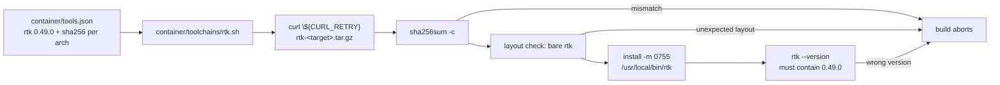

# Pin RTK v0.49.0 as a container toolchain fragment

## Summary

The image now installs the stable RTK CLI as a SHA-256-pinned toolchain
fragment. `container/toolchains/rtk.sh` reads the version and the
per-architecture digest out of `container/tools.json` with `jq`, downloads the
pinned release asset with the build's shared `${CURL_RETRY}` policy, verifies it
with `sha256sum -c`, installs the bare `rtk` binary to `/usr/local/bin/rtk`
(0755) and proves the installed binary reports the pinned version. An unknown
architecture, a missing pin, a failed download, a checksum mismatch, an archive
without `rtk` at its top level, or a wrong reported version aborts the build.

`RTK_TELEMETRY_DISABLED` and `RTK_SUPPRESS_HOOK_WARNING` are image-wide `ENV`s,
set before the toolchain install so the fragment's own version probe is quiet
too. Like `codegraph`, this toolchain exists for the worker's own trial (#2328)
rather than a monitored repository's gate, so it stays out of
`REQUIRED_REPO_TOOLCHAIN_COMMANDS`.

Closes #2381.

## Evidence

Backend/CLI change with no web interface to screenshot.

- **Pins verified upstream, not computed from a download.** Both digests are
  byte-identical to the v0.49.0 release's own `checksums.txt` entries for
  `rtk-x86_64-unknown-linux-musl.tar.gz` and
  `rtk-aarch64-unknown-linux-gnu.tar.gz`.
- **The fragment ran end to end on this host (aarch64).** Executed against the
  committed manifest with the install redirected into a sandbox root:
  `[rtk] Installing 0.49.0 for arm64` → `rtk.tar.gz: OK` →
  `[rtk] Installed rtk 0.49.0`, exit 0, with a 0755 `rtk` in place. The binary
  prints `rtk 0.49.0`, which is the fixture recorded in
  `worker/deno/tests/toolchain_selfcheck_test.ts`.
- **Tarball layout confirmed** on both architectures: one top-level member,
  `rtk`.
- **`shellcheck container/toolchains/rtk.sh`** — clean.
- **`./quality.sh`** — passes (see Standards Review for the two stages this
  branch initially broke and how they were fixed).
- **`RTK_SUPPRESS_HOOK_WARNING` is declared but inert in v0.49.0.** The binary's
  env surface (`strings` over the pinned tarball) carries
  `RTK_TELEMETRY_DISABLED` but no suppress variable — the missing-hook warning
  is throttled by a stamp file under RTK's data dir. The `ENV` is set because
  the issue requires it; the comment and both docs now say plainly that it is
  inert until a release honours it, rather than claiming an effect it does not
  have.

## Acceptance Criteria

<!-- vibe-spec-review inputs="diff+issue-body" -->

- **met** — `container/toolchains/rtk.sh` run against a manifest with the `rtk`
  pin removed exits non-zero without a network call — evidence:
  `worker/deno/tests/install_toolchains_test.ts::container/toolchains/rtk.sh - a missing pin aborts before downloading`
  — reviewer: partial — reason: the reviewer is right that `jq -er` aborts
  silently, so nothing *names* the missing pin; that is the shape
  `container/toolchains/codegraph.sh` and every other fragment here uses, and
  changing it is a cross-fragment change this issue did not ask for. The
  exit-non-zero, no-network half is implemented and tested.
- **met** — an unsupported `uname -m` value exits non-zero naming the
  architecture — evidence:
  `worker/deno/tests/install_toolchains_test.ts::container/toolchains/rtk.sh - an unsupported architecture aborts, naming it`
  — reviewer: met
- **met** — `container/tools.json` parses with the `rtk` entry and the start-up
  self-check derives an `rtk --version` probe against `0.49.0` — evidence:
  `container/tools.json:327` and
  `worker/deno/tests/toolchain_selfcheck_test.ts::checkContainerToolchains - every probe of the committed manifest passes against what the image really prints`
  — reviewer: met
- **met** — the image build installs `/usr/local/bin/rtk` reporting
  `rtk 0.49.0` and aborts on a checksum or version mismatch — evidence:
  `container/toolchains/rtk.sh` run end to end on this host (sandboxed install
  root), plus
  `worker/deno/tests/install_toolchains_test.ts::container/toolchains/rtk.sh - a tampered download aborts before extracting`
  — reviewer: met
- **met** — `RTK_TELEMETRY_DISABLED="1"` and `RTK_SUPPRESS_HOOK_WARNING="1"` are
  image `ENV`s — evidence: `container/Containerfile:211` — reviewer: met —
  reason: the reviewer noted they sit before the toolchain `RUN` rather than
  beside `ENV DO_NOT_TRACK`; deliberate, so the fragment's own `rtk --version`
  probe is covered, exactly as `POWERSHELL_TELEMETRY_OPTOUT` is.
- **met** — quality gate passes, including the container manifest/Containerfile
  consistency tests — evidence: full `./quality.sh` run after the final edit —
  reviewer: missing — reason: the reviewer ran markdownlint on an intermediate
  commit and found a real MD018 break in `docs/CONTAINER.md`; it is fixed here
  and the gate now passes.
- **unrequested** — a third and fourth fragment test (tampered download, and an
  archive without `rtk` at its top level) beyond the two the issue named —
  reviewer: unrequested — reason: the bare-binary layout is the RTK-specific
  risk the issue called out, so the guard that enforces it is tested rather than
  asserted.
- **unrequested** — `docs/CONTAINER-IMAGE.md` gains `rtk` in its
  `install-toolchains.sh` id list and a paragraph on the two `ENV`s — reviewer:
  unrequested — reason: that list restates the Containerfile line this diff
  changes, so leaving it would have made the doc stale; the paragraph records
  that one of the two `ENV`s is inert in v0.49.0.
- **unrequested** — `worker/deno/lib/container_image_hash.ts` gains the fragment
  path — reviewer: unrequested — reason: required by
  `container_image_hash_test.ts::container/ - every pinned toolchain fragment is enumerated`,
  which is the issue's "any consistency test that enumerates fragment ids is
  updated" bullet.
- **unrequested** — `docs/audits/dependency-inventory.md` gains the `rtk` row —
  reviewer: unrequested — reason: generated file; `supply-chain-gate` fails the
  CI job with `inventory-stale` without it.

## Standards Review

<!-- vibe-standards-review inputs="diff+CODING-STANDARDS.md" -->

- **violation** — markdownlint gate stage red (MD018): the reflowed sentence
  started a line with `#2153 and #2381) …` — evidence: `docs/CONTAINER.md:375` —
  reason: fixed here by rewrapping so no line begins with `#`; markdownlint now
  reports 0 issues.
- **violation** — the generated dependency inventory was not regenerated after
  `container/tools.json` gained a toolchain — evidence:
  `docs/audits/dependency-inventory.md:44` — reason: fixed here by running
  `supply-chain-gate --write-inventory` and committing the result.
- **violation** — three surfaces asserted an effect `RTK_SUPPRESS_HOOK_WARNING`
  does not have in v0.49.0 — evidence: `container/Containerfile:202` — reason:
  fixed here; the comment, `container/tools.json` notes and
  `docs/CONTAINER-IMAGE.md` now say the variable is declared and inert until a
  release honours it (confirmed by reading the pinned binary's env surface).
- **violation** — the fragment cited a non-existent issue (`#3234`), copied from
  `codegraph.sh` — evidence: `container/toolchains/rtk.sh:21` — reason: fixed
  here by dropping the citation.
- **violation** — the bare-binary layout guard, the behaviour genuinely new
  versus `codegraph.sh`, had no test — evidence:
  `container/toolchains/rtk.sh:70` — reason: fixed here by
  `install_toolchains_test.ts::container/toolchains/rtk.sh - an archive without rtk at its top level aborts`.
- **violation** — the Containerfile comment named a provider-specific path
  (`~/.claude/settings.json`), which
  `agent_provider_test.ts::the generic worker path names no specific provider`
  forbids — evidence: `container/Containerfile:204` — reason: fixed here;
  the comment now says "the agent CLI … its own user settings file".
- **clean** — pins verified against upstream `checksums.txt`; fail-loud
  throughout (`set -euo pipefail`, `jq -er`, pinned URL, `sha256sum -c`, layout
  guard, post-install version probe, `trap` cleanup); Australian English; no
  hidden paths staged; the fragment reads its version from the manifest rather
  than restating it; `rtk` correctly absent from
  `REQUIRED_REPO_TOOLCHAIN_COMMANDS`; the fragment registered in
  `CONTAINER_IMAGE_INPUTS`; every fragment-id enumeration updated.

## Test Plan

Added to `worker/deno/tests/install_toolchains_test.ts` — each runs the real
fragment and asserts on its exit code, stderr and side effects:

- `container/toolchains/rtk.sh - a missing pin aborts before downloading`
- `container/toolchains/rtk.sh - an unsupported architecture aborts, naming it`
- `container/toolchains/rtk.sh - a tampered download aborts before extracting`
- `container/toolchains/rtk.sh - an archive without rtk at its top level aborts`

Added to `worker/deno/tests/toolchain_selfcheck_test.ts`: the `rtk` fixture
(`rtk 0.49.0`), which the committed-manifest probe test consumes.

Existing suites re-run unchanged: `container_manifest_test.ts`,
`container_image_hash_test.ts`, `agent_provider_test.ts`,
`containerfile_strip_test.ts`, `container_tools_install_test.ts`,
`launcher_toolchain_selfcheck_test.ts`, `toolchain_selfcheck_command_test.ts`.
