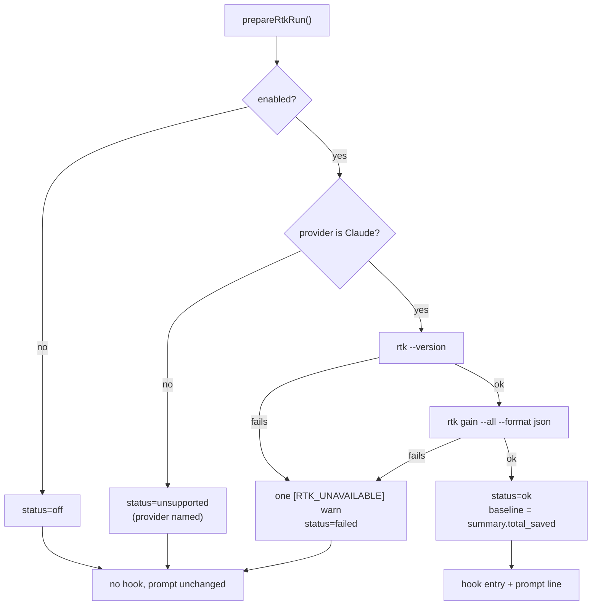

# RTK run module: hook settings, prompt line, status and saved-token delta (#2382)

## Summary

Adds `worker/deno/lib/rtk_output.ts`, the wiring module behind the
`rtk_output.enabled` switch #2380 landed. It decides — once per run — whether
RTK is wired in, hands back the `PreToolUse` hook settings and the prompt line
as an indivisible pair, and records the saved-token delta afterwards. Shaped
after `codegraph_context.ts` + `codegraph_run.ts` but collapsed into one file,
because RTK has no index step. No spawn path calls it yet; the remaining #2328
sub-issues do that. Closes #2382.

- `type RtkStatus = "ok" | "failed" | "off" | "unsupported"` and
  `RtkOutputResult`, whose `provider` is set **only** on `unsupported` so the
  stats line reads `unsupported (codex)`.
- `buildRtkHookSettings()` — RTK's own `rtk hook claude` command on the `Bash`
  matcher (native since v0.37.2, `src/hooks/constants.rs`), so no `jq` wrapper
  script is needed.
- `mergePreToolUseSettings(base, extra)` — pure; concatenates the two
  `hooks.PreToolUse` arrays so the split guard's `Edit|Write` entry (#2378) and
  RTK's `Bash` entry sit in one settings object without either clobbering the
  other. Does not mutate the caller's object.
- `prepareRtkRun({ enabled, providerId, logger, cwd?, env?, run? })` — the
  decision order, the preflight, and one status line per run.
- `record()` — re-reads gain and sets `savedTokens` to the second reading minus
  the baseline, clamped at zero. A failed second read logs the marker and leaves the figure absent;
  the status stays `ok`, because the hook did run.
- `describeRtkRun(result)` — the one-line log summary.
- `docs/audits/security-sweep-2382-rtk-output.md` plus its `top-up-2382` slice
  in `docs/audits/lib-sweep-coverage.json` — required of every new `lib/`
  module by the completeness gate.
- `docs/CONFIGURATION.md` — the RTK row's scope clause corrected: the module
  now exists, but no spawn path calls it yet.



### The saved-token figure is indicative only

The issue asked the implementer to check an assumption: *"one agent invocation
at a time writes that store; if the implementer finds concurrent containers
share `VIBE_WORK_ROOT/.container-state`, say so in the PR summary and the trial
page rather than silently trusting the figure."*

**Checked, and the assumption does not hold.** `container/entrypoint.sh` sets
`XDG_DATA_HOME="${STATE_ROOT}/data"` with `STATE_ROOT` under the durable work
root, and that root is deliberately group-shared and setgid — **one durable
state root per volume, not one per lane**. Concurrent lanes therefore write the
same `rtk/tracking.db`, so `summary.total_saved` is a host-wide running total,
not this run's. Consequences, all deliberate:

- The delta is **clamped at zero**: a neighbour rotating or trimming the store
  mid-run can leave the second read lower than the first, and a negative saving
  is not a figure anyone should read.
- `savedTokens` is **indicative only** and may include a sibling lane's saving.
  The trial bar is read from run-stats tokens and cost, never from this number.
- **The trial page (`RTK-OUTPUT-TRIAL.md`, written by a later #2328 sub-issue)
  must repeat this caveat** beside any figure it quotes.

## Evidence

Backend/CLI module with no web interface to screenshot — no Playwright evidence
applies. Verified by the tests below (22 passed, 0 failed) and by the full gate
run in the foreground:

```text
completeness checks   PASSED
deno tests            PASSED
deno lint             PASSED
deno type check       PASSED
deno fmt              PASSED
semgrep               PASSED
markdownlint          PASSED
Result: PASSED (with skipped checks)
```

(`config integration` is SKIPPED on this machine — no `.config.json` present —
as it is for every run here.)

## Acceptance Criteria

<!-- vibe-spec-review inputs="diff+issue-body" -->

- **met** — `prepareRtkRun` never rejects, whatever the seam does, and every
  status is reached by a test — evidence: `worker/deno/lib/rtk_output.ts:362-374`
  (the spawn `try`/`catch` and the `!result.ok` branch) and `408-428` (the parse
  and figure checks); the table-driven
  `rtk_output_test.ts::prepareRtkRun - no seam outcome fails the run` covers
  nine seam outcomes — unstartable, non-zero exit, timeout, a throwing seam,
  and five malformed gain answers — and the `off`, `unsupported`, `failed` and
  `ok` statuses are each asserted by their own test — reviewer: met
- **met** — a `failed` or `unsupported` preparation returns no hook settings and
  an unchanged prompt — evidence: a single `wired = result.status === "ok"` flag
  drives both halves (`worker/deno/lib/rtk_output.ts:443-448`), asserted for
  `unsupported`, for all nine failure cases, and for `off` — reviewer: met
- **met** — `mergePreToolUseSettings(splitGuard, rtk)` yields two `PreToolUse`
  entries with both matchers intact, and with an `undefined` base yields RTK's
  alone — evidence: `worker/deno/lib/rtk_output.ts:300-322`;
  `rtk_output_test.ts::mergePreToolUseSettings - both matchers survive the merge`
  asserts `["Edit|Write", "Bash"]`, that `permissions` and `PostToolUse`
  survive, and that the caller's object is not mutated; two further tests cover
  the absent base and a base with no `hooks` key — reviewer: met
- **met** — `savedTokens` equals the `summary.total_saved` delta, clamped at
  zero — evidence: `worker/deno/lib/rtk_output.ts:462`; tests cover a normal
  delta, an unchanged store reading zero, a *lower* second read clamping to zero
  rather than going negative, and a failed second read leaving the figure absent
  with the status still `ok` — reviewer: met
- **met** — the quality gate passes — evidence: the gate output above —
  reviewer: met
- **unrequested** — `docs/audits/security-sweep-2382-rtk-output.md` and the
  `top-up-2382` slice in `docs/audits/lib-sweep-coverage.json` — reviewer:
  unrequested — reason: the completeness gate fails any new `lib/` module that
  no sweep slice claims, so the fifth criterion cannot be met without them.
- **unrequested** — the `docs/CONFIGURATION.md` row correction — reviewer:
  unrequested — reason: a code change owes a docs change; the row said no such
  module existed, which this diff falsifies.
- **unrequested** — the `cwd`/`env` options, and the exported
  `RTK_PREFLIGHT_TIMEOUT_MS`, `RTK_HOOK_MATCHER` and `RTK_HOOK_COMMAND` —
  reviewer: unrequested — reason: `cwd`/`env` mirror what `runWithTimeout`
  already takes and let the caller spawn `rtk` in the worktree; the three
  constants exist so the tests assert against the module's own values rather
  than restating them.
- **unrequested** — a negative or non-finite `summary.total_saved` is refused as
  an error rather than read as a figure, and `provider` is suppressed when
  `providerId` is the empty string — reviewer: unrequested — reason: fail-loud;
  a nonsense figure on the trial page is worse than none, and an empty id would
  render `unsupported ()`.

## Standards Review

<!-- vibe-standards-review inputs="diff+CODING-STANDARDS.md" -->

- **violation** — `worker/deno/lib/rtk_output.ts:234` claimed "DeepSeek's runner
  strips `settingsJson` outright", which nothing in the repo supports
  (`settingsJson` appears nowhere) — reason: fixed here; the comment now says
  only what is true — every non-Claude provider gets an unchanged prompt and no
  hook.
- **violation** — `detail()`'s two edge branches, the 300-character truncation
  and the `"(no output)"` empty case, had no covering test, yet the security
  sweep leans on that truncation as the bound on hostile subprocess output —
  reason: fixed here; two tests drive both branches **through `prepareRtkRun`**
  (a seam whose stderr is 400+ characters with a trailing marker, and one whose
  stderr is only whitespace) and assert the marker line is flattened to one
  line, ends at `…` with the tail dropped, and is shorter than the input.
- **violation** — `docs/audits/security-sweep-2382-rtk-output.md` claimed "at
  most three invocations per run (one preflight, two gain reads)", contradicted
  by the module's own unguarded `record()` and by the test asserting a repeated
  `record()` re-reads the store — reason: fixed here; the row now states two at
  preparation plus one per `record()` call, and says plainly that the count is
  the caller's.
- **nit** — `mergePreToolUseSettings` and `describeRtkRun` are exported with no
  production caller yet — reason: stands; the issue specifies both as part of
  this module's surface, and the spawn-path sub-issue of #2328 consumes them.
- **nit** — the `savedTokens=` segment of `describeRtkRun` is unreachable on
  this module's own path, since the status line is logged before `record()` —
  reason: stands; the caller logs the closing summary, and the segment is
  directly tested.
- **nit** — `RTK_PREFLIGHT_TIMEOUT_MS` understates its reach: it caps the
  post-run gain read too — reason: stands; renaming it would churn the exported
  surface the tests and the sweep both cite, and its docstring says so.
- **nit** — `RtkRun.result` is `readonly` yet `record()` assigns `savedTokens` —
  reason: stands; `readonly` binds the property, not the object, and the frozen
  `RTK_OFF` is never `wired` so it can never be written. Same shape as the
  `codegraph_run.ts` precedent.
- **clean** — Australian English throughout; no shell and no argv construction
  (both argvs are module constants); no secret or environment value logged;
  fail-loud with exactly one `[RTK_UNAVAILABLE] <reason>` line and no
  catch-and-ignore; tests call real functions with an injected subprocess seam —
  no source grepping, no sleeps, parallel-safe; no existing test removed or
  disabled; docs updated in the same change; commits carry the
  `Vibe-Coder-Run-Id` trailer.

## Test Plan

Added `worker/deno/tests/rtk_output_test.ts` (22 tests), all driving real
functions through an injected `RtkRunner` stub — no binary is spawned and no
test sleeps:

- **Statuses**: the switch off yields the frozen `RTK_OFF` and spawns nothing; a
  non-Claude provider yields `unsupported` with the provider named (and an empty
  id is suppressed rather than rendering an empty bracket); a healthy preflight
  yields `ok` and spawns exactly `rtk --version` then `rtk gain …`.
- **Never rejects**: one table-driven test over nine seam outcomes — the binary
  missing, a non-zero version exit, a timeout, a seam that throws, a non-zero
  gain exit, non-JSON output, a JSON array, a missing `summary.total_saved`, and
  a negative total — each asserting `failed`, exactly one marker line, no hook
  settings and an unchanged prompt.
- **The indivisible pair**: `hookSettings()` and `applyPrompt()` asserted
  together on every status; the `ok` case matches `buildRtkHookSettings()`
  exactly and appends `RTK_PROMPT_LINE` after a blank line.
- **The delta**: a normal delta; an unchanged store reading zero; a *lower*
  second read clamping to zero; a failed second read leaving `savedTokens`
  absent with the status still `ok`; `record()` on a failed preparation spawning
  nothing; repeated `record()` calls re-reading the store.
- **Diagnostic bounds**: 400+ characters of stderr flattened to one line,
  truncated at `…`, tail dropped; whitespace-only stderr reported as
  `(no output)`.
- **Merging and describing**: both matchers survive, other keys and other hook
  events survive, the caller's object is not mutated; an absent base and a base
  without `hooks` both yield RTK's entry; `describeRtkRun` names the status, the
  provider and the figure, and omits `savedTokens` when there is none.

No existing test was removed, disabled or modified.
