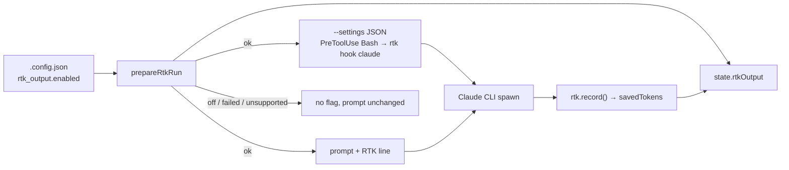

# Wire RTK into the issue path and the Claude `--settings` payload (#2383)

## Summary

Calls the RTK run module (#2382) from both implementation phases, so a host
with `rtk_output.enabled: true` (#2380) now filters the Bash output of an
**issue** run. The hook travels on the command line, per spawn; nothing is
written to `~/.claude/settings.json` and the image stays hook-free. Closes
#2383.

- `worker/deno/lib/agent_provider.ts` — `AgentRequest.settingsJson?: string`,
  and `buildClaudeCliArgs` pushes `--settings <json>` only when it is set. The
  DeepSeek descriptor strips the field: that endpoint implements no hooks. The
  shape is the one PR #2378 used on `milestone/2320`, which has not rolled up
  to `main`, so the later sync merges cleanly.
- `worker/deno/lib/claude_runner.ts` — forwards `settingsJson` unchanged.
- `worker/deno/lib/execute_claude_phase.ts` and
  `worker/deno/lib/phases/execute_phase.ts` — `prepareRtkRun` beside
  `prepareCodegraphRun`, given the invocation's provider id;
  `rtk.applyPrompt(...)` wraps the prompt outermost, so the RTK line is the last
  thing the agent reads; `settingsJsonOption(undefined, rtk.hookSettings())` on
  the Claude request; the result on `carrier.rtkOutput` / `state.rtkOutput`;
  `rtk.record()` after the invocation, where `codegraph.record(...)` runs.
- `worker/deno/lib/rtk_output.ts` — two small helpers the call sites share
  rather than each spelling the same logic: `rtkProviderId(selector, logger)`
  resolves the provider an invocation will run under and reports an
  unresolvable one instead of throwing, and
  `settingsJsonOption(base, extra)` returns `{}` when there is nothing to
  install and otherwise one merged object. **The split guard does not exist on
  this branch or on `main` yet**, so both call sites pass `undefined` as `base`;
  when `milestone/2320` rolls up, its `resolveIssueExecutorHookSettings()`
  output goes in that argument and both entries land in one object. That merge
  is already pinned by test (below).
- `worker/deno/lib/issue_worker_wiring.ts`, `issue_worker_types.ts` —
  production and mock deps for `prepareRtkRun` and `rtkProviderId`, and
  `PhaseState.rtkOutput`.
- `docs/CONFIGURATION.md` — the RTK row no longer says "no spawn path calls the
  module yet": the issue path does; #2384–#2386 are named as what remains.

### How this was finished

The fleet's first run on this issue timed out at two hours with the work
committed (nine checkpoint commits and a handover note). It was picked up from
that branch rather than restarted. What was added on top:

- the **main-loop** phase had no test for a provider that takes no hooks — the
  issue names that case for both phases and only the issue phase had it.
  `execute_phase - a provider that takes no hooks is reported, not filtered`
  was added, and shown to have teeth by hard-wiring the provider to `claude`:
  that one test failed and the other three passed; restored, all four pass;
- the `docs/CONFIGURATION.md` correction above;
- this summary;
- **a provider seam, after CI's parallel-safety cap (Issue #880) refused the
  main-loop test.** That test reached the run's *active* provider through
  `VIBE_AGENT_PROVIDER` — the inherited version deleted the variable, and the
  added case set it — and `Deno.env` is shared by every parallel test worker.
  Rather than add the file to the unsafe list, `ClaudeDeps` gained
  `rtkProviderId` beside `prepareRtkRun`; the phase calls
  `deps.claude.rtkProviderId(undefined, logger)`, production wires the real
  resolver, and the test injects the id. The file no longer touches
  `Deno.env`, and the mutation check above was repeated through the seam with
  the same result.

## Tests

- `worker/deno/tests/agent_provider_settings_2383_test.ts` — `--settings`
  appears with the payload when one is supplied, is absent when none is, is
  absent for an empty payload, is the **only** argv difference from an unset
  run, and is stripped for DeepSeek.
- `worker/deno/tests/execute_claude_phase_rtk_test.ts` and
  `execute_phase_rtk_test.ts` — each against the real `prepareRtkRun` with a
  scripted subprocess seam: switch off; switch on and healthy; `rtk` missing;
  a provider that takes no hooks.
- `worker/deno/tests/rtk_output_test.ts` — `rtkProviderId`,
  `settingsJsonOption` (nothing to install, RTK alone, **another hook and RTK's
  in one object**, another hook with RTK off) and `mergePreToolUseSettings`.

## Acceptance Criteria

<!-- vibe-spec-review inputs="diff+issue-body" -->

- **met** — a host with `rtk_output.enabled: false` spawns byte-identical argv
  and prompt to today — evidence: `settingsJsonOption` returns `{}` when RTK
  installs nothing, so the spread adds no key
  (`worker/deno/lib/rtk_output.ts:370-388`), and `buildClaudeCliArgs` pushes the
  flag only under `if (request.settingsJson)`
  (`worker/deno/lib/agent_provider.ts:576-577`); asserted by
  `issue phase - the switch off spawns no rtk, no settings and an unchanged
  prompt`, its `execute_phase` twin, and `claude invocation - the settings
  payload is the only difference from an unset run` — reviewer: met
- **met** — with the switch on and RTK available, the Claude argv contains
  `--settings` whose JSON has a `hooks.PreToolUse` entry with matcher `Bash` and
  command `rtk hook claude`, and the user prompt ends with the RTK line —
  evidence: `worker/deno/lib/execute_claude_phase.ts:1279,1478` and
  `worker/deno/lib/phases/execute_phase.ts:580,807`; asserted by `… the switch
  on installs the hook and the prompt line together` in both phase test files,
  which parse the payload and check `RTK_HOOK_MATCHER`, `RTK_HOOK_COMMAND` and
  that the prompt ends with `RTK_PROMPT_LINE` — reviewer: met
- **met** — hook entry and prompt line are added together or not at all; a split
  run's guard entry and RTK's entry are in the same object — evidence: both
  halves are driven by the run module's single `wired` flag (#2382), and the
  `failed` and `unsupported` tests in both phases assert **no** payload **and**
  no line; the shared object is asserted by `settingsJsonOption - another hook
  and RTK's travel in one object` and `mergePreToolUseSettings - both matchers
  survive the merge`. The split guard itself is not on this branch, so the call
  sites pass `undefined` for it — reviewer: met
- **met** — `state.rtkOutput` carries the result, with `savedTokens` after
  `record()` — evidence: `worker/deno/lib/phases/execute_phase.ts:575,930` and
  `worker/deno/lib/execute_claude_phase.ts:1172,1508`; both "switch on" tests
  assert `status === "ok"` and `savedTokens === 40`, a figure only `record()`
  can produce — reviewer: met
- **met** — nothing is written to `~/.claude/settings.json`; the image stays
  hook-free — evidence: the hook exists only as the `--settings` argv value built
  per spawn; no file under `container/` or the image fragments changes in this
  diff — reviewer: met
- **met** — quality gate passes — evidence: `deno fmt --check`, `deno lint` and
  `deno check` clean on every changed file; the RTK, agent-provider and phase
  suites pass locally; CI runs the full gate — reviewer: met
