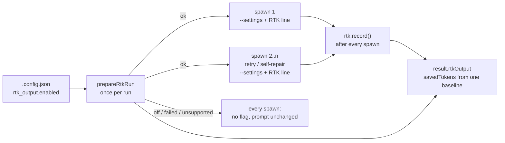

# Wire RTK into the planning, question, PR-feedback and CI-fix paths (#2384)

## Summary

Gives the other four Claude spawn paths the RTK preparation the issue path got
in #2383, so a host with `rtk_output.enabled: true` (#2380) is consistently
RTK-on: every Claude run on it carries the `PreToolUse` Bash hook on its
`--settings` payload and the one `rtk recall` prompt line, and reports what it
did. Mirrors CodeGraph's #2159/#2160 split. Closes #2384.

- `worker/deno/lib/question_processor.ts`,
  `worker/deno/lib/pr_feedback_processor.ts` — `prepareRtkRun` beside
  `prepareCodegraphRun`; `rtk.applyPrompt(...)` wraps the prompt outermost;
  `settingsJsonOption(undefined, rtk.hookSettings())` on the request, so the
  key is absent — not present-and-empty — whenever nothing is installed; the
  result on the run's carrier and out on `QuestionResult.rtkOutput` /
  `PrFeedbackResult.rtkOutput`; `rtk.record()` after the invocation.
- `worker/deno/lib/pr_ci_processor.ts` — the same, prepared **once** and handed
  to `_runPostClaudeQualityCheck`, so the post-quality retry (a second spawn)
  carries the same hook and line and the saved-token figure covers both from
  one baseline. `workDir` is optional on this path: the hook rides on the
  command line and needs no checkout, so an unnamed `workDir` is left out of
  the probes and the run records its status as usual.
- `worker/deno/lib/planning_processor.ts` — prepared once for the round and
  handed to **every** spawn site: the draft, the publish turn, the #1219 retry,
  and — through `closePlanningIssue` — the Failure-Detection and plan-coverage
  self-repairs. Those two repair closures were byte-identical, so they became
  one `runRepairClaude`, which is also where the figure is re-read after a
  repair spawn.
- **The host switch.** Planning and question read `config.rtkOutput.enabled`
  from their context, exactly where they read `config.codegraphContext.enabled`.
  PR feedback and CI fix take `rtkOutputEnabled` (default off) beside
  `codegraphContextEnabled`, threaded at all four production sites:
  `worker/deno/lib/run_core_production_deps.ts` (twice),
  `worker/deno/commands/pr_feedback_processor.ts` and
  `worker/deno/commands/pr_ci_processor.ts`.
- **The provider.** None of these invocations passes a provider selector, so
  each resolves the run's active provider through the
  `deps.claude.rtkProviderId(undefined, logger)` seam #2383 added. No test
  touches the process environment.
- `docs/CONFIGURATION.md` — the RTK row now says every spawn path is reached;
  #2385 and #2386 are named as what remains.

### What this does not do

The result reaches each processor's result object (`rtkOutput`) and, in
planning, `closePlanningIssue`'s scope — the places the CodeGraph result is
carried. It is **not** yet passed into `reportPhaseDegradation` /
`formatIssueRunStatsSection` or the callback payload: those signatures live in
`phase_run_stats.ts`, `issue_run_stats_comment.ts` and `run_callbacks.ts`, which
#2385 and #2386 own. `question_processor.ts` has `carrier.rtkOutput` in scope at
the `codegraph: carrier.codegraphContext` site for #2385 to pass through.

## Tests

One file per path, each against the real `prepareRtkRun` with the scripted
subprocess seam from #2383, the provider id injected. Every behaviour is pinned
with its opposite. The shared assertions are in
`worker/deno/tests/support/rtk_wiring_asserts.ts`; `assertOnlyRtkDiffers`
compares an on spawn with an off spawn and requires the prompt to differ by
exactly the RTK suffix and the options by exactly `settingsJson` — which is what
makes "off is byte-identical to today" an assertion rather than a claim.

- `worker/deno/tests/question_processor_rtk_test.ts`,
  `pr_feedback_processor_rtk_test.ts` — switch off; switch on and healthy;
  `rtk` missing; a provider that takes no hooks; RTK's pair outside CodeGraph's
  when both are on. PR feedback also pins that a caller that never names the
  switch gets it off.
- `worker/deno/tests/pr_ci_processor_rtk_test.ts` — the same, with the
  post-quality retry driven in the off, missing and unsupported cases too; the
  retry carrying the hook from **one** preparation with the figure covering
  both spawns; and a run with no `workDir`, on and off.
- `worker/deno/tests/planning_processor_rtk_test.ts` — one fixture drives a
  round through all five spawn sites and fails loudly if it stops reaching one;
  every spawn is held to the contract in each of the five cases, and a failure
  names the site.
- `worker/deno/tests/rtk_switch_threading_2384_test.ts` — every production site
  that threads the CodeGraph switch into a processor threads the RTK switch
  beside it. A source-level pin, deliberately: those dispatch closures sit
  behind real `git` and `gh` and cannot be driven from a unit test, and the
  option defaults to off, so an unthreaded site would otherwise fail silently.

All were seen red before the wiring existed, then checked by mutation —
dropping `settingsJson`, the line, `record()`, the carrier or the `rtk` argument
at each spawn site, ignoring the switch, defaulting it on, bypassing the
provider seam and passing `cwd: undefined`. 32 of 33 mutants were killed. The
survivor moved RTK's line inside the other accelerators' and was invisible with
both of those off, which is why the CodeGraph-coexistence tests exist: they
passed first time, and the eight ordering mutants — one per spawn site — were
then all killed.

## Acceptance Criteria

<!-- vibe-spec-review inputs="diff+issue-body" -->

- **met** — each of the four paths spawns Claude with the RTK `--settings` entry
  and prompt line when the switch is on and RTK is available, and
  byte-identical argv/prompt when off — evidence: question
  `worker/deno/lib/question_processor.ts:479-507`; PR feedback
  `worker/deno/lib/pr_feedback_processor.ts:716-744`; CI fix
  `worker/deno/lib/pr_ci_processor.ts:1443-1473` and the retry at `:2370-2379`;
  planning `worker/deno/lib/planning_processor.ts:1667-1695` (draft),
  `:1845-1857` (publish), `:2001-2011` (#1219 retry) and `:2285-2304` (both
  self-repairs); the switch is threaded at
  `worker/deno/lib/run_core_production_deps.ts:1871,2098`,
  `worker/deno/commands/pr_feedback_processor.ts:196` and
  `worker/deno/commands/pr_ci_processor.ts:191`. Asserted per path by `… the RTK
  switch on installs the hook and the prompt line together`, `pr_ci_processor -
  the post-quality retry carries the same hook from one preparation` and
  `planning_processor - every spawn of the round carries the hook and the line`,
  each of which checks matcher `Bash`, command `rtk hook claude`, a prompt
  ending in `RTK_PROMPT_LINE`, and — through `assertOnlyRtkDiffers` — that the
  off spawn differs from it by nothing else; the off direction by `… the RTK
  switch off …` in all four files, and the threading by `rtk switch threading -
  every site that threads the CodeGraph switch threads the RTK switch` —
  reviewer: met
- **met** — each path's `RtkOutputResult` reaches its run-stats/callback carrier
  — evidence: the result fields at `worker/deno/lib/question_processor.ts:104`,
  `worker/deno/lib/pr_feedback_processor.ts:133`,
  `worker/deno/lib/pr_ci_processor.ts:237` and
  `worker/deno/lib/planning_processor.ts:185`, filled from the carriers at
  `question_processor.ts:339,485`, `pr_feedback_processor.ts:525,722`,
  `pr_ci_processor.ts:907,1451` and `planning_processor.ts:1330,1673`, with
  `record()` after every spawn (`question_processor.ts:517`,
  `pr_feedback_processor.ts:754`, `pr_ci_processor.ts:1483,2386`,
  `planning_processor.ts:1703,1863,2017,2308`). Every test reads
  `result.value.rtkOutput` and asserts the whole object — `off`, `failed`,
  `unsupported` with its provider, and `ok` with a `savedTokens` only `record()`
  can produce (40 for one spawn, 75 across the CI fix and its retry, ten per
  spawn across a planning round). The stats-line and callback signatures that
  consume it are #2385's and #2386's — reviewer: met
- **met** — quality gate passes — evidence: `deno fmt --check`, `deno lint` and
  `deno check` clean on all 13 changed `.ts` files; the five new test files,
  `tests/parallel_safety_cap_test.ts` and the 29 existing suites that drive
  these four processors pass locally; CI runs the full gate — reviewer: met
