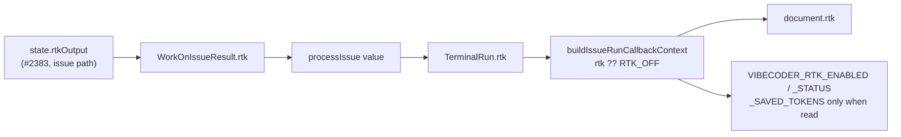

# Carry an `rtk` block on the callback context (`VIBECODER_RTK_*`) (#2386)

## Summary

Every issue-run callback context now carries an additive `rtk` block —
`enabled`, `status`, and `savedTokens` only when RTK's gain store was read —
exported to hooks as `VIBECODER_RTK_ENABLED`, `VIBECODER_RTK_STATUS` and
`VIBECODER_RTK_SAVED_TOKENS`. It is modelled field for field on the `codegraph`
block (#2162). **`schemaVersion` stays at 2**: the contract is additive-only
(#2039, #2041), and the block is appended after every key a deployed hook
already reads. Closes #2386.

- `worker/deno/lib/run_callbacks.ts` — `rtk?: RtkOutputResult` on
  `IssueRunCallbackContext` and `TerminalIssueRun`; the frozen `RTK_OFF`
  default; `rtkBlock()` beside `codegraphBlock()`, which emits `savedTokens`
  only when it is defined and never emits `provider` (the detail an
  `unsupported` status carries for the run-stats line); the three scalars in
  `buildCallbackEnv`, through the same `put()` that drops an undefined value.
- `worker/deno/lib/run_callback_context.ts` — `rtk: run.rtk ?? RTK_OFF` on every
  context.
- `worker/deno/lib/run_core.ts` — `rtk` carried wherever `codegraph` is: the
  `processIssue` result type, `TerminalRun`, `withProcessCallbackFacts` and
  `dispatchIssueCallbacks`.
- `worker/deno/lib/issue_worker_types.ts`, `issue_worker.ts`,
  `run_core_production_deps.ts` — the hops between the phase state and the scan
  loop: `WorkOnIssueResult.rtk`, the one-line lift of `state.rtkOutput` beside
  the `codegraph` lift, and the one-line copy onto the `processIssue` value
  (not for an expected skip, exactly as `codegraph`).
- `docs/CALLBACKS.md` — the block in the example document, three rows after
  `VIBECODER_CODEGRAPH_QUERIES`, a paragraph beside the `graft`/`codegraph`
  ones, and a reference row. `docs/CONFIGURATION.md` — the three scalars added
  to the exported-variable list.

### Which runs populate the block today

Only the **issue (implementation) path** records an RTK outcome on this branch
(#2383). The planning, question, PR-feedback and CI-fix processors do not call
the RTK module until #2384 lands, so their runs — and any run that ended before
the preparation — publish the default `{ "enabled": false, "status": "off" }`.
`docs/CALLBACKS.md` says so: `off` means the switch was off *or nothing was
recorded*. Unlike CodeGraph's `codegraphNotRun`, no switched-on fallback was
added here: the issue's acceptance criterion asks for the plain `off` default,
and until #2384 lands a `failed` fallback would mislabel every processor run on
a switched-on host.

### Follow-up

The private logs record does not copy the block yet. That change lands in the
private extension repository, which the worker cannot write to, so it is handed
off as **#2413** ("Copy the rtk callback block into the GRQ-VibeCoder-logs
metadata record"). The RTK window does not wait for it.

## Tests

Each was written first and seen red (the eight builder tests and the two
`workOnIssue` tests failed on `undefined` before the implementation); the
`run_core` pair and each builder hop were then mutation-checked by deleting the
carrying line, which failed the named tests, and restored.

- `worker/deno/tests/callback_schema_compat_test.ts` — the block for every
  status including `ok` with no figure, `unsupported` without `provider`, and a
  measured `0`; explicitly `off` when the context has none; the scalars, with
  `VIBECODER_RTK_SAVED_TOKENS` absent from the environment (not blank) when no
  figure was read; and the additive pin: `CALLBACK_SCHEMA_VERSION === 2`, every
  schema 1 field and scalar, the #2100 scalars, the `graft` and `codegraph`
  blocks and scalars unchanged, and `rtk` the last key of the document.
- `worker/deno/tests/run_callback_context_test.ts` — the outcome travels; the
  block is on every context shape and `off` by default; no `savedTokens` key
  when none was read; `rtk` and `codegraph` do not disturb each other, in both
  directions.
- `worker/deno/tests/run_core_callbacks_test.ts` — the terminal run carries the
  RTK outcome, and carries none when the run reported none.
- `worker/deno/tests/rtk_callback_2386_test.ts` — end to end through the real
  `workOnIssue` and the real `prepareRtkRun` on the scripted subprocess seam:
  `ok` with a figure of 40, `failed` with no figure, and switch off.

Not covered by a test: the one-line copy in `run_core_production_deps.ts`
(`processIssue`), which has no harness — the `codegraph` line beside it is
likewise untested.

### A run that ends early states the host's real switch

Added in review. As first written, an issue run on a **switched-on** host that
ended before RTK was prepared (a refused claim, an early exit) published
`{ enabled: false, status: "off" }`. The trial separates enabled runs from
control runs by this block alone, so that archived an enabled host's run as a
control run — the fabricated-`false` trap the `graft` block documents and
avoids (#2104). `issue_worker.ts` now lifts
`state.rtkOutput ?? { status: "off", enabled: ctx.config.rtkOutput.enabled }`,
exactly as it does for Graft. Pinned by `#2386 - a run that ended before RTK
was prepared states the host's real switch`, for the switch on **and** off,
through the real `workOnIssue`; both were red first.

## Acceptance Criteria

<!-- vibe-spec-review inputs="diff+issue-body" -->

- **met** — the run callback document emits `rtk: { enabled, status[,
  savedTokens] }` on every run, and `{ enabled: false, status: "off" }` when
  nothing was recorded (the issue names the builder
  `buildIssueRunCallbackDocument`; in the code it is
  `buildCallbackContextDocument`) — evidence: `document.rtk =
  rtkBlock(context.rtk)` is unconditional
  (`worker/deno/lib/run_callbacks.ts:557`), `rtkBlock` defaults to `RTK_OFF` and
  adds `savedTokens` only when defined (`run_callbacks.ts:599-606`), and the
  context builder sets `rtk: run.rtk ?? RTK_OFF`
  (`worker/deno/lib/run_callback_context.ts:226`); pinned by `#2386 - the rtk
  block carries enabled and status for every status, and savedTokens only when
  read`, `#2386 - a run that reported no RTK preparation is explicitly off,
  never absent` and `run_callback_context - the rtk block is on every context,
  off when the run supplied nothing`. Only the issue path records an outcome
  until #2384 lands; every other run kind publishes the `off` default —
  reviewer: met
- **met** — `VIBECODER_RTK_ENABLED` and `VIBECODER_RTK_STATUS` are always
  exported; `VIBECODER_RTK_SAVED_TOKENS` only when present — evidence:
  `worker/deno/lib/run_callbacks.ts:727-730`, where `put()` drops an undefined
  value; pinned by `#2386 - the rtk scalars are exported, the saved-token figure
  only when the run has it`, which asserts the key is **not in** the environment
  for `ok`-without-figure, `failed`, `unsupported`, `off` and an absent block,
  and is `"0"` for a measured zero; and end to end by `#2386 - a switched-on
  host without rtk reports failed and no figure at all` — reviewer: met
- **met** — `docs/CALLBACKS.md` documents all three;
  `callback_schema_compat_test.ts` passes without a schema version bump —
  evidence: rows at `docs/CALLBACKS.md:511-513`, paragraph at
  `docs/CALLBACKS.md:587`; `CALLBACK_SCHEMA_VERSION` is untouched in this diff
  and `#2386 - the block is additive: the schema version and every earlier field
  and scalar are untouched` asserts `assertEquals(CALLBACK_SCHEMA_VERSION, 2)`
  beside the existing #2100, #2104 and #2162 assertions of the same, all passing
  — reviewer: met
- **met** — the follow-up issue exists and is linked from the PR summary —
  evidence: #2413, filed after `gh issue list --search` found no open match
  other than #2386 itself; see "Follow-up" above — reviewer: met
- **met** — quality gate passes — evidence: `deno fmt --check`, `deno lint` and
  `deno check` clean on the ten changed `.ts` files; `markdownlint-cli2` clean
  on both changed documents; the callback, context, `run_core` callbacks, RTK
  phase and parallel-safety suites pass locally; CI runs the full gate —
  reviewer: met
