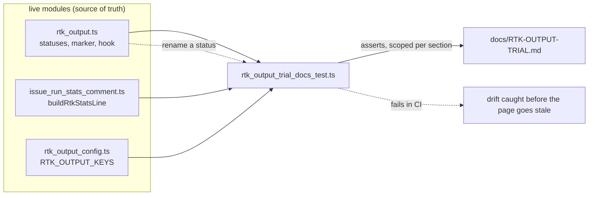

# RTK trial page, references and the 1.7.0 release (Issue #2387)

## Summary

Closes #2387.

`rtk_output.enabled` now exists end to end — the config key (#2380), the module
(#2382), the two implementation phases (#2383), the four other agent paths
(#2384), the `RTK:` stats line (#2385), the `rtk` callback block (#2386) and the
pinned toolchain (#2381) — but nothing wrote down *how the trial is judged*.
This PR adds that page, links it from every surface that names the switch, and
cuts the 1.7.0 release that carries the whole switch.

- **`docs/RTK-OUTPUT-TRIAL.md`** (276 lines, 11 sections) follows the skeleton of
  its sibling `docs/REPO-CONTEXT-TRIAL.md`: the candidate and its wiring, the
  motivation (stated as motivation, **not** evidence), the bar, the
  human-opened window, the comparison rule, where every figure is read from,
  the security posture of a third-party binary sitting ahead of every Bash
  command, a results template ending "clears / does not clear", what a pass and
  a miss change, and the comparable tools recorded as facts rather than trial
  candidates.
- **Four link edits** so no surface names the switch without reaching the
  protocol: `docs/REPO-CONTEXT-TRIAL.md` §9, the `README.md` Documentation
  table, the `rtk_output` row in `docs/CONFIGURATION.md`, and a new residual
  risk **R13** in `docs/THREAT-MODEL.md` for the rewrite hook.
- **`docs/REFERENCES.md`** gains the RTK row — the upstream project, what was
  taken (the `PreToolUse` Bash-output rewrite hook, trialled behind a switch),
  and the trial page as where it shows up.
- **`worker/deno/tests/rtk_output_trial_docs_test.ts`** keeps the page honest:
  the statuses, the rendered `RTK:` shapes, the hook matcher/command, the
  config key and the `[RTK_UNAVAILABLE]` marker are all taken from the **live**
  modules, so renaming a status or changing a rendered line fails in CI instead
  of leaving the page quietly wrong.
- **Release**: `.release-floor` → `1.7.0` with a `## 1.7.0` entry in
  `docs/RELEASE-NOTES.md`, both in the same commit as
  `docs/RELEASE-TAGGING.md` requires.

This is the **last** sub-issue of milestone #2328 to merge, so the 1.7.0 tag
carries the whole switch and the toolchain it needs.

### How the page stays true



The four drift tests really call `prepareRtkRun` through the shared
`tests/support/rtk_seam.ts` seam — no `rtk` binary is spawned and no clock is
waited on — so the page's four statuses are the four the runner genuinely
returns, not a list someone typed out.

## Evidence

This is a documentation and test change with no runtime behaviour change — no
worker code path was modified, so there is no screenshot to capture and no UI
surface to show. The evidence is the test run and the quality gate.

```text
$ deno test --allow-read tests/rtk_output_trial_docs_test.ts < /dev/null
ok | 11 passed | 0 failed (7ms)
```

```text
$ timeout 900 ./quality.sh < /dev/null
PASSED (with skipped checks)   # only `config integration` skipped (no host config)
```

`markdownlint-cli2`: 0 issues across 176 files, including the new page.
`deno fmt --check`, `deno lint` and `deno check` clean.

## Acceptance Criteria

<!-- vibe-spec-review inputs="diff+issue-body" -->

- **met** — `docs/RTK-OUTPUT-TRIAL.md` exists and is linked from
  `REPO-CONTEXT-TRIAL.md` §9, the README Documentation table and the
  `rtk_output` CONFIGURATION row — evidence: `docs/RTK-OUTPUT-TRIAL.md:1-276`,
  `docs/REPO-CONTEXT-TRIAL.md:278`, `README.md:472`,
  `docs/CONFIGURATION.md:1742`; test `the trial page is linked from every
  surface that names the switch` — reviewer: met
- **met** — `deno test worker/deno/tests/rtk_output_trial_docs_test.ts` passes
  against the live `rtk_output.ts` exports — evidence: 11 passed / 0 failed in
  7 ms; the statuses come from real `prepareRtkRun` calls
  (`rtk_output_trial_docs_test.ts:64-84`), the shapes from real
  `buildRtkStatsLine` calls (`:219-248`), the marker from
  `RTK_UNAVAILABLE_MARKER` (`:250-255`) — reviewer: met
- **met** — `docs/REFERENCES.md` carries the RTK row and its path-existence
  test passes — evidence: `docs/REFERENCES.md:69` names the source, what was
  taken and `docs/RTK-OUTPUT-TRIAL.md` as where it shows up;
  `references_doc_test.ts` 16 tests pass — reviewer: met
- **met** — `.release-floor` reads `1.7.0` with the matching `## 1.7.0` entry in
  the same commit — evidence: `.release-floor:17` plus the reason at `:14-16`,
  `docs/RELEASE-NOTES.md:17` — the `## 1.7.0 — RTK Bash-output trial behind
  rtk_output.enabled` heading — naming the new key, the two record surfaces, the
  `VIBECODER_RTK_*` scalars, migration (none) and rollback (set `false`); both
  in commit `13aa2685` — reviewer: met
- **met** — the stale-headings follow-up exists and is referenced here —
  evidence: **#2422** (filed after a dedup search that found no prior issue)
  covers the two stale `## Unreleased` headings at `docs/RELEASE-NOTES.md:53`
  and `:146`, shipped as 1.6.41 and 1.6.56; they are deliberately **not** edited
  in this PR — reviewer: partial (the reviewer ran before this file existed and
  marked it partial solely because no PR summary yet referenced #2422; that is
  what this bullet resolves)
- **met** — markdownlint and the quality gate pass — evidence: markdownlint 0
  issues / 176 files; `./quality.sh` PASSED with only `config integration`
  skipped — reviewer: met (partial verification — the reviewer confirmed
  markdownlint but did not execute the full gate itself; the gate was run in
  this session, output above)

Two deviations the spec reviewer flagged and neither of which changes a stated
criterion: the `.release-floor` reason runs to three comment lines rather than
one (the floor carries seven sub-issues and naming them is what makes the floor
auditable), and the page carries two mermaid diagrams the issue did not ask for
(the sibling `REPO-CONTEXT-TRIAL.md` carries diagrams too, and
`CODING-STANDARDS.md` asks for them where they aid understanding). No scope
creep outside the issue's deliverable list was found.

## Standards Review

<!-- vibe-standards-review inputs="diff+CODING-STANDARDS.md" -->

- **violation** — documentation keyword checks in the drift suite: seven of the
  eleven cases assert that particular words appear in prose rather than on any
  code behaviour — evidence:
  `worker/deno/tests/rtk_output_trial_docs_test.ts:159` (`"10%"`), `:164`
  (`"2 days"`), `:182-195` (`grq-25`, `/no code schedules it/i`,
  `/no worker flips it/i`), `:236-247`, `:274-281`
  (`/clears \/ does not clear/i`), `:287-297` (`/#2348/`), `:302-312`
  (`/not trialled/i`), against `CODING-STANDARDS.md:104-107` — reason: stands,
  and is now recorded rather than argued. The four cases the code *can* express
  do drive live modules (`prepareRtkRun` `:64-84`, `buildRtkStatsLine`
  `:223-235`, `parseRtkOutput`/`RTK_OUTPUT_KEYS` `:111-121`, the imported
  matcher/command/marker constants); the other seven pin rules — the bar, the
  human-opened window, "no worker flips it" — that no module can express, and
  acceptance criterion 2 asks for exactly that guard. The reviewer is right that
  the repo's 22 sibling `*_docs_test.ts` suites are precedent, not a documented
  exemption, and that the carve-out belongs in `CODING-STANDARDS.md` rather than
  in each new test's header; that is a repo-wide decision, so it is filed as
  **#2429** instead of being settled inside this PR. Every assertion is scoped
  to its own section, so deleting a rule cannot be satisfied by the same words
  elsewhere on the page.
- **violation** — duplicated markdown helpers: a third hand-rolled copy of the
  `readRepoDoc`/`section` pair, and not fence-aware — evidence:
  `worker/deno/tests/rtk_output_trial_docs_test.ts:46-69` (pre-refactor) —
  reason: fixed here. The suite now imports the shared
  `tests/support/markdown_docs.ts` (`:42`), which masks fenced blocks so a `#`
  inside a shell example is not read as a heading.
- **violation** — re-implemented RTK subprocess seam duplicating
  `tests/support/rtk_seam.ts` — evidence:
  `worker/deno/tests/rtk_output_trial_docs_test.ts:71-88` and fixtures at
  `:114-117` (pre-refactor) — reason: fixed here. The suite now imports
  `rtkSeam`, `rtkExited`, `rtkVersion` and `rtkGain` from the shared module
  (`:43`), the same seam seven other suites use. Net effect of the two fixes:
  52 insertions, 100 deletions.
- **violation** — missing `docs/archive/pr-summaries/pr-summary-2387.md` —
  evidence: `docs/archive/pr-summaries/` — reason: fixed here; this file is it.
- **violation (minor)** — commit `376e9881` is titled "WIP checkpoint: periodic
  agent progress snapshot (Issue #4170)" while carrying this change set's
  deliverables; `f1987a8c` repeats the title — evidence: `git log` at
  `376e9881`, `f1987a8c` — reason: stands. Both are worker-generated automatic
  checkpoints, not hand-authored commits, and both are already pushed;
  correcting the titles would mean rewriting published history, which the
  standards' bound-irreversible-actions rule forbids. The substantive commit
  `13aa2685` is correctly titled and carries the run-id trailer.

One observation recorded without a fix: `.release-floor` is a tracked hidden
path outside the five-entry allowlist in `CODING-STANDARDS.md`. It is
pre-existing, and `worker/deno/tests/next_release_tag_test.ts:325-330` requires
it to be committed — drift in the standards prose, not a fault introduced here.

Confirmed clean by the standards reviewer: Australian English throughout, no
silent failures, unit-test shape and speed (11 passed in a few ms, no sleeps or
wall-clock thresholds), docs updated alongside code across seven surfaces, the
additive-contract rule, and all gates green (`deno task check:manifests` 662
passed in 5.6 s; fmt/lint/check clean; markdownlint 0 issues across 176 files).

## Test Plan

| Check | Command | Result |
| --- | --- | --- |
| New drift suite | `deno test --allow-read tests/rtk_output_trial_docs_test.ts < /dev/null` | 11 passed / 0 failed (7 ms) |
| References path test | `deno test --allow-read tests/references_doc_test.ts < /dev/null` | 16 passed |
| Release-floor rules | `deno test --allow-read tests/next_release_tag_test.ts < /dev/null` | passed |
| Manifests | `deno task check:manifests < /dev/null` | 662 passed (5.6 s) |
| Markdown | `markdownlint-cli2` (via the gate) | 0 issues / 176 files |
| Full gate | `timeout 900 ./quality.sh < /dev/null` | PASSED (only `config integration` skipped) |

Regression coverage this adds: the drift suite fails if a status is renamed in
`rtk_output.ts`, if `buildRtkStatsLine` changes a rendered shape, if the hook
matcher or command changes, if `RTK_OUTPUT_KEYS` gains or loses a key, if the
`[RTK_UNAVAILABLE]` marker changes, or if any of the four link surfaces drops
its link to the page.

## Follow-up

**#2422** — `docs/RELEASE-NOTES.md` carried two stale `## Unreleased` headings
for content that actually shipped as 1.6.41 and 1.5.36–1.5.156. Filed from this
issue after a dedup search found no existing open issue, and deliberately left
untouched by this PR's own diff so the 1.7.0 commit stays scoped to the release
it cuts. It has since been fixed on `main` by #2424 and closed; that fix reached
this branch through the `main` merge (`98a0afad`), which is why the branch's
release notes no longer show either heading.
