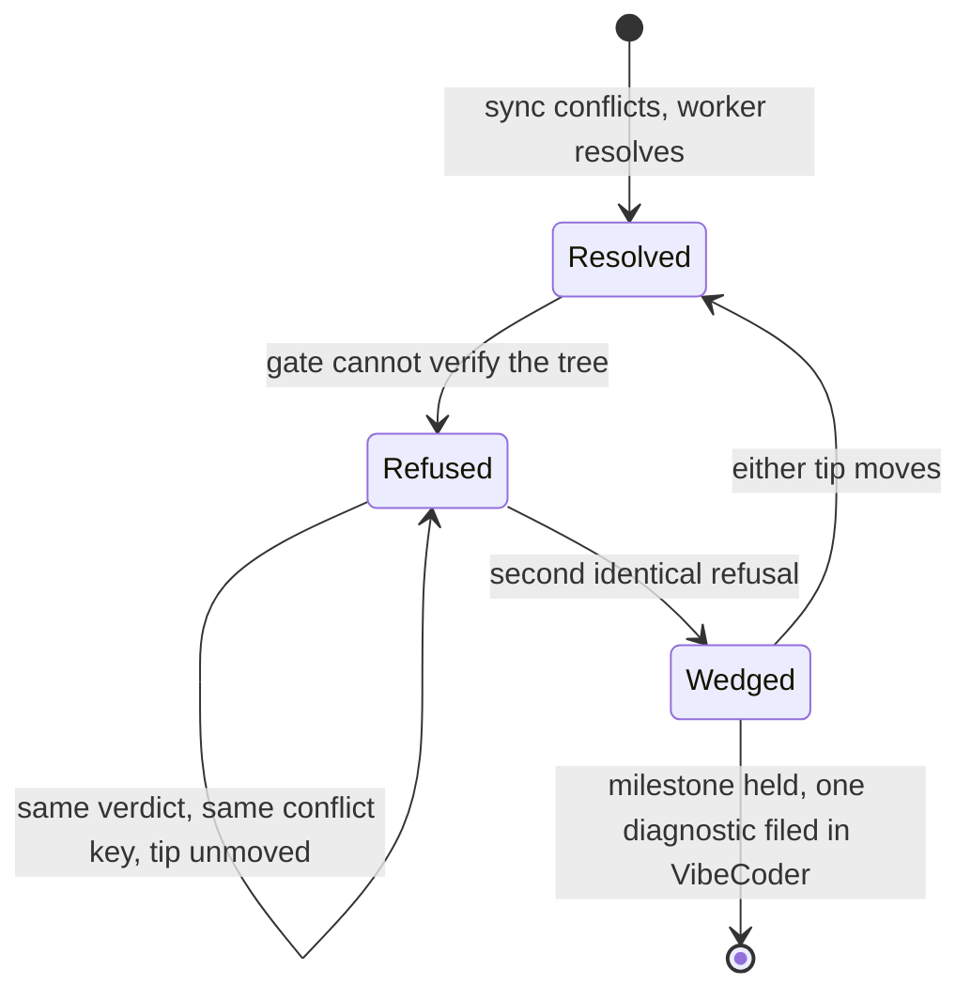

# A gate refusal that cannot change now concludes

Closes #2388.

One host walked all 15 open issues of one milestone once per hourly run —
claim, ~15 s, release — roughly 150 times in a day, with no PR, no failure
label and no fixes. Every cycle rebuilt the same auto-resolved merge, the
resolution gate refused it with the same verdict, the refusal was filed as
`not-charged` so the two-attempt budget never spent, and the reason survived
only in the *first* release comment on each issue.

## What changed

- **`milestone_sync_streak.ts`** — the conflict ledger gains a
  `gateRefusal` record (conflict key, verdict, both tips, count, reported
  flag). Two identical refusals from an unmoved default tip is a wedge
  (`GATE_REFUSAL_WEDGE_THRESHOLD = 2`); an unreadable tip counts as
  *unmoved*, so an unknown never unwedges the branch by accident.
- **`milestone_presync.ts`** — a wedged branch is not rebuilt: the milestone
  is paced until `gateWedgeTipsMoved` says one side moved, and the ledger is
  cleared when it does. Adds `resetMilestoneArmSyncMemo()` for tests.
- **`phases/setup_branch_phase.ts`** — the issue-run path now goes through
  `presyncMilestoneOnceForArming`, so a milestone gets **one** sync attempt
  per run rather than one per issue. That alone is the ~150× amplification.
- **`milestone_gate_wedge.ts`** (new) — an exhausted automatic route files one
  `bug` diagnostic in `stSoftwareAU/VibeCoder` naming the repository,
  milestone, gate verdict and refusal count, deduped on title and
  author-verified; a repeat appends a comment. The *gate* is what failed, so
  it is reported where the gate is fixed.
- **`milestone_branch_sync.ts` / `milestone_conflict_triage.ts`** — the old
  "needs a human" escalation onto an arbitrary sibling issue is gone. A
  conflict is the worker's to resolve end to end, never a human's.
- **`heartbeat_storage.ts`** — a collapsed release comment now repeats the
  current one-line reason instead of pointing "above", so the newest comment
  on an issue says why it was dropped.

Expected item 1 of the issue — verify with what the repository has, running
`./quality.sh` as the unit suite when there is no `test:unit`/`test` task and
no Cargo workspace — arrived earlier in merged PR #2394 (`fd46a1df`), together
with the three mandated cases in `milestone_resolution_gate_test.ts`. This PR
delivers items 2–4.

## Tests

- `milestone_gate_wedge_test.ts` (new, 18 tests) — ledger, pacing, presync and
  diagnostic, including the issue-mandated composition case: the same gate
  refusal on the same conflict key across three issues of one milestone in one
  run produces **one** sync attempt, not three.
- `heartbeat_release_collapse_test.ts` — the second and later release comments
  carry the current reason.
- `milestone_branch_sync_test.ts` — no `issue comment` on the monitored repo;
  exactly one `issue create` against `GATE_WEDGE_DIAGNOSTIC_REPO`.
- `milestone_resolution_gate_test.ts` — the five `(Issue #2388)` cases from
  PR #2394 still pass: `quality.sh` runs and its exit decides, no
  `quality.sh` ⇒ `skipped`, a `test` task wins and `quality.sh` is not also
  run.

## Pre-PR security self-check

- Input validation — refusal records are the worker's own ledger state; the
  gate verdict is fenced, never interpolated into a command.
- Secrets — nothing hidden or credential-shaped staged.
- Injection surface — every GitHub write goes through the guarded `gh` argv
  runner; no shell string building.
- Output encoding — the diagnostic body is Markdown through the `gh` spawn
  chokepoint, which masks secrets (`redactGhBodyArgs`).
- Error handling — a failed dedup search fails **open** (a duplicate is noise,
  a suppressed diagnostic leaves the gate unfixed); a failed write is logged
  `WARNING` and returns `false` so the next cycle retries.

<!-- vibe-spec-review inputs="diff+issue-body" -->
## Acceptance Criteria

- criterion: A tree with no unit-suite task and no Cargo workspace but a `quality.sh` runs it as the unit suite inside the same gate budget; `skipped` stays for a tree with nothing to run.
  reviewer: met

- criterion: A refusal that cannot change is concluded — the same gate verdict on the same conflict key is treated as a wedge, attempted once per milestone per run (not per issue), and the milestone's issues stop being claimed until either tip moves.
  reviewer: met

- criterion: No "needs a human" for a conflict — an exhausted automatic route files one worker diagnostic in VibeCoder naming repository, milestone, gate verdict and count, instead of a needs-human comment on a sibling issue.
  reviewer: met

- criterion: The latest release comment says why — the collapsed/superseded release pointer repeats the current one-line reason instead of only pointing "above".
  reviewer: met

- criterion: `milestone_resolution_gate_test.ts` covers deno.json with no test task + `quality.sh` ⇒ script runs and its exit decides; no `quality.sh` ⇒ `skipped`; a `test` task ⇒ task runs and `quality.sh` is not also run.
  reviewer: met

- criterion: Composition test — the same gate refusal on the same conflict key across three issues of one milestone in one run produces one sync attempt, not three.
  reviewer: met

- criterion: Release-rendering test — the second and later release comments carry the current reason.
  reviewer: met

<!-- vibe-standards-review inputs="diff+CODING-STANDARDS.md" -->
## Standards Review

- standard: Australian English spelling in code, comments and docs
  reviewer: met

- standard: KISS — simplest thing that works, no speculative machinery
  reviewer: met

- standard: DRY — no duplicated logic
  reviewer: met

- standard: Boy Scout Rule — leave the code cleaner than you found it
  reviewer: met

- standard: Smaller, focused files
  reviewer: met

- standard: Never Fail Silently — errors surface, no silent fallback sold as success
  reviewer: met

- standard: Log Levels — INFO/WARNING/ERROR used for what each means
  reviewer: met

- standard: TDD — real function calls and assertions, no source-text grepping, happy + error + edge paths
  reviewer: met

- standard: No wall-clock sleeps or absolute timing thresholds in tests
  reviewer: met

- standard: Unit tests are parallel-safe (no process-wide or module-singleton bleed)
  reviewer: met
  reason: the module-level arming memo is reset at the top of every test that touches it in all three consumer files, so no value crosses a test boundary.

- standard: Deno TypeScript for new logic; no Node regression
  reviewer: met

- standard: Secure coding — refs validated, gh argv guarded, no shell interpolation
  reviewer: met

- standard: Secret Redaction — every outbound sink routes through redactSecrets()
  reviewer: met
  reason: the new issue body reaches GitHub through the `gh` spawn chokepoint (`redactGhBodyArgs`/`redactGhBodyText` in lib/gh_spawn.ts), which is where the standard puts the mask; hand-wrapping is not required.

- standard: Commit Safety — no hidden or secret files staged
  reviewer: met

- standard: A Code Change Owes a Docs Change
  reviewer: met

- standard: Quality Gates — `deno fmt`, `deno lint`, `deno check` and the manifest checks pass
  reviewer: missing
  reason: `deno fmt --check` fails on worker/deno/tests/milestone_gate_wedge_test.ts (the `presyncMilestoneBranch({...}, deps({...}))` call at lines 293-306 and again near 323 is misformatted) and `deno task check:manifests` fails — "worker/deno/lib/milestone_gate_wedge.ts" is claimed by no sweep slice in docs/audits/lib-sweep-coverage.json (`deno check` and `deno lint` on the changed files both pass, and the touched suites run 32 passed / 0 failed).

- standard: Commit Messages reference the issue number and carry a Vibe-Coder-Run-Id trailer
  reviewer: partial
  reason: both commits on the branch carry `Vibe-Coder-Run-Id: vibe-mu83t1yk-397689` but are titled "WIP checkpoint: periodic agent progress snapshot (Issue #4170)" — they cite #4170, not the #2388 work they contain.

- standard: PR Summary and Evidence — docs/archive/pr-summaries/pr-summary-{issue}.md
  reviewer: missing
  reason: docs/archive/pr-summaries/pr-summary-2388.md does not exist in the branch.

- standard: Scope discipline — only files related to the issue
  reviewer: partial
  reason: worker/deno/lib/heartbeat_storage.ts and tests/heartbeat_release_collapse_test.ts add a release-reason line to the superseded heartbeat body — a separate subsystem from the gate-wedge fix, labelled "(Issue #2388)" but not required by it.

### Notes on the non-`met` standards

Verdicts above are recorded exactly as the reviewers returned them. For the
record, all three were addressed after the review ran:

- **Quality Gates** — both test files were reformatted with `deno fmt`, and
  `worker/deno/lib/milestone_gate_wedge.ts` is now claimed by the milestone
  slice of `docs/audits/lib-sweep-coverage.json`.
- **Commit Messages** — the two `(Issue #4170)`-titled WIP checkpoints were
  replaced with a single commit naming #2388 and carrying this run's
  `Vibe-Coder-Run-Id`.
- **PR Summary** — this file.
- **Scope discipline** — the `heartbeat_storage.ts` change *is* Expected item 4
  of the issue ("The latest release says why"), not adjacent work; the reviewer
  saw the heartbeat subsystem without the issue's fourth criterion in hand.

## Evidence

Backend-only change — no visual surface, so no screenshots. The behaviour is
evidenced by the test suites listed above.

## Deno regression avoided

All new logic is Deno TypeScript run through `deno test`/`deno task`; no Node
tooling, dependency or workflow step was introduced.
