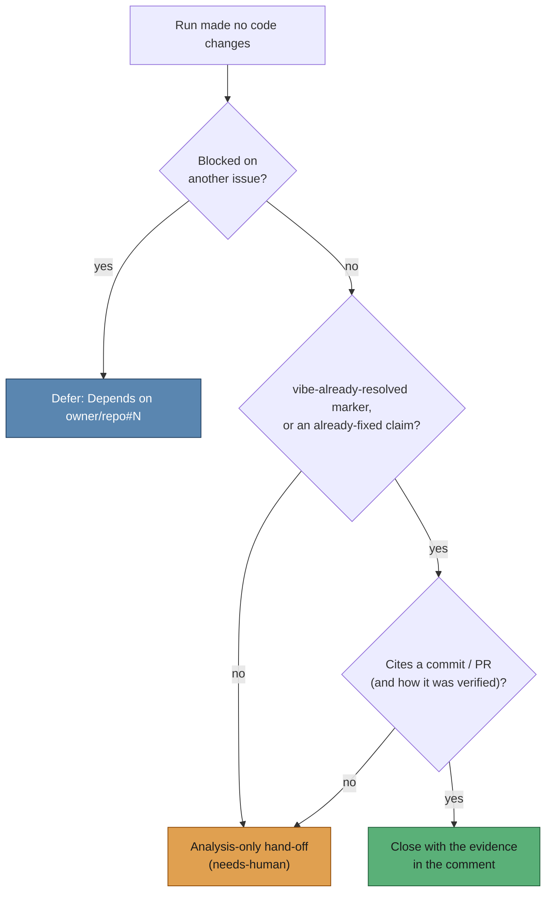

## Summary

A `work-on` run that verifies an issue is already fixed now ends with the issue
**closed with the evidence recorded**, instead of a "Partial Answer" and a
`needs-human` escalation. Closes #241.

The failure this fixes is NEAT-AI-Backpropagation#96: the agent verified the fix
(commit `4c6f932`, PR #97, test re-run) and said so, but the #519 keyword list in
`handle_no_changes_phase.ts` did not contain the phrasing it used ("was resolved
on `Develop` by commit …", "no code change was required"), so the run fell
through to the analysis-only hand-off.

What changed:

- **New `worker/deno/lib/already_resolved_outcome.ts`** — deterministic
  detection, following the `blocked_outcome.ts` / `cross_repo_pr_handoff.ts`
  pattern. Primary signal is the structured marker
  `<!-- vibe-already-resolved commit="…" pr="…" verified="…" -->`; a broadened
  keyword list stays as a fallback for older prompt versions.
- **Evidence is required to close.** A commit and/or PR reference, plus (on the
  marker path) how the fix was verified. Without it the detection returns
  `unverified` and the run falls back to the existing analysis-only
  `needs-human` hand-off. This deliberately tightens the #519 keyword path,
  which closed on a plain "already fixed" claim, and is what keeps the change
  clear of #174: a PR that merely *references* the issue is not a reason to
  close it — the agent must verify the code and cite what it checked. A
  reference to the issue's own number is discarded as self-evidence.
- **`handle_no_changes_phase.ts`** now closes via that detection and records the
  evidence in the close comment, so the closure is auditable from the issue
  alone. The blocked-outcome deferral (#222) stays ahead of it — a blocked run
  is deferred, never closed, even if it carries a marker.
- **`prompts/issue/v35.md`** — new immutable prompt version instructing the
  agent to emit the marker with its evidence when it verifies the issue is
  already fixed.
- Untrusted marker fields are flattened (control characters, HTML-comment
  breakout) and length-capped before they reach a world-readable comment; the
  existing secret redaction of the published output tail is unchanged.

## Evidence

Backend/CLI change — no web interface to screenshot. Verified by the unit tests
below (`deno test` — 21 new detection tests, 4 new phase tests, all passing) and
by the full `./quality.sh` gate.

Ten tests fail in this container **before and after** this change, so they are
environmental, not a regression: `setup_workdir_reminder_test.ts` (7),
`fleet_health_test.ts:914`, `host_workdir_guard_test.ts:288` and
`optional_feature_env_test.ts:57`. They assert on the host `WORK_DIR` / `HOME`
layout, and this container's `/home/vibe/auto-issue-work` already holds real
clones. Confirmed by running the same four files in a `git worktree` at the
parent commit: `FAILED | 63 passed | 10 failed`, the same ten.

## Test Plan

New — `worker/deno/tests/already_resolved_outcome_test.ts`:

- Marker with commit + PR + verification resolves; marker alone (no prose
  keyword) resolves; a PR URL is accepted.
- Marker missing evidence, missing the verification note, citing the issue
  itself, or carrying a non-hex commit → `unverified`.
- Marker fields are flattened; a field containing `-->` truncates the
  declaration rather than smuggling markup into the comment.
- Keyword fallback: the exact NEAT-AI-Backpropagation#96 wording resolves with
  the commit and PR extracted; "no code change was required" and the #519
  phrasings resolve when evidence is cited.
- Unevidenced claim, self-referencing claim, a SHA-shaped token off a commit
  line, and an all-digit token → `unverified`; output making no claim → `none`.
- Evidence renders as auditable markdown bullets.

New — `worker/deno/tests/handle_no_changes_phase_test.ts`:

- The marker closes the issue with commit, PR and verification in the close
  comment, and does not apply `needs-human`.
- The NEAT#96 narrative (no marker) closes and posts no "Partial Answer" —
  the regression test for the reported failure.
- An unevidenced already-fixed claim hands off to `needs-human` and does **not**
  close.
- A marker inside a blocked run is still deferred, not closed.

Modified (behaviour change, documented): four existing already-complete tests in
`handle_no_changes_phase_test.ts` now cite a commit or PR in their fixture
output, because the close path requires evidence. What each asserts —
close-beats-suppression, secret redaction, run-stats posting — is unchanged.
