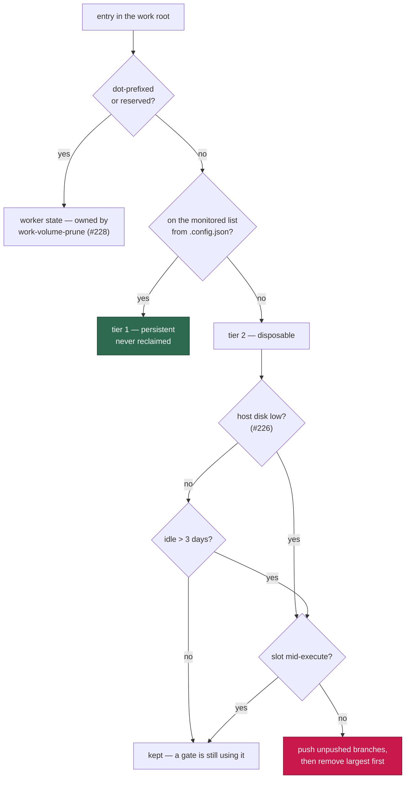

# Tier the work volume — monitored repos persist, side/data clones are disposable

## Summary

The `vibe-work` volume was treated as one undifferentiated pile. On GRQ-23 it
held 43 directories, and the big ones were **not** monitored repos: sibling
**data** repos a monitored repo's gate clones as `../<name>`
(`GRQ-shareprices2026Q2` 7.3 GB, `GRQ-listing` 3.9 GB, `GRQ-companyreports`
2.1 GB, …) — ~15 GB the worker is not responsible for, removed only after 7
idle days by the stale-workdir scanner and never tied to the host's disk.

The work root now has two tiers, driven by the monitored list the worker
already has:

- **Tier 1 — monitored repos.** Persistent; never removed by either path
  here, so a large clone is not re-downloaded every cycle. Their build output
  stays bounded by `work-volume-prune` (Issue #228).
- **Tier 2 — everything else.** Disposable: aged out by the new
  `work-volume-tiers` housekeeping step after
  `WORK_VOLUME_SIDE_REPO_MAX_AGE_DAYS` idle days (default 3), and removed
  **largest first** the moment the host-disk monitor (Issue #226) reports
  `low` — the reclaim action the gate now runs *before* it stops claiming, so
  a host merely short of room heals itself instead of idling for a cycle.

Protections: nothing goes while a slot is mid-execute (a gate may be reading
the clone right now); unpushed commits are rescued first with the existing
`pushUnpushedBranches` and the directory is kept when that fails; `.git`-less
and unreadable directories go without a rescue because they have no commits
to save. An empty monitored list fails loud rather than treating every clone
as disposable.

**Re-fetch on demand — verified, not assumed.** GRQ's
`worker/model_fetch.sh` clones the sibling when the directory is absent
(`if [[ ! -d "${REPO}" ]]` → `git_clone_safe`, `worker/model_fetch.sh:690`)
and fetches/resets when it is present, so removal costs one clone, not a
failed gate. No worker-side re-clone shim was needed.

Closes #242.

## Evidence

This is a backend/CLI change with no web interface to screenshot; the
evidence is the test suite and the repository quality gate.



Both paths log the split before anything goes:

```text
work volume: monitored 2.1 GB in 15 repos; side/data 15.2 GB in 8 dirs; removed 2 (11.0 GB, disk-low)
work volume: removed disposable GRQ-listing (4.0 GB, 9.0 days idle, disk-low)
```

`./quality.sh` result: **15304 passed, 10 failed** — all ten failures are
pre-existing and environment-dependent (`setup_workdir_reminder_test.ts`,
`fleet_health_test.ts`, `host_workdir_guard_test.ts`,
`optional_feature_env_test.ts`); they fail identically on a stashed, clean
tree in this container. Every other gate (lint, type check, fmt, mermaid,
markdownlint, the security chokepoints) passed.

## Test Plan

New — `worker/deno/tests/work_volume_tiers_test.ts` (15 tests):

- `classifyWorkRootEntry` is a pure function of (directory name, monitored
  list): monitored clones, sibling data repos, dot-prefixed state, reserved
  names, and an empty list making nothing monitored.
- `scanWorkRootTiers` measures and ages each tier, and a `git fetch` that
  only touched `.git/FETCH_HEAD` keeps a data repo warm.
- `selectAgedOutDirs` / `selectLargestFirst`: the age cut (plus `.git`-less
  and unreadable dirs), the fewest removals that free the space, and tier 1
  never selected by either.
- `reclaimWorkVolumeTiers`: disk-low removes largest first and keeps
  monitored repos; age mode drops idle side repos and keeps warm ones; a slot
  mid-execute holds every removal back; a failed push rescue keeps the
  directory while a `.git`-less one still goes; a removal failure is recorded,
  never thrown.
- `anySlotMidExecute`: a fresh heartbeat is live, a stale one is not, and an
  unreadable work root fails safe.

New — `worker/deno/tests/work_volume_tiers_command_test.ts` (6 tests): the
monitored list resolves from the loaded config, age mode keeps tier 1,
`--mode disk-low` requires `--bytes-needed`, invalid mode/knobs and a missing
work dir are refused, and an empty monitored list fails loud removing nothing.

Extended:

- `worker/deno/tests/run_core_slot_pool_test.ts` — the reclaim runs before the
  cycle stops claiming and a healed host keeps claiming; a reclaim that frees
  nothing still stops the cycle; a reclaim that throws is loud and the gate
  still holds.
- `worker/deno/tests/host_disk_test.ts` — `shortfallBytes` sizes the reclaim,
  and a forced check re-reads inside the sample cadence.
- `worker/deno/tests/run_housekeeping_test.ts` — `work-volume-tiers` runs
  directly after `work-volume-prune` with the default 3-day window and honours
  `WORK_VOLUME_SIDE_REPO_MAX_AGE_DAYS`.
- `worker/deno/tests/mod_test.ts` — the new command is registered (138 → 139).

Docs: `docs/CONTAINER.md` gains a "The work volume has two tiers" section with
the classification diagram, the protections, and the env knob.
