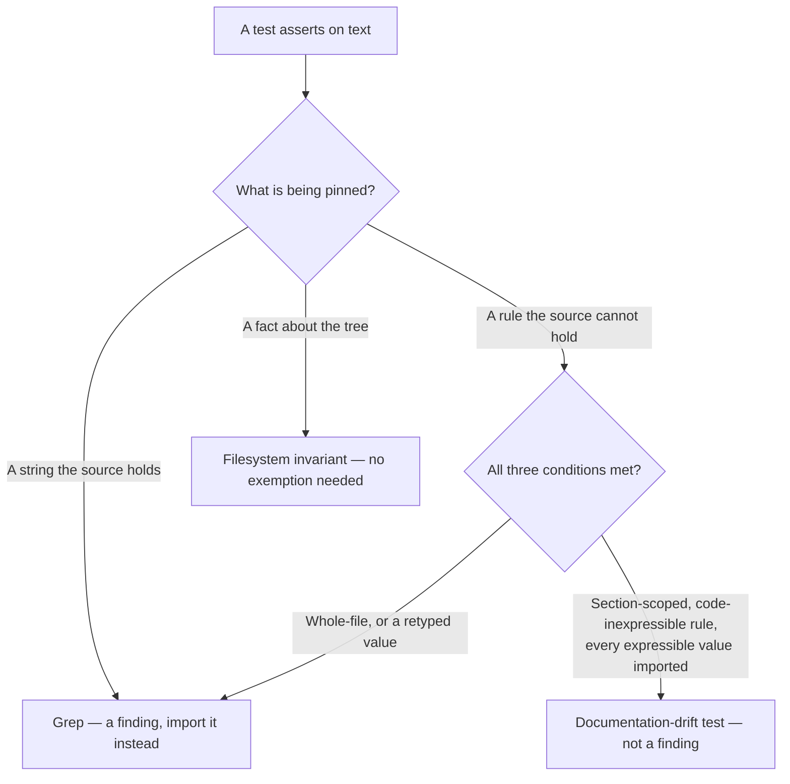

# Carve documentation-drift tests out of the grep-as-assertion ban

## Summary

Closes #2429

`CODING-STANDARDS.md` rule 5 banned tests that "check documentation for
keywords" and called them "not real tests". The tree ships 22
`worker/deno/tests/*_docs_test.ts` suites that are exactly that, and CI depends
on them — they are the only guard on a documented rule, switch name or rendered
line drifting away from the code that produces it. So every new trial or
protocol page re-litigated the question and every new suite argued its own
exemption in a file header, most recently `rtk_output_trial_docs_test.ts`
(#2387), where a standards review recorded the violation as standing.

This takes option (a) from the issue: decide the house position once and write
it down, rather than delete the suites.

The rule, stated identically on both surfaces that disagreed:

> a rule the source cannot hold is documentation drift; a string the source does
> hold is a grep.

**`CODING-STANDARDS.md`** — rule 5 keeps banning source greps and now points at
a new `### Documentation-drift tests` subsection, which grants the exemption
against three conditions:

1. **Section-scoped** — read with `readRepoDoc`, narrowed with `section` from
   `worker/deno/tests/support/markdown_docs.ts`, which masks fenced code and
   throws on a renamed heading. A whole-file `includes` still passes on a page
   that moved the rule into an unrelated section.
2. **What it pins is a rule the code cannot express** — a promise about
   behaviour no module holds as a value, so prose is the only place it exists.
3. **Every value the code can express is imported from the live module** —
   status names, rendered lines, config keys, markers, defaults. A retyped
   constant stays green while the page and the test agree with each other and
   the code has moved on.

`bucket_docs_test.ts`, the example the issue cites, is named as the different
species it is: a filesystem-derived invariant, needing no exemption.

**`prompts/test_audit/prompt.md` check 2** — the auditor stopped saying "Flag
every grep-as-assertion you find"; it flags every grep-as-assertion *over source
code*, and a new paragraph exempts the documentation-drift shape while naming
the two ways it degenerates back into a finding (whole-file assertion, or a
retyped value the code does express). Its body describes the shape rather than
citing `support/markdown_docs.ts`, because `test_audit` is filed into other
repositories and its body may not carry a VibeCoder-internal path.



### Scope

`prompts/coding_guidelines/prompt.md` is deliberately untouched. Its
corresponding bullets are scoped to *source files*, so they never banned the
documentation shape and need no carve-out; `coding_guidelines_twin_drift_test.ts`
case 2 additionally asserts that file carries no TDD wording, so adding one
there would break a sibling pin for no gain.

## Evidence

A documentation and test change with no web UI surface — there is nothing to
render, so no screenshots were captured. The evidence is the test cycle.

`worker/deno/tests/documentation_drift_policy_test.ts` was written first and
failed 4 of its 5 cases against the unamended prose (neither surface stated the
rule; rule 5 still contained "check documentation for keywords"; the carve-out
section did not exist; `test_audit` still read "Flag every grep-as-assertion you
find."). After the two prose edits:

```text
deno test -A tests/documentation_drift_policy_test.ts
ok | 5 passed | 0 failed (88ms)
```

Regression sweep over the suites that pin the two edited surfaces:

```text
tests/coding_guidelines_twin_drift_test.ts
tests/coding_standards_model_agnostic_test.ts
tests/test_category_definitions_test.ts
tests/best_practices_test_classification_test.ts
tests/timing_assertion_policy_test.ts
tests/hidden_allowlist_drift_test.ts
ok | 67 passed | 0 failed (283ms)

tests/test_audit_unit_suite_checks_943_test.ts
tests/test_audit_prompt_v12_test.ts
tests/test_audit_template_test.ts
tests/idle_task_cross_repo_body_refs_test.ts
tests/prompt_manager_test.ts
tests/idle_task_body_preview_limit_test.ts
ok | 93 passed | 0 failed (1s)
```

`deno fmt` and `deno lint` both report `Checked 1 file` on the new suite.

## Test Plan

The new suite calls real functions — `loadPrompt` from `lib/prompt_manager.ts`
and `readRepoDoc` / `section` / `flat` from `tests/support/markdown_docs.ts` —
and asserts on what they return. It dogfoods the rule it states: every assertion
is narrowed with `section()` rather than run over a whole file.

1. **Both surfaces state the same rule** — the collapsed `test_audit` prompt and
   the flattened `## Test-Driven Development (TDD)` section each match
   `/a rule the source cannot hold is documentation drift/i`. Fails if either
   surface drops the sentence and they start disagreeing again.
2. **The standards carve the pattern out instead of banning it** — the numbered
   rules no longer contain "check documentation for keywords" but still contain
   "grep source files for patterns" (so the carve-out did not widen into
   permission for source greps), and the `Documentation-drift tests` section
   states all three conditions and names `bucket_docs_test.ts`.
3. **The auditor exempts the pattern it still flags in source** — the prompt
   still mentions `grep-as-assertion`, now says documentation-drift tests are
   not a finding, no longer contains the unconditional "Flag every
   grep-as-assertion you find.", and does not cite the internal helper path
   (the cross-repo body guard).
4. **The pattern the carve-out protects is real** — walks `worker/deno/tests`
   and fails if no `*_docs_test.ts` suite remains, or if no test imports the
   helper the carve-out names. The exemption cannot outlive what it exempts.
5. **The scoping helper does the scoping** — condition 1 is only worth stating
   while `section()` really narrows, so this feeds it a fixture and asserts it
   keeps text after a fenced `# comment`, stops at the next real heading,
   excludes the neighbouring sections, and throws on a renamed heading.

Run locally from `worker/deno`:

```bash
deno test -A tests/documentation_drift_policy_test.ts < /dev/null
```

## Security Self-Check

- No new input surfaces, endpoints or dependencies; the change is prose in two
  documents plus one test that reads files already in the repository.
- Nothing staged is hidden or secret-bearing — three tracked files plus this
  summary.
