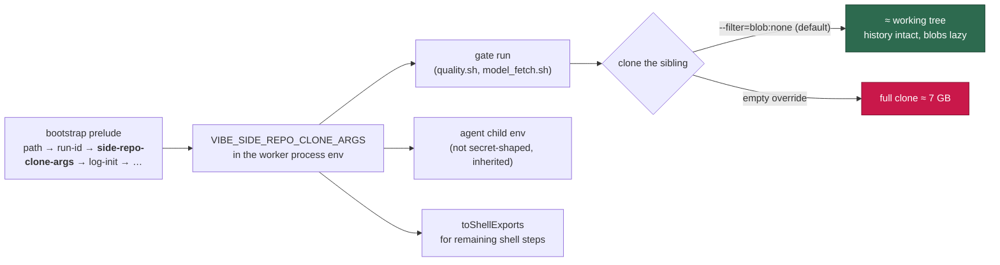

# Side/data repo clones are blobless: `VIBE_SIDE_REPO_CLONE_ARGS`

## Summary

The work-volume tiering (Issue #242) removes idle sibling data repos and drops
them largest-first when the host disk is low. That reclaim was a bandwidth tax:
`GRQ-shareprices2026Q2` is 7.3 GB with an 832 MB `.git` of daily data commits,
so every reclaim bought disk back at the price of a full re-download on the
next gate run — on every fleet host.

The worker now resolves and exports **`VIBE_SIDE_REPO_CLONE_ARGS`** (default
`--filter=blob:none`) in the bootstrap prelude, so every gate and agent it
spawns inherits it, and a monitored repo's script adopts it with
`git clone ${VIBE_SIDE_REPO_CLONE_ARGS:-} …`. A blobless partial clone keeps
the whole commit history — `git log`, `git blame` and pulls all behave — and
fetches blobs lazily, so a data repo checked out at one revision costs roughly
its working tree instead of every blob ever committed. A `--depth` shallow
clone is smaller still but breaks history-based tooling, which is why blobless
is the default.

Three boundaries hold:

- **An operator override wins verbatim**, including an empty value — the
  documented way back to a full clone.
- **An override is validated, never mangled.** The value is word-split
  unquoted by adopting shell scripts, so a token that is not a plain
  `git clone` option (shell metacharacters, a bare word) is refused loudly in
  `run_core.log` and the blobless default stands.
- **New clones only.** A partial clone already on disk is left exactly as it
  is; nothing re-clones a checkout to shrink it, because that would cost the
  very download the filter exists to avoid.

The companion one-line change in GRQ — the repo that pulls in all of the large
siblings — rides its own PR (branch
`fix/side-repo-blobless-clone-args-vibecoder-243`): both clone paths in
`worker/model_fetch.sh` / `worker/shared/model_fetch_promisor_reclone.sh` now
honour the variable and fall back to the existing
`MODEL_FETCH_USE_PARTIAL_CLONE` flag when it is unset.

Closes #243.

## Evidence

Backend/CLI change — no web interface to screenshot. The evidence is the test
runs below plus the resolved behaviour.



GRQ's own regression suite, run against the companion branch (the fleet
override reaches the real `git clone` argv through a PATH-shimmed `git`):

```text
=== Fleet override (VibeCoder #243): VIBE_SIDE_REPO_CLONE_ARGS wins ===
  PASS: Fleet override applies the filter despite the local opt-out
  PASS: Fleet override keeps GRQ's --depth 1
  PASS: An empty fleet override opts out of the filter verbatim
  PASS: An empty fleet override still clones --depth 1

Passed: 17
Failed: 0
```

## Test Plan

New — `worker/deno/tests/side_repo_clone_args_test.ts`:

- unset yields the blobless default `--filter=blob:none`;
- an operator override wins verbatim;
- an empty override is honoured as "no arguments" (full clone);
- an override carrying shell metacharacters, or a bare word, is refused and the
  default stands, with the reason reported;
- `sideRepoCloneArgList` splits the resolved value into argv tokens for the
  worker's own clones;
- the variable survives `buildAgentChildEnv` — the agent/gate runs are what
  have to receive it.

Extended — `worker/deno/tests/run_bootstrap_test.ts`:

- the prelude establishes the blobless default in-process;
- an operator override reaches the process environment verbatim;
- an unsafe override is refused with a `run_core.log` line and the default
  stands;
- `toShellExports` renders the variable for the remaining shell steps.

Existing `BootstrapEnv` fixtures in `run_worker_test.ts`, `run_mode_test.ts`
and `run_entrypoint_test.ts` were extended with the new field (no test removed
or disabled).

Cross-repo — `worker/shared/test_model_fetch_partial_clone.sh` (GRQ) gains two
behavioural cases, shown above; `test_model_fetch_promisor_reclone.sh` still
passes 22/22 against the changed re-clone helper.

### Quality gate

`./quality.sh` passes every check except `deno tests`, which reports 10
failures in `fleet_health_test.ts`, `host_workdir_guard_test.ts`,
`optional_feature_env_test.ts` and `setup_workdir_reminder_test.ts`. Those are
environmental and unrelated to this change — the run happens inside the worker
container, where `FLEET_HEALTH_REPO`, `WORK_DIR` and
`VIBE_IMAGE_AGENT_PROVIDERS` are set in the ambient environment and those tests
assert the unset-host defaults:

```text
$ env -u FLEET_HEALTH_REPO -u WORK_DIR -u VIBE_IMAGE_AGENT_PROVIDERS \
    deno test --allow-all tests/fleet_health_test.ts \
    tests/optional_feature_env_test.ts tests/setup_workdir_reminder_test.ts \
    tests/host_workdir_guard_test.ts
ok | 73 passed | 0 failed (1s)
```

No file in this change is imported by any of them.
