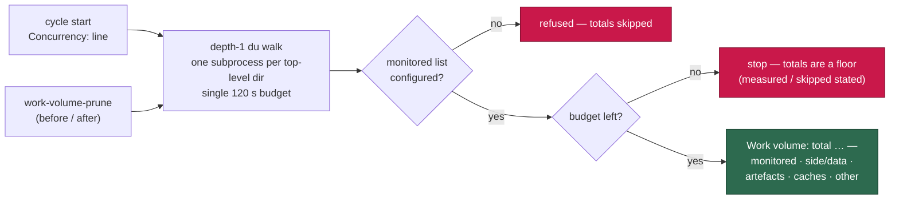

# Log the work volume's standing totals by category at cycle start

## Summary

Every disk problem on GRQ-23 was invisible until the host hit 95 %: the only
per-launch signal was the launcher's `container-store:` line, `work-volume-prune`
(#228) logs what it *removed*, `work-volume-tiers` (#242) logs the split only
when it runs, and the host-disk monitor (#226) reports free space — not where it
went. The worker log said nothing about what the volume still held.

A new `worker/deno/lib/work_volume_usage.ts` measures what **remains** and
formats it as one line, logged at cycle start beside the `Concurrency:` line and
again in `work-volume-prune`'s housekeeping summary:

```text
Work volume: total 18.4 GB — monitored repos 2.1 GB (15) · side/data clones 15.2 GB (8: GRQ-shareprices2026Q2 7.3, GRQ-listing 3.9, GRQ-companyreports 2.1, …) · build artefacts 5.1 GB (4 target dirs: GRQ-23/target 3.1, VibeCoder/target 2.0, …) · caches 0.6 GB · other 0.2 GB
```

- **Categoriser** — a pure function of the entry name and the monitored list:
  monitored clone, side/data clone, worker cache (`.deno-cache`, `.vibe-cache`,
  `.gh-*-cache`, `.claude-*`), other (reserved names, remaining state
  directories, state files). Those four disjoint buckets sum to the total.
- **Build artefacts are a cross-cut, not a fifth bucket.** A `target/` dir (the
  same discovery #228 uses) lives *inside* a clone, so its bytes are already
  counted there; naming it says which clone the space is in.
- **Top 3 named inline** for side/data clones and artefact dirs, so the log line
  alone says where the space went.
- **Bounded** — depth-1 only: one `du -sk` per top-level directory under a
  single 120 s budget. Over budget the walk stops and the line reports how many
  directories it measured and skipped; the total is stated as a floor, never as
  a clean reading.
- **Fails loud** — a directory `du` cannot size is named as
  `unmeasured (counted as 0)` (the filesystem's root-only `lost+found` lands
  here, so a permanent permission denial never drowns out a real fault); a work
  root that cannot be read at all is reported as an error on the same line
  instead of as an empty volume. A throwing walk is logged via `logError` and
  never stops the cycle.
- **Refuses to guess** — with no monitored repositories configured every clone
  would read as side/data, so the split is declined with a stated reason
  (mirrors `work-volume-tiers`).
- `work-volume-prune` prints the breakdown **before** its sweep and again
  **after** when it actually removed something, so a reclamation's before/after
  is visible; an idle prune pays for one walk, not two.

Closes #244.

## Evidence

Backend/CLI change — no web interface to screenshot. Evidence is the real
formatted line and the test suite.

Run against this container's own work root
(`worker/deno/lib/work_volume_usage.ts` via `reportWorkVolumeUsage`, monitored
list `stSoftwareAU/VibeCoder`):

```text
Work volume: total 0.0 GB — monitored repos 0.0 GB (1) · side/data clones 0.0 GB (12: audit 0.0, GRQ 0.0, GRQ-health 0.0, …) · build artefacts 0.0 GB (3 target dirs: NEAT-AI-Backpropagation/target 0.0, NEAT-AI-Forests/target 0.0, NEAT-AI-scorer/target 0.0) · caches 0.0 GB · other 0.0 GB — unmeasured (counted as 0): lost+found
```

That run is what drove the second commit: `lost+found` is root-only on every
host, so reporting it as an `error` would have put a permanent false alarm on
every line.



Suite results (`deno test`, 22 new tests):

```text
tests/work_volume_usage_test.ts            ok | 15 passed | 0 failed
tests/work_volume_prune_command_test.ts    ok |  4 passed | 0 failed
tests/run_core_work_volume_usage_test.ts   ok |  4 passed | 0 failed
```

`./quality.sh` passes every gate except `deno tests`, which reports 10 failures
in `fleet_health_test.ts`, `host_workdir_guard_test.ts`,
`optional_feature_env_test.ts` and `setup_workdir_reminder_test.ts`. Those are
**pre-existing and unrelated** — confirmed by re-running them with this branch's
changes stashed (`git stash`), where they fail identically. Nothing this PR
touches is involved.

## Test Plan

New — `worker/deno/tests/work_volume_usage_test.ts` (15):

- `categoriseWorkVolumeEntry` — monitored clones win over every other rule;
  anything else that is a clone is side/data; each worker cache pattern
  (`.deno-cache`, `.vibe-cache`, `.gh-*-cache`, `.claude-*`) buckets as a cache
  while `.gh-cache` does not; reserved names, other state and the empty name are
  `other`; an `owner/repo` monitored entry matches its clone directory.
- `scanWorkVolumeUsage` — totals every category and the four disjoint buckets
  sum to the total; artefacts are named per clone and not double-counted; a
  directory `du` cannot size is named rather than silently zeroed as clean; an
  unreadable work root reports an error instead of an empty volume; the walk
  stops at the budget and states measured/skipped counts (injected clock).
- `formatWorkVolumeUsage` — the exact one-line format with the top offenders and
  the `…` overflow marker; an empty volume with a caller-supplied label; a single
  artefact dir without a plural or an ellipsis.
- `reportWorkVolumeUsage` — refuses to publish a split with no monitored list;
  scans and formats with one.

New — `worker/deno/tests/work_volume_prune_command_test.ts` (4): an idle run
reports the standing totals once with no "after" line; a reclamation reports both
before and after (and the after line no longer names the removed target); no
monitored repositories refuses the split; an invalid knob is still rejected
before anything is measured.

New — `worker/deno/tests/run_core_work_volume_usage_test.ts` (4): the line is
logged immediately after the `Concurrency:` line and the walk runs once; a
throwing walk is logged loud via `logError` and the loop still reaches planned
shutdown; omitting the optional hook is a no-op; the production deps wire the
hook to the real work root.

Changed:

- `worker/deno/lib/run_core.ts` — optional `reportWorkVolumeUsage` dep, awaited
  and logged after the `Concurrency:` line.
- `worker/deno/lib/run_core_production_deps.ts` — wires it to the depth-1 walk
  with `config.repos`.
- `worker/deno/commands/work_volume_prune.ts` — before/after breakdown in the
  summary.
- `docs/CONTAINER.md` — new "Standing totals at cycle start" section with a
  Mermaid flow, beside the existing two-tier section.
