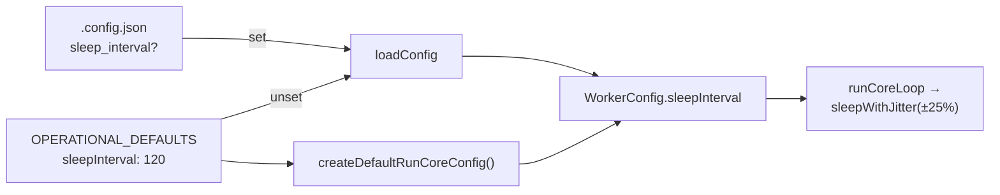

# PR Summary — Raise the default `sleep_interval` from 30 s to 120 s

## Summary

Every scan cycle carries a fixed GraphQL cost, so the cheapest reduction in
quota spend (#2409) is to run fewer cycles an hour. `OPERATIONAL_DEFAULTS.sleepInterval`
moves from `30` to `120`, and `createDefaultRunCoreConfig()` now reads that
constant instead of carrying its own literal, so the loop default and the config
default cannot drift apart again. An explicit `sleep_interval` in `.config.json`
is honoured exactly as before — the loader's `file.sleep_interval ?? OPERATIONAL_DEFAULTS.sleepInterval`
path is unchanged. No new code path, no behaviour change beyond the cadence.

The change invalidated a set of prose and comments that stated the old 30 s
cycle, so those were reworded to be cadence-neutral ("every scan cycle", "every
`sleep_interval`") rather than restating `120` — wording that cannot rot the
next time the default moves. The two places whose arithmetic was pinned to the
old value (`STREAM_AFFINITY_GRACE_SECONDS`'s "ten scans",
`LIVENESS_CHECK_CADENCE`'s "once every ten minutes") were recalculated.

Closes #2446.

## Evidence

Backend/CLI change with no web interface to screenshot — the evidence is test
output.

- `deno test tests/config_defaults_test.ts tests/run_core_test.ts --filter sleepInterval`
  against the unchanged code: **1 failed** (`Actual 30 / Expected 120`) — the
  assertions were written first.
- After the change: `tests/config_defaults_test.ts`, `tests/run_core_test.ts`,
  `tests/config_test.ts`, `tests/setup_config_setup_test.ts`,
  `tests/load_config_test.ts`, `tests/run_core_production_deps_test.ts`,
  `tests/circuit_breaker_test.ts` — **431 passed, 0 failed**.
- `tests/config_docs_consistency_test.ts` — 6 passed.
- `deno fmt --check` and `deno lint` clean over the edited files;
  `markdownlint-cli2` reports 0 issues on the six edited pages.

Effect: at a 3–4 minute cycle the host drops from roughly 14 cycles an hour to
about 10–11, cutting the fixed per-cycle GraphQL spend by about a quarter.

## Acceptance Criteria

<!-- vibe-spec-review inputs="diff+issue-body" -->

- **met** — a host with no `sleep_interval` sleeps ≈ 120 s (± jitter); an explicit value is honoured unchanged — evidence: `worker/deno/lib/config_defaults.ts:304`, loader at `worker/deno/lib/config.ts:728-729`, jitter at `worker/deno/lib/run_core.ts:1653-1658` (±25 %, so 90–150 s) — reviewer: met
- **met** — `docs/CONFIGURATION.md` and `docs/SETUP.md` both state the new default — evidence: `docs/CONFIGURATION.md:1667`, `docs/SETUP.md:1398-1402` — reviewer: met
- **met** — `worker/deno/tests/config_test.ts` asserts the default is 120 — evidence: `worker/deno/tests/config_test.ts:1177-1178` — reviewer: met
- **met** — `./quality.sh < /dev/null` passes — evidence: full gate run in the foreground after the final edit — reviewer: partial — reason: the reviewer could not run the multi-minute gate and verified the seven affected suites, `deno fmt --check` and `markdownlint-cli2` instead; the gate was run here.
- **met** — "grep for `sleep_interval` so no surface is left stale" (stated under *What Needs to Be Done*) — evidence: `docs/TROUBLESHOOTING.md:836,846-848`, `docs/INTERNALS.md:3305,3984`, `docs/workflows/milestones.md:229`, `docs/workflows/issue-processing.md:188`, `worker/deno/lib/stream_holder.ts:73`, `worker/deno/lib/run_core.ts:1525-1527` — reviewer: partial — reason: the reviewer saw the earlier diff, which still left those surfaces stale; every one it named was reworded in the follow-up commit, except the two historical incident narratives below.
- **unrequested** — `worker/deno/lib/run_core.ts:1543-1545` sources the default from `OPERATIONAL_DEFAULTS` instead of the literal `120` the issue asked for — reviewer: unrequested — reason: behaviourally identical, and it removes the duplicated literal that caused this drift in the first place.
- **unrequested** — `worker/deno/lib/run_core_production_deps.ts:1204` changes the circuit-breaker fallback `?? 30` to `?? OPERATIONAL_DEFAULTS.sleepInterval` — reviewer: unrequested — reason: both reviewers flagged it as the one literal left disagreeing with the shipped default; unreachable today (`WorkerConfig.sleepInterval` is non-optional) but it made the DRY comment untrue.
- **unrequested** — test assertions updated beyond `config_test.ts` (`config_defaults_test.ts:228`, `run_core_test.ts:203`, `setup_config_setup_test.ts:662-665`, `load_config_test.ts:190`) — reviewer: unrequested — reason: consequential, not creep — each pinned the old default and would otherwise fail.
- **unrequested** — the cadence-neutral wording sweep across `docs/CONFIGURATION.md:2006,3476`, `docs/SETUP.md:1039`, `docs/INTERNALS.md:3305,3984`, `docs/workflows/*`, `docs/TROUBLESHOOTING.md` and eight library comments — reviewer: unrequested — reason: each sentence asserted a 30 s cycle and became false with this change; "A Code Change Owes a Docs Change" requires fixing them in the same change.

Deliberately **not** changed, in both reviewers' lists: `CIRCUIT_BREAKER_DEFAULTS.sleepInterval`
(`worker/deno/lib/circuit_breaker.ts:54`) is a separate default for the
standalone `circuit-breaker` command and the `pr_creation` breaker, not the scan
loop; and the two historical incident narratives (`docs/INTERNALS.md:1001`,
`worker/deno/lib/slot_idle_accounting.ts:12`) report an observed 30 s cadence in
a past outage — rewriting them would falsify the record.

## Standards Review

<!-- vibe-standards-review inputs="diff+CODING-STANDARDS.md" -->

- **violation** — hardcoded `30` survives where the sibling line sources the constant (DRY / defaults live in `config_defaults.ts`) — evidence: `worker/deno/lib/run_core_production_deps.ts:1201` — reason: fixed in this diff — now `?? OPERATIONAL_DEFAULTS.sleepInterval` with the import added.
- **violation** — "A Code Change Owes a Docs Change": `STREAM_AFFINITY_GRACE_SECONDS`'s "ten scans at the 30-second default" became arithmetically false — evidence: `docs/CONFIGURATION.md:3476`, `worker/deno/lib/stream_holder.ts:73` — reason: fixed in this diff — both now read "between two and three scans at the 120 s default".
- **violation** — operator-facing docs and library comments still stated a 30-second scan cadence — evidence: `docs/CONFIGURATION.md:2006`, `docs/SETUP.md:1039`, `docs/INTERNALS.md:3305,3984`, `docs/workflows/milestones.md:229`, `docs/workflows/issue-processing.md:188`, `worker/deno/lib/adaptive_floor_starvation.ts:41,191`, `find_oldest_issue.ts:407`, `issue_finder_common.ts:109`, `milestone_presync.ts:21,171`, `run_core_production_deps.ts:3659`, `slot_idle_accounting.ts:203` — reason: fixed in this diff — reworded to be cadence-neutral; `docs/INTERNALS.md:1001` and `slot_idle_accounting.ts:12` were left alone because they narrate a past incident rather than state the default.
- **violation** — KISS: three lines of prose explaining that the `docs/SETUP.md` sample had become a snapshot rather than an override — evidence: `docs/SETUP.md:1371,1400-1402` — reason: fixed in this diff — the sample now sets `60`, a genuine override, and the prose is one clause.
- **violation** — `CIRCUIT_BREAKER_DEFAULTS.sleepInterval` still declares `30` — evidence: `worker/deno/lib/circuit_breaker.ts:29,54` — reason: stands — it is a different default, consumed only by the standalone `circuit-breaker` command and the `pr_creation` breaker, not the scan loop; changing it would alter behaviour the issue did not ask about.
- **clean** — Australian English throughout the added lines; no test commented out or removed, and each changed assertion carries an inline reason for the business-logic change; all tests remain real behavioural assertions, none grep the source; the default stays in `config_defaults.ts` as the single source of truth; the rewritten backoff ladder in `docs/TROUBLESHOOTING.md` matches `calculateSleepInterval`; no hidden path staged; `deno fmt --check` and `markdownlint-cli2` clean.

## Test Plan

Modified (default-value assertions, each with an inline Issue #2446 reason):

- `worker/deno/tests/config_test.ts` — `loadConfig` operational defaults → `sleepInterval` 120.
- `worker/deno/tests/config_defaults_test.ts` — `OPERATIONAL_DEFAULTS.sleepInterval` is 120.
- `worker/deno/tests/run_core_test.ts` — `createDefaultRunCoreConfig()` returns 120.
- `worker/deno/tests/load_config_test.ts` — shell export emits `SLEEP_INTERVAL:-120`.
- `worker/deno/tests/setup_config_setup_test.ts` — `buildOverridesOnly` omits `sleep_interval` when it matches the 120 default, and still includes a differing value.

No tests were removed or disabled; the four suites above are the ones that pinned
the old default, and each was seen failing before the implementation landed.
