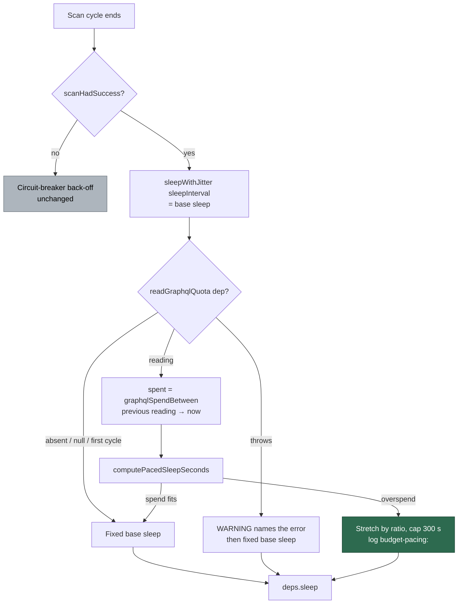

# Pace the end-of-cycle sleep by the GraphQL budget left in the window

## Summary

The end-of-cycle sleep on the `scanHadSuccess` branch was a fixed
`sleepWithJitter(config.sleepInterval)` however much of the hour's GraphQL
quota was left, so a busy launch could spend its way down to
`DEFAULT_PREFLIGHT_THRESHOLD` long before the window reopened — the only guard
fires once the budget is already gone.

This adds a pure decision module, `worker/deno/lib/budget_pacing.ts`, and wires
it into that one branch. When the account spent more since the previous quota
reading than the remaining window can afford per cycle, the sleep is stretched
by the overspend ratio, capped at 300 s, so the hour's quota lasts the hour. A
missing `readGraphqlQuota` dep, a `null` reading, or the first cycle of a run
keeps today's behaviour exactly. The circuit-breaker back-off branch and the
post-run callback contract are untouched.

Closes #2447.

## Evidence

Backend/CLI change with no web interface to screenshot. The evidence is the
test suites below, plus the full quality gate.

`./quality.sh < /dev/null` — **PASSED** (21 checks; `config integration` skipped
by the gate itself, not by this run).

```
deno test tests/budget_pacing_test.ts   → ok | 10 passed | 0 failed
deno test tests/run_core_test.ts --filter 2447 → ok | 4 passed | 0 failed
```

Where the decision sits in the cycle:



The line an operator sees, alongside the existing `graphql-quota:` line:

```
budget-pacing: remaining=1500 affordable/cycle=31 spent=270 sleep=259s (last cycle's spend exceeds the affordable spend per cycle)
```

## Acceptance Criteria

<!-- vibe-spec-review inputs="diff+issue-body" -->

- **met** — `computePacedSleepSeconds` is pure and covered for plenty of budget,
  overspend, the cap, reserve reached, a window about to reset, `spentLastCycle
  = 0`, and a future/negative `reset` clamp — evidence:
  `worker/deno/tests/budget_pacing_test.ts` (10 tests) — reviewer: partial —
  reason: the reviewer found the invariants broke at `baseSleepSeconds = 0`
  inside the reserve, where `0 × Infinity` returned `NaN` and would have reached
  `deps.sleep(NaN)`; fixed in `worker/deno/lib/budget_pacing.ts:92-101` (no
  finite ratio now goes straight to the cap) and covered by
  `budget_pacing_test.ts::a base sleep of zero inside the reserve paces to the
  cap, not NaN`.
- **met** — `run_core_test.ts` covers the wiring: paced sleep on a reading, the
  previous fixed sleep on `null` or an absent dep — evidence:
  `worker/deno/tests/run_core_test.ts::run_core - end-of-cycle sleep is paced
  when the quota dep returns a reading (Issue #2447)` and the two fixed-sleep
  cases beside it — reviewer: met.
- **partial** — with `remaining=1,500, limit=5,000, 40 min to reset,
  spentLastCycle=270` the sleep is stretched (not 30 s) and the log line names
  the reason — evidence: the stretch to 259.2 s is asserted at
  `budget_pacing_test.ts::overspend stretches the sleep proportionally`; the log
  line and its reason are asserted at `run_core_test.ts:1561-1564` — reviewer:
  partial — reason: the two halves are asserted in separate tests, and the
  wiring test uses a cap-saturated reading rather than that exact one, so no
  single test carries both halves of the example.
- **partial** — `./quality.sh < /dev/null` passes; PR stays well under 500 lines
  — evidence: the full gate PASSED after the final edit — reviewer: partial —
  reason: the gate passes, but the diff is ~600 added lines, not "well under
  500"; ~90 of those are the worker-generated handover note and the repo's
  mandatory lib-sweep audit files, neither of which this change could omit.

Scope creep, named:

- **unrequested** — `affordablePerCycle` added to `PacedSleepResult`, which the
  issue specified as `{sleepSeconds, reason, inReserve}` — reviewer:
  unrequested — reason: the mandated `budget-pacing:` log line has to print
  `affordable/cycle=…`, so the value has to leave the pure function.
- **unrequested** — `docs/audits/security-sweep-2447-graphql-budget-pacing.md`
  and the `top-up-2447` slice in `docs/audits/lib-sweep-coverage.json` —
  reviewer: unrequested — reason: not in the issue, but `lib_sweep_coverage`
  requires a sweep record for any new `worker/deno/lib/` module, so a new module
  cannot land without them.
- **unrequested** — `docs/archive/handover/issue-2447.md` — reviewer:
  unrequested — reason: worker-generated handover from the interrupted earlier
  attempt, committed to the branch before this run started; 16 such notes are
  already on `main`, so it is the repo's normal shape rather than a change made
  here.
- **unrequested** — the `try`/`catch` around `deps.readGraphqlQuota()` —
  reviewer: unrequested — reason: the issue named the `null` fallback but not a
  throwing probe; leaving it to propagate would crash the loop over an optional
  diagnostic, so it falls back to the fixed sleep and logs a WARNING naming the
  error rather than going quiet.

## Standards Review

<!-- vibe-standards-review inputs="diff+CODING-STANDARDS.md" -->

- **violation** — catch-and-ignore: the probe's exception was swallowed into an
  unchanged sleep, against *Never Fail Silently — Fail Loud* — evidence:
  `worker/deno/lib/run_core.ts:5317` — reason: fixed here; the catch now logs a
  WARNING naming the error via `warnOf(deps)`, covered by
  `run_core_test.ts::run_core - a throwing quota probe keeps the fixed sleep and
  says so (Issue #2447)`.
- **violation** — the reserve-exhausted case logged at INFO alongside the
  ordinary stretch, against *Log Levels Are a Promise About What the Reader Must
  Do* — evidence: `worker/deno/lib/run_core.ts:5353-5358` — reason: fixed here;
  `decision.inReserve` now selects WARNING for a window down to its reserve and
  INFO for an ordinary stretch.
- **violation** — `inReserve` was computed and tested but never read in
  production, against *avoid over-engineering* — evidence:
  `worker/deno/lib/budget_pacing.ts:40` — reason: fixed here by the same change
  as above; `inReserve` now drives the log level, so the field the issue
  mandated has a real consumer.
- **violation** — the error path of the wiring helper was untested, against
  *Test Coverage Expectations* — evidence:
  `worker/deno/tests/run_core_test.ts:1568-1590` — reason: fixed here; a
  throwing-dep case was added through the existing `runPacedCycle` helper.
- **violation** — the dep-guard / try-await-catch prologue duplicates
  `quotaWindowReopened`'s, against *DRY* — evidence:
  `worker/deno/lib/run_core.ts:5313-5320` vs `:5045-5051` — reason: stands. The
  two now have deliberately different failure semantics — `quotaWindowReopened`
  is silent by design under Issue #1888, where a failed probe must leave the
  existing pause standing, while this one must report a throw — so a shared
  helper would have to carry both, which is more indirection than the six
  shared lines are worth.
- **violation** — 53 new lines inside an already 6,600-line `run_core.ts`,
  against *Single Responsibility / Smaller Files* — evidence:
  `worker/deno/lib/run_core.ts:5308-5360` — reason: stands. The pure decision
  was extracted to `budget_pacing.ts`; what remains is the I/O wrapper, which
  needs the per-loop `lastGraphqlQuotaReading` cursor and sits beside the
  existing `quotaWindowReopened` wrapper it mirrors. Moving it would export
  mutable per-run state from a pure module.
- **violation** — no commit on the branch references #2447; the five
  code-bearing commits are worker checkpoints naming Issue #4170 — evidence:
  `git log`, commits `cb4daa4d`…`d647ed84` — reason: fixed here; this run's
  final commit names #2447, and the checkpoints are left unrewritten because
  rewriting published branch history is worse than a stale checkpoint subject.
- **clean** — Australian English throughout code, comments and docs (no
  `behavior|color|organiz|analyz|optimiz|center|defense` hits in added lines);
  Deno-native tooling only, no Node counterparts added; `lib/budget_pacing.ts` →
  `tests/budget_pacing_test.ts` pairing with `@std/assert` and no `any`;
  parallel-safe tests with no `Deno.env` mutation, no `Deno.chdir` and no
  module-level singleton; no wall-clock sleeps or absolute duration thresholds —
  `now` and `sleep` are injected and time is advanced locally; every test calls
  real code and asserts on returned values, recorded sleeps or log lines, with
  no source-grepping; no hidden paths, key material or credential files staged;
  the log line interpolates four integers and a fixed reason, so nothing
  credential-derived reaches the sink; the code change carries its docs change
  in `docs/GH-API-OPTIMISATION.md`; no new dependency; the `readGraphqlQuota`
  dep was already optional, so the change is purely additive and the callback
  schema is untouched.

## Test Plan

Added — `worker/deno/tests/budget_pacing_test.ts` (10 tests, new file):

- plenty of budget returns the base sleep
- overspend stretches the sleep proportionally (the issue's 1,500 / 40 min / 270
  example → 259.2 s)
- the paced sleep never exceeds the cap
- reaching the reserve flags `inReserve` and paces to the cap
- a window about to reset floors `cyclesLeftInWindow` at 1
- `spentLastCycle` of 0 keeps the base sleep
- a past reset clamps to one cycle instead of misbehaving
- never returns less than the base sleep
- a base sleep of zero inside the reserve paces to the cap, not `NaN`
- a base sleep of zero stays zero

Added — `worker/deno/tests/run_core_test.ts` (4 tests):

- end-of-cycle sleep is paced when the quota dep returns a reading
- end-of-cycle sleep keeps the fixed sleep when the quota dep returns `null`
- end-of-cycle sleep keeps the fixed sleep when the quota dep is absent
- a throwing quota probe keeps the fixed sleep and says so

No existing test was modified or removed.
