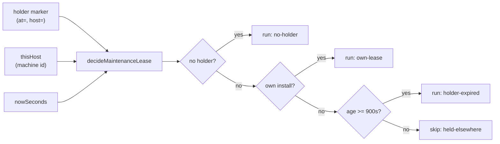

## Summary

Adds the pure decision module for the maintenance lease (Decision 2 of #2443) —
`worker/deno/lib/maintenance_lease.ts`. It formats and parses the
`vibe-maintenance-lease` marker and decides, from a recorded holder, this host's
install id and the clock, whether this host runs a repository's four fixed-cost
maintenance sweeps (`{ run, reason }`). Identity is the per-install UUID from
`machine_id.ts`, not the hostname (which changes on every hourly launch, #2403);
a future-stamped marker is clamped to `now`; a marker older than
`MAINTENANCE_LEASE_SECONDS` (900) is a dead holder. No GitHub I/O — the store is
a separate sub-issue. `installFromMachineId` is exported from `stream_holder.ts`
and reused. Closes #2448.

## Evidence

Backend/CLI change with no web interface to screenshot. Verified by unit tests:
`worker/deno/tests/maintenance_lease_test.ts` (17 tests) drives the real
functions through an injected holder and clock, and
`worker/deno/tests/stream_holder_test.ts` still passes after the export.

## Acceptance Criteria

<!-- vibe-spec-review inputs="diff+issue-body" -->

- **met** — `worker/deno/tests/maintenance_lease_test.ts` covers format/parse round-trip, malformed markers, all four `reason` values, the future-`at` clamp, the exact 900 s boundary, and the same install id with a different hostname recognised as `own-lease` — evidence: `worker/deno/tests/maintenance_lease_test.ts::round-trips the repo, host and epoch`, `::a non-numeric at is rejected`, `::a missing host is rejected`, `::a repository that is not owner/repo is rejected`, `::no holder means this host runs`, `::the holder host runs (own-lease)`, `::a dead holder may be taken over (holder-expired)`, `::a live foreign holder blocks this host (held-elsewhere)`, `::the lease expires exactly at the boundary`, `::a marker from the future is clamped to now`, `::the same install id with a new hostname is own-lease` — reviewer: met
- **met** — `stream_holder_test.ts` still passes after `installFromMachineId` is exported — evidence: the change is `function` → `export function` (additive); `deno test tests/stream_holder_test.ts` passes — reviewer: met
- **met** — `./quality.sh < /dev/null` passes — evidence: full gate run after the final edit, `Result: PASSED` — reviewer: missing — reason: the reviewer saw only the diff and could not run the gate; it was run here and passed
- **unrequested** — `isOwnLease` raw-value fallback branches in `maintenance_lease.ts` — reviewer: unrequested — reason: kept deliberately — it mirrors `sameInstall` in `stream_holder.ts`, extended for a marker whose `host` field is the bare uuid; inert in production (fires only when one side carries no uuid) and exercised by the "bare install id" and "same hostname on a different install" tests
- **unrequested** — extra test cases beyond the acceptance list (bare install id, same hostname different install, future-stamped own-lease) — reviewer: unrequested — reason: these are the boundary coverage that pins the identity/clock rules the issue names; each maps directly to a requirement's edge case

## Standards Review

<!-- vibe-standards-review inputs="diff+CODING-STANDARDS.md" -->

- **violation** — Never Fail Silently: `parseMaintenanceLeaseMarker` returns `null` for both "no marker" and "malformed marker", which `decideMaintenanceLease` folds into `no-holder` — evidence: `worker/deno/lib/maintenance_lease.ts:103-113,160` — reason: this is the issue's explicit contract (`parseMaintenanceLeaseMarker` returns `null` on any malformed field; `reason: "no-holder"`), mirroring `stream_holder.ts`'s documented fail-open direction; the trusted-author filter that makes a marker trustworthy belongs to the store (a separate sub-issue), not this pure decision module
- **violation** — test coverage gap on `formatMaintenanceLeaseMarker` edge cases (empty/negative/fractional epoch, whitespace/unicode) — evidence: `worker/deno/tests/maintenance_lease_test.ts` — reason: fixed in this diff — added `::clamps a negative epoch to zero and floors a fractional one` and `::sanitises a repository and host with whitespace and unicode`, and aligned `sanitiseRepo` trimming with `sanitiseField`
- **violation** — DRY (minor): `sanitiseField` and `sanitiseRepo` are near-identical — evidence: `worker/deno/lib/maintenance_lease.ts:76-84` — reason: stands — two call sites, differing only in the `/` in the allowed class and trim; a parameterised helper would obscure more than it saves, and `sanitiseField` mirrors the existing `stream_holder.ts` helper
- **clean** — Australian English throughout (behaviour, organisation, recognise, sanitise); pure module with no GitHub I/O, no added dependency; tests call real functions through injected seams; no hidden path staged; the `holderHost` doc comment corrected to describe the raw recorded value

## Test Plan

- Added `worker/deno/tests/maintenance_lease_test.ts` — 17 tests covering the marker (round-trip, null, non-numeric `at`, missing `host`, wrong `repo`, epoch clamping, sanitisation) and the decision (all four `reason` values, the exact 900 s boundary, the future-`at` clamp, own-lease with a changed hostname and a bare install id, foreign holder on the same hostname).
- `worker/deno/tests/stream_holder_test.ts` — unchanged; verified still passing after the `installFromMachineId` export.
- `worker/deno/tests/lib_sweep_coverage_test.ts` — verified passing after the ledger slice was added.
