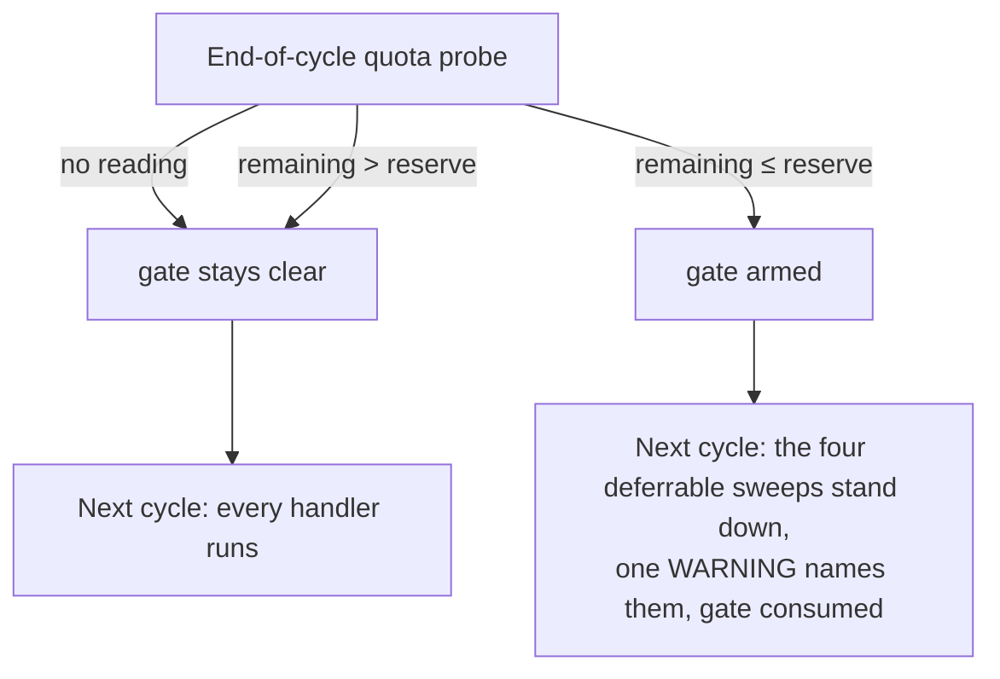

# Skip deferrable maintenance sweeps while the GraphQL budget is in reserve

## Summary

Pacing the end-of-cycle sleep (Issue #2447) slows the worker down, but the
fixed-cost maintenance sweeps still spend their GraphQL calls every cycle
whether or not there is anything for them to do — so inside the reserve they
compete with the issue work the reserve exists to protect.

`PriorityHandler` now carries an optional `budgetTier?: "deferrable"`, set on
exactly four sweeps (1.67 Close Issues for Merged PRs, 1.68 Recover Assigned
with Closed PRs, 1.7 Milestone Completions, 1.81 Failure-Detection Repair
Resume). When the previous cycle's quota reading put the window at or below its
reserve, the cycle skips those four and logs one WARNING naming them. Nothing
that services in-flight work is tiered, and the local-only Closed Milestone
Housekeeping — which spends no GraphQL budget — is not either.

The gate is **consumed** by the cycle that reads it: only a fresh in-reserve
reading arms it again, so a cycle that takes no reading (no dep, a `null`
reading, a probe that threw, the circuit-breaker back-off branch, a rate-limit
pause) skips nothing and a stale skip cannot outlive the reading behind it.

Closes #2449.

## Evidence

Backend/CLI change with no web interface to screenshot. The evidence is the
test suite and the full quality gate:

- `deno test tests/run_core_test.ts tests/budget_pacing_test.ts` — **78 passed,
  0 failed**.
- `./quality.sh < /dev/null` — **PASSED** (deno tests, lint, type check, fmt,
  markdownlint, mermaid, semgrep and the chokepoint checks all green; only the
  pre-existing `config integration` check SKIPPED).

## Acceptance Criteria

<!-- vibe-spec-review inputs="diff+issue-body" -->

- **met** — with `inReserve: true` the four deferrable handlers do not execute
  and every other handler does; with `inReserve: false` or no reading, all
  handlers execute — evidence:
  `worker/deno/tests/run_core_test.ts::run_core - deferrable sweeps are skipped while the budget is in reserve (Issue #2449)`,
  `::run_core - every handler runs while the budget is outside the reserve (Issue #2449)`,
  `::run_core - no quota reading skips nothing (Issue #2449)` — reviewer: met
- **met** — exactly four handlers carry `budgetTier: "deferrable"`, asserted by
  name — evidence:
  `worker/deno/tests/run_core_test.ts::run_core - exactly four handlers carry budgetTier deferrable (Issue #2449)`
  — reviewer: met
- **met** — `./quality.sh < /dev/null` passes — evidence: full gate run after
  the final edit, `Result: PASSED (with skipped checks)` — reviewer: missing —
  reason: the reviewer was told not to run the gate and recorded it as "not
  verified directly"; it was run here and passed.
- **unrequested** — `isInReserve(limit, remaining)` exported from
  `worker/deno/lib/budget_pacing.ts`, with `computePacedSleepSeconds`
  delegating to it — reviewer: unrequested — reason: the cycle loop needs the
  reserve verdict for the reading it just took, including the run's first
  reading which has no previous reading to diff a spend against; extracting the
  rule keeps one definition instead of copying `remaining ≤ limit·reserve`. The
  reviewer called it "justified refactoring rather than true creep".
- **unrequested** — a paragraph on the tier in the priority-ladder section of
  `docs/USAGE.md` — reviewer: unrequested — reason: that section states the
  ladder is serial and lists the rungs, which is now false for four of them;
  "A Code Change Owes a Docs Change" requires the user-facing surface to match.

## Standards Review

<!-- vibe-standards-review inputs="diff+CODING-STANDARDS.md" -->

- **violation** — a `true` gate could outlive the reading that set it, because
  the flag was only cleared inside the probe and the circuit-breaker and
  rate-limit paths never probe — evidence: `worker/deno/lib/run_core.ts:5274` —
  reason: fixed here; the gate is now consumed by the cycle that reads it
  (`run_core.ts:6160`), so only a fresh reading arms it again, and the doc
  claim matches the code.
- **violation** — the user-facing priority ladder still said "the ladder is
  serial, with one exception" — evidence: `docs/USAGE.md:813` — reason: fixed
  here; the section now names the four deferrable rungs and links the tier
  section.
- **violation** — an uncited "≈ 80 GraphQL calls a cycle" figure in permanent
  operator docs — evidence: `docs/GH-API-OPTIMISATION.md:610` — reason: fixed
  here; the claim is now qualitative ("spend their GraphQL calls every cycle").
- **violation** — the newly exported `isInReserve` had no direct test,
  including at the `remaining === limit × reserve` boundary — evidence:
  `worker/deno/lib/budget_pacing.ts:23` — reason: fixed here, see
  `tests/budget_pacing_test.ts::isInReserve is inclusive at the reserve boundary (Issue #2449)`.
- **violation** — comment economy: the same rationale was restated three times
  in code plus once in the doc — evidence: `worker/deno/lib/run_core.ts:1817` —
  reason: fixed here; the rationale lives once on the `budgetTier` JSDoc and
  each handler carries a bare `// Issue #2449` marker.
- **violation** — `budgetTier?: "deferrable"` is a single-member string union
  where a boolean would be the smaller rung — evidence:
  `worker/deno/lib/run_core.ts:317` — reason: stands; the issue specifies this
  field name and type verbatim, and the union leaves room for further tiers
  without a second boolean flag.
- **clean** — Australian English throughout; no hidden or credential paths
  staged; tests call real code (`runCoreLoop`, `buildPriorityDispatchTable`,
  `computePacedSleepSeconds`) with injected clock and `sleep` seams rather than
  grepping source or sleeping on the wall clock; fail-loud preserved (the skip
  is announced, the existing probe-throw warning is untouched); the tier check
  sits after the resume cursor and before the lane deferral, so it cannot
  bypass cursor persistence; markdownlint and `deno fmt`/`lint`/`check` clean;
  commit messages reference Issue #2449 and carry the run-id trailer.

## Test Plan

Added to `worker/deno/tests/run_core_test.ts`:

- `run_core - exactly four handlers carry budgetTier deferrable (Issue #2449)`
  — asserts the tiered set by name against the dispatch table.
- `run_core - deferrable sweeps are skipped while the budget is in reserve (Issue #2449)`
  — drives two real cycles of `runCoreLoop` with a reading of 400/5,000; the
  four sweeps run in cycle 1 and are skipped in cycle 2, while PR Feedback, CI
  Fix, Auto-Merge, Closed Milestone Housekeeping and Planning Mode all still
  run, and exactly one skip line names the four.
- `run_core - every handler runs while the budget is outside the reserve (Issue #2449)`
  — 4,800/5,000: nothing skipped, no skip line.
- `run_core - no quota reading skips nothing (Issue #2449)` — a `null` reading:
  nothing skipped, no skip line.

Added to `worker/deno/tests/budget_pacing_test.ts`:

- `isInReserve is inclusive at the reserve boundary (Issue #2449)` — the
  boundary, either side of it, an exhausted window, and agreement with
  `computePacedSleepSeconds().inReserve`.

Full gate: `./quality.sh < /dev/null` → `Result: PASSED (with skipped checks)`.
