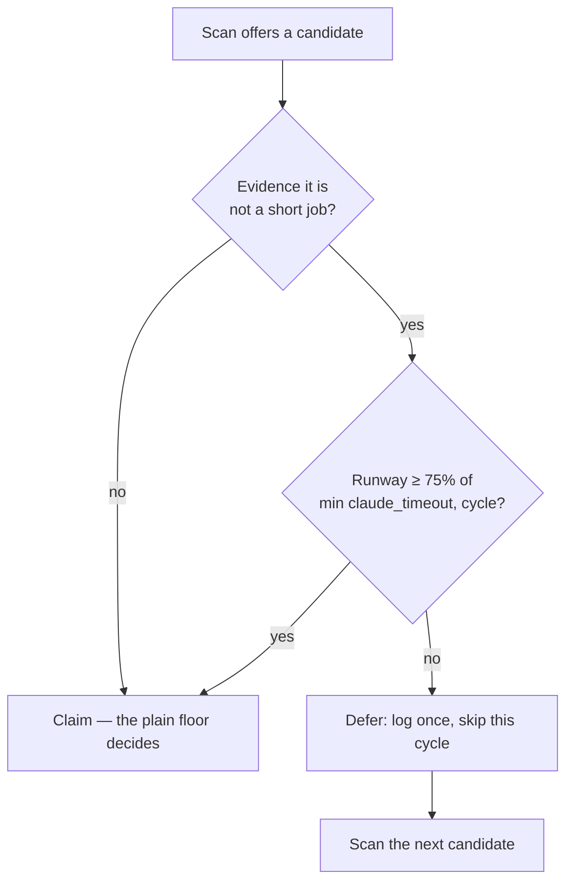

# Adaptive claim-runway floor (Issue #245)

## Summary

The claim-runway floor (#4304/#47) is the same for every issue, so an issue
already known to be a long job could be claimed on a slice of a cycle it could
never finish: VibeCoder#222 (21 files, a timed-out attempt already behind it)
was claimed with **933 s** of runway left, burning a claim cycle, a Fable-tier
run and a claim/release comment pair for nothing the next attempt did not redo.

The floor now adapts to what the issue already carries. Evidence — preserved
WIP on the issue branch, a previous attempt whose recorded outcome was
`timeout` in `execute`, or a configured long-job label — requires a runway that
can host a real execute before the issue is claimed. An issue with no history
is unaffected: late-cycle claims of fresh small issues still happen, which is
the point of #47's default. Closes #245.

What landed:

- **`worker/deno/lib/claim_runway_evidence.ts`** — the pure decision function
  `(evidence, remainingRunway, fullBudget, cycleSeconds) → claim | skip(reason)`,
  plus `evidenceFromIssueSignals` deriving the evidence from an issue's labels
  and the fleet's release comments.
- **`worker/deno/lib/claim_evidence_lookup.ts`** — one
  `gh issue view --json labels,comments` per candidate. Only **fleet-authored**
  comments are read, so an untrusted author cannot forge a marker to keep an
  issue from being claimed. A failed lookup is reported, never swallowed: the
  worker logs it and claims on the plain floor alone.
- **`worker/deno/lib/run_core.ts`** — the serial loop and every pool slot run
  the gate before claiming, log the reason once per cycle, record the issue in
  a cycle-scoped deferral set and move to the **next candidate** rather than
  parking the slot (the #219 rule). A scan that keeps re-offering a deferred
  issue stops the loop loudly instead of spinning.
- **`claim_long_job_labels`** config key (default `size/l`, `size/xl`, `epic`),
  documented in `docs/CONFIGURATION.md`.

### How much runway an evidenced issue needs

Three quarters of the best execute budget the host can offer —
`min(claude_timeout, run_duration_seconds)`. The share is below 1 deliberately:
on the #47 exception host, where the cycle *is* the budget, demanding the whole
budget would refuse every claim that host could ever make — the exact failure
that exception was written to avoid. Three quarters refuses the doomed slice
(933 s of 3600 s, 26 %) while leaving the #222 attempts that did make progress
— 56 min (93 %) and 49 min (82 %) — untouched.

## Evidence

Backend/CLI change with no web interface to screenshot; the evidence is the
test suite below plus the decision flow the change implements.

The #222 timeline, replayed as a test
(`claim_runway_evidence_test.ts`): attempt 1 (933 s) is skipped; attempts 2
(56 min) and 3 (49 min) claim exactly as they did.

Quality gate (`./quality.sh`): lint, type check, fmt, markdownlint, mermaid and
every chokepoint check pass. `deno test` reports 10 failures in
`fleet_health_test.ts`, `host_workdir_guard_test.ts`,
`optional_feature_env_test.ts` and `setup_workdir_reminder_test.ts` — all
pre-existing and environment-dependent: they fail identically on a clean
checkout of `main` in this container (verified with `git stash`), and none of
them touch claim or scan code.

## Test Plan

`worker/deno/tests/claim_runway_evidence_test.ts` (17 tests)

- No evidence, and an unknown execute budget → claim (unchanged behaviour).
- Each evidence source separately — preserved WIP, prior execute timeout,
  long-job label — refuses a 933 s slice.
- Boundary: exactly at the required runway claims; one second below skips.
- The #47 exception host requires the cycle equivalent and says so.
- The VibeCoder#222 timeline: attempt 1 skipped, attempts 2–3 unaffected.
- Evidence parsing: the preserved-WIP release marker, the collapsed attempt
  tally, the release outcome block, a timeout in another phase (not evidence),
  a successful attempt (not evidence), and case-insensitive label matching
  against the configured set.

`worker/deno/tests/claim_evidence_lookup_test.ts` (5 tests)

- One `gh` call answers all three evidence sources.
- A marker forged by an untrusted author is ignored.
- Configured long-job labels replace the defaults.
- A failed `gh` call and unparseable output are both reported as
  `lookupError`, not swallowed.

`worker/deno/tests/run_core_adaptive_claim_test.ts` (6 tests)

- A long job on a doomed slice is skipped, the log names the evidence, and the
  loop claims the *next* candidate; the deferral is logged once per cycle.
- A fresh issue with no evidence still claims late in the cycle.
- An evidenced issue claims once the runway can host an execute.
- A failed evidence lookup is logged and the claim proceeds.
- The slot pool defers and claims the next candidate too.
- A scan that keeps re-offering a deferred issue stops the loop loudly and
  never claims it.
