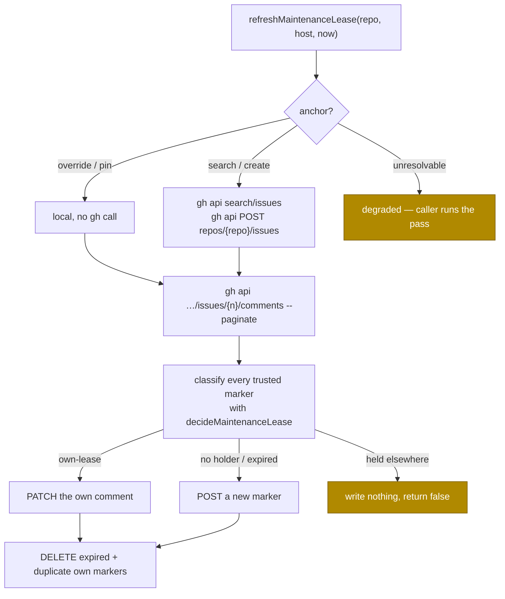

# Maintenance lease store — per-repository anchor issue marker via REST

## Summary

The lease decision from #2448 had nowhere to read or write. This adds the
store: one hidden lease marker comment per holder on a fleet-owned **anchor
issue** in each repository, read with the existing `fetchMarkerComments` and
refreshed with `gh api` — every call REST, so the lease costs none of the
GraphQL budget it exists to save. Closes #2450.

- `worker/deno/lib/maintenance_lease_store.ts`
  - `readMaintenanceLease(repo, io)` — the freshest trusted marker as a
    `MaintenanceLeaseHolder`, or `null`.
  - `refreshMaintenanceLease(repo, host, nowSeconds, io)` — posts on first
    hold, patches its own comment thereafter, deletes dead markers.
  - `resolveMaintenanceLeaseAnchor(repo, io)` — config override → pin file →
    fleet-authored anchor found by search → freshly created anchor. Never
    labelled, so the anchor can never be picked up as work.
- `maintenance_lease_issue` per-repo config override (`types.ts`,
  `lib/config.ts`, `docs/CONFIGURATION.md`).
- The module is claimed in the sweep-coverage ledger, with its written record
  at `docs/audits/security-sweep-2450-maintenance-lease-store.md`.

Identity and expiry are not re-decided here: every marker is classified by
`decideMaintenanceLease`, so the store and the decision cannot disagree about
which marker is this host's, or when a holder is dead.



## Evidence

Backend/CLI only — no web interface to screenshot. The evidence is the test
suite, which drives the real functions against a fake `gh` that **models the
anchor thread** (a POST appends, a PATCH rewrites, a DELETE removes), so a
marker the store writes is read back by the store's own next read:

```
deno test tests/maintenance_lease_store_test.ts
ok | 22 passed | 0 failed (25ms)

deno task check:manifests   → PASSED (672 tests, sweep-coverage ledger green)
deno lint / deno check / deno fmt on the changed files → clean
```

No live GitHub call is made by any test.

## Acceptance Criteria

<!-- vibe-spec-review inputs="diff+issue-body" -->

- **met** — the test file covers all eight named cases — evidence:
  `worker/deno/tests/maintenance_lease_store_test.ts` — no anchor → created and
  pinned; pinned number reused without a search; config override wins;
  non-trusted author ignored; freshest marker wins; own marker patched not
  re-posted; expired foreign marker deleted; API failure → `null` + degraded
  log, no throw — reviewer: met
- **met** — no GraphQL call is made by this module — evidence:
  `maintenance_lease_store_test.ts::maintenance lease store - every gh call is
  REST, never GraphQL` — reviewer: partial — reason: the reviewer read the
  first commit, where the anchor used `gh issue list` / `gh issue create`,
  which `gh_argv.ts` classifies as GraphQL-backed; both were moved to
  `gh api search/issues` and `gh api POST repos/{repo}/issues` in this diff and
  the test now asserts `argv[0] === "api"` for every call
- **met** — `./quality.sh` passes — evidence: full gate run after the final
  edit — reviewer: missing — reason: the reviewer ran the gate against the
  first commit, where the new module was claimed by no sweep slice; the ledger
  entry and its written record were added here and `check:manifests` is green
- **partial** — PR well under 500 lines — evidence: ~1,100 lines, about half of
  it the test file and the sweep-coverage record — reviewer: partial — reason:
  the module itself is ~600 lines with its documentation; the tests and the
  required security-sweep record are not reducible without dropping coverage
  the first criterion asks for
- **met** — the anchor is resolved once per launch — evidence:
  `maintenance_lease_store.ts::resolveAnchor`,
  `…_test.ts::the pinned number is reused without a search` — reviewer:
  partial — reason: the reviewer wanted in-memory memoisation; the pin file is
  the memo and costs no GitHub call, and an in-memory cache would need its own
  invalidation when the anchor is deleted — the pin is dropped instead
- **unrequested** — `refreshMaintenanceLease` writes nothing and returns
  `false` when another host's lease is still fresh — reviewer: unrequested —
  reason: the reviewer found that without it mutual exclusion rested entirely
  on a caller that does not exist yet; the guard is a no-op in correct use and
  a safety net otherwise
- **unrequested** — a pin pointing at a deleted anchor is dropped on a 404 —
  reviewer: unrequested — reason: otherwise a closed anchor leaves the host
  logging `degraded` every cycle for ever, which is the symptom the issue's
  Failure Detection section describes rather than a recovery
- **unrequested** — duplicate copies of this host's own marker are deleted —
  reviewer: unrequested — reason: a raced double-post would otherwise leave a
  comment nothing ever cleans up, against the stated "one marker per host"
- **unrequested** — `io.repoConfigs`, a fifth `io` field beyond the four the
  issue names — reviewer: unrequested — reason: the `maintenance_lease_issue`
  override the issue asks for has to reach the module somehow, and injecting
  the map keeps config loading out of it
- **unrequested** — the repository-name allowlist and its degraded path —
  reviewer: unrequested — reason: `repo` reaches a `gh api` endpoint and the
  pin file's name, so it is validated at the trust boundary

## Standards Review

<!-- vibe-standards-review inputs="diff+CODING-STANDARDS.md" -->

- **violation** — the new `lib/` module was claimed by no sweep slice, so
  `check:manifests` was red — evidence:
  `worker/deno/lib/maintenance_lease_store.ts:1` — reason: fixed here —
  `docs/audits/lib-sweep-coverage.json` gained a `top-up-2450` slice and
  `docs/audits/security-sweep-2450-maintenance-lease-store.md` is its written
  record
- **violation** — the fleet-author check was hand-rolled and case-sensitive,
  so a marker by `Vibe-Coder-Bot` would have been read as an outsider's —
  evidence: `worker/deno/lib/maintenance_lease_store.ts:143` — reason: fixed
  here — delegates to `isFleetAuthor`, covered by `…_test.ts::a foreign marker
  whose author differs only in case is this host's fleet`
- **violation** — the `owner/repo` validator duplicated `isValidRepoSlug` —
  evidence: `worker/deno/lib/maintenance_lease_store.ts:78` — reason: fixed
  here — the exported helper is reused
- **violation** — the tests asserted the request text rather than faking the
  service — evidence:
  `worker/deno/tests/maintenance_lease_store_test.ts:376` — reason: fixed here
  — the fake models the anchor thread, and `…::the marker written is the marker
  read back` proves the round trip
- **violation** — documented behaviour and error branches had no test
  (invalid override, unparseable create result, the snake_case config key) —
  evidence: `docs/CONFIGURATION.md:4222` — reason: fixed here, and the missing
  test found a real defect: `parseInt` turned an override of `12.7` into issue
  #12, where the docs promise a non-integer is ignored
- **violation** — the degraded log lines carried no level promise — evidence:
  `worker/deno/lib/maintenance_lease_store.ts:92` — reason: fixed by
  documentation — `io.log` is now documented as the warning sink, matching
  `stream_holder.ts`; the module has one level of message, so a second
  injected function would be unused weight
- **clean** — Australian English throughout; `deno fmt`, `deno lint`,
  `deno check` clean; unit-test shape (temp dir per case with `finally`
  cleanup, no env mutation, no sleeps, no wall-clock assertions); fail-loud
  error handling (the search and comment read re-throw so a blind read can
  never read as "no anchor"/"no holder"); reuse of `fetchMarkerComments`,
  `deleteIssueComment`, `decideMaintenanceLease` and `installFromMachineId`;
  no hidden path staged; the docs surface listing `repo_config` keys updated in
  the same change; additive `RepoConfig` field; commit messages reference
  #2450 and carry the run-id trailer

## Test Plan

- Added `worker/deno/tests/maintenance_lease_store_test.ts` (22 tests):
  - anchor resolution — created and pinned when none exists; pinned number
    reused with **no** GitHub call; an existing fleet-authored anchor adopted
    (an impostor's ignored); config override wins over the pin; non-positive
    and non-integer overrides ignored; unparseable create result degrades; a
    failed search never files a duplicate;
  - reads — non-trusted author ignored; freshest marker wins; API failure →
    `null` + degraded log; a 404 drops the stale pin, a 503 keeps it; a
    malformed repository name makes no call at all;
  - refresh — first hold posts (marker plus a visible line); the marker written
    is the marker read back, and the second cycle patches rather than posts;
    own marker patched, never re-posted, including when the author's login
    differs only in case; a duplicate own marker deleted; an expired foreign
    marker deleted; a fresh foreign holder never overwritten; a failed write
    degrades to `false` without throwing;
  - every `gh` argv asserted REST (`argv[0] === "api"`).
- Added `worker/deno/tests/config_test.ts::config - loadConfig normalises the
  maintenance-lease anchor override (Issue #2450)` — the snake_case
  `maintenance_lease_issue` key end to end through `loadConfig`.
