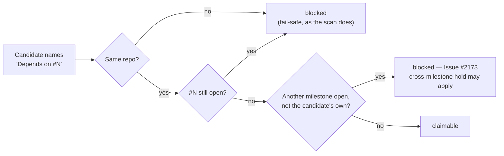

# Model the cross-milestone dependency hold in the idle-decision census

## Summary

Closes #2455

The idle-decision census called `stSoftwareAU/GRQ-AutoTrader#662` claimable on
three consecutive cycles while the claim scan refused it as
`dependency-blocked`, so the streak filer escalated a scan that was right.

`#662` names `Depends on #660` and `Depends on #661`. Both dependencies are
**closed**, and both belong to the still-open milestone
`gateway-host-retirement`. That is the Issue #2173 cross-milestone hold: a
closed same-repo dependency in another open milestone has not reached the
default branch yet, so `isDependencyBlocked` keeps refusing the dependant. The
census modelled only the open-dependency half of the gate — its docblock
recorded the omission as a deliberate under-count — yet
`CENSUS_SCAN_GATE_COVERAGE` already declared `dependency-blocked` as `modelled`.
Two sides modelling different gates is exactly the manufactured signal Issue
#460 describes.

A closed issue's milestone is unknowable from a set of open issues, so the
census now models the hold's **precondition**: the repo has some open milestone
other than the candidate's own. Where no other milestone is open the hold cannot
fire and a genuine inversion is still reported; where one is, the census defers
to the scan instead of escalating against it.



Changes:

- `idle_decision_census.ts` — new optional `RepoCensusInput.openMilestones`,
  threaded through `countUnblocked` to **both** call sites of the gate: the
  claimable count and `censusVisibleRefusal`, which drives tier-3 suppression.
  Omitting it preserves the pre-change behaviour exactly, as `openPRs` does.
- `run_core_production_deps.ts` — populates it best-effort from the same cached
  `fetchOpenMilestoneClosedCounts(repo, issueCache)` entry
  (`milestones_open_counts`) that the scan's `createOpenMilestoneLookup` reads,
  so it costs no extra `gh` call and cannot drift from the scan's view. On a
  fetch failure the hold is simply not modelled — at worst an idle task is filed
  while work exists, the same bounded-harm direction the module already prefers.
- `CENSUS_SCAN_GATE_COVERAGE` — the `dependency-blocked` entry now records which
  issue modelled which half of the gate.
- `docs/IDLE-TASK-FRAMEWORK.md` — the paragraph claiming the hold is _not_
  modelled is replaced with the sixth instance of the census-vs-scan hole and
  how it is closed; the census flowchart's dependency node updated to match.

Both call sites needed the milestone context for a second reason: a `work-on`
issue the census cannot see a refusal for reads as refused by _nothing_, and an
unrefused higher-tier issue suppresses the lower tiers. `dependency-blocked` is
`human`-clearing (Issue #2610) and deliberately never suppresses, so without the
context the census would also have parked tier 3 behind `#662`.

## Evidence

Backend/worker change with no user-visible surface — no screenshot applies. The
evidence is the test suite and the quality gate.

Targeted tests, including the five new `#2455` cases:

```
$ deno test -A tests/idle_decision_census_test.ts \
    tests/claim_path_differential_test.ts \
    tests/census_occupancy_drift_1071_test.ts \
    tests/skip_reason_clearing_test.ts
ok | 104 passed | 0 failed (458ms)
```

The census/scan production wiring:

```
$ deno test -A tests/run_core_production_deps_test.ts \
    tests/run_core_production_deps_cache_test.ts \
    tests/run_core_production_deps_disk_test.ts \
    tests/run_core_production_deps_fast_failure_test.ts \
    tests/idle_inversion_streak_test.ts
ok | 66 passed | 0 failed (532ms)
```

Full quality gate, run once in the foreground:

```
$ ./quality.sh < /dev/null
  deno tests                     PASSED
  deno lint                      PASSED
  deno type check                PASSED
  deno fmt                       PASSED
  mermaid                        PASSED
  markdownlint                   PASSED
  semgrep                        PASSED
Result: PASSED (with skipped checks)
```

(`config integration` is skipped in this environment, as it is on every run
without the operator configuration it needs.)

The reported issue's live data, which the first test reproduces:
`GRQ-AutoTrader#662` is open, `work-on`, milestone `null`, body
`Depends on #660` / `Depends on #661`; `#660` and `#661` are both closed and
both carry the open milestone `gateway-host-retirement`.

## Test Plan

Five new tests in `worker/deno/tests/idle_decision_census_test.ts`, each calling
`buildIdleDecisionCensus` and asserting on the returned census — the first is
the regression test and fails against the unfixed gate:

1. **`a closed dependency still blocks while another milestone is open`** — the
   `#662` shape. `unblocked.workOn === 0`, `dependencyBlocked === 1`,
   `inversionSignal === false`. Fails before the change (the census counted it
   claimable and raised the signal).
2. **`no other open milestone means no hold, so detection is preserved`** — the
   opposite direction: with no open milestone the issue is claimable and
   `inversionSignal === true`, so a real inversion is still escalated.
3. **`the candidate's own milestone cannot hold it`** — the scan compares the
   dependency's milestone with the candidate's, so the candidate's own milestone
   being open blocks nothing.
4. **`an open dependency keeps blocking without any milestone context`** — the
   Issue #460 half is unchanged when no milestones are supplied.
5. **`a milestone-held work-on issue does not suppress tier 3`** — pins the
   second call site: the held `work-on` issue is refused, and the repo's
   `low-priority` issue stays claimable (`lowPrioritySuppressed === 0`) because
   `dependency-blocked` is `human`-clearing. Without the milestone context at
   `censusVisibleRefusal` the work-on issue reads as unrefused and wrongly
   suppresses tier 3.

Existing constraints kept green, unmodified:
`#460 - a closed dependency does
not block` (no milestones supplied → still
claimable), the `CENSUS_SCAN_GATE_COVERAGE` totality guards, and
`skip_reason_clearing_test.ts`'s two-map key-set check.
