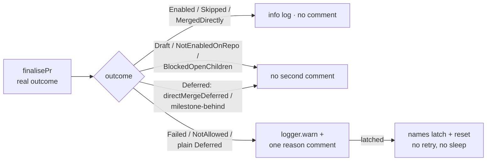

# Report the real auto-merge outcome at PR creation and post one reason comment when arming fails

## Summary

Closes #2457

Every fleet PR must leave its creating run either armed for auto-merge or
carrying one comment that says why it is not. `finalisePr` returned `ok: true`
for every outcome, so `armAutoMergeAtCreation` logged "Auto-merge armed at
creation" whether the `--auto` call succeeded, was refused, or was deferred —
and `armSyncPrAutoMerge` swallowed its failure in an empty `catch`.
GRQ-AutoTrader#716 shipped with nothing armed and no comment.

`finalisePr` now returns the real `EnableAutoMergeResult`, and both creation
call sites classify it: a genuine refusal (`Failed`, `NotAllowed`, or a
`Deferred` nothing else has already explained) produces one `logger.warn` naming
the reason plus exactly one PR comment — built through the same
`EnableAutoMergeOptions.commentFn` seam — stating the reason and that the
Auto-Merge sweep retries. Deliberate holds stay silent: the #4375/#1082 gated
direct-merge deferral (a chosen hold, never `--auto`), the #2005/#1779
milestone-behind deferral (its `postBehindSyncReason` comment), `Draft`,
`NotEnabledOnRepo`, and the #3909 summary-PR withhold.

A `gh pr merge --auto` refusal that is really the primary-quota latch is
classified by the shared `PRIMARY_QUOTA_SKIP_PREFIX` (exported from
`primary_quota_latch.ts`) as `Failed` with `latched: true`, returned before the
retry loop — no in-run retry, no `sleep` — and the reason comment names the
latch and its reset time (which rides in `primaryQuotaSkipMessage()`), with a
retry line stating "no further auto-merge attempt was made in this run". The
same warn-plus-one-comment path now covers `armSyncPrAutoMerge` on
`sync/milestone-*` PRs, and a lost reason comment there is itself warned about
rather than silently swallowed.



Changes:

- `pr_auto_merge.ts` — `finalisePr` returns
  `Result<EnableAutoMergeResult, Error>`; `enableAutoMerge` returns
  `latched: true` on a `PRIMARY_QUOTA_SKIP_PREFIX` refusal before the retry
  loop; new `autoMergeOutcomeNeedsComment` / `buildArmingReasonComment`; the
  `EnableAutoMergeResult` gains `latched` and `directMergeDeferred` (set on the
  two #4375/#1082 gated holds).
- `completion_phase.ts` — `armAutoMergeAtCreation` threads a `commentFn` seam
  into `finalisePr`, logs the real outcome, and on a comment-worthy outcome
  warns plus posts one reason comment (warn again if the comment itself fails).
- `milestone_sync_pr.ts` — `armSyncPrAutoMerge` reports a failed or refused
  `--auto` with the same warn-plus-one-comment contract, and warns when the
  comment cannot be posted.
- `primary_quota_latch.ts` — `PRIMARY_QUOTA_SKIP_PREFIX` export, so the
  latch-refusal classification lives in one place instead of a magic string.
- `execute_claude_phase.ts`, `issue_worker_wiring.ts` — the string-typed and
  mock `finalisePr` adapters unwrap the new object result.

No new `worker/deno/lib` module; the change extends `pr_auto_merge.ts`, so no
`docs/audits/lib-sweep-coverage.json` slice is needed.

## Evidence

Backend/worker change with no user-visible surface — no screenshot applies. The
evidence is the test suite and the quality gate.

Targeted suites, all green (fakes injected through the `ghCommandFn` /
`commentFn` / `gh` / `runGhCommand` seams):

```
$ deno test -A tests/pr_auto_merge_test.ts tests/milestone_sync_pr_test.ts \
    tests/issue_worker_test.ts \
    tests/completion_phase_closure_render_test.ts \
    tests/completion_phase_summary_incomplete_test.ts \
    tests/completion_phase_summary_rule_retry_test.ts
ok | 183 passed | 0 failed
```

`deno check --frozen --lock=deno.lock mod.ts` — clean; `deno lint` and
`deno fmt --check` on every changed file — clean.

Full quality gate, run once in the foreground:

```
$ ./quality.sh < /dev/null
  benchmark audit                PASSED
  hardcoded branch names         PASSED
  needs-human chokepoint         PASSED
  gh spawn chokepoint            PASSED
  git spawn chokepoint           PASSED
  redact before truncate         PASSED
  host work-dir guard            PASSED
  git ref chokepoint             PASSED
  tmp state dir chokepoint       PASSED
  workflow hygiene               PASSED
  completeness checks            PASSED
  config integration             SKIPPED
  source targets                 PASSED
  mermaid                        PASSED
  markdownlint                   PASSED
  semgrep                        PASSED
  release-tag ruleset            PASSED
  deno tests                     PASSED
  deno lint                      PASSED
  deno type check                PASSED
  deno fmt                       PASSED
Result: PASSED (with skipped checks)
```

(`config integration` is skipped in this environment, as it is on every run
without the operator configuration it needs.)

## Reproduction

- **symptom** — a PR whose `--auto` arming was refused left its creating run
  with no armed auto-merge and no comment saying why; `finalisePr` reported
  `ok: true` for every outcome, so the completion phase logged "Auto-merge armed
  at creation" for a failure, and `armSyncPrAutoMerge` returned silently from an
  empty `catch`.
- **status** — `verified` — the regression test below fails against the
  pre-change `finalisePr` (which returned the constant `ok: true`) and passes
  with the fix; the `armSyncPrAutoMerge` regression test fails against the
  silent-return implementation and passes with the warn-plus-one-comment path.
- **regression test** —
  `worker/deno/tests/pr_auto_merge_test.ts::pr_auto_merge - finalisePr returns
  the real outcome, not a constant ok:true (Issue #2457)` (scripts an HTTP 500
  and asserts `result.value.result === AutoMergeResult.Failed`), and
  `worker/deno/tests/milestone_sync_pr_test.ts::raiseMilestoneSyncPr - a refused
  --auto posts one reason comment and warns (Issue #2457)` (scripts a failing
  `ghCommandFn` and asserts the warning and single comment).

## Acceptance Criteria

<!-- vibe-spec-review inputs="diff+issue-body" -->

An independent spec reviewer was given only the diff and the issue body. Verdict
per criterion:

- **met** — `finalisePr` returns the real arming outcome; a unit test asserts a
  scripted `Failed` result is no longer reported as `ok: true` — evidence:
  `pr_auto_merge.ts:1060-1088` returns `Result<EnableAutoMergeResult, Error>`;
  `pr_auto_merge_test.ts::finalisePr returns the real outcome, not a constant
  ok:true` — reviewer: met.
- **met** — Armed PR (`Enabled`): warning log absent, no comment posted —
  evidence: `autoMergeOutcomeNeedsComment` returns `false` for `Enabled`
  (`pr_auto_merge_test.ts` quiet array), `armAutoMergeAtCreation` logs at
  `info` and skips the comment block (`completion_phase.ts:330-358`). The
  `autoMergeRequest.enabledAt` half is unchanged `fleet_pr_search.ts` behaviour,
  not part of this arming path. — reviewer: met (that half N/A for this diff).
- **met** — `Failed`, `Deferred`, `NotAllowed`: one `logger.warn` and exactly
  one PR comment naming the reason and that the sweep retries — evidence:
  `completion_phase.ts:339-358`; completion-level tests for `Failed`
  (`a refused arming posts one reason comment and warns`), plain `Deferred`
  (`a route-gate Deferred outcome posts one reason comment`), and `NotAllowed`
  (`a NotAllowed outcome posts one reason comment`) in `issue_worker_test.ts`.
  — reviewer: met.
- **met** — Latched `gh` refusal: the comment names the latch and its reset
  time; no further `gh` call is made in that run — evidence: the
  `PRIMARY_QUOTA_SKIP_PREFIX` check returns `latched: true` before the retry
  loop (`pr_auto_merge.ts:928-935`); `pr_auto_merge_test.ts::a latched gh
  refusal never retries and is marked latched` asserts `mergeCalls === 1` and
  the reset time in the message; `issue_worker_test.ts::a latched refusal posts
  one comment naming the quota`. — reviewer: met.
- **met** — `NotEnabledOnRepo`, `Draft`, #3909 withhold, #2005 deferral: no
  second comment — evidence: all fall through `autoMergeOutcomeNeedsComment` to
  `false` (`Draft`/`NotEnabledOnRepo`/`BlockedOpenChildren` in the quiet array;
  `deferral === "milestone-behind"` → `false`); `issue_worker_test.ts::a
  NotEnabledOnRepo outcome posts no second comment`. — reviewer: met.
- **met** — Regression: `skipAutoMerge: true` yields `Skipped`, no comment;
  unprotected base (#4375) takes the gated direct merge with no `--auto` and no
  comment — evidence: the early `Skipped` return plus `!skipAutoMerge` guards;
  `directMergeDeferred: true` set on both #4375/#1082 holds and returned `false`
  by the classifier (`deliberate holds stay silent`); `MergedDirectly` in the
  quiet array. — reviewer: met.
- **met** — `armSyncPrAutoMerge` no longer returns silently on failure — unit
  test with a scripted failing `ghCommandFn` asserts the warning and single
  comment — evidence: `milestone_sync_pr_test.ts::raiseMilestoneSyncPr - a
  refused --auto posts one reason comment and warns` and `… a latched refusal
  posts one comment and never retries`. — reviewer: met.
- **met** — Unit tests use fake `ghCommandFn` / `commentFn` seams; no
  source-text assertions — evidence: every new test injects a fake command /
  comment seam and asserts on captured argv or observable output. — reviewer:
  met.

Reviewer notes, both addressed in this diff (commit `1a7b02c5`): the latched
retry line now says "no further auto-merge attempt was made" (the comment itself
is a `gh` call, so "no further `gh` call" was imprecise), and the reset time is
now asserted explicitly in the latched test.

## Standards Review

<!-- vibe-standards-review inputs="diff+CODING-STANDARDS.md" -->

An independent standards reviewer checked the diff against the repo's
CODING-STANDARDS. Verdict per standard:

- **PASS** — Deno tooling only (no package.json / npm / tsconfig changes).
- **PASS** — no new `worker/deno/lib` module; logic extended existing modules.
- **PASS** — tests are real: they call functions through injected seams and
  assert on captured argv / comment counts / observable output, never source
  text.
- **PASS** — no spin-wait / sleep; the latch refusal returns before the retry
  loop; the pre-existing bounded `setTimeout` transient retry is unchanged.
- **PASS** — fail loud: the comment-failure paths now warn (both
  `completion_phase.ts` and `milestone_sync_pr.ts`), and the `armSyncPrAutoMerge`
  comment-swallow found by the reviewer is fixed.
- **PASS** — no cross-repo coupling.
- **PASS** — Australian English throughout.
- **PASS** — KISS: the unused `ARMING_REASON_MARKER` export was dropped to a
  module-local constant.
- **PASS** — secure: `gh` args are string arrays; comment bodies travel as
  `--body` argv elements, never shell-interpolated; no hidden or
  credential-shaped paths staged.
- **PASS** — type safety: `deno check` clean; `noUncheckedIndexedAccess`
  respected.

## Test Plan

Added (fakes via `ghCommandFn` / `commentFn` / `gh` / `runGhCommand` seams):

- `worker/deno/tests/pr_auto_merge_test.ts` — `finalisePr returns the real
  outcome, not a constant ok:true`; `finalisePr reports Skipped as a typed
  outcome`; `finalisePr reports Enabled on success`; `a latched gh refusal never
  retries and is marked latched` (asserts the reset time); `autoMergeOutcomeNeedsComment
  covers Failed, NotAllowed, and unhandled Deferred`; `deliberate holds stay
  silent` (directMergeDeferred and milestone-behind); `buildArmingReasonComment
  names the reason and the sweep retry`.
- `worker/deno/tests/milestone_sync_pr_test.ts` — `raiseMilestoneSyncPr - a
  refused --auto posts one reason comment and warns`; `… a latched refusal posts
  one comment and never retries`.
- `worker/deno/tests/issue_worker_test.ts` — `a refused arming posts one reason
  comment and warns`; `a latched refusal posts one comment naming the quota`; `a
  route-gate Deferred outcome posts one reason comment`; `a NotAllowed outcome
  posts one reason comment`; `a NotEnabledOnRepo outcome posts no second
  comment`.

Modified:

- `worker/deno/tests/issue_worker_test.ts`,
  `completion_phase_closure_render_test.ts`,
  `completion_phase_summary_incomplete_test.ts`,
  `completion_phase_summary_rule_retry_test.ts` — the `finalisePr` mocks now
  return the object `EnableAutoMergeResult` instead of the string `"finalised"`,
  and the "arming outcome is logged" test expects the new
  `Auto-merge <outcome> at creation` wording.

### Quality gate

`./quality.sh < /dev/null` — `Result: PASSED (with skipped checks)`. Every check
green except `config integration`, which is SKIPPED in this environment (no
operator configuration), as on every run. The full per-check table is in the
Evidence section.
