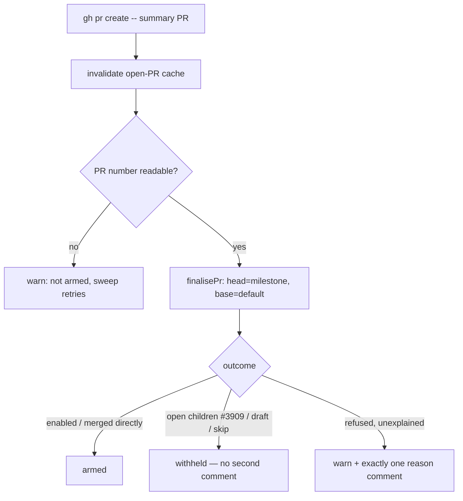

# Arm auto-merge on the milestone summary PR at creation (Issue #2458)

## Summary

`createMilestoneSummaryPr` raised the `milestone/**` → default-branch summary PR
and returned `exists` | `created` | `failed` without ever arming auto-merge on
it — the last fleet PR kind with no arming attempt at all, relying entirely on
the next Auto-Merge sweep. It now routes through the same `finalisePr`
chokepoint as every other PR (head = the milestone branch, base = the default
branch) and reports the outcome the Issue #2457 way. Closes #2458.

What changed:

- `armSummaryPrAutoMerge` (`worker/deno/lib/milestone_completion.ts`) calls
  `finalisePr` immediately after `gh pr create` and the open-PR cache
  invalidation, with a `commentFn` built from the same `ghCommandFn`.
- Outcomes are classified `armed` / `withheld` / `failed` and returned on the
  `created` outcome (`SummaryPrArming`), alongside the PR number.
  `autoMergeOutcomeNeedsComment` decides the comment: a refusal nothing else
  explained gets a warn log and exactly one reason comment naming the sweep
  retry; the #3909 open-children withhold, which comments for itself, is
  recorded silently rather than commented twice.
- `skip_auto_merge` repositories raise the summary PR and leave it unarmed,
  exactly as the sweep already treats them.
- The push-capable fleet logins are threaded through so an unprotected default
  branch takes the #4375/#1082 gated direct merge rather than the outright
  Issue #2416 refusal (the sweep already passes the same set).
- Arming sits **outside** the `gh pr create` try/catch: the PR exists from that
  point on, so an arming fault can never re-label a created PR as `failed`
  (which would suppress `onPrCreated` and leave the tracking issue open).

## Evidence

Backend/CLI change with no web interface to screenshot. The evidence is the
scripted-fake test suite and the full quality gate.

- `worker/deno/tests/milestone_summary_pr_auto_merge_test.ts` — 7 tests, all
  driving the real `checkAndHandleMilestoneCompletions` with a recording fake
  `ghCommandFn` and asserting on the recorded `gh` argv and the log lines.
- `deno test tests/milestone_summary_pr_auto_merge_test.ts tests/milestone_completion_test.ts tests/milestone_completion_cache_test.ts tests/pr_auto_merge_test.ts tests/auto_merge_sweep_test.ts`
  → **151 passed, 0 failed**.
- `./quality.sh` → **PASSED** (only the environmental `config integration`
  check skipped).

## Reproduction

- **symptom** — a milestone summary PR was raised with `autoMergeRequest` null
  and no comment explaining it; it sat unmerged until a later Auto-Merge sweep
  picked it up, because `createMilestoneSummaryPr` never issued
  `gh pr merge --auto`
- **status** — `verified` — with `worker/deno/lib/milestone_completion.ts`
  stashed to its unfixed state, 4 of the 7 new tests failed (`… is armed before
  the function returns`, `open children withhold …`, `a refused --auto call …`,
  `an unreadable PR URL …`); all 7 pass after the fix. The fleet-logins
  regression was verified the same way — removing the `fleetAuthors` forwarding
  turns `an unprotected default branch takes the gated merge with the fleet
  logins` red on its own.
- **regression test** —
  `worker/deno/tests/milestone_summary_pr_auto_merge_test.ts::summary PR arming - a created summary PR is armed before the function returns`

## Acceptance Criteria

<!-- vibe-spec-review inputs="diff+issue-body" -->

- **met** — With no open children, the summary PR has `gh pr merge --auto`
  issued before the function returns — evidence:
  `worker/deno/tests/milestone_summary_pr_auto_merge_test.ts::summary PR arming - a created summary PR is armed before the function returns`
  (asserts one `--auto` call ordered after `pr create`) — reviewer: met
- **met** — With open children (#3909 withhold), the existing reason comment is
  posted and no second comment appears — evidence:
  `worker/deno/tests/milestone_summary_pr_auto_merge_test.ts::summary PR arming - open children withhold arming with no second comment`
  (0 `--auto` calls, exactly 1 comment, naming the child) — reviewer: met
- **met** — A failed `--auto` call yields exactly one comment naming the reason
  and that the sweep retries — evidence:
  `worker/deno/tests/milestone_summary_pr_auto_merge_test.ts::summary PR arming - a refused --auto call yields exactly one reason comment`
  — reviewer: met
- **met** — `exists` and `failed` outcomes behave as today — evidence:
  `worker/deno/tests/milestone_summary_pr_auto_merge_test.ts::summary PR arming - an existing summary PR is left untouched`;
  the `branch_missing` and create-failure branches are unchanged — reviewer: met
- **met** — Unit tests with a scripted fake `ghCommandFn` assert the `--auto`
  call sequence and comment count; no source-text assertions — evidence:
  `worker/deno/tests/milestone_summary_pr_auto_merge_test.ts` (all assertions on
  recorded argv and logs) — reviewer: met
- **met** — Tests and quality checks pass (`./quality.sh`) — evidence: full gate
  run after the final edit, `Result: PASSED` — reviewer: met
- **unrequested** — `MilestoneCompletionDeps.skipAutoMerge`, wired in
  `worker/deno/lib/run_core_production_deps.ts` and
  `worker/deno/commands/milestone_completion.ts` — reviewer: unrequested —
  reason: arming at creation would otherwise override an operator's explicit
  `skip_auto_merge`, which the Auto-Merge sweep honours; kept so the new path
  cannot merge a milestone in a repository that opted out
- **unrequested** — `MilestoneCompletionDeps.fleetAuthors` forwarded into
  `finalisePr` — reviewer: unrequested — reason: the spec reviewer found the
  omission made AC1 unobservable on an unprotected default branch (the gated
  direct merge refuses outright with Issue #2416 and the PR is reported
  unarmed); added in response to that finding, mirroring the sweep
- **unrequested** — `prNumber` on the `created` outcome and
  `summaryPrNumberFromUrl` — reviewer: unrequested — reason: the arming call is
  addressed to a PR number, and an unreadable URL must fail loud rather than
  address the writes at PR #0

Two reviewer findings were deliberately not actioned in this diff, and both are
recorded rather than left silent:

- The spec reviewer noted the #3909 `lookup-failed` block posts no comment yet
  is classified `withheld`. Fixing it changes shared #3909/#2457 policy for all
  four PR kinds and needs per-cycle comment de-duplication, so it is filed as
  **stSoftwareAU/VibeCoder#2479** rather than folded in here.
- The standards reviewer flagged that this module's `log` seam is wired to
  `logger.info`, so its `WARNING:` lines are INFO-level. That is the module's
  pre-existing convention for every one of its warnings; changing the seam is
  not this issue's scope.

## Standards Review

<!-- vibe-standards-review inputs="diff+CODING-STANDARDS.md" -->

- **violation** — DRY: `armSummaryPrAutoMerge` repeats the #2457 reporting shape
  used by `armAutoMergeAtCreation` — evidence:
  `worker/deno/lib/milestone_completion.ts:790` vs
  `worker/deno/lib/phases/completion_phase.ts:257` — reason: stands; extracting
  the shared shape means refactoring the #2457 code path this issue does not
  own, and the duplicated part is the three-line `commentFn` plus the
  `needsComment` branch
- **violation** — DRY: `summaryPrNumberFromUrl` re-implements
  `run_outcome.ts::prNumberFromUrl` — evidence:
  `worker/deno/lib/milestone_completion.ts:769` — reason: stands, deliberately;
  that helper answers `0` for an unreadable URL, which would address the arming
  and comment writes at PR #0, and importing it would couple the milestone path
  to run-outcome reporting. The divergence is documented at the helper
- **violation** — KISS: positional argument growth, with the new optional
  arguments transposable between hops — evidence:
  `worker/deno/lib/milestone_completion.ts:894` — reason: fixed here; the arming
  inputs are now one `SummaryPrArmingInputs` object passed unchanged down every
  hop instead of three positional arguments
- **violation** — fail-loud: an arming throw inside the creation `try/catch`
  would re-label a created PR as `failed` — evidence:
  `worker/deno/lib/milestone_completion.ts:983` — reason: fixed here; the
  creation `try` now covers only `gh pr create`, and arming runs after it
- **violation** — test fake answered `gh pr view --json baseRefName` with a
  comments array — evidence:
  `worker/deno/tests/milestone_summary_pr_auto_merge_test.ts:113` — reason:
  fixed here; the fake routes that read to the real base branch, which is what
  exposed the missing fleet logins
- **clean** — Australian English throughout the added code, docs and tests; no
  hidden or credential paths staged (`docs/MERGE.md`, three `worker/deno`
  sources, one new test file); no bare `catch {}` — the comment-post failure is
  caught *and* named, and `finalisePr`'s `ok: false` is never read as armed; no
  wall-clock sleeps or timing thresholds in the new tests, which all call real
  exports; the code change carries its docs change (`docs/MERGE.md`)

## Test Plan

New file `worker/deno/tests/milestone_summary_pr_auto_merge_test.ts` (7 tests,
each driving the real `checkAndHandleMilestoneCompletions`):

- `a created summary PR is armed before the function returns` — one
  `gh pr merge --auto` for the created PR, ordered after `gh pr create`, no
  comment.
- `open children withhold arming with no second comment` — an open child PR on
  the milestone branch: no `--auto`, exactly one comment (the #3909 gate's).
- `a refused --auto call yields exactly one reason comment` — one `--auto`
  attempt, exactly one comment naming the `gh` error and the sweep retry, plus
  the warn log.
- `skip_auto_merge repositories are never armed` — PR created, no `--auto`, no
  comment.
- `an unreadable PR URL fails loud and arms nothing` — warn log, no `--auto`,
  no comment.
- `an unprotected default branch takes the gated merge with the fleet logins` —
  no bare `--auto`, and no Issue #2416 refusal comment (red without the
  `fleetAuthors` forwarding).
- `an existing summary PR is left untouched` — no `pr create`, no `--auto`, no
  comment.

Existing suites re-run unchanged: `milestone_completion_test.ts`,
`milestone_completion_cache_test.ts`, `pr_auto_merge_test.ts`,
`auto_merge_sweep_test.ts`, `milestone_children_gate_test.ts`.
