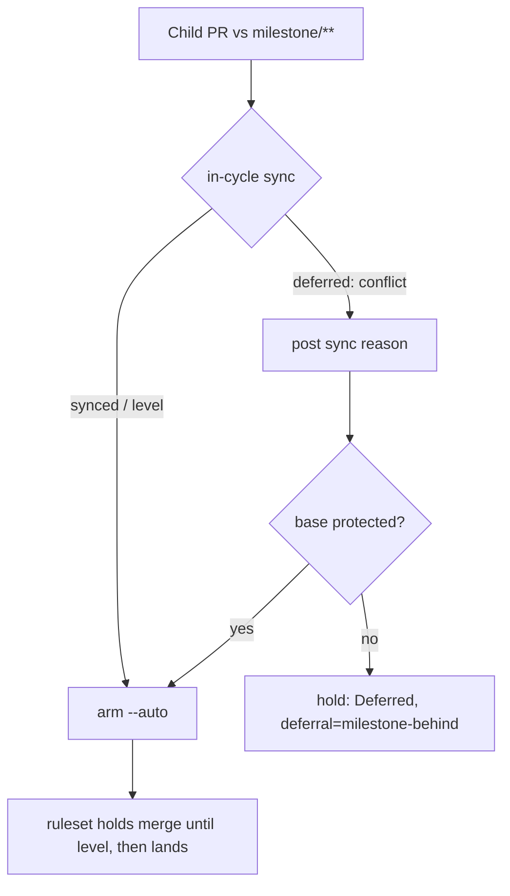

# Arm the child PR even when the in-cycle milestone sync conflicts (Issue #2460)

## Summary

Closes #2460

`enableAutoMerge` ran the #2005 `syncBehindMilestone` hook before arming a child
PR against `milestone/**`. When that sync came back `deferred` (conflict), it
posted the sync reason and returned `Deferred` without ever issuing
`gh pr merge --auto` — the #1779 withhold. With the strict up-to-date policy on
the milestone ruleset, being behind blocks the *merge*, not the *arming*, so the
withhold only left the child unarmed.

The deferred branch now posts its reason and falls through to the arming loop.
The child is armed, and the ruleset holds the merge until the periodic 1.72 sync
levels the branch — at which point the child lands with no further scan needed.

### One carve-out the issue did not anticipate

Arming early is safe **because** the milestone ruleset holds the merge. A base
with no required checks has no such policy: `--auto` there merges immediately
whatever CI says (the #4375 defect), and the gated direct merge only measures
the head against its own base — `enforcePreMergeRequirements` returns
`behind_target` from `state.behindBy`, which never measures the base against the
default branch. Either route would land the child on a stale milestone tip: the
exact side-pick `docs/MERGE.md` promises never happens.

So a behind base that is **unprotected** posts its sync reason and then defers
to the next scan, as before. The withhold is removed where the issue's own
premise holds (a protected base) and retained where it does not.

### Deliberate deviations from the literal wording

- **`sync-base-unreadable` still returns `Deferred`.** The issue asked for the
  fall-through in both branches. The #1967 holds exist because an unreadable
  base means the worker cannot tell whether the base is safe at all; arming
  there would reintroduce #1957. No acceptance criterion covers it — every one
  names the `deferred` outcome — so the #1967 holds are untouched.
- **The #477 `lookup-failed` defer is likewise untouched**, for the same reason.
- **`milestone_children_gate.ts` needed no change.** `requireSyncedBase: true`
  stays at both call sites: the gate's defer is what *triggers* the #2005 sync
  and the reason comment in the first place. Only the treatment of that defer
  changed — it now feeds the `deferral` field for logging (which the issue
  explicitly permits) while `result` reflects the real arming outcome.

## Evidence

Backend-only change to the auto-merge arming path; no visual surface, so no
screenshots.

- `deno test --allow-all worker/deno/tests/pr_auto_merge_test.ts < /dev/null`
  → `ok | 50 passed | 0 failed (18ms)`
- `./quality.sh < /dev/null` → **PASSED** (with skipped checks; only
  `config integration` SKIPPED, which needs credentials unavailable in the
  container). Run twice — once before and once after the unprotected-base
  carve-out.
- `deno fmt` / `deno lint` / `deno check` clean on `lib/pr_auto_merge.ts`,
  `lib/pr_maintenance.ts`, `tests/pr_auto_merge_test.ts`.
- `npx markdownlint-cli2` → `0 issues` on `docs/MERGE.md` and
  `docs/workflows/milestones.md` (the repo's own committed markdownlint config —
  no new dependency).

## Acceptance Criteria

<!-- vibe-spec-review inputs="diff+issue-body" -->

- **met** — With a fake `syncBehindMilestone` returning `deferred`,
  `gh pr merge --auto` is issued, the result is `Enabled`, and exactly one
  sync-reason comment is posted. `reviewer: met`
- **met** — `synced` and `level` outcomes are unchanged. `reviewer: met`
- **met** — The #2457 reporting posts nothing further for this deferral (one
  comment total); asserted via `autoMergeOutcomeNeedsComment(result) === false`.
  `reviewer: met`
- **met** — A regression test asserts arming on deferred sync; the five former
  withhold tests are updated (rewritten, not removed) to assert `Enabled` plus
  `deferral === "milestone-behind"`. `reviewer: met`
- **met** — `docs/MERGE.md` no longer describes the withhold; the stale lines in
  `docs/workflows/milestones.md` are updated too. `reviewer: met`
- **partial** — Tests and quality checks pass. `reviewer: partial` — the
  reviewer could not execute `./quality.sh` in its own sandbox and recorded the
  criterion as unverified on its side. It was run here twice and **PASSED**
  both times; see Evidence.

## Standards Review

<!-- vibe-standards-review inputs="diff+CODING-STANDARDS.md" -->

No blocking findings.

1. **should-fix** — `pr_maintenance.ts:1670-1675`: stale comment on a branch the
   reviewer read as unreachable. *Addressed*: the comment is rewritten, and the
   unprotected-base carve-out keeps the branch genuinely reachable.
2. **should-fix** — `merge_block_escalation.ts:77-82`, `:195-197`: dead union
   member. *Not actioned*: the issue puts that file explicitly out of scope, and
   the carve-out means the member is no longer dead.
3. **nit** — `pr_auto_merge.ts:283-289`: dead guard. No longer dead.
4. **nit** — `deferral` field naming. Kept: the issue explicitly permits the
   field to remain for logging.
5. **nit** — `pr_auto_merge_test.ts:1217-1225` pins a dead shape. No longer
   dead.
6. **should-fix** — missing PR summary file. *Addressed*: this file.
7. **nit** — WIP checkpoint commits (`255bf207`, `27daae2b`) carry part of the
   change under the Issue #4170 periodic-snapshot mechanism. Expected worker
   behaviour, not a defect in this change.

The two axes above are reported separately and are never merged or reranked.

## Test Plan

`worker/deno/tests/pr_auto_merge_test.ts`, all against the real
`enableAutoMerge` with injected fakes — no source-text inspection:

- **Happy path (new, AC1)** — "a conflicting in-cycle sync arms the child anyway
  and posts the reason (Issue #2460)": deferred sync + protected base ⇒
  `Enabled`, `--auto` issued once, exactly one comment,
  `autoMergeOutcomeNeedsComment` false.
- **Error path (new)** — "a behind base with no required checks is held, not
  armed or side-picked (Issue #2460)": deferred sync + **unprotected** base ⇒
  `Deferred`, `deferral === "milestone-behind"`, zero `--auto` calls, zero
  direct-merge calls, one comment.
- **Regression (updated ×5)** — the former #1779 withhold tests now assert the
  armed outcome (`Enabled`, `deferral` retained, `--auto` issued, no direct
  merge, no label). Each resets `baseProtectionMemo` and pins
  `isBaseProtectedFn` so the memo cannot leak across tests.
- **Unchanged** — `synced` and `level` sync outcomes, the #1967
  `sync-base-unreadable` holds and the #477 `lookup-failed` defer all keep their
  existing assertions.

Full file: 50 passed / 0 failed.
