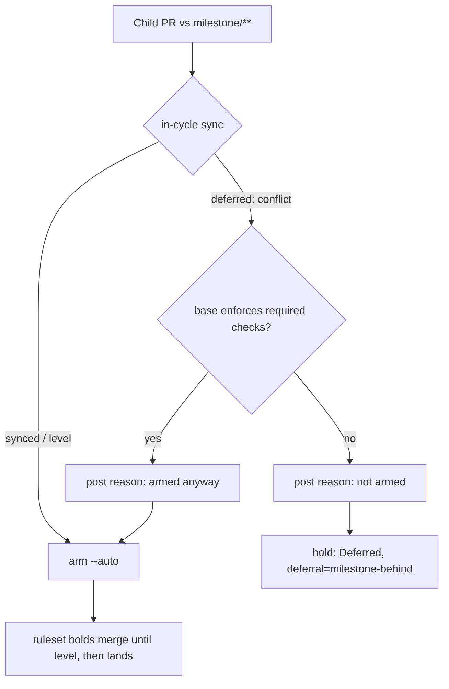

# Arm the child PR even when the in-cycle milestone sync conflicts (Issue #2460)

## Summary

Closes #2460

`enableAutoMerge` ran the #2005 `syncBehindMilestone` hook before arming a child
PR against `milestone/**`. When that sync came back `deferred` (conflict), it
posted the sync reason and returned `Deferred` without ever issuing
`gh pr merge --auto` — the #1779 withhold. With the strict up-to-date policy on
the milestone ruleset, being behind blocks the _merge_, not the _arming_, so the
withhold only left the child unarmed.

The deferred branch now posts its reason and falls through to the arming loop.
The child is armed, and the ruleset holds the merge until the periodic 1.72 sync
levels the branch — at which point the child lands with no further scan needed.

### One carve-out the issue did not anticipate

Arming early is safe **because** the milestone ruleset holds the merge. A base
that enforces no required checks has no such policy: `--auto` there merges
immediately whatever CI says (the #4375 defect), and the gated direct merge only
measures the head against its own base — `enforcePreMergeRequirements` returns
`behind_target` from `state.behindBy`, which never measures the base against the
default branch. Either route would land the child on a stale milestone tip: the
exact side-pick `docs/MERGE.md` promises never happens.

So a behind base that is **unprotected** posts its sync reason and then defers
to the next scan, as before. The withhold is removed where the issue's own
premise holds (a protected base) and retained where it does not.

Base protection is therefore settled **before** the sync reason is written, so
the single comment names the outcome the run actually produced. An earlier
revision of this branch posted "Auto-merge is armed anyway" unconditionally and
could then hold the PR — a sync-reason comment on a PR with a null
`autoMergeRequest`, which is exactly the post-release failure signal the issue
names. Both independent reviewers caught it and it is fixed here.

**This PR follows #2490.** That PR landed the arming change on
`milestone/2442-worker-deno-lib-auto-merge-arming-path` before its summary had
closed the criteria out; this one carries the corrected closure blocks and the
fixes both reviewers asked for. Issue #2460 is still open, so the closing
keyword rides here.

### Deliberate deviations from the literal wording

- **`sync-base-unreadable` still returns `Deferred`.** The issue asked for the
  fall-through in both branches, but that deferral is not part of the
  `syncBehindMilestone` path at all — it is the #1967 retargeted-sync-PR guard
  (`pr_auto_merge.ts:788`, `:819`), where an unreadable default branch means the
  worker cannot tell whether the base is safe at all; arming there would
  reintroduce #1957. No acceptance criterion covers it — every one names the
  `deferred` outcome — so the #1967 holds are untouched.
- **The #477 `lookup-failed` defer is likewise untouched**, for the same reason.
- **`milestone_children_gate.ts` needed no change.** `requireSyncedBase: true`
  stays at both call sites: the gate's defer is what _triggers_ the #2005 sync
  and the reason comment in the first place. Only the treatment of that defer
  changed — it now feeds the `deferral` field for logging (which the issue
  explicitly permits) while `result` reflects the real arming outcome.

## Evidence

Backend-only change to the auto-merge arming path; no visual surface, so no
screenshots.

- `deno test --allow-all tests/pr_auto_merge_test.ts < /dev/null` →
  `ok | 50 passed | 0 failed (18ms)`
- `deno test --allow-all tests/pr_auto_merge_test.ts tests/pr_maintenance_test.ts
  tests/milestone_children_gate_test.ts tests/milestone_summary_pr_auto_merge_test.ts
  tests/pr_auto_merge_sync_pr_retarget_test.ts < /dev/null`
  → `ok | 164 passed | 0 failed (353ms)`
- `./quality.sh < /dev/null` → **Result: PASSED (with skipped checks)** — every
  stage PASSED; only `config integration` SKIPPED, which needs credentials
  unavailable in the container. Run after the final edit.
- `deno fmt` / `deno lint` / `deno check` clean on `lib/pr_auto_merge.ts` and
  `tests/pr_auto_merge_test.ts`.

## Acceptance Criteria

<!-- vibe-spec-review inputs="diff+issue-body" -->

- **partial** — With a fake `syncBehindMilestone` returning `deferred`,
  `gh pr merge --auto` is issued, the result is `Enabled`, and exactly one
  sync-reason comment is posted — evidence:
  `worker/deno/tests/pr_auto_merge_test.ts:1035::a conflicting in-cycle sync arms
  the child anyway and posts the reason (Issue #2460)`,
  which asserts `Enabled`, `autoCalls === 1` and `comments.length === 1` —
  reviewer: partial — reason: the arming is conditional on the base enforcing
  required checks (`worker/deno/lib/pr_auto_merge.ts:887`), so the criterion's
  unconditional form is not met; see the carve-out above for why an unprotected
  base must still be held.
- **met** — `synced` and `level` outcomes are unchanged — evidence: the re-ask
  path at `worker/deno/lib/pr_auto_merge.ts:697-713` is untouched, and
  `worker/deno/tests/pr_auto_merge_test.ts::a clean in-cycle sync arms a behind
  child (Issue #2005)`
  is unmodified and passes — reviewer: met
- **met** — The #2457 reporting posts nothing further for this deferral (one
  comment total) — evidence: `worker/deno/lib/pr_auto_merge.ts:298` returns
  false for a `milestone-behind` outcome, asserted by
  `autoMergeOutcomeNeedsComment(result) === false` in both Issue #2460 tests
  (`worker/deno/tests/pr_auto_merge_test.ts:1035`, `:1082`) — reviewer: met
- **met** — A regression test asserts arming on deferred sync; the former
  withhold tests are updated — evidence: the new test at
  `worker/deno/tests/pr_auto_merge_test.ts:1035`, plus five former withhold
  tests rewritten (not removed) at `:597`, `:667`, `:746`, `:803` and `:1082` to
  assert `Enabled` with `deferral === "milestone-behind"` — reviewer: met
- **met** — `docs/MERGE.md` no longer describes the withhold — evidence:
  `docs/MERGE.md:429-445` now reads "**armed anyway** (Issue #2460)", and the
  stale lines in `docs/workflows/milestones.md:113` are updated too — reviewer:
  partial — reason: departing from the reviewer, which read the new
  unprotected-base hold documented at `docs/MERGE.md:465` as a withhold still
  being described; that is a different, narrower hold, and the #1779 withhold
  the criterion names is gone from the file.
- **met** — Tests and quality checks pass (`./quality.sh`) — evidence:
  `./quality.sh < /dev/null` → `Result: PASSED (with skipped checks)` after the
  final edit; see Evidence — reviewer: met
- **unrequested** — a behind base that enforces no required checks is held
  rather than armed or direct-merged, across
  `worker/deno/lib/pr_auto_merge.ts:887-899`, its test at
  `worker/deno/tests/pr_auto_merge_test.ts:1082` and the bullet at
  `docs/MERGE.md:465` — reviewer: unrequested — reason: the issue's premise is
  the milestone ruleset holding the merge; without a ruleset neither `--auto`
  nor the gated direct merge measures the base against the default branch, so
  removing the withhold there would land children on stale tips — the #1779
  side-pick.
- **unrequested** — the sync-reason comment now names the outcome, and base
  protection is resolved through a shared memoised helper to make that possible
  — evidence: `worker/deno/lib/pr_auto_merge.ts:250-256`, `:513-535`, `:716` —
  reviewer: unrequested — reason: added this run to remove the false "armed
  anyway" claim on a held PR that both reviewers found; it costs no extra API
  call because the later arming check reads the same memo.
- **unrequested** — comment rewrite in `worker/deno/lib/pr_maintenance.ts:1670`,
  a file the issue never names — reviewer: unrequested — reason: no behaviour
  change; the comment described the removed #1779 withhold and would otherwise
  have been left stating the opposite of the code above it.

## Standards Review

<!-- vibe-standards-review inputs="diff+CODING-STANDARDS.md" -->

- **violation** — the sync-reason comment asserted "Auto-merge is armed anyway"
  unconditionally but was posted before the base-protection check that can hold
  the PR, so a held PR was told it was armed and `autoMergeOutcomeNeedsComment`
  suppressed any correction — breaches "Never Fail Silently — Fail Loud" —
  evidence: `worker/deno/lib/pr_auto_merge.ts:251` — reason: fixed here —
  protection is settled first (`:716`) and the comment branches on the real
  outcome (`:250-256`).
- **violation** — a normal-path "arming anyway" line was emitted through the
  `log` seam, which is a warning sink, so it fired every sweep for every behind
  child — breaches "Log Levels Are a Promise About What the Reader Must Do" —
  evidence: `worker/deno/lib/pr_auto_merge.ts:690` (pre-fix) — reason: fixed
  here — the line is removed; the fact rides on `deferral` and
  `logAutoMergeOutcome` reports the outcome at INFO.
- **violation** — the unprotected-base test asserted only
  `comments.length === 1` and never the body, leaving the wrong-comment defect
  uncovered — breaches the test-coverage expectation that an error path asserts
  the observable effect — evidence:
  `worker/deno/tests/pr_auto_merge_test.ts:1111` (pre-fix) — reason: fixed here
  — both Issue #2460 tests now assert the comment body.
- **violation** — the singular/plural assertions deleted in the rewrite left the
  pluralisation ternary untested — breaches TDD rule 5 (behaviour that had
  coverage lost it) — evidence: `worker/deno/tests/pr_auto_merge_test.ts` patch
  lines 345-346, 448 — reason: fixed here — the ternary lived only in the
  removed warning line and no longer exists.
- **violation** — `docs/MERGE.md` documented the hold as "no required checks"
  while the code holds on `protectedBase !== true`, which also covers a failed
  protection lookup — breaches "A Code Change Owes a Docs Change" — evidence:
  `docs/MERGE.md:465` — reason: fixed here — the bullet now says "does not
  enforce required checks" and states that a failed lookup reads as unprotected.
- **violation** — the "Issue #2460: kept `true`" comment sat above the
  `headRefName` spread rather than the `requireSyncedBase: true` it describes —
  Boy Scout / comment-accuracy — evidence:
  `worker/deno/lib/pr_auto_merge.ts:620` — reason: fixed here — moved above the
  option it annotates.
- **clean** — Australian English throughout the added prose and comments; no new
  dependency and no Node tooling added to this Deno repo; `Result`-style
  injected seams (`isBaseProtectedFn`, `decideMilestoneBaseFn`,
  `syncBehindMilestone`, `directMergeFn`) rather than ambient state; no
  grep-the-source tests, no wall-clock sleeps, no benchmark-shaped unit test;
  tests reset `_resetBaseProtectionMemo` / `_resetMilestoneBehindMemo` per case
  so the file stays parallel-safe; every downstream consumer of `deferral`
  (`pr_maintenance.ts:1676`, `:1687`, `pr_auto_merge.ts:298`) checked — an armed
  outcome returns `landed` before `deferral` is read, so the field riding along
  cannot mis-route; docs surfaces updated in the same change.

## Test Plan

`worker/deno/tests/pr_auto_merge_test.ts`, all against the real
`enableAutoMerge` with injected fakes — no source-text inspection:

- **Happy path (new, AC1)** — `:1035` "a conflicting in-cycle sync arms the
  child anyway and posts the reason (Issue #2460)": deferred sync + protected
  base ⇒ `Enabled`, `--auto` issued once, exactly one comment whose body says
  "Auto-merge is armed anyway", `autoMergeOutcomeNeedsComment` false.
- **Error path (new)** — `:1082` "a behind base with no required checks is held,
  not armed or side-picked (Issue #2460)": deferred sync + **unprotected** base
  ⇒ `Deferred`, `deferral === "milestone-behind"`, zero `--auto` calls, zero
  direct-merge calls, one comment whose body says "Auto-merge is not armed".
- **Log level** — `:667` "arming over a behind base logs as a success, not a
  warning": the armed outcome logs exactly one INFO line through
  `logAutoMergeOutcome`, and no warning.
- **Regression (updated ×5)** — the former #1779 withhold tests now assert the
  armed outcome (`Enabled`, `deferral` retained, `--auto` issued, no direct
  merge, no label). Each resets `baseProtectionMemo` and pins
  `isBaseProtectedFn` so the memo cannot leak across tests.
- **Unchanged** — `synced` and `level` sync outcomes, the #1967
  `sync-base-unreadable` holds and the #477 `lookup-failed` defer all keep their
  existing assertions.

Full file: 50 passed / 0 failed; the five related files together: 164 passed / 0
failed.
