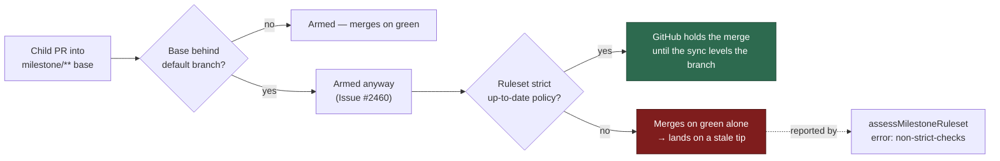

# Report a `milestone/**` ruleset lacking the strict up-to-date policy

## Summary

`assessMilestoneRuleset` typed `strict_required_status_checks_policy` but never
reported a `milestone/**` ruleset that omits it. A child PR whose base is
behind the default branch is armed anyway (Issue #2460), and that policy is the
only thing holding the merge until the sync levels the branch — without it the
child merges on green checks alone and lands on a stale tip, with nothing ever
forcing it current.

The assessment now raises an `error` finding, `non-strict-checks`, when a
`milestone/**` ruleset has required status checks but does not require the
branch to be up to date. `buildMilestoneRulesetBody` already wrote the
parameter (`worker/deno/lib/repo_rulesets.ts:442`), so the ruleset the fleet
creates for itself passes — only a hand-written or older ruleset trips the
finding. Closes #2461.

## Evidence

Backend/CLI change with no web interface, so there is nothing to screenshot.
The evidence is the test suite: `deno test tests/milestone_ruleset_check_test.ts
tests/milestone_ruleset_read_test.ts` → 52 passed, 0 failed. Against the base
branch's `milestone_ruleset_check.ts` the new tests do not even type-check
(`non-strict-checks` is not in the finding-code union), which is the red half of
the loop.

Where the new finding sits in the arming path:

## Acceptance Criteria

<!-- vibe-spec-review inputs="diff+issue-body" -->

- **met** — Strict policy `false` or absent → an `error` finding with code
  `non-strict-checks` — evidence:
  `worker/deno/lib/milestone_ruleset_check.ts:316-341`;
  `worker/deno/tests/milestone_ruleset_check_test.ts::assessMilestoneRuleset - required checks that do not require an up-to-date branch are an ERROR`
  and `::assessMilestoneRuleset - an absent strict policy is reported like an explicit false`
  — reviewer: met
- **met** — Strict policy `true` → no such finding and the ruleset reports
  `configured` — evidence:
  `worker/deno/tests/milestone_ruleset_check_test.ts::assessMilestoneRuleset - a strict ruleset raises no staleness finding and reports configured`
  — reviewer: met
- **met** — No `required_status_checks` rule → only `no-required-checks`, never
  `non-strict-checks` — evidence:
  `worker/deno/tests/milestone_ruleset_check_test.ts::assessMilestoneRuleset - no required checks means no staleness finding to make`
  — reviewer: met
- **met** — The body produced by `buildMilestoneRulesetBody` passes
  `assessMilestoneRuleset` with no errors — evidence:
  `worker/deno/tests/milestone_ruleset_check_test.ts::assessMilestoneRuleset - the ruleset this repo writes passes with no errors`
  — reviewer: met — reason: the reviewer noted the assertion was weaker than
  the behaviour (it allowed a vacuous pass); it now asserts the exact
  `["configured"]` result
- **met** — Unit tests cover strict true / false / absent / no-checks —
  evidence: the four tests named above — reviewer: met
- **met** — Tests and quality checks pass (`./quality.sh`) — evidence: the full
  gate run after the final edit — reviewer: met — reason: the reviewer ran it
  itself and reported exit 0; it was re-run here after the review fixes
- **unrequested** — the two test fixtures gain
  `strict_required_status_checks_policy: true`
  (`worker/deno/tests/milestone_ruleset_check_test.ts:48`,
  `worker/deno/tests/milestone_ruleset_read_test.ts:44`) — reviewer: unrequested
  — reason: both fixtures model a *correct* milestone ruleset, so the new error
  would otherwise fire on every test that uses them; the same edit was made for
  `do_not_enforce_on_create` when that check was added

## Standards Review

<!-- vibe-standards-review inputs="diff+CODING-STANDARDS.md" -->

- **violation** — the docs claimed a surface the code does not have ("surfaced
  … on the repository's tracking issue") — evidence: `docs/MERGE.md:509` —
  reason: fixed here; the paragraph now says the findings are printed by
  `setup`'s ruleset pass (`reportMilestoneRuleset`), which is their only
  non-test consumer
- **violation** — the finding message cited Issue #2460 rather than the issue
  that introduced the check — evidence:
  `worker/deno/lib/milestone_ruleset_check.ts:339` — reason: fixed here; it now
  cites Issue #2461, matching every peer finding in the module
- **violation** — the guard `checks !== undefined && contexts.length > 0` was
  duplicated verbatim on two adjacent blocks (DRY/KISS) — evidence:
  `worker/deno/lib/milestone_ruleset_check.ts:325` — reason: fixed here; the
  staleness check moved inside the existing required-checks guard
- **violation** — two new tests duplicated existing ones assertion-for-assertion
  — evidence: `worker/deno/tests/milestone_ruleset_check_test.ts:603` and `:616`
  — reason: fixed here; the healthy case now spells the parameter out instead of
  leaning on the fixture, and the no-checks case asserts the absence of
  `non-strict-checks` explicitly
- **violation** — `severity: "error"` for a condition nothing stops on, where
  the log-level standard would argue for a warning — evidence:
  `worker/deno/lib/milestone_ruleset_check.ts:330` — reason: stands; the issue
  specifies `error` and asks the message to mirror `unreportable-checks`, which
  is also an error. The reviewer's related note — that
  `setup_cli.ts:1335-1341` explains any non-zero error count as a service
  account push problem — is a pre-existing inaccuracy affecting
  `create-blocked` and `unreportable-checks` equally, and is out of scope here
- **clean** — `deno fmt`, `deno lint`, `deno check` clean; markdownlint clean on
  `docs/MERGE.md`; Australian English throughout; no hidden or credential paths
  staged; tests call the real function with test data rather than inspecting
  source; module/test co-location kept; no new dependencies

## Test Plan

Added to `worker/deno/tests/milestone_ruleset_check_test.ts`:

- `assessMilestoneRuleset - required checks that do not require an up-to-date branch are an ERROR`
- `assessMilestoneRuleset - an absent strict policy is reported like an explicit false`
- `assessMilestoneRuleset - a strict ruleset raises no staleness finding and reports configured`
- `assessMilestoneRuleset - no required checks means no staleness finding to make`
- `assessMilestoneRuleset - the ruleset this repo writes passes with no errors`

Modified fixtures (no test removed or disabled):

- `worker/deno/tests/milestone_ruleset_check_test.ts` — the shared `ruleset()`
  fixture now sets `strict_required_status_checks_policy: true`
- `worker/deno/tests/milestone_ruleset_read_test.ts` — the `MILESTONE` fixture
  does the same
