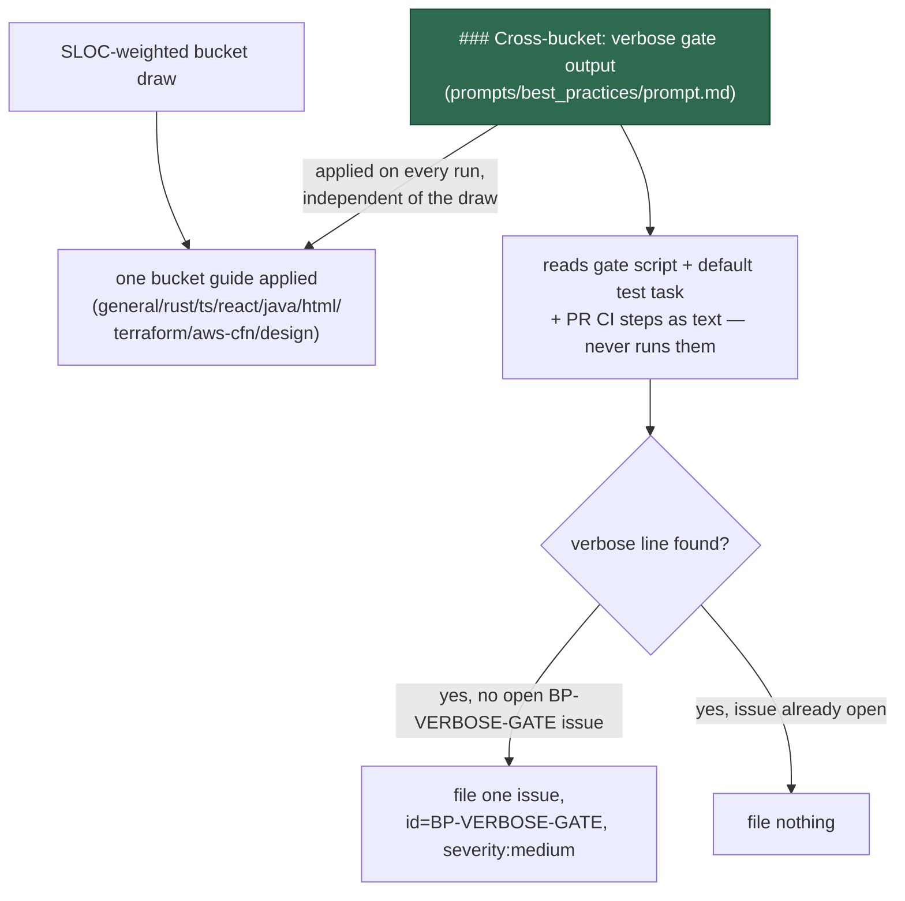

# One verbose-gate check runs on every best-practices scan, not four in nine

## Summary

The rule that a green gate prints no per-test pass line shipped as LLM check 19
in the `general` bucket guide, plus a near-identical "Test output" section
duplicated in `typescript`, `rust`, `java` and `react` — five copies of one
rule, four of which a scan never sees, because the SLOC-weighted bucket draw
applies exactly one guide per run. A repository whose draw landed on
`terraform`, `design`, `html` or `aws-cloudformation` was never asked the
question at all.

The rule now lives once, in a `### Cross-bucket: verbose gate output` stanza in
the orchestrator prompt (`prompts/best_practices/prompt.md`), which every
bucket run applies regardless of the draw. The five bucket guides that carried
a full copy now carry a one-line pointer to the stanza instead. The check reads
the quality-gate script, the default test task and pull-request CI steps **as
text only** — it never runs the suite — and flags test/build/install
invocations with no quiet-or-failures-only flag, plus any explicit `--verbose`,
`-v` or `set -x`. A finding files once per repository under the fixed id
`BP-VERBOSE-GATE` at `severity:medium`; a second scan while that issue is open
files nothing, and the scan never opens a PR — the fix rides the repository's
own `work-on` PR.

Closes #2472.



## Evidence

Backend/prompt change with no web interface to screenshot. The evidence is the
regression suite and the full quality gate.

```text
worker/deno/tests/best_practices_verbose_gate_test.ts
ok | 30 passed | 0 failed (12ms)
```

The other `markdown_docs.ts` consumer suites, re-run to confirm the shared
fence-aware `section()`/`withoutSection()` refactor caused no regression
elsewhere:

```text
documentation_drift_policy_test.ts    ok | 5 passed  | 0 failed
rtk_output_trial_docs_test.ts         ok | 11 passed | 0 failed
release_integrity_docs_test.ts        ok | 9 passed  | 0 failed
update_mode_docs_test.ts              ok | 19 passed | 0 failed
```

Full gate, run once from the repo root after the final fix:

```text
./quality.sh
Result: PASSED (with skipped checks)
```

All 20 non-skipped checks (deno tests, deno lint, deno type check, deno fmt,
mermaid, markdownlint, semgrep, release-tag ruleset, completeness checks,
source targets, chokepoint checks, workflow hygiene, benchmark audit,
hardcoded branch names) PASSED; `config integration` SKIPPED as always.

## Acceptance Criteria

<!-- vibe-spec-review inputs="diff+issue-body" -->

- **met** — the check runs on every best-practices scan whichever bucket the
  draw picks, and on no other cadence — evidence:
  `prompts/best_practices/prompt.md` `### Cross-bucket: verbose gate output`,
  pinned by `the verbose-gate stanza states the runs on every scan regardless
  of the draw` — reviewer: met
- **met** — one stanza, one ecosystem flag table, applied by every bucket run
  — evidence: `prompts/best_practices/prompt.md`, pinned by `the verbose-gate
  stanza states the per-ecosystem quiet flags` — reviewer: met
- **met** — `general.md` check 19 and the four bucket "Test output" sections
  fold into one-line pointers — evidence:
  `prompts/best_practices/buckets/{general,typescript,rust,java,react}.md`,
  pinned by `no bucket guide keeps a duplicate Test output section` and `every
  folded guide points at the orchestrator stanza` — reviewer: met
- **met** — a test asserts the stanza exists and no guide keeps a full copy;
  `docs/BEST-PRACTICES-SCAN.md` documents it — evidence:
  `worker/deno/tests/best_practices_verbose_gate_test.ts`, plus `the scan
  documentation records the stanza and its fixed id` — reviewer: met
- **met** — the check reads the quality-gate script, default test task and PR
  CI steps as text and never runs the suite — evidence: stanza clause `the
  three surfaces it reads` and `static-evidence-only rule`, both pinned with a
  negative control — reviewer: met
- **met** — flags runners/build/install steps with no quiet flag, plus
  explicit `--verbose`/`-v`/`set -x` — evidence: stanza clause
  `explicit-verbosity detections` — reviewer: met
- **met** — one issue per repository under fixed id `BP-VERBOSE-GATE` at
  `severity:medium`, listing every verbose line by file/line with the quiet
  flag beside it; a second scan while open files nothing — evidence: stanza
  clauses `fixed finding id, one issue per repository` and `severity band` —
  reviewer: met
- **met** — the six already-known-verbose repositories get no hand-filed
  issue — reviewer: met — reason: this is an operational instruction to the
  scan operator, not a testable code path; no code in this diff hand-files
  issues for those repositories, and the fixed-id dedup means a prior run's
  filed issue (if any) still suppresses a repeat.
- **met** — the scan never opens a PR; the fix rides the repository's own
  `work-on` PR — evidence: stanza clause `no-pull-request boundary` — reviewer:
  met
- **met** — a governed waiver marker fails closed on a missing field or passed
  expiry — evidence: stanza clause `fail-closed governed suppression` —
  reviewer: met
- **met** — on-demand test tasks are out of scope — evidence: stanza clause
  `on-demand carve-out` — reviewer: met
- **met** — `./quality.sh` passes — evidence: full gate run after the final
  edit, `Result: PASSED (with skipped checks)`, 20 non-skipped checks, 0
  failures — reviewer: met

## Standards Review

<!-- vibe-standards-review inputs="diff+CODING-STANDARDS.md" -->

- **violation** — `best_practices_verbose_gate_test.ts` reimplemented a local,
  non-fence-aware `headingIndex`/`sectionEnd`/`section` helper set instead of
  importing the shared, fence-aware `section()`/`readRepoDoc()` from
  `worker/deno/tests/support/markdown_docs.ts`, contradicting the
  "Documentation-drift tests" condition in `CODING-STANDARDS.md` that
  prose-assertion tests must be section-scoped through the shared helper —
  evidence: `worker/deno/tests/best_practices_verbose_gate_test.ts` (prior
  revision) — reason: **fixed here** — the test now imports `readRepoDoc`,
  `section` and the new `withoutSection` from `markdown_docs.ts`; the local
  duplicate helpers are removed (42 lines deleted, 7 added). `markdown_docs.ts`
  gained a shared `sectionBounds()` and an exported `withoutSection()` so the
  negative-control pattern this test needs is available to every consumer, not
  reinvented per file. Verified against all five `markdown_docs.ts` consumers
  (74 tests total, 0 failures) and the full gate.
- **clean** — Australian English throughout; no hidden or secret paths staged;
  every test calls a real function (`loadPrompt`, `readRepoDoc`, `section`,
  `withoutSection`) and asserts on its return value — no source-grepping;
  every prose assertion is paired with a negative control against the same
  text with the stanza removed, so a predicate that pins nothing is caught;
  the stanza itself carries no bare `#NNN` issue reference or repo-relative
  path, so it stays portable when filed verbatim as an issue body in another
  repository (`the verbose-gate stanza stays portable across repositories`);
  commit references Issue #2472 and carries `Co-Authored-By` and
  `Vibe-Coder-Run-Id` trailers.

## Test Plan

- `worker/deno/tests/best_practices_verbose_gate_test.ts` (new, 30 tests):
  - One states/absent pair per contract clause (12 clauses × 2) run against
    the orchestrator stanza and against the orchestrator with the stanza cut
    out, so a predicate satisfied by unrelated prose elsewhere in the prompt
    is caught by its own negative control.
  - `no bucket guide keeps a duplicate Test output section` / `... a copy of
    the quiet-flag table` — the fold actually happened in all nine guides.
  - `every folded guide points at the orchestrator stanza` — the five folded
    guides left a pointer, not a silent deletion.
  - `every bucket guide is still non-empty after the fold`.
  - `the scan documentation records the stanza and its fixed id`.
  - `the verbose-gate stanza stays portable across repositories` — no bare
    `#NNN` or repo-local path inside the stanza body.
- `worker/deno/tests/support/markdown_docs.ts` — added `sectionBounds()`
  (private, shared by `section()` and the new `withoutSection()`) and exported
  `withoutSection()`. Behaviour-preserving for existing callers; re-ran all
  four other consumer suites (44 tests) to confirm.
- No existing test was modified to pass, or removed.

## Docs

- `docs/BEST-PRACTICES-SCAN.md` — new entry naming the `### Cross-bucket:
  verbose gate output` stanza and the fixed `BP-VERBOSE-GATE` finding id.
- `prompts/best_practices/buckets/{general,typescript,rust,java,react}.md` —
  the five full copies replaced with one-line pointers to the orchestrator
  stanza.
