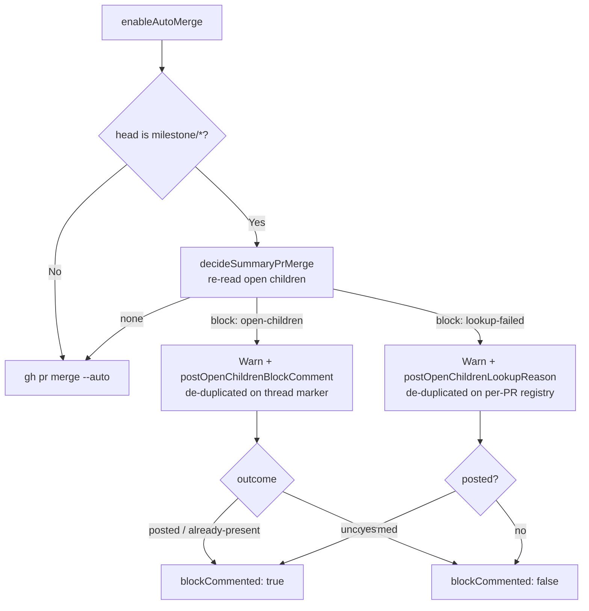

# PR Summary — Issue #2479

## Summary

`refuseMilestoneMerge` returned `AutoMergeResult.BlockedOpenChildren` for two
different situations, and only one of them explained itself on the PR. A genuine
`open-children` block posts the gate's own comment; a `lookup-failed` block —
the children count could not be read — only logged. Because
`autoMergeOutcomeNeedsComment` (Issue #2457) treats `BlockedOpenChildren` as
"already commented", an unreadable count left the PR unarmed with nothing on the
thread saying why.

This change:

1. **Distinguishes the two reasons** on `EnableAutoMergeResult` via a new
   optional `blockCommented` flag, set on both branches by
   `refuseMilestoneMerge`.
2. **Posts one reason comment on the `lookup-failed` branch**
   (`postOpenChildrenLookupReason`), naming the milestone, the unreadable lookup
   and that the sweep retries.
3. **De-duplicates that comment per PR** with a module-level
   `postedOpenChildrenLookupReason` registry keyed `${repo}#${prNumber}`,
   mirroring `postBehindSyncReason`.

To make `blockCommented` truthful on the genuine branch,
`postOpenChildrenBlockComment` was widened from `boolean` to the tri-state
`OpenChildrenCommentOutcome = "posted" | "already-present" | "unconfirmed"`. The
old boolean conflated "the explanation is already on the thread" with "the post
failed" — the second must not count as an explained block.

**Issue step 2 (`autoMergeOutcomeNeedsComment` returning `true` for the
uncommented case) is deliberately not edited here.** That function and
`buildArmingReasonComment` do not exist on `main` (base `186f891`); they live
only on `origin/milestone/2442-worker-deno-lib-auto-merge-arming-path`. Issue
#2479 has no milestone, so this is a main-line PR. The acceptance criteria are
satisfied directly in `refuseMilestoneMerge`, and `blockCommented` is exported
so the milestone branch's chokepoint can consume it when it merges.

**`resetOpenChildrenLookupComments()` is deliberately NOT wired into
`resetIterationCaches`** (`run_core_production_deps.ts:4647`), which clears
`resetBehindSyncComments()` every iteration. A lookup that stays broken is
re-swept every cycle; clearing the registry per iteration would re-post the
comment every cycle — exactly what acceptance criterion 3 forbids. The reason is
recorded at the declaration; the reset is tests-only.

Closes #2479

## Evidence

Backend/worker change only — there is no web interface or visual surface, so no
browser screenshots apply.

The two block reasons and where each is explained:



Files changed:

- `worker/deno/lib/pr_auto_merge.ts` — `OPEN_CHILDREN_LOOKUP_MARKER`, the
  per-PR registry, `postOpenChildrenLookupReason`,
  `resetOpenChildrenLookupComments`, `blockCommented` on
  `EnableAutoMergeResult`, both branches of `refuseMilestoneMerge`.
- `worker/deno/lib/milestone_children_gate.ts` — `postOpenChildrenBlockComment`
  returns `OpenChildrenCommentOutcome`.
- `worker/deno/tests/pr_auto_merge_test.ts` — five new tests.
- `worker/deno/tests/milestone_children_gate_test.ts`,
  `worker/deno/tests/security_untrusted_ingestion_1249_test.ts` — five
  assertions updated for the widened return type.
- `docs/INTERNALS.md` — the auto-merge gate section and its Mermaid diagram now
  describe the second comment and its registry de-duplication.

## Reproduction

- **symptom:** When the open-children count for a milestone summary PR cannot be
  read, `refuseMilestoneMerge` returns `BlockedOpenChildren` and only logs. No
  comment is posted, and `autoMergeOutcomeNeedsComment` suppresses the arming
  chokepoint's comment on the premise the gate already spoke — so the PR sits
  unarmed with nothing on it saying why.
- **status:** verified
- **regression test:**
  `worker/deno/tests/pr_auto_merge_test.ts::pr_auto_merge - blocks the merge when the open-children count cannot be read`

Verified by reverting the fix in place — `postOpenChildrenLookupReason(...)`
replaced with `const blockCommented = false;` — and running the suite against
the unfixed behaviour:

```text
pr_auto_merge - blocks the merge when the open-children count cannot be read ... FAILED (8ms)
pr_auto_merge - repeated sweeps over an unreadable count post one comment ... FAILED (758µs)
pr_auto_merge - a failed lookup comment post is reported, not swallowed ... FAILED (249µs)
  => ./tests/pr_auto_merge_test.ts:352:6  error: AssertionError: Values are not equal.
  => ./tests/pr_auto_merge_test.ts:383:6  error: AssertionError: Values are not equal.
  => ./tests/pr_auto_merge_test.ts:409:6  error: AssertionError
FAILED | 41 passed | 3 failed (28ms)
```

With the fix restored, the same file passes: `ok | 46 passed | 0 failed (40ms)`.

## Acceptance Criteria

Reproduced verbatim from the spec reviewer.

<!-- vibe-spec-review inputs="diff+issue-body" -->

```text
- criterion: "A `lookup-failed` open-children block posts exactly one reason comment naming the unreadable lookup and that the sweep retries."
  reviewer: spec
  verdict: met
  evidence: worker/deno/lib/pr_auto_merge.ts:1028 (`postOpenChildrenLookupReason` call in the `lookup-failed` branch of `refuseMilestoneMerge`), body built at pr_auto_merge.ts:287-303; test "pr_auto_merge - blocks the merge when the open-children count cannot be read" (tests/pr_auto_merge_test.ts:352) asserts `state.posted.length === 1`, the marker, "could not be read", the underlying "HTTP 502 Bad Gateway" detail and "retries"
  reason: comment body names both the failed lookup detail and that "The Auto-Merge sweep retries every cycle"; PASS observed in the run

- criterion: "A genuine `open-children` block still posts only the gate's own comment."
  reviewer: spec
  verdict: met
  evidence: pr_auto_merge.ts:1044-1065 — the genuine branch still calls only `postOpenChildrenBlockComment` and never `postOpenChildrenLookupReason`; test "pr_auto_merge - blocks summary-PR auto-merge while milestone has open children" (tests/pr_auto_merge_test.ts:262-267) asserts one posted comment carrying `OPEN_CHILDREN_BLOCK_MARKER` and explicitly asserts `OPEN_CHILDREN_LOOKUP_MARKER` is absent

- criterion: "A repeated sweep over the same unreadable PR posts no further comments."
  reviewer: spec
  verdict: met
  evidence: `postedOpenChildrenLookupReason` Set at pr_auto_merge.ts:271 with the early return at pr_auto_merge.ts:286; test "pr_auto_merge - repeated sweeps over an unreadable count post one comment" (tests/pr_auto_merge_test.ts:383) loops three `enableAutoMerge` cycles and asserts `state.posted.length === 1`
  reason: dedup is the in-process Set the issue prescribed (mirrors `postedBehindSyncReason`), and is deliberately not cleared per cycle; note it is process-local — `OPEN_CHILDREN_LOOKUP_MARKER` is embedded in the body but never read back from the thread, so a worker restart would re-post once, unlike the gate's own marker-read dedup

- criterion: "Unit tests with a scripted fake `ghCommandFn` assert the comment counts."
  reviewer: spec
  verdict: met
  evidence: `createUnreadableChildrenStub` (tests/pr_auto_merge_test.ts:342) scripts a `gh` fake that throws on `/issues?milestone=`; three tests at tests/pr_auto_merge_test.ts:352, :383 and :409 assert `state.posted.length` of 1, 1 and 0 respectively. Verified by running `deno test --allow-all tests/pr_auto_merge_test.ts`: 44 passed, 0 failed; touched siblings `tests/milestone_children_gate_test.ts` + `tests/security_untrusted_ingestion_1249_test.ts` also pass (53 passed, 0 failed)

- criterion: "`./quality.sh` passes."
  reviewer: spec
  verdict: partial
  evidence: not run
  reason: my review mandate is read-only and forbids running ./quality.sh, so I can only confirm the three touched test files pass — I cannot verify the full gate

- unrequested: "`postOpenChildrenBlockComment` return type changed from `boolean` to the three-state `OpenChildrenCommentOutcome` union, cascading into milestone_children_gate.ts and two unrelated test files (milestone_children_gate_test.ts, security_untrusted_ingestion_1249_test.ts)."
  reviewer: spec
  reason: not literally asked for, but needed to set `blockCommented` honestly on the genuine-block branch (the old `false` conflated "already present" with "post failed"); sole production caller is pr_auto_merge.ts:1052 and it handles all three states

- unrequested: "The issue's step 2 — make `autoMergeOutcomeNeedsComment` return true for the uncommented lookup-failed case — is not implemented here."
  reviewer: spec
  reason: defensible — I verified `autoMergeOutcomeNeedsComment` and `buildArmingReasonComment` are absent from the base commit 186f891 and exist only on origin/milestone/2442-worker-deno-lib-auto-merge-arming-path; this diff instead satisfies the acceptance criteria directly in `refuseMilestoneMerge` and exports `blockCommented` so that branch can consume it
```

The one `partial` — criterion 5, which the reviewer could not run — is answered
by the gate output in the Test Plan below: `Result: PASSED (with skipped
checks)`.

## Standards Review

Reproduced verbatim from the standards reviewer.

<!-- vibe-standards-review inputs="diff+CODING-STANDARDS.md" -->

```text
- violation: "The new PR comment interpolates the attacker-writable milestone title and the raw gh error text without `scrubUntrustedText`, so a forged HTML marker in a title lands in a fleet-authored comment."
  reviewer: standards
  file: worker/deno/lib/pr_auto_merge.ts:299
  standard: Coding Principles → KISS "the floor is never cut: input validation at a trust boundary, security"; DRY (single source of truth) — the sibling renderer `renderOpenChildrenBlockComment` scrubs for exactly this reason
  reason: `milestone_children_gate.ts:462-473` scrubs `milestoneTitle` because "an unscrubbed `<!-- … -->` marker in a title lands in this body and is read back as a genuine marker on a later scan" (Issue #1249 finding 8); a milestone titled with `OPEN_CHILDREN_BLOCK_MARKER` would now be echoed into a fleet-authored comment and permanently suppress the genuine open-children block explanation via `hasFleetAuthoredMarker`.

- violation: "The documented behaviour of the unreadable-count branch changed but `docs/INTERNALS.md` still says the gate posts no comment there."
  reviewer: standards
  file: docs/INTERNALS.md:2158
  standard: A Code Change Owes a Docs Change
  reason: The gate's Mermaid node reads `E[Warn, no comment<br/>PR left open]` and the bullet at INTERNALS.md:2143-2148 describes the single comment as de-duplicated on a hidden marker; the change adds a second comment on the read-failed path, de-duplicated by an in-memory registry instead, and neither surface was updated.

- violation: "A new permanent outbound sink (a public PR comment carrying a raw gh error message) is not routed through `redactSecrets()`."
  reviewer: standards
  file: worker/deno/lib/pr_auto_merge.ts:309
  standard: Secret Redaction — Every Outbound Sink
  reason: `detail` is `childrenResult.error.message`, i.e. unbounded API/transport text, published to a public PR thread; the standard says wiring a new sink to `redactSecrets()` is part of adding it. Noting honestly that the adjacent `postBehindSyncReason` has the same gap — the standard still applies to the newly added sink.

- violation: "`OPEN_CHILDREN_LOOKUP_MARKER` is exported and written into the body but never read, so 'at most once' holds only for the life of the process."
  reviewer: standards
  file: worker/deno/lib/pr_auto_merge.ts:263
  standard: Coding Principles → KISS smallest-change-first ("reuse what the codebase has"); DRY (single source of truth for "has this PR been told")
  reason: The codebase already has durable thread-marker de-duplication for this exact comment class (`hasFleetAuthoredMarker` in `milestone_children_gate.ts:519`); the worker self-updates on every host within the hour, so a restart during a sustained lookup outage re-posts the comment while the written marker that could prevent it is never consulted.

- violation: "`postOpenChildrenLookupReason` duplicates `postBehindSyncReason` almost line for line — same key shape, same Set guard, same try/catch/WARNING."
  reviewer: standards
  file: worker/deno/lib/pr_auto_merge.ts:288
  standard: Coding Principles → DRY
  reason: Two ~30-line "post one marker-tagged comment per PR, warn on failure" bodies now sit adjacent with only the marker, the body text and the add-before-vs-after-post ordering differing; the mechanism is one concept with two copies.

- violation: "`EnableAutoMergeResult.blockCommented` is produced but read by no production caller."
  reviewer: standards
  file: worker/deno/lib/pr_auto_merge.ts:345
  standard: Coding Principles → Avoid over-engineering
  reason: `git grep blockCommented` finds only `pr_auto_merge.ts` and the test file; the only consumer of the result, `attemptMerge` in `worker/deno/lib/pr_maintenance.ts:1666`, branches on `result.result` alone. Unsure whether the issue asked for the field for a follow-on caller — flagging as dead output surface, not as a wrong value.

- violation: "No test covers the genuine-open-children block whose explanatory comment post fails (`outcome === \"unconfirmed\"` → `blockCommented === false`)."
  reviewer: standards
  file: worker/deno/tests/pr_auto_merge_test.ts:262
  standard: Test coverage expectations (happy path, at least one error path, relevant edge cases)
  reason: The error path of the new `outcome !== "unconfirmed"` mapping is only exercised on the lookup-failed branch; the children-present branch is tested only when the post succeeds, so a mis-mapped outcome there would stay green.

- clean: "Fail-loud on the new failure path — the comment failure is logged at WARNING with the error text and surfaced as `blockCommented: false`; nothing is caught and ignored, and the key is recorded only after a successful post so a failure is retried rather than latched"
  reviewer: standards
- clean: "Log level choice — degraded-but-continuing conditions use WARNING, matching 'Log Levels Are a Promise'"
  reviewer: standards
- clean: "All call sites of the widened `postOpenChildrenBlockComment` return type updated — the single production caller (`pr_auto_merge.ts:1052`), its own doc comment, and both test files (`milestone_children_gate_test.ts`, `security_untrusted_ingestion_1249_test.ts`); no boolean comparison left behind"
  reviewer: standards
- clean: "The module-level Set being excluded from `resetIterationCaches` is documented at the declaration with its reason and is bounded by the number of PRs whose lookup failed — defensible as an in-process leak, not unbounded growth (the durability caveat is raised separately above)"
  reviewer: standards
- clean: "Test quality — every new test drives the real `enableAutoMerge` through injected `gh` stubs and asserts on returned results and observed side effects; no source grepping, no sleeps, no real subprocesses, `@std/assert` only"
  reviewer: standards
- clean: "Australian English throughout the added lines"
  reviewer: standards
- clean: "Deno-native tooling and conventions — TypeScript in `worker/deno/lib`, tests beside their module, comment posting routed through the existing `commentFn`/`gh` chokepoint seam"
  reviewer: standards
```

### Disposition

**Fixed in this run:**

- **Unscrubbed attacker-writable title / raw error** (`pr_auto_merge.ts:299`) —
  the body now builds from `scrubUntrustedText(milestoneTitle)`, so a milestone
  titled with `OPEN_CHILDREN_BLOCK_MARKER` cannot forge a fleet marker.
  Regression test: `pr_auto_merge - a marker-shaped milestone title cannot forge
  a marker`.
- **Unredacted outbound sink** (`pr_auto_merge.ts:309`) — the detail is now
  `scrubUntrustedText(redactSecrets(detail))` before it reaches the public PR
  thread.
- **Stale docs** (`docs/INTERNALS.md:2158`) — the Mermaid node and both bullets
  now describe the second comment and its in-memory per-PR de-duplication.
- **Missing genuine-block error-path test**
  (`tests/pr_auto_merge_test.ts:262`) — added `pr_auto_merge - a failed
  genuine-block comment post is reported too`, which fails the comment post with
  `HTTP 403 Forbidden` and asserts `blockCommented === false`.

**Disclosed, deliberately not fixed:**

- **Process-local de-duplication** (`pr_auto_merge.ts:263`) — the issue
  prescribed the `postBehindSyncReason` pattern explicitly, and that pattern is
  an in-process registry. Switching to durable `hasFleetAuthoredMarker` reads
  would diverge from the requested design and add a thread read per sweep. The
  spec reviewer raised the same caveat: a worker restart during a sustained
  lookup outage re-posts once.
- **DRY overlap with `postBehindSyncReason`** (`pr_auto_merge.ts:288`) —
  unifying the two would change the existing function's add-before-vs-after-post
  ordering, i.e. a behaviour change to adjacent code outside this issue's scope.
- **`blockCommented` has no production reader yet** (`pr_auto_merge.ts:345`) —
  it is exactly what issue step 1 asked for; its intended consumer,
  `autoMergeOutcomeNeedsComment`, exists only on
  `origin/milestone/2442-worker-deno-lib-auto-merge-arming-path`.

## Test Plan

Five new tests in `worker/deno/tests/pr_auto_merge_test.ts`, all driving the
real `enableAutoMerge` through a scripted fake `ghCommandFn`
(`createUnreadableChildrenStub` throws `HTTP 502 Bad Gateway` on
`/issues?milestone=`):

| Test | Asserts |
| --- | --- |
| blocks the merge when the open-children count cannot be read | one comment, carrying the marker, the failed-read detail and "retries" |
| repeated sweeps over an unreadable count post one comment | three sweeps, still one comment |
| a failed lookup comment post is reported, not swallowed | zero comments, `blockCommented === false` |
| a failed genuine-block comment post is reported too | zero comments, `blockCommented === false` |
| a marker-shaped milestone title cannot forge a marker | the forged `OPEN_CHILDREN_BLOCK_MARKER` is absent from the posted body |

Touched test files:

```text
deno test --allow-all tests/pr_auto_merge_test.ts \
  tests/milestone_children_gate_test.ts \
  tests/security_untrusted_ingestion_1249_test.ts
ok | 99 passed | 0 failed (422ms)
```

Full gate (`./quality.sh < /dev/null`, one bounded foreground run):

```text
=== Quality Check Summary ===

  benchmark audit                PASSED
  hardcoded branch names         PASSED
  needs-human chokepoint         PASSED
  gh spawn chokepoint            PASSED
  git spawn chokepoint           PASSED
  redact before truncate         PASSED
  host work-dir guard            PASSED
  git ref chokepoint             PASSED
  tmp state dir chokepoint       PASSED
  workflow hygiene               PASSED
  completeness checks            PASSED
  config integration             SKIPPED
  source targets                 PASSED
  mermaid                        PASSED
  markdownlint                   PASSED
  semgrep                        PASSED
  release-tag ruleset            PASSED
  deno tests                     PASSED
  deno lint                      PASSED
  deno type check                PASSED
  deno fmt                       PASSED

Result: PASSED (with skipped checks)
```

`config integration` is skipped in this environment because it needs live
credentials; every other check passed.

## Pre-PR Security Self-Check

- **Input validation** — the milestone title and the transport error text are
  both untrusted; both pass through `scrubUntrustedText`, and the error text
  additionally through `redactSecrets`, before reaching the comment body.
- **Secrets** — no credentials staged; `git diff --cached --name-only` checked
  before commit.
- **Injection surface** — no new SQL, shell or filesystem calls; the comment is
  posted through the existing `commentFn` / `gh` chokepoint seam.
- **Output encoding** — marker-shaped content in untrusted input is neutralised
  so it cannot be read back as a fleet marker.
- **Error handling** — a failed post logs a WARNING and returns
  `blockCommented: false`; nothing is swallowed, and the registry key is
  recorded only after a confirmed post so a failure is retried.
- **Dependencies** — none added.
