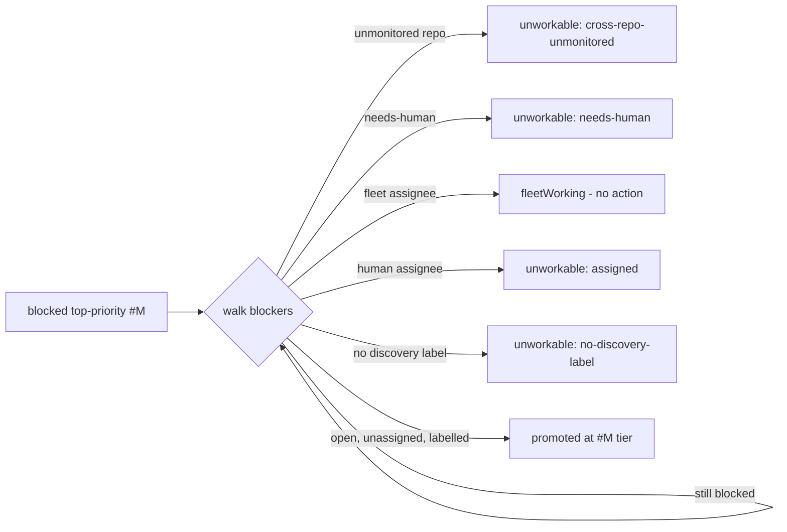

# Closes #2493

## Summary

Adds `worker/deno/lib/dependency_chain_promotion.ts` — a pure, side-effect-free
resolver that walks the dependency chain behind every blocked
`top-priority`/`work-on` candidate and decides which chain members the fleet
should work now (at the blocked issue's own tier) and which chain roots it
cannot work at all.

This is the decision core for the #2483 plan and the only dependency-free
sub-issue in it. No discovery wiring, logging or commenting lands here — those
are Issues #2494–#2496, which own every write. The resolver performs no I/O:
`DependencyBlocker` is an `import type` (erased at runtime) and `isFleetAuthor`
comes from an import-free module, so the whole module can be reasoned about and
tested as a function of its arguments.

Also lands the sweep-coverage record the ledger gate requires for any new module
under `worker/deno/lib/` (`top-up-2493` slice +
`docs/audits/security-sweep-2493-dependency-chain-promotion.md`).



## Evidence

**No UI to screenshot.** This is a backend library change: one pure TypeScript
module plus its unit tests, with no CLI surface, no HTTP surface and no rendered
output. The evidence is test output.

Targeted suite (23 tests, every branch of the resolver):

```text
$ cd worker/deno && deno test --allow-read tests/dependency_chain_promotion_test.ts < /dev/null
...
resolveChainPromotions - monitored repo matching ignores case ... ok (85µs)
chainIssueKey - renders the owner/repo#N snapshot key ... ok (24µs)
resolveChainPromotions - one unworkable root is reported per blocked issue that reaches it ... ok (45µs)

ok | 23 passed | 0 failed (8ms)
```

Full gate:

```text
$ timeout 900 ./quality.sh < /dev/null
EXIT=0
Result: PASSED (with skipped checks)
```

(`config integration` is the only SKIPPED stage — it needs live worker config
this run does not have; every other stage, including `deno tests`, `deno lint`,
`deno type check`, `deno fmt`, `semgrep`, `completeness checks`, `mermaid` and
`markdownlint`, PASSED.)

Red-before-green was observed directly, twice:

- With the module absent, the test file failed to type-check with 13 × TS7006
  implicit-any errors — nothing to import.
- With `resolveChainPromotions` stubbed to return empty arrays:
  `FAILED | 6 passed | 16 failed (21ms)`.
- The one test added after the standards review was re-verified red by reverting
  the fix alone: `FAILED | 22 passed | 1 failed (24ms)`, then green again.

## Acceptance Criteria

<!-- vibe-spec-review inputs="diff+issue-body" -->

1. **The module exports the named types and `resolveChainPromotions`, and
   imports nothing that performs I/O.** — reviewer: met
2. **The test file covers every branch, and each test was observed failing
   before the implementation.** — reviewer: partial
   reason: the branch coverage is complete, but the diff carries no
   git-history evidence of the red state — `45cf9137` adds the library and its
   tests in a single commit, so a reviewer reading only the diff cannot
   reconstruct the failing run.
   departure recorded: I am not upgrading this verdict. The reviewer's `partial`
   stands as written. For the record, the red state *was* observed during the
   run (both runs quoted under **Evidence** above), and the one post-review test
   was demonstrated red by reverting only its fix — but that evidence is
   observational, not reconstructible from the diff, which is exactly what the
   reviewer marked down.
3. **A cycle terminates and promotes nothing on the cycle.** — reviewer: met
4. **A root assigned to a `fleetAuthors` login appears in `fleetWorking`, never
   in `promoted` or `unworkableRoots`.** — reviewer: met
5. **A root assigned to any other login appears in `unworkableRoots` with
   `reason: "assigned"` and the login in `detail`.** — reviewer: met
6. **`./quality.sh` passes.** — reviewer: met

Additions beyond the letter of the issue, each declared rather than folded in:

7. **`chainIssueKey` is exported.** — reviewer: unrequested
   reason: the issue names the map key format (`owner/repo#N`) but not a helper.
   Exported so #2494/#2495 build the snapshot map the same way the resolver
   reads it — a hand-rolled mismatched key reads as an unknown root and silently
   drops a subtree. Consistent with the per-module key-helper convention
   (`claim_runway_evidence.ts`, `comment_cache.ts`, `stream_holder.ts`,
   `pr_merge_conflict_scan.ts` each own theirs).
8. **`ChainIssueRef` is factored out as a named interface.** — reviewer:
   unrequested
   reason: the issue writes `{ repo; number }` inline in five places; naming it
   once is DRY and changes no structural type.
9. **`BlockedCandidate` is a named export.** — reviewer: unrequested
   reason: the issue declares it inline inside `ChainPromotionInput.blocked`;
   naming it lets #2494 build the array without restating the shape.
10. **`PromotedChainMember`, `FleetWorkingRoot` and `UnworkableChainRoot` are
    named exports.** — reviewer: unrequested
    reason: same — the issue declares the three result-array element types
    inline; the callers in #2495/#2496 need to name them.
11. **Labels, logins and repository names are compared after
    `trim().toLowerCase()`.** — reviewer: unrequested
    reason: the issue does not specify normalisation. GitHub returns
    inconsistent casing and padded label names; an exact-match comparison turns
    a data-shape difference into a confident wrong verdict.
12. **23 tests rather than the 10 scenarios the issue lists.** — reviewer:
    unrequested
    reason: the extra 13 cover tier-ordering both ways round, the still-blocked
    member being walked through *and* not classified, a root past a cycle, a
    blocked issue never promoting itself, case/padding on labels and logins, a
    fleet assignee outranking a human co-assignee, `needs-human` outranking
    assignment, and `chainIssueKey` itself.
13. **`docs/audits/lib-sweep-coverage.json` + a new sweep record.** — reviewer:
    unrequested
    reason: not in the issue, but mandatory — `lib_sweep_coverage_test.ts` fails
    the gate for any module under `worker/deno/lib/` that no slice claims, so
    AC6 cannot pass without it.

## Standards Review

<!-- vibe-standards-review inputs="diff+CODING-STANDARDS.md" -->

Three findings. Two fixed, one declined with the reason recorded here.

1. **Silent skip when a blocker has no snapshot** — *declined, documentation
   fixed instead.* The reviewer read the `if (!snapshot) continue;` branch as a
   Never-Fail-Silently violation and proposed adding `"unknown-snapshot"` to
   `ChainRootReason` with an `unworkableRoots` entry.

   **Departure recorded out loud:** I did not make that behavioural change. Issue
   #2493 specifies the classification order explicitly, including "root not in
   `issues` → nothing (unknown)", and the spec'd test asserts
   `unworkableRoots` is empty for an unknown root. Emitting a verdict there would
   contradict the issue and turn "the caller could not read it" into "the fleet
   cannot work it" — a confident claim on a partial view, which is its own
   failure mode. What the reviewer did surface is real and is fixed: the
   `resolveChainPromotions` doc comment falsely listed "unknown snapshot" among
   the classification steps. It now states the skip and why:

   > A blocker with no snapshot is skipped rather than classified — the caller
   > could not read it, and a partial view must not become a confident verdict.

   If a caller in #2494–#2496 needs that signal surfaced, it belongs in the
   caller that knows *why* the fetch came back empty, not in the pure resolver.

2. **`monitoredRepos` was matched case-sensitively** — *fixed
   (`f11c596d`).* `input.monitoredRepos.has(next.repo)` was the module's only
   unnormalised string comparison. `Owner/Repo` against a set holding
   `owner/repo` would report a monitored blocker as `cross-repo-unmonitored`,
   emitting a wrong verdict *and* silently dropping that blocker's entire
   subtree — the worst combination of the two failure modes. Now normalised into
   a `monitored` set alongside `discovery`/`needsHuman`, with the field doc
   updated, a regression test added (verified red against the unfixed line), and
   the sweep record amended to say repository comparisons are normalised too.

3. **Missing `docs/archive/pr-summaries/pr-summary-2493.md`** — *fixed by this
   file.*

Standards confirmed clean by the reviewer and not changed: Australian English
throughout; the `queue[cursor] === undefined` and `const humanAssignee` guards
are required by `noUncheckedIndexedAccess`, not defensive noise; the index-cursor
walk keeps the traversal O(n); no secrets, no subprocess, no shell, no path
interpolation; every `detail` string is GitHub data that is reported, never
interpolated; `sweptAt` pinned to the merge-base (reachable from the default
branch) matches the `top-up-2438/2448/2450/2470/2473` convention.

## Test Plan

`worker/deno/tests/dependency_chain_promotion_test.ts` — 23 tests, every one of
which imports the real module and asserts on the value
`resolveChainPromotions` returns. No source-text inspection, no mocking of the
unit under test (it is pure, so there is nothing to mock).

| Area | Tests |
| ---- | ----- |
| Walk | single chain; blocked issue with no blockers; blocked issue never promotes itself |
| Tier | `work-on` inherited; shared root takes `configured-label` in both input orderings |
| Still-blocked member | walked through to its own blockers; never promoted; never classified unworkable |
| Cycles | a cycle terminates and promotes nothing on it; a root reachable past a cycle is still promoted |
| Cross-repo | monitored repo promoted; unmonitored repo → `cross-repo-unmonitored`; casing ignored |
| Assignees | fleet login → `fleetWorking` only (incl. `Vibe-Coder-Bot` casing); fleet outranks a human co-assignee; human login → `assigned` with the login in `detail` |
| Labels | `needs-human` outranks assignment; no discovery label; no labels at all; casing and padding (`" Enhancement "`) ignored |
| Edges | unknown root emits nothing; empty input; one unworkable entry per blocked issue reaching the same root; `chainIssueKey` renders `stSoftwareAU/VibeCoder#101` |

Run it with:

```bash
cd worker/deno && deno test --allow-read tests/dependency_chain_promotion_test.ts < /dev/null
```

Ledger gate (`worker/deno/tests/lib_sweep_coverage_test.ts`) re-run green after
the `top-up-2493` slice was added: `ok | 31 passed | 0 failed (30ms)`.
