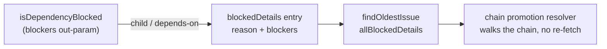

# Record dependency blockers on blocked discovery candidates

## Summary

The discovery collectors knew an issue was dependency-blocked but discarded
*which* issues blocked it, so the chain-promotion resolver had no chain to walk
from `allBlocked`. `BlockedCandidateInfo` now carries an optional
`blockers?: DependencyBlocker[]`: the configured-label collector passes the
out-param `isDependencyBlocked` already accepted, and the work-on collector
attaches the array its #2473 stall check already builds. Skip logging and the
`configured-label-blocked=N` scan-log line are untouched — the new field is not
projected into either.

Supplying the out-param suppresses the early `return true` inside
`isDependencyBlocked`, which pushed the unreadable-body case into its outer
`catch`. That catch answered `false`, releasing a candidate whose open child was
already known — a fail-open regression at the highest-priority tier. It now
returns the same `blockers.length > 0` verdict the normal path does, so the
verdict really is unchanged. Closes #2494.

## Evidence

Backend/CLI change — no web interface to screenshot. Verified by unit tests
(below) and the full `./quality.sh` gate.

Test runs:

- `deno test tests/collect_label_candidates_test.ts tests/collect_work_on_candidates_escalation_test.ts` — 17 passed.
- The wider dependency/discovery set (label, work-on, `find_oldest_issue`,
  cross-repo and cross-milestone gates, chain promotion) — 217 passed, 0 failed.
- `./quality.sh` — PASSED (the pre-existing `config integration` environment
  skip aside).

## Acceptance Criteria

<!-- vibe-spec-review inputs="diff+issue-body" -->

- **met** — `BlockedCandidateInfo` carries `blockers?: DependencyBlocker[]` — evidence: `worker/deno/lib/issue_finder_logger.ts:151` — reviewer: met
- **met** — a dependency-blocked `top-priority` candidate's `allBlocked` entry lists every blocker, cross-repo blockers keeping their own `repo` — evidence: `worker/deno/tests/collect_label_candidates_test.ts::collect_label_candidates - a dependency-blocked candidate records every blocker, cross-repo included` — reviewer: met
- **met** — a dependency-blocked `work-on` candidate's entry lists the same blockers the #2473 stall check used — evidence: `worker/deno/tests/collect_work_on_candidates_escalation_test.ts::collectWorkOnCandidates - a dependency-blocked candidate records the blockers the stall check used` — reviewer: met
- **met** — skip logging and the `configured-label-blocked=N` count are byte-for-byte unchanged — evidence: `worker/deno/lib/issue_finder_logger.ts:668-677` projects only `repo#number(reason)` and `blockedEntries.length`; `worker/deno/tests/find_oldest_issue_test.ts` green — reviewer: met
- **met** — new tests were observed failing before the change — evidence: run red first (type error, then assertion diffs); the reviewer independently reverted the two collectors and saw `14 passed | 3 failed` — reviewer: met
- **met** — `./quality.sh` passes — evidence: full gate run after the final edit, exit 0 — reviewer: met
- **unrequested** — `isDependencyBlocked`'s outer `catch` now returns `blockers ? blockers.length > 0 : false` instead of `false` — evidence: `worker/deno/lib/issue_finder_common.ts:644-649` — reviewer: unrequested — reason: load-bearing for the "verdict unchanged" criterion; without it the label collector fails open on a throwing body read. The Standards reviewer raised the same hole independently. Blast radius checked: of the six call sites only the label collector reads the return value with an out-param supplied.
- **unrequested** — a third test, "an unreadable issue body still blocks on the blockers already found" — evidence: `worker/deno/tests/collect_label_candidates_test.ts:617-680` — reviewer: unrequested — reason: the error-path regression test guarding the change above; observed red against the unfixed helper.
- **unrequested** — conditional spread so `blockers` is omitted rather than set to `undefined` for non-dependency blocks — evidence: `worker/deno/lib/collect_work_on_candidates.ts:405-410` — reviewer: unrequested — reason: `@std/assert` treats `{a, b: undefined}` and `{a}` as unequal, so an explicit `undefined` would break existing whole-object assertions on `blockedDetails`.
- **unrequested** — the field doc states the consumer contract for `undefined` — evidence: `worker/deno/lib/issue_finder_logger.ts:143-150` — reviewer: unrequested — reason: `new_work_eligibility.ts:369` also records `dependency-blocked` without blockers, so `undefined` must read as "not recorded", never "no blockers".

## Standards Review

<!-- vibe-standards-review inputs="diff+CODING-STANDARDS.md" -->

- **violation** — fail-open regression: the top-priority collector released a child-blocked candidate when the body read threw — evidence: `worker/deno/lib/collect_label_candidates.ts:395-404` (via `worker/deno/lib/issue_finder_common.ts:644`) — reason: fixed here; the outer catch returns the collected verdict and `collect_label_candidates_test.ts:617` pins it.
- **violation** — the field doc overstated where `blockers` is populated ("absent for every other skip reason" implied present for every dependency block) — evidence: `worker/deno/lib/issue_finder_logger.ts:141-147` — reason: fixed here; the doc now names the two collectors that populate it and tells consumers to read `undefined` as "not recorded".
- **violation** — the modified public functions had happy-path coverage only — evidence: `worker/deno/tests/collect_label_candidates_test.ts:546` — reason: fixed here; the unreadable-body test adds the error path that would have caught the finding above.
- **violation** — new tests sat outside their files' declared scope, headers not updated — evidence: `worker/deno/tests/collect_work_on_candidates_escalation_test.ts:470` — reason: fixed here; both file headers now list the blocker-recording cases.
- **violation** — no PR summary in the diff — evidence: `docs/archive/pr-summaries/pr-summary-2494.md` — reason: fixed here; this file.
- **clean** — Australian English throughout; KISS/smallest-change-first (reuses the existing out-param and the array #2473 already builds, no new abstraction); DRY (reuses `DependencyBlocker`; `noteBlocked` stays the single write point); tests call the real collectors and assert on returned values, no source greps; additive-only optional field; no hidden paths staged; Deno-native tooling only; commit trailers carry the run id.

A known trade-off, recorded rather than fixed: a dependency-blocked
configured-label candidate now enumerates every blocker instead of stopping at
the first, so it costs more `gh` reads per scan (served from the iteration
cache, and the work-on collector has done this since #2473). Logging and counts
are unaffected.

## Test Plan

- Added `worker/deno/tests/collect_label_candidates_test.ts::collect_label_candidates - a dependency-blocked candidate records every blocker, cross-repo included` — a child blocker plus a cross-repo `depends-on` blocker, asserting the `{ repo, number, kind }` list on the blocked entry.
- Added `worker/deno/tests/collect_label_candidates_test.ts::collect_label_candidates - an unreadable issue body still blocks on the blockers already found` — the fail-safe regression test; red against the unfixed helper.
- Added `worker/deno/tests/collect_work_on_candidates_escalation_test.ts::collectWorkOnCandidates - a dependency-blocked candidate records the blockers the stall check used` — same-repo plus cross-repo blockers on an ordinary (claimable) dependency block.
- Re-ran the existing dependency/discovery suites, including `find_oldest_issue_test.ts` for the `configured-label-blocked=N` line — all green.
